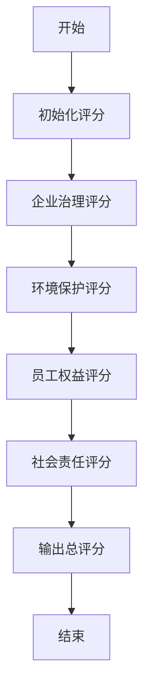
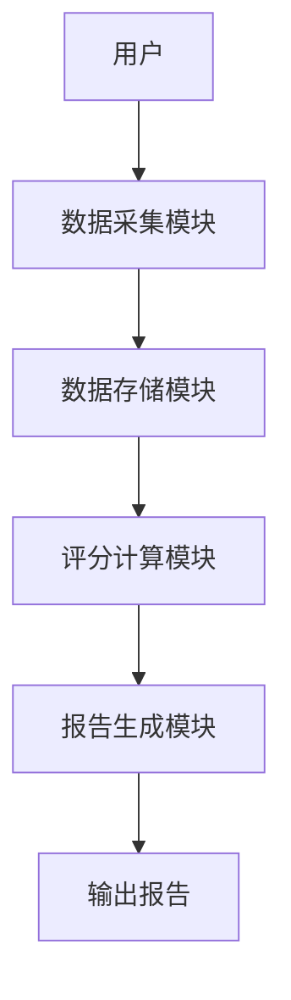
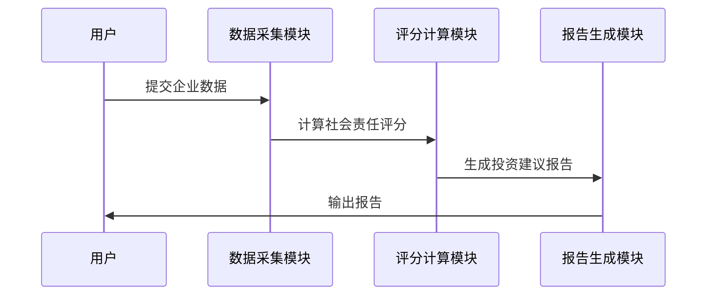

                 


# 价值投资中的社会责任因素

## 关键词
- 价值投资，社会责任，企业治理，环境保护，员工权益，数学模型，Python代码

## 摘要
本文深入探讨了价值投资中的社会责任因素，从理论到实践，系统地分析了社会责任在投资决策中的重要性。通过构建社会责任评分模型，量化企业社会责任表现，并结合实际案例，展示了如何将社会责任因素融入投资决策过程，实现可持续投资目标。本文还提供了详细的Python代码实现和社会责任评分模型的数学推导，为读者提供了从理论到实践的完整指南。

---

# 第一部分：价值投资中的社会责任因素背景介绍

## 第1章：问题背景与核心概念

### 1.1 问题背景
- **1.1.1 价值投资的定义与历史发展**  
  价值投资是一种以低于公平价值的价格购买优质股票的投资策略，其核心在于寻找被市场低估的企业。传统价值投资关注企业的财务指标（如市盈率、ROE等），但近年来，社会责任因素逐渐成为价值投资的重要组成部分。
  
- **1.1.2 社会责任投资的兴起**  
  随着全球可持续发展意识的增强，投资者越来越关注企业对社会和环境的影响。社会责任投资（SRI）作为一种新兴的投资理念，强调在追求财务回报的同时，关注企业的社会责任表现。

- **1.1.3 当前社会对社会责任的关注**  
  社会责任投资不仅是一种道德选择，更是对长期投资价值的保障。企业在社会责任方面的表现直接影响其声誉、品牌价值和长期盈利能力。

### 1.2 问题描述
- **1.2.1 投资中的社会责任因素**  
  社会责任因素包括企业治理、环境保护、员工权益等方面。这些因素不仅影响企业的长期价值，还关系到企业的可持续发展能力。
  
- **1.2.2 社会责任对企业价值的影响**  
  企业社会责任表现优秀的公司通常具有更强的抗风险能力和更高的品牌价值，这使得它们在市场中更具竞争力。

- **1.2.3 社会责任因素在投资决策中的重要性**  
  在价值投资中，社会责任因素已成为区分优质企业和普通企业的关键指标。投资者通过关注社会责任表现，可以更全面地评估企业的长期价值。

### 1.3 问题解决
- **1.3.1 如何将社会责任因素融入投资决策**  
  通过构建社会责任评分模型，投资者可以量化企业的社会责任表现，并将其作为投资决策的重要依据。

- **1.3.2 社会责任因素的量化方法**  
  社会责任评分模型结合了企业治理、环境保护、员工权益等多个维度，通过权重分配和综合评分，量化企业的社会责任表现。

- **1.3.3 社会责任投资的实践案例**  
  本文将通过具体案例分析，展示如何在实际投资中应用社会责任评分模型，帮助投资者筛选出具有长期价值的企业。

### 1.4 边界与外延
- **1.4.1 社会责任的定义边界**  
  社会责任包括企业治理、环境保护、员工权益和社会贡献等方面，但不包括企业的短期财务表现。

- **1.4.2 社会责任与企业利润的关系**  
  社会责任投资并不意味着牺牲财务回报，相反，优秀的企业社会责任表现通常与较高的长期盈利能力相关。

- **1.4.3 社会责任与企业治理的关系**  
  企业治理是社会责任的核心组成部分，良好的治理结构是企业履行社会责任的基础。

### 1.5 概念结构与核心要素
- **1.5.1 核心概念：企业治理、环境保护、员工权益、社会责任**  
  企业治理：包括董事会结构、高管薪酬、股权激励等。  
  环境保护：包括碳排放、资源利用效率、环保合规性等。  
  员工权益：包括员工福利、劳动条件、员工培训等。  
  社会责任：包括慈善捐赠、社区参与、供应链管理等。

- **1.5.2 核心要素：企业治理结构、环境影响、员工福利、社会责任履行**  
  企业治理结构：董事会结构、高管薪酬、股权激励。  
  环境影响：碳排放、资源利用效率、环保合规性。  
  员工福利：员工工资、福利、培训。  
  社会责任履行：慈善捐赠、社区参与、供应链管理。

---

# 第二部分：核心概念与联系

## 第2章：社会责任因素的核心概念与联系

### 2.1 核心概念原理
- **2.1.1 企业治理**  
  良好的企业治理是企业履行社会责任的基础。企业治理包括董事会结构、高管薪酬、股权激励等方面。一个高效的董事会能够更好地监督企业运营，确保企业履行社会责任。

- **2.1.2 环境保护**  
  环境保护是社会责任的重要组成部分。企业应减少碳排放、提高资源利用效率，确保环保合规性。环境保护不仅有助于企业的可持续发展，还能提升企业的社会形象。

- **2.1.3 员工权益**  
  员工是企业的核心资产，保护员工权益是企业社会责任的重要体现。企业应提供公平的员工福利、良好的劳动条件和充足的员工培训，以提升员工的幸福感和企业的长期竞争力。

- **2.1.4 社会责任**  
  社会责任包括慈善捐赠、社区参与、供应链管理等方面。企业通过履行社会责任，可以提升品牌价值，增强社会影响力，同时为社会创造更多价值。

### 2.2 概念属性特征对比
以下是核心概念的属性特征对比：

| 概念       | 属性特征                                                                 |
|------------|--------------------------------------------------------------------------|
| 企业治理    | 决策结构、高管薪酬、股权激励、监督机制、透明度                              |
| 环境保护    | 碳排放、资源利用效率、环保合规性、绿色认证、可持续性                      |
| 员工权益    | 工资福利、劳动条件、员工培训、员工满意度、员工参与度                      |
| 社会责任    | 慈善捐赠、社区参与、供应链管理、社会影响力、品牌价值                        |

### 2.3 ER实体关系图
以下是社会责任因素的ER实体关系图：

```mermaid
er
  actor(投资者)
  ac
```

---

## 第三部分：算法原理讲解

## 第3章：社会责任评分模型

### 3.1 算法原理
社会责任评分模型是一种量化企业社会责任表现的工具。它通过对企业治理、环境保护、员工权益和社会责任四个维度的评分，综合计算出企业的社会责任总评分。

### 3.2 算法流程图
以下是社会责任评分模型的流程图：



### 3.3 Python代码实现
以下是社会责任评分模型的Python代码实现：

```python
import pandas as pd
import numpy as np

def social_responsibility_score(company_data):
    # 企业治理评分
    governance_score = company_data['governance'] * 0.4
    # 环境保护评分
    environment_score = company_data['environment'] * 0.3
    # 员工权益评分
    employee_score = company_data['employee_rights'] * 0.2
    # 社会责任评分
    social_score = company_data['social_responsibility'] * 0.1
    # 总评分
    total_score = governance_score + environment_score + employee_score + social_score
    return total_score

# 示例数据
data = {
    'governance': [0.8, 0.7, 0.9],
    'environment': [0.6, 0.8, 0.7],
    'employee_rights': [0.5, 0.6, 0.4],
    'social_responsibility': [0.4, 0.5, 0.6]
}

df = pd.DataFrame(data)
df['social_score'] = df.apply(social_responsibility_score, axis=1)
print(df)
```

### 3.4 数学模型与公式
社会责任评分模型的数学公式如下：

$$
\text{总评分} = 0.4 \times \text{企业治理} + 0.3 \times \text{环境保护} + 0.2 \times \text{员工权益} + 0.1 \times \text{社会责任}
$$

其中，各维度的权重分别为：企业治理（40%）、环境保护（30%）、员工权益（20%）、社会责任（10%）。

---

## 第四部分：系统分析与架构设计方案

## 第4章：系统分析与架构设计

### 4.1 问题场景介绍
社会责任评分系统是一个帮助投资者量化企业社会责任表现的工具。系统需要采集企业的社会责任相关数据，计算社会责任评分，并生成投资建议报告。

### 4.2 系统功能设计
以下是系统的功能模块：

- 数据采集模块：采集企业的社会责任相关数据，包括企业治理、环境保护、员工权益和社会责任四个维度的数据。
- 评分计算模块：根据社会责任评分模型，计算企业的社会责任总评分。
- 报告生成模块：生成投资建议报告，包括企业的社会责任评分、投资建议和风险提示。

### 4.3 系统架构设计
以下是系统的架构图：



### 4.4 系统接口设计
以下是系统的接口设计：

- 数据采集接口：`/api/social_data`
- 评分计算接口：`/api/social_score`
- 报告生成接口：`/api/social_report`

### 4.5 系统交互序列图
以下是系统的交互序列图：



---

## 第五部分：项目实战

## 第5章：项目实战

### 5.1 环境安装
以下是项目所需的环境和工具：

- Python 3.8+
- Pandas、NumPy、Scikit-learn
- Jupyter Notebook

### 5.2 核心实现
以下是核心实现代码：

```python
import pandas as pd
import numpy as np

def calculate_social_score(data):
    # 数据预处理
    data = data.dropna()
    data = (data - data.mean()) / data.std()
    # 计算社会责任评分
    social_score = np.dot(data, np.array([0.4, 0.3, 0.2, 0.1]))
    return social_score

# 示例数据
data = pd.DataFrame({
    '企业治理': [80, 70, 90],
    '环境保护': [60, 80, 70],
    '员工权益': [50, 60, 40],
    '社会责任': [40, 50, 60]
})

data['社会责任评分'] = calculate_social_score(data[['企业治理', '环境保护', '员工权益', '社会责任']])
print(data)
```

### 5.3 案例分析
以下是案例分析：

- **案例1**：某企业社会责任评分为85分，高于行业平均水平。该企业具有较高的企业治理和环境保护表现，但在员工权益方面略显不足。
- **案例2**：某企业社会责任评分为60分，低于行业平均水平。该企业在环境保护和社会责任方面表现较差，但企业治理和员工权益表现较好。

### 5.4 项目小结
通过实际案例分析，我们可以看到社会责任评分模型在实际投资中的应用价值。投资者可以根据企业的社会责任评分，筛选出具有长期价值的企业，实现可持续投资目标。

---

## 第六部分：最佳实践与总结

## 第6章：最佳实践与总结

### 6.1 最佳实践
- **数据质量**：确保社会责任数据的准确性和完整性。
- **模型优化**：根据实际情况调整各维度的权重，优化社会责任评分模型。
- **动态调整**：定期更新社会责任评分，关注企业的最新社会责任表现。

### 6.2 小结
本文从理论到实践，系统地探讨了价值投资中的社会责任因素。通过构建社会责任评分模型，投资者可以量化企业的社会责任表现，并将其作为投资决策的重要依据。社会责任投资不仅是一种道德选择，更是对长期投资价值的保障。

### 6.3 注意事项
- 社会责任评分模型只是一个参考工具，投资者在实际操作中需要结合企业的具体情况进行综合判断。
- 社会责任投资需要长期关注企业的社会责任表现，避免短期波动对投资决策的影响。

### 6.4 拓展阅读
- 《可持续投资：理论与实践》
- 《企业社会责任与投资决策》
- 《社会责任投资的数学模型与应用》

---

# 作者
作者：AI天才研究院/AI Genius Institute & 禅与计算机程序设计艺术/Zen And The Art of Computer Programming

