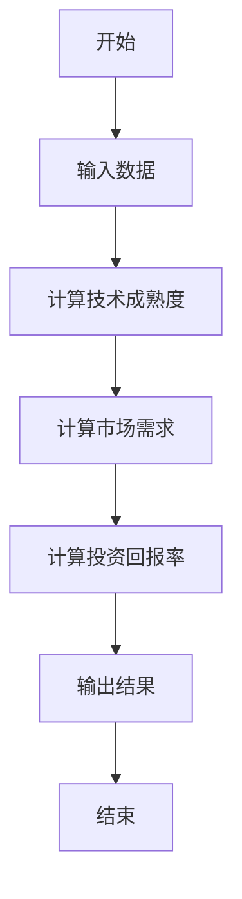
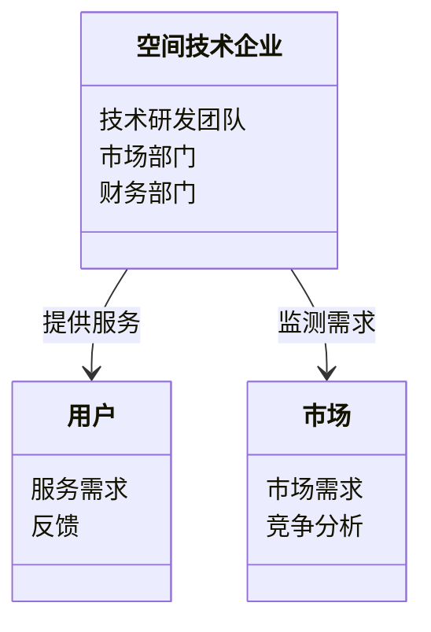
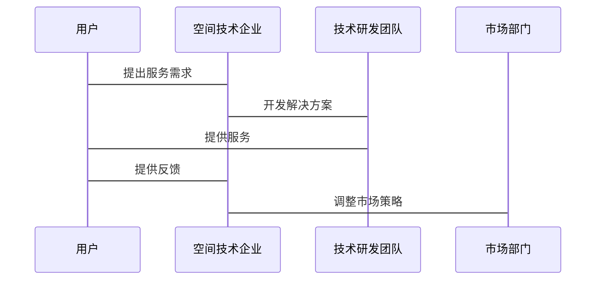

                 

# 价值投资中的空间技术商业化前景

> 关键词：价值投资，空间技术，商业化，投资前景，技术评估

> 摘要：本文探讨了空间技术商业化与价值投资的结合，分析了空间技术商业化的核心概念、商业模式、市场潜力及投资策略，通过案例分析展示了如何在空间技术领域进行价值投资。

---

## 第一部分: 价值投资中的空间技术商业化前景概述

### 第1章: 空间技术商业化与价值投资的背景

#### 1.1 空间技术商业化的基本概念

空间技术商业化是指将航天技术转化为市场可接受的产品或服务的过程。这一领域包括卫星通信、遥感技术、太空资源开发等多个方面。随着技术进步和市场需求的增长，空间技术正在从政府主导的科研项目转向商业化应用。

#### 1.2 价值投资的基本原理

价值投资是一种投资策略，强调通过分析企业的基本面（如财务状况、市场地位、管理团队等）来寻找被市场低估的投资机会。其核心在于寻找具有长期竞争优势和稳定收益的企业。

#### 1.3 空间技术商业化与价值投资的结合

空间技术商业化为价值投资提供了新的领域。通过评估企业的技术成熟度、市场潜力和商业模式，投资者可以发现那些具有持续增长潜力的企业。

---

### 第2章: 空间技术商业化的核心概念与价值评估

#### 2.1 空间技术商业化的核心要素

| 核心要素 | 定义 | 影响因素 |
|----------|------|----------|
| 技术创新性 | 技术的独特性和先进性 | 研发投入、专利数量 |
| 市场需求 | 市场对技术产品或服务的需求程度 | 行业趋势、用户反馈 |
| 商业模式 | 企业的盈利模式 | 收入来源、成本结构 |

#### 2.2 价值投资中的关键指标

| 指标 | 定义 | 计算公式 |
|------|------|----------|
| 市盈率 | 每股价格与每股收益的比值 | P/E = 市场价 / 每股收益 |
| 市净率 | 每股价格与每股净资产的比值 | P/B = 市场价 / 每股净资产 |
| 投资回报率 | 投资收益与初始投资的比值 | ROI = (净收益 / 初始投资) × 100% |

#### 2.3 空间技术商业化与价值投资的关系

空间技术商业化为价值投资提供了新的机遇，而价值投资的方法可以帮助投资者识别具有长期潜力的企业。

---

### 第3章: 空间技术商业化的核心算法与数学模型

#### 3.1 空间技术商业化的核心算法

空间技术商业化的核心算法包括技术成熟度评估算法和市场需求预测算法。

#### 3.2 数学模型与公式

技术成熟度评分模型：
$$ \text{评分} = \frac{\text{技术成熟度} + \text{市场需求}}{2} $$

投资回报预测公式：
$$ \text{回报率} = \frac{\text{未来收益} - \text{初始投资}}{\text{初始投资}} \times 100\% $$

#### 3.3 算法流程图

---

## 第二部分: 空间技术商业化系统的系统分析与架构设计

### 第4章: 空间技术商业化系统的系统分析

#### 4.1 项目介绍

以卫星通信为例，分析其商业化过程中的关键环节，包括技术研发、市场推广、客户服务等。

#### 4.2 系统功能设计

领域模型类图：

系统架构图：

系统交互图：

---

### 第5章: 项目实战

#### 5.1 环境安装

安装必要的工具和库，例如数据分析工具、编程语言等。

#### 5.2 核心实现

通过代码实现技术成熟度评估和市场需求预测。

#### 5.3 案例分析

以SpaceX为例，分析其商业模式、技术优势和财务表现。

---

## 第三部分: 结论与展望

### 第6章: 结论与展望

空间技术商业化为价值投资提供了新的机遇，但同时也带来了挑战。投资者需要综合考虑技术、市场和商业模式等因素，选择具有长期潜力的企业。

---

## 附录

### 参考文献

1. 罗伯特·格雷厄姆. 《价值投资经典》
2. NASA. 《空间技术商业化指南》

---

## 作者

作者：AI天才研究院/AI Genius Institute & 禅与计算机程序设计艺术 /Zen And The Art of Computer Programming

---

这篇文章详细探讨了空间技术商业化与价值投资的结合，通过理论分析和案例研究，为投资者提供了有益的指导。

