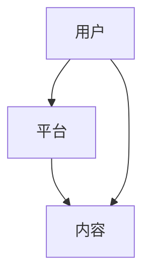
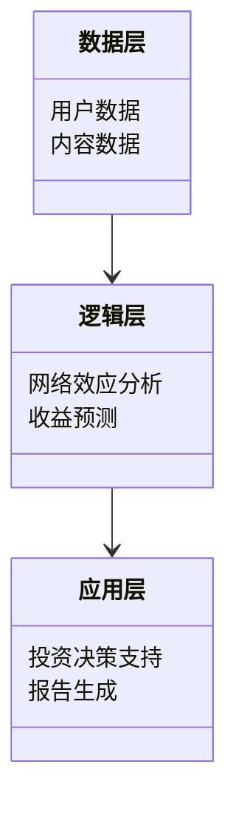
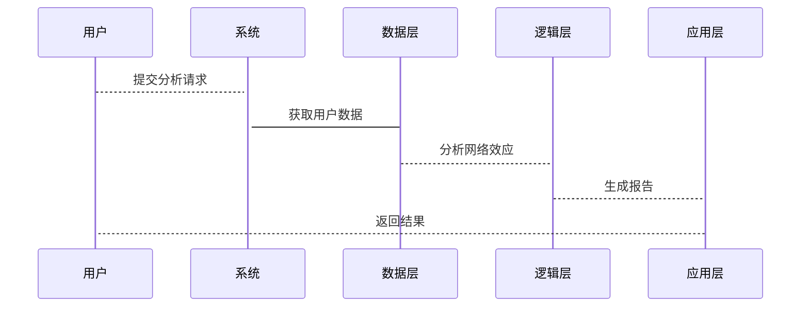

                 


# 价值投资中的网络效应分析

---

## 关键词：
- 价值投资
- 网络效应
- 系统架构
- 投资决策
- 数学模型

---

## 摘要：
网络效应是价值投资中的一个重要因素，它描述了随着用户数量增加，产品或服务的价值呈指数级增长的现象。本文从网络效应的定义、类型、数学模型、算法原理、系统架构和项目实战等方面，详细分析了网络效应在价值投资中的应用。通过实际案例和系统设计，本文为投资者提供了基于网络效应的投资决策支持系统，帮助他们在复杂的市场环境中做出更明智的投资决策。

---

# 第1章: 价值投资与网络效应概述

## 1.1 价值投资的核心概念

### 1.1.1 价值投资的定义与特点
价值投资是一种长期投资策略，强调以低于内在价值的价格购买优质资产。其特点包括：
- 长期视角
- 重视基本面分析
- 寻找被市场低估的资产

### 1.1.2 网络效应的定义与特点
网络效应是指随着用户数量的增加，产品或服务的价值呈指数级增长。其特点包括：
- 正反馈循环
- 用户依赖性
- 边际成本递减

### 1.1.3 价值投资与网络效应的结合
网络效应可以作为价值投资的补充分析工具，帮助投资者识别具有长期增长潜力的公司。

---

## 1.2 价值投资中的网络效应背景

### 1.2.1 价值投资的历史发展
价值投资起源于20世纪初，由本杰明·格雷厄姆和戴维·多德提出，强调以低于内在价值的价格购买股票。

### 1.2.2 网络效应在现代投资中的作用
随着互联网和社交媒体的普及，网络效应在科技公司中的重要性日益凸显。例如，社交平台的用户增长会带来更高的广告收入和内容丰富度。

### 1.2.3 网络效应与价值投资的结合意义
通过分析网络效应，投资者可以更准确地评估公司的长期增长潜力，尤其是在科技和社交媒体领域。

---

## 1.3 网络效应的类型与特征

### 1.3.1 网络效应的分类
- **正向网络效应**：用户数量增加，产品价值提升。
- **负向网络效应**：用户数量增加，产品价值下降。
- **双边网络效应**：产品价值依赖于两个或多个用户群体的增长。

### 1.3.2 网络效应的正反馈循环
- 用户增长 → 产品价值提升 → 用户增长加速。
- 正反馈循环可能导致市场垄断或寡头竞争。

### 1.3.3 网络效应的双边市场特征
- 双边市场的例子：支付平台（消费者和商家）、社交平台（用户和内容创作者）。
- 双边市场的平衡点：用户增长和收益之间的平衡。

---

# 第2章: 网络效应的数学模型与分析

## 2.1 网络效应的数学模型

### 2.1.1 网络效应的用户增长模型
用户增长模型可以表示为：
$$
\frac{dN}{dt} = rN - \frac{N^2}{K}
$$
其中：
- \( N \)：用户数量
- \( r \)：用户增长率
- \( K \)：环境容量

### 2.1.2 网络效应的收益递增模型
收益递增模型可以表示为：
$$
R = aN + bN^2
$$
其中：
- \( R \)：收益
- \( N \)：用户数量
- \( a \) 和 \( b \)：系数

### 2.1.3 网络效应的梅尔卡托图（Mermaid图）



---

## 2.2 网络效应的量化分析

### 2.2.1 网络效应的度量指标
- 网络效应指数（Network Effect Index）：衡量用户增长对产品价值的影响。
- 边际收益递增率（Marginal Revenue Increase Rate）：衡量用户增长带来的收益增加速度。

### 2.2.2 网络效应的数学公式
网络效应的收益函数可以表示为：
$$
\text{收益} = \frac{1}{N} \cdot \left(1 - \frac{1}{N}\right)
$$

### 2.2.3 网络效应的案例分析
以某社交媒体平台为例，分析用户增长对广告收入的影响。

---

# 第3章: 网络效应的算法原理

## 3.1 网络效应的算法基础

### 3.1.1 网络效应的图论模型
图论模型可以用于分析用户之间的关系和互动。


### 3.1.2 网络效应的博弈论模型
博弈论模型可以用于分析用户在平台上的策略选择。

### 3.1.3 网络效应的社会网络分析
社会网络分析可以用于识别关键用户和群体。

---

## 3.2 网络效应的算法实现

### 3.2.1 网络效应的节点度数计算
节点度数计算可以用于识别关键用户。

```python
def calculate_degree centrality(graph):
    degree_centrality = {}
    for node in graph.nodes():
        degree = len(graph.neighbors(node))
        degree_centrality[node] = degree
    return degree_centrality
```

### 3.2.2 网络效应的社区发现算法
社区发现算法可以用于识别用户群体。

```python
import community as community_module
import networkx as nx

def find_communities(graph):
    partition = community_module.community_louvain(graph)
    return {node: partition[node] for node in graph.nodes()}
```

### 3.2.3 网络效应的路径分析算法
路径分析算法可以用于识别用户之间的互动路径。

```python
def find_shortest_path(graph, start_node, end_node):
    return nx.shortest_path(graph, start=start_node, end=end_node)
```

---

# 第4章: 价值投资中的网络效应系统分析

## 4.1 网络效应在价值投资中的系统架构

### 4.1.1 系统架构的分层设计
分层设计包括数据层、逻辑层和应用层。



### 4.1.2 系统架构的模块化设计
模块化设计包括数据采集、分析和决策支持模块。

### 4.1.3 系统架构的可扩展性设计
可扩展性设计允许系统轻松添加新功能。

---

## 4.2 网络效应的系统接口设计

### 4.2.1 系统接口的定义与规范
系统接口包括数据输入、分析请求和结果输出。

### 4.2.2 系统接口的实现与测试
接口实现包括API设计和测试用例编写。

### 4.2.3 系统接口的交互流程图



---

## 4.3 网络效应的系统交互分析

### 4.3.1 网络效应的用户界面设计
用户界面包括数据可视化和分析结果展示。

### 4.3.2 网络效应的交互流程
用户提交请求 → 系统分析 → 返回结果。

---

# 第5章: 价值投资中的网络效应项目实战

## 5.1 项目环境配置

### 5.1.1 环境安装
安装Python和相关库（如networkx、community）。

### 5.1.2 数据准备
收集用户数据和网络数据。

---

## 5.2 网络效应的核心实现

### 5.2.1 网络效应的代码实现
实现网络效应分析的代码。

```python
import networkx as nx
from community import community_louvain

def analyze_network_effects(users, connections):
    graph = nx.Graph()
    graph.add_nodes_from(users)
    graph.add_edges_from(connections)
    communities = community_louvain(graph)
    return communities
```

### 5.2.2 网络效应的代码解读
代码解读包括数据输入、网络构建和社区发现。

---

## 5.3 项目案例分析

### 5.3.1 案例背景介绍
以某社交平台为例，分析其网络效应。

### 5.3.2 案例数据处理
处理用户数据和网络数据。

### 5.3.3 案例分析结果
展示社区发现结果和收益预测。

---

## 5.4 项目经验总结

### 5.4.1 项目小结
总结网络效应在投资中的应用。

### 5.4.2 项目经验总结
总结项目中的经验和教训。

---

# 第6章: 价值投资中的网络效应最佳实践

## 6.1 最佳实践 tips

### 6.1.1 投资中的注意事项
- 注意网络效应的正反馈循环
- 考虑双边市场的平衡点

### 6.1.2 投资中的小结
总结网络效应在投资中的重要性。

---

## 6.2 投资中的注意事项

### 6.2.1 网络效应的局限性
- 网络效应可能引发市场垄断
- 网络效应可能受政策影响

### 6.2.2 网络效应的未来趋势
- 更多行业将出现网络效应
- 技术进步将增强网络效应

---

## 6.3 拓展阅读

### 6.3.1 相关书籍
- 《网络效应》
- 《价值投资入门》

### 6.3.2 相关文章
- 网络效应与投资策略
- 价值投资中的网络效应分析

---

# 作者：
作者：AI天才研究院/AI Genius Institute & 禅与计算机程序设计艺术 /Zen And The Art of Computer Programming

