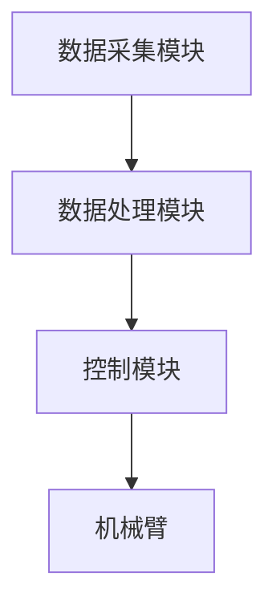

                 


# 价值投资中的脑机接口医疗应用前景

---

## 关键词：
价值投资、脑机接口、医疗应用、技术创新、投资分析、医疗技术、神经工程

---

## 摘要：
本文从价值投资的角度，深入分析脑机接口技术在医疗领域的应用前景。通过探讨脑机接口技术的核心原理、应用场景、算法优化以及市场潜力，结合实际案例和数据分析，为投资者提供基于技术与市场的双重视角，评估脑机接口技术在医疗领域的投资价值。本文旨在为医疗技术创新和价值投资结合提供新的思路。

---

## 第一部分: 背景介绍

### 第1章: 价值投资与脑机接口技术概述

#### 1.1 价值投资的定义与核心理念
价值投资是一种长期投资策略，核心理念是通过深入分析企业的基本面，寻找被市场低估的投资标的。其核心原则包括：
- 重视企业的内在价值，而非市场波动。
- 长期持有优质资产，避免短期交易。
- 重点关注企业的财务健康、行业地位和竞争优势。

#### 1.2 脑机接口技术的定义与特点
脑机接口（Brain-Computer Interface, BCI）是一种能够直接连接人类大脑与外部设备的技术，通过采集、分析和处理大脑信号，实现人与机器之间的信息交互。其特点包括：
- 非侵入性或侵入性：非侵入式设备（如头戴式电极）或侵入式设备（如植入式电极）。
- 高精度：通过先进的信号处理算法，实现对大脑信号的精准识别。
- 多领域应用：广泛应用于医疗、康复、教育、娱乐等领域。

#### 1.3 医疗领域的脑机接口应用背景
医疗领域的数字化转型为脑机接口技术提供了广阔的应用空间。脑机接口技术在神经康复、精神疾病治疗、疑难疾病诊断等方面展现出巨大潜力。从价值投资的角度来看，技术创新与市场需求的结合，使得脑机接口技术在医疗领域的应用成为投资者关注的热点。

---

## 第二部分: 核心概念与联系

### 第2章: 脑机接口技术的核心原理

#### 2.1 脑机接口技术的原理概述
脑机接口技术的核心流程包括：
1. **神经信号采集**：通过电极采集大脑产生的电信号。
2. **数据处理与分析**：对采集到的信号进行滤波、特征提取和分类。
3. **信号输出**：根据分析结果生成控制指令，驱动外部设备。

#### 2.2 脑机接口技术的关键组成部分
- **神经信号采集设备**：如EEG电极、fMRI设备等。
- **数据处理与分析算法**：如小波变换、机器学习算法。
- **输出设备与执行机构**：如机械臂、虚拟现实设备。

---

### 第3章: 脑机接口技术的核心概念对比

#### 3.1 脑机接口技术与传统医疗技术的对比
| 特性             | 脑机接口技术             | 传统医疗技术         |
|------------------|--------------------------|----------------------|
| **技术原理**     | 基于神经信号的处理与分析 | 基于物理或化学方法   |
| **应用场景**     | 神经康复、精神疾病治疗   | 手术、药物治疗       |
| **优缺点**       | 优势：非侵入性、高精度；缺点：技术复杂、成本高 | 优势：成熟可靠；缺点：侵入性、技术有限 |

#### 3.2 脑机接口技术与价值投资的关联
- **技术创新对投资价值的影响**：技术突破可提升企业市场竞争力。
- **市场需求对技术发展的推动**：医疗需求推动脑机接口技术的商业化。
- **投资策略与技术创新的互动关系**：技术创新为投资提供新机会，投资反过来推动技术创新。

---

## 第三部分: 算法原理讲解

### 第4章: 脑机接口技术的算法原理

#### 4.1 神经信号处理算法
- **基于滤波器的信号处理**：使用小波变换对EEG信号进行去噪。
- **基于机器学习的信号分类**：利用支持向量机（SVM）对信号进行分类。
- **基于深度学习的信号分析**：使用卷积神经网络（CNN）进行特征提取。

#### 4.2 数据分析与模式识别算法
- **时间序列分析**：分析EEG信号的时间特征。
- **聚类分析与分类算法**：识别不同脑区的活动模式。
- **神经网络与深度学习模型**：构建深度学习模型进行复杂模式识别。

---

## 第四部分: 系统分析与架构设计

### 第5章: 脑机接口技术的系统架构

#### 5.1 问题场景介绍
医疗领域中，脑机接口技术可以用于神经康复治疗。例如，帮助中风患者通过脑机接口设备控制机械臂完成简单的动作。

#### 5.2 系统功能设计
- **数据采集模块**：采集患者的EEG信号。
- **数据处理模块**：对信号进行预处理和特征提取。
- **控制模块**：根据处理结果生成控制指令，驱动机械臂。

#### 5.3 系统架构图


---

## 第五部分: 项目实战

### 第6章: 脑机接口技术的项目实现

#### 6.1 环境安装
- **硬件**：EEG采集设备（如OpenBCI Ganglion）。
- **软件**：Python编程环境、相关库（如numpy、scipy、sklearn）。

#### 6.2 核心代码实现
```python
import numpy as np
from sklearn import svm

# 示例数据
X = np.random.randn(100, 5)
y = np.random.randint(2, size=100)

# 训练SVM模型
model = svm.SVC()
model.fit(X, y)

# 预测
predicted = model.predict(X)
print(predicted)
```

#### 6.3 案例分析
假设我们开发了一款基于EEG信号的神经康复设备，通过训练模型识别患者的意图，控制机械臂完成抓取动作。通过实际测试和优化，设备的成功率显著提高，为患者提供了有效的康复手段。

---

## 第六部分: 最佳实践与总结

### 第7章: 最佳实践与总结

#### 7.1 投资建议
- **技术创新**：关注具有核心技术突破的企业。
- **市场需求**：选择在医疗领域有明确应用场景的技术。
- **风险控制**：评估技术的商业化可行性，避免盲目投资。

#### 7.2 项目小结
脑机接口技术在医疗领域的应用前景广阔，但技术创新和商业化过程仍面临诸多挑战。投资者需要结合技术与市场的双重因素，做出明智的投资决策。

#### 7.3 注意事项
- **技术风险**：脑机接口技术的复杂性可能导致研发失败。
- **市场竞争**：技术门槛高，但潜在竞争者众多。
- **法规政策**：需关注相关法律法规对脑机接口技术的规范。

#### 7.4 拓展阅读
- 推荐书籍：《脑机接口：原理与应用》。
- 推荐文章：《医疗领域的技术创新与投资机会》。

---

## 作者：
AI天才研究院/AI Genius Institute & 禅与计算机程序设计艺术 /Zen And The Art of Computer Programming

