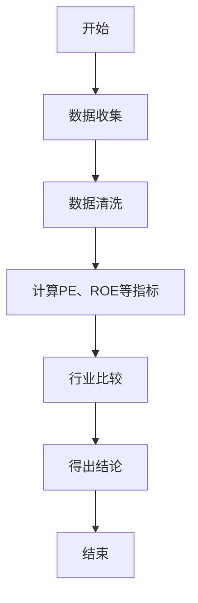
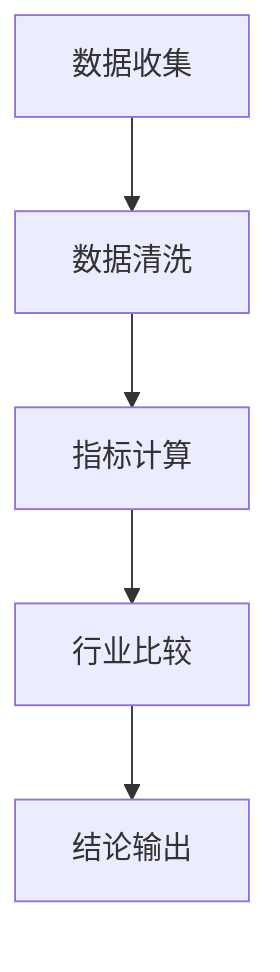
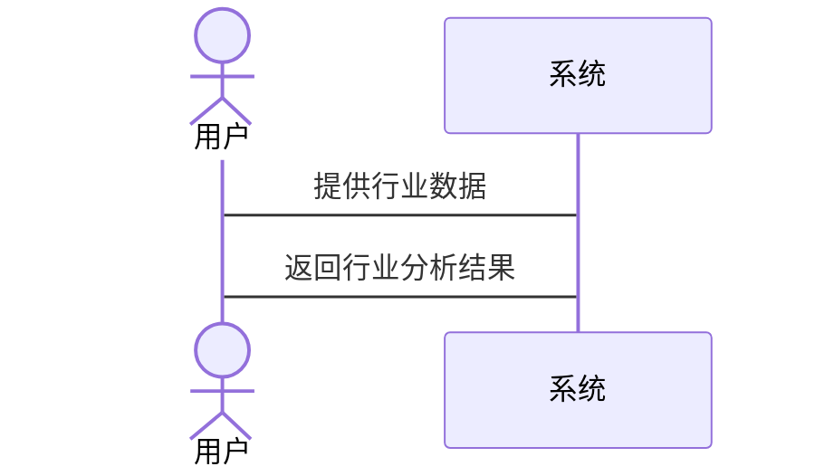

                 


# 价值投资中的行业分析方法

> 关键词：价值投资，行业分析，投资策略，行业评估，财务指标

> 摘要：本文深入探讨了价值投资中的行业分析方法，从行业分析的基本概念、核心要素到具体实施的数学模型和系统架构，结合实际案例进行详细分析。文章不仅介绍了行业分析在价值投资中的重要性，还提供了行业分析的系统架构设计和实战项目，帮助读者更好地理解和应用这些方法。

---

# 第一部分: 价值投资与行业分析基础

## 第1章: 价值投资与行业分析概述

### 1.1 价值投资的基本概念
#### 1.1.1 价值投资的定义与核心理念
价值投资是一种投资策略，强调以低于其内在价值的价格购买优质资产，长期持有，等待其价值回归。其核心理念是寻找市场先生的错误定价，通过深入分析企业的基本面，找到具有长期竞争优势和稳定盈利的企业进行投资。

#### 1.1.2 价值投资与其它投资方法的区别
与趋势投资、技术投资等方法不同，价值投资注重企业的内在价值，而非市场的短期波动。它强调对企业基本面的深入分析，包括财务状况、行业地位、竞争优势等方面。

#### 1.1.3 价值投资在现代金融中的地位
价值投资是投资学的重要流派之一，尤其在强调长期稳健回报的投资理念中占据重要地位。尽管市场波动和短期趋势可能影响股价，但长期来看，价值投资的核心理念依然有效。

### 1.2 行业分析在价值投资中的重要性
#### 1.2.1 行业分析的基本概念
行业分析是通过对行业内的企业进行研究，分析行业的发展趋势、竞争结构、盈利能力等因素，从而判断行业的投资价值。

#### 1.2.2 价值投资中行业分析的作用
在价值投资中，行业分析是投资决策的重要组成部分。通过行业分析，投资者可以判断行业的长期增长潜力、盈利能力以及估值水平，从而筛选出具有投资价值的企业。

#### 1.2.3 行业分析的核心要素与边界
行业分析的核心要素包括行业生命周期、行业竞争结构、行业财务指标等。行业分析的边界包括行业的上下游关系、政策环境、宏观经济因素等。

### 1.3 价值投资与行业分析的关系
#### 1.3.1 行业分析是价值投资的基础
行业分析为价值投资提供了筛选企业的重要依据。只有在具有良好行业前景的行业中，才能找到具有长期竞争优势的企业。

#### 1.3.2 行业分析对投资决策的影响
行业分析可以帮助投资者规避行业风险，抓住行业机遇。通过对行业趋势的分析，投资者可以更好地把握企业的成长空间和竞争优势。

#### 1.3.3 行业分析在价值投资中的具体应用
在实际投资中，行业分析被用于筛选投资标的、评估企业价值以及制定投资策略。例如，投资者可以通过行业分析确定哪些行业具有较高的ROE和较低的PE，从而筛选出具有投资价值的企业。

---

## 第2章: 价值投资中的行业分析框架

### 2.1 行业分析的基本框架
#### 2.1.1 行业生命周期理论
行业生命周期包括导入期、成长期、成熟期和衰退期。不同阶段的行业具有不同的投资价值，例如成长期行业的增长潜力较大，而成熟期行业的稳定性较高。

#### 2.1.2 行业竞争结构分析
行业竞争结构包括行业内竞争、替代品威胁、供应商议价能力、买家议价能力以及新进入者的威胁。分析行业竞争结构可以帮助投资者判断行业的盈利能力和发展前景。

#### 2.1.3 行业财务指标分析
行业财务指标包括PE（市盈率）、ROE（净资产收益率）、毛利率等。这些指标可以帮助投资者评估行业的估值水平和盈利能力。

### 2.2 价值投资中的行业选择标准
#### 2.2.1 行业的长期增长潜力
投资者需要选择具有长期增长潜力的行业，例如科技、消费、医疗等行业的增长空间较大。

#### 2.2.2 行业的盈利能力与稳定性
盈利能力强且稳定的行业通常具有较高的投资价值。例如，ROE较高且稳定的行业往往能够为投资者带来较好的回报。

#### 2.2.3 行业的估值水平与安全边际
投资者需要选择估值水平合理且具有安全边际的行业。例如，PE较低且具有较高ROE的行业通常具有较高的投资价值。

### 2.3 行业分析的核心要素与联系
#### 2.3.1 行业核心要素的定义与属性对比
| 核心要素 | 定义 | 属性 |
|----------|------|------|
| 生命周期 | 行业的发展阶段 | 导入期、成长期、成熟期、衰退期 |
| 竞争结构 | 行业内的竞争情况 | 供应商、买家、新进入者等 |
| 财务指标 | 行业的估值与盈利能力指标 | PE、ROE、毛利率等 |

#### 2.3.2 行业核心要素的ER实体关系图
```mermaid
er
actor 行业分析者
root 行业
  has 行业生命周期
  has 行业竞争结构
  has 行业财务指标
```

---

## 第3章: 行业分析的数学模型与算法原理

### 3.1 行业分析的数学模型
#### 3.1.1 行业PE模型
$$ PE = \frac{股票价格}{每股收益} $$
PE（市盈率）是衡量行业估值水平的重要指标。当PE低于行业平均水平时，行业可能具有较高的投资价值。

#### 3.1.2 行业ROE模型
$$ ROE = \frac{净利润}{股东权益} $$
ROE（净资产收益率）是衡量行业盈利能力的重要指标。较高的ROE通常意味着行业具有较强的盈利能力。

#### 3.1.3 行业增长模型
$$ 增长率 = \frac{收入增长率 + 净利润增长率}{2} $$
行业增长率是衡量行业增长潜力的重要指标。较高的增长率通常意味着行业具有较高的增长空间。

### 3.2 行业分析的算法原理
#### 3.2.1 行业分析算法的流程图


#### 3.2.2 行业分析算法的Python实现
```python
import pandas as pd

def industry_analysis(data):
    # 计算PE和ROE
    data['PE'] = data['股票价格'] / data['每股收益']
    data['ROE'] = data['净利润'] / data['股东权益']
    # 计算增长率
    data['增长率'] = (data['收入增长率'] + data['净利润增长率']) / 2
    # 筛选具有较高ROE和较低PE的行业
    filtered_data = data[(data['ROE'] > data['ROE'].mean()) & (data['PE'] < data['PE'].mean())]
    return filtered_data

# 示例数据
data = {
    '股票价格': [100, 80, 120, 90],
    '每股收益': [10, 8, 12, 9],
    '净利润': [200, 160, 240, 180],
    '股东权益': [1000, 800, 1200, 900],
    '收入增长率': [20, 15, 25, 20],
    '净利润增长率': [15, 10, 20, 15]
}

result = industry_analysis(data)
print(result)
```

### 3.3 行业分析的数学公式与详细讲解
#### 3.3.1 PE公式的实际应用
$$ PE = \frac{股票价格}{每股收益} $$
例如，某行业的股票价格为100元，每股收益为10元，则该行业的PE为10倍，低于行业平均水平，说明该行业具有较高的投资价值。

#### 3.3.2 ROE公式的实际应用
$$ ROE = \frac{净利润}{股东权益} $$
例如，某行业的净利润为200元，股东权益为1000元，则该行业的ROE为20%，高于行业平均水平，说明该行业具有较强的盈利能力。

#### 3.3.3 增长率公式的实际应用
$$ 增长率 = \frac{收入增长率 + 净利润增长率}{2} $$
例如，某行业的收入增长率为20%，净利润增长率为15%，则该行业的增长率为17.5%，高于行业平均水平，说明该行业具有较高的增长潜力。

---

## 第4章: 行业分析的系统架构与设计方案

### 4.1 行业分析系统的功能设计
#### 4.1.1 系统功能模块划分
| 模块 | 功能 |
|------|------|
| 数据收集 | 从多个数据源收集行业数据 |
| 数据清洗 | 对收集到的数据进行清洗和预处理 |
| 指标计算 | 计算PE、ROE等指标 |
| 行业比较 | 对行业进行比较和筛选 |
| 结论输出 | 输出行业分析结果 |

#### 4.1.2 行业分析系统的模块关系图


### 4.2 行业分析系统的架构设计
#### 4.2.1 系统架构图


#### 4.2.2 系统接口设计
- 数据收集模块接口：从多个数据源（如股票数据库、行业报告等）收集行业数据。
- 数据清洗模块接口：对收集到的数据进行清洗和预处理。
- 指标计算模块接口：计算PE、ROE等指标。
- 行业比较模块接口：对行业进行比较和筛选。
- 结论输出模块接口：输出行业分析结果。

### 4.3 行业分析系统的交互设计
#### 4.3.1 系统交互流程图


---

## 第5章: 行业分析的项目实战

### 5.1 项目背景与目标
#### 5.1.1 项目背景
本项目旨在通过行业分析的方法，筛选出具有投资价值的行业。

#### 5.1.2 项目目标
- 数据收集与清洗
- 计算行业指标
- 行业比较与筛选
- 输出行业分析结果

### 5.2 项目实施步骤
#### 5.2.1 数据收集
从股票数据库中收集某行业的历史数据，包括股票价格、每股收益、净利润、股东权益等。

#### 5.2.2 数据清洗
对收集到的数据进行清洗和预处理，包括缺失值处理、异常值处理等。

#### 5.2.3 指标计算
计算PE、ROE等指标，并对行业进行比较和筛选。

#### 5.2.4 结论输出
输出行业分析结果，筛选出具有投资价值的行业。

### 5.3 项目实战代码
```python
import pandas as pd

def main():
    # 数据收集
    data = {
        '股票价格': [100, 80, 120, 90],
        '每股收益': [10, 8, 12, 9],
        '净利润': [200, 160, 240, 180],
        '股东权益': [1000, 800, 1200, 900],
        '收入增长率': [20, 15, 25, 20],
        '净利润增长率': [15, 10, 20, 15]
    }
    df = pd.DataFrame(data)
    
    # 数据清洗
    df.dropna(inplace=True)
    
    # 指标计算
    df['PE'] = df['股票价格'] / df['每股收益']
    df['ROE'] = df['净利润'] / df['股东权益']
    df['增长率'] = (df['收入增长率'] + df['净利润增长率']) / 2
    
    # 行业比较与筛选
    industry_data = df[(df['ROE'] > df['ROE'].mean()) & (df['PE'] < df['PE'].mean())]
    
    # 结论输出
    print("行业分析结果：")
    print(industry_data)

if __name__ == "__main__":
    main()
```

### 5.4 项目实战结果分析
通过上述代码，我们可以筛选出具有较高ROE和较低PE的行业，从而找到具有投资价值的行业。

---

## 第6章: 行业分析的注意事项与拓展阅读

### 6.1 行业分析的注意事项
#### 6.1.1 数据来源的可靠性
行业分析结果依赖于数据的准确性，因此需要选择可靠的 数据来源。

#### 6.1.2 行业分析的局限性
行业分析虽然重要，但并不能完全决定企业的投资价值。投资者还需要结合企业的其他因素进行综合评估。

#### 6.1.3 市场环境的变化
行业分析结果可能受到市场环境变化的影响，例如政策变化、经济周期等。

### 6.2 行业分析的拓展阅读
#### 6.2.1 价值投资的经典书籍
- 《巴菲特的午餐》
- 《投资学原理》
- 《股票分析的艺术》

#### 6.2.2 行业分析的工具与方法
- 使用专业的股票分析软件
- 学习高级的行业分析方法
- 关注行业动态与趋势

---

## 第7章: 总结与展望

### 7.1 本章小结
本文详细介绍了价值投资中的行业分析方法，从行业分析的基本概念到具体实施的数学模型和系统架构，结合实际案例进行详细分析。

### 7.2 未来展望
随着金融市场的不断发展，行业分析的方法和工具也将不断创新。投资者需要不断学习和更新行业分析的知识，以适应市场的变化。

---

## 作者

作者：AI天才研究院/AI Genius Institute & 禅与计算机程序设计艺术 /Zen And The Art of Computer Programming

