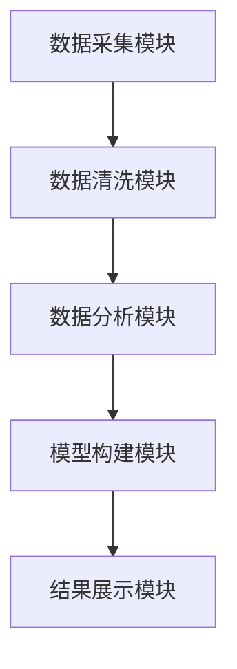

                 

# 价值投资中的行业领导者识别

## 关键词：价值投资、行业领导者、财务分析、竞争优势、投资策略

## 摘要：  
本文旨在探讨如何在价值投资中识别行业领导者。通过分析行业领导者的定义、特征、识别方法和系统解决方案，本文为投资者提供了理论支持和实战指导。从基本面分析到财务指标筛选，再到系统化解决方案，本文深入剖析了行业领导者识别的关键要素，结合实际案例，帮助投资者在复杂市场中做出明智决策。

---

## 第一部分：引言

### 1.1 价值投资的概述

#### 1.1.1 价值投资的基本概念  
价值投资是一种长期投资策略，强调以低于公允价值的价格买入优质资产。其核心在于寻找那些被市场低估的企业，关注企业的内在价值，而非短期市场波动。  

#### 1.1.2 行业领导者的定义与重要性  
行业领导者是指在特定行业中占据领先地位的企业，通常具有强大的市场影响力、竞争优势和持续的盈利能力。识别行业领导者是价值投资的关键，因为它们往往能够穿越周期，为投资者带来超额收益。  

#### 1.1.3 本书的目标与结构  
本文旨在帮助投资者系统地识别行业领导者，通过理论分析、方法论和实战案例，提供一套完整的解决方案，帮助读者在投资实践中找到真正的行业领导者。

---

## 第二部分：价值投资的核心理论

### 2.1 价值投资的基本原理

#### 2.1.1 基本面分析的核心要素  
基本面分析是价值投资的核心，主要关注企业的财务状况、行业地位、管理团队和竞争优势。以下是基本面分析的核心要素：  
1. **财务状况**：包括收入、利润、现金流等指标。  
2. **行业地位**：企业在行业中的排名和影响力。  
3. **竞争优势**：企业的核心竞争力，如技术壁垒、品牌优势等。  
4. **管理团队**：管理层的稳定性、战略眼光和执行力。  

#### 2.1.2 安全边际的概念与计算  
安全边际是价值投资中的一个重要概念，指买入价格与内在价值之间的差距。计算公式如下：  
$$ \text{安全边际} = \text{内在价值} - \text{市场价格} $$  
通过计算安全边际，投资者可以降低投资风险，确保以合理的价格买入优质资产。  

#### 2.1.3 价值与价格的动态关系  
价值与价格并非总是一致的，市场波动可能导致价格偏离价值。价值投资者需要耐心等待价格回归价值的时机，长期持有优质资产。

---

### 2.2 行业领导者的特征分析

#### 2.2.1 财务表现的关键指标  
行业领导者的财务表现通常优于同行，以下是一些关键指标：  
1. **ROE（净资产收益率）**：衡量企业盈利能力，公式为：  
$$ \text{ROE} = \frac{\text{净利润}}{\text{股东权益}} $$  
2. **ROA（资产回报率）**：衡量资产使用效率，公式为：  
$$ \text{ROA} = \frac{\text{净利润}}{\text{总资产}} $$  
3. **现金流**：健康的现金流是企业持续发展的保障。  

#### 2.2.2 市场地位与竞争优势  
行业领导者通常具有强大的市场地位和竞争优势，如：  
- 高市场份额：企业在行业中的占有率高。  
- 技术壁垒：拥有独特的技术或专利。  
- 品牌影响力：强大的品牌效应吸引更多的客户。  

#### 2.2.3 管理团队的稳定性与战略眼光  
优秀的管理团队是企业成功的关键，投资者需要关注：  
- 团队稳定性：管理层是否稳定，是否有频繁的变动。  
- 战略眼光：管理层是否能够制定长远的发展战略。  
- 执行力：管理层是否能够高效执行战略。  

---

## 第三部分：行业领导者的识别方法

### 3.1 行业分析框架

#### 3.1.1 PEST分析法  
PEST分析法从政治、经济、社会和技术四个方面分析行业环境。  
- **政治因素**：政策法规对企业的影响。  
- **经济因素**：经济周期和货币政策。  
- **社会因素**：社会趋势和消费者行为。  
- **技术因素**：技术创新对企业的影响。  

#### 3.1.2 SWOT分析法  
SWOT分析法从优势、劣势、机会和威胁四个方面分析企业。  
- **优势**：企业的核心竞争力。  
- **劣势**：企业的不足之处。  
- **机会**：行业中的潜在机会。  
- **威胁**：行业中的潜在风险。  

#### 3.1.3 行业周期与趋势预测  
行业通常会经历周期性波动，投资者需要关注行业的生命周期阶段，如导入期、成长期、成熟期和衰退期。  

### 3.2 财务指标筛选

#### 3.2.1 利润能力分析  
- **毛利率**：公式为：  
$$ \text{毛利率} = \frac{\text{营业收入} - \text{营业成本}}{\text{营业收入}} \times 100\% $$  
- **净利率**：公式为：  
$$ \text{净利率} = \frac{\text{净利润}}{\text{营业收入}} \times 100\% $$  

#### 3.2.2 资产负债表分析  
- **负债率**：公式为：  
$$ \text{负债率} = \frac{\text{总负债}}{\text{总资产}} \times 100\% $$  
- **现金流**：健康的现金流是企业财务健康的重要指标。  

#### 3.2.3 股东权益与分红  
- **股东权益**：公式为：  
$$ \text{股东权益} = \text{资产} - \text{负债} $$  
- **分红政策**：稳定的分红政策通常表明企业盈利稳定。  

---

## 第四部分：系统化解决方案

### 4.1 数据收集与处理

#### 4.1.1 数据来源  
- **财务报表**：包括资产负债表、利润表和现金流量表。  
- **行业报告**：如麦肯锡、波斯顿咨询等机构发布的行业分析报告。  
- **新闻与公告**：关注企业的最新动态和重大事件。  

#### 4.1.2 数据清洗与预处理  
- **数据清洗**：处理缺失值、异常值和重复数据。  
- **数据转换**：将数据转换为易于分析的形式，如标准化或归一化。  

### 4.2 系统架构设计

#### 4.2.1 功能模块  
- **数据采集模块**：从多个数据源采集数据。  
- **数据分析模块**：对数据进行清洗、处理和分析。  
- **模型构建模块**：基于机器学习算法构建预测模型。  
- **结果展示模块**：将分析结果以图表形式展示。  

#### 4.2.2 系统架构图  

### 4.3 指标体系设计

#### 4.3.1 指标体系  
- **财务指标**：ROE、ROA、毛利率等。  
- **市场指标**：市场份额、品牌影响力等。  
- **管理指标**：团队稳定性、战略眼光等。  

#### 4.3.2 评分系统  
- **评分标准**：根据各项指标的重要性赋予不同的权重，计算综合得分。  
- **评分公式**：  
$$ \text{综合得分} = \sum (\text{指标得分} \times \text{权重}) $$  

---

## 第五部分：实战案例分析

### 5.1 案例一：苹果公司

#### 5.1.1 公司背景  
苹果公司是全球知名的科技公司，拥有强大的品牌影响力和技术创新能力。  

#### 5.1.2 财务分析  
- **ROE**：2022年苹果的ROE约为25%。  
- **现金流**：苹果每年的现金流充裕，足以支持研发投入和分红。  

#### 5.1.3 竞争优势  
- **技术壁垒**：苹果在iOS系统和芯片设计方面具有强大的技术优势。  
- **品牌影响力**：苹果品牌在全球范围内具有强大的号召力。  

### 5.2 案例二：微软公司

#### 5.2.1 公司背景  
微软公司是全球最大的软件公司之一，近年来在云计算领域表现尤为突出。  

#### 5.2.2 财务分析  
- **ROA**：微软的ROA约为15%。  
- **市场份额**：微软在云服务市场占据领先地位。  

#### 5.2.3 竞争优势  
- **技术优势**：微软在云计算、人工智能等领域具有强大的技术优势。  
- **管理团队**：萨提亚·纳德拉（Satya Nadella）的领导为微软带来了新的增长动力。  

---

## 第六部分：结论

### 6.1 投资注意事项

#### 6.1.1 风险管理  
投资者需要关注市场波动、政策变化和公司基本面的变化，制定合理的风险管理策略。  

#### 6.1.2 长期投资  
价值投资是一种长期投资策略，需要耐心等待企业的价值回归。  

### 6.2 未来趋势

#### 6.2.1 技术进步  
人工智能和大数据技术的应用将为价值投资带来新的机遇和挑战。  

#### 6.2.2 可持续发展  
随着ESG（环境、社会、治理）投资理念的兴起，具有社会责任感的企业将成为投资者的首选。  

---

## 作者：AI天才研究院/AI Genius Institute & 禅与计算机程序设计艺术 /Zen And The Art of Computer Programming

