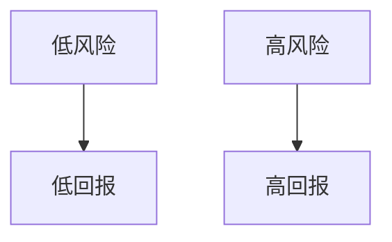
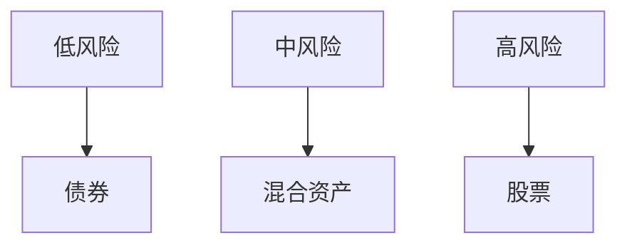
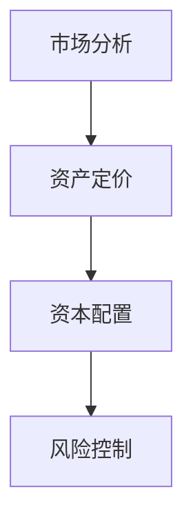
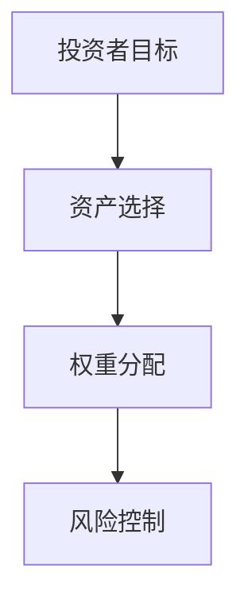
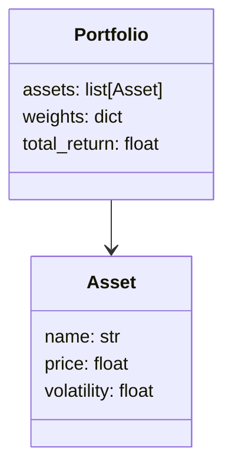
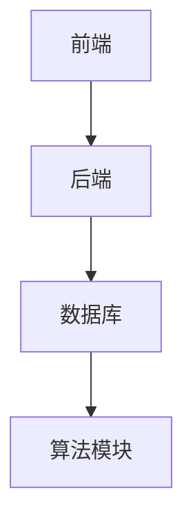

                 


# 价值投资中的资本配置策略

> **关键词**: 价值投资, 资本配置, 投资组合管理, 风险管理, 数学模型, 资产定价

> **摘要**: 本文详细探讨了价值投资中的资本配置策略，从理论基础到实际应用，结合数学模型和系统架构，分析了如何优化资本配置以实现长期稳健的投资回报。文章涵盖了资本配置的核心概念、主流策略、系统设计、实战案例以及风险管理等方面，为投资者提供了全面的指导。

---

# 第一部分: 价值投资中的资本配置策略概述

## 第1章: 资本配置的背景与重要性

### 1.1 价值投资的基本概念

#### 1.1.1 价值投资的定义与核心理念
价值投资是一种以基本面分析为基础的投资策略，旨在通过识别市场中被低估的资产，实现长期稳健的投资回报。其核心理念是购买价格低于内在价值的资产，长期持有，等待市场重新评估其价值。

**关键术语**:
- **内在价值**: 资产根据其基本面因素（如盈利能力、财务状况等）所决定的合理价格。
- **市场价值**: 资产在市场上的实际交易价格，可能高于或低于内在价值。

#### 1.1.2 资本配置在价值投资中的地位
资本配置是将资金分配到不同资产或资产类别中的过程，是价值投资策略的核心环节。有效的资本配置可以帮助投资者在不同市场环境下优化风险和回报。

#### 1.1.3 资本配置与投资组合管理的关系
资本配置是投资组合管理的基础，决定了投资组合的结构和风险特征。通过合理的资本配置，投资者可以在不同资产之间分散风险，同时最大化潜在回报。

### 1.2 资本配置的背景与问题背景

#### 1.2.1 投资者面临的资产分配挑战
投资者在进行资本配置时，需要考虑多个因素，包括市场波动、经济周期、资产流动性等。不同类型的投资者（如风险厌恶型、风险中性型、风险寻求型）有不同的资产分配策略。

#### 1.2.2 资本配置与风险控制的关联
资本配置直接影响投资组合的风险和回报。通过合理的资本配置，投资者可以在控制风险的同时，追求更高的回报。

#### 1.2.3 资本配置的边界与外延
资本配置不仅涉及资产的选择，还包括资产的权重分配、再平衡策略以及风险管理。其外延包括市场预测、资产定价模型的应用等。

---

## 第2章: 资本配置的核心概念与联系

### 2.1 资本配置的核心原理

#### 2.1.1 资本配置的基本原理
资本配置的核心在于确定不同资产的权重，以实现投资目标（如最大化回报、最小化风险等）。常见的资本配置方法包括现代投资组合理论（MPT）和资本资产定价模型（CAPM）。

#### 2.1.2 资本配置的数学模型与公式
资本配置可以通过数学模型优化。以下是一个简单的资本配置模型，假设我们有两个资产，股票和债券，目标是最大化回报，同时最小化风险。

**公式**:
$$
\text{风险} = \sqrt{w_1^2 \sigma_1^2 + w_2^2 \sigma_2^2 + 2w_1w_2\sigma_1\sigma_2\rho}
$$
其中，\( w_1 \) 和 \( w_2 \) 是股票和债券的权重，\( \sigma_1 \) 和 \( \sigma_2 \) 是股票和债券的波动率，\( \rho \) 是它们的相关性。

#### 2.1.3 资本配置与资产回报的关系
资产回报是资本配置的核心驱动因素。通过分析不同资产的历史回报和波动率，投资者可以优化资本配置。

### 2.2 核心概念的对比分析

#### 2.2.1 不同资本配置策略的对比
以下是一个简单的对比表格：

| 策略 | 基于资产类别 | 基于风险承受能力 |
|------|--------------|-------------------|
| 优点 | 分散风险      | 个性化           |
| 缺点 | 灵活性低      | 复杂性高          |

#### 2.2.2 资本配置与投资组合风险的对比
资本配置直接影响投资组合的风险。以下是一个简单的风险-回报权衡图：



#### 2.2.3 资本配置与资产流动性特征的对比
流动性高的资产更容易变现，但在市场波动较大时可能面临价格折扣。流动性低的资产则可能在市场下跌时难以变现。

---

## 第3章: 主流的资本配置策略

### 3.1 基于资产类别划分的配置策略

#### 3.1.1 股票、债券、现金等资产的配置比例
常见的资产配置比例为“60%股票 + 30%债券 + 10%现金”，但这取决于投资者的个人风险偏好和市场环境。

#### 3.1.2 不同经济周期下的资产配置调整
在经济衰退期，债券和现金的权重应增加；在经济复苏期，股票权重应增加。

#### 3.1.3 资产类别间的相互影响与协同效应
股票和债券通常呈负相关关系，可以有效分散风险。现金作为流动性资产，起到缓冲作用。

### 3.2 基于风险承受能力的配置策略

#### 3.2.1 风险偏好与资本配置的关系
风险厌恶型投资者应增加债券和现金的权重，风险寻求型投资者应增加股票权重。

#### 3.2.2 不同风险承受能力下的配置模型
以下是一个简单的配置模型：



#### 3.2.3 风险调整后的资产回报优化
通过调整资产权重，优化投资组合的回报-风险比。

---

## 第4章: 价值投资中的资本配置策略分析

### 4.1 价值投资与资本配置的结合

#### 4.1.1 价值投资理念与资本配置的融合
价值投资强调购买低估资产，资本配置强调优化资产权重。两者结合可以实现长期稳健的回报。

#### 4.1.2 价值投资中的资产定价与配置
资产定价是资本配置的基础。通过分析资产的内在价值，确定其在投资组合中的权重。

#### 4.1.3 价值投资与资本配置的动态调整
市场环境变化时，资本配置需要动态调整。例如，当市场下跌时，增加股票权重；当市场上涨时，减少股票权重。

### 4.2 资本配置的系统分析与架构设计

#### 4.2.1 系统分析框架
以下是一个系统的分析框架：



#### 4.2.2 系统架构设计
以下是一个系统的架构设计：



#### 4.2.3 系统接口与交互设计
系统需要与市场数据源、资产定价模型等接口交互。

---

## 第5章: 资本配置的数学模型与算法原理

### 5.1 资本配置的数学模型

#### 5.1.1 资本资产定价模型（CAPM）
CAPM用于确定资产的预期回报：

$$
E(R_i) = R_f + \beta_i (R_m - R_f)
$$
其中，\( R_f \) 是无风险利率，\( \beta_i \) 是资产的贝塔系数，\( R_m \) 是市场预期回报。

#### 5.1.2 马科维茨均值-方差模型
马科维茨模型用于优化投资组合的均值-方差：

$$
\text{最小化} \sigma^2 \quad \text{在} \quad \sum w_i R_i = \mu
$$

#### 5.1.3 基于风险中性的配置模型
风险中性模型通过调整风险溢价进行资产定价。

### 5.2 资本配置的算法原理

#### 5.2.1 马科维茨均值-方差模型的实现
以下是一个简单的实现代码：

```python
import numpy as np

def portfolio_optimization(returns):
    n = len(returns)
    cov_matrix = np.cov(returns)
    inv_cov = np.linalg.inv(cov_matrix)
    ones = np.ones(n)
    weight = inv_cov.dot(ones) / (ones.T.dot(inv_cov.dot(ones)))
    return weight
```

#### 5.2.2 风险调整后的资产配置算法
通过调整风险溢价进行资产定价，优化资本配置。

---

## 第6章: 价值投资中的资本配置策略实战

### 6.1 项目背景与目标
以一个模拟投资组合为例，目标是实现长期稳健的回报。

### 6.2 系统功能设计

#### 6.2.1 领域模型设计
以下是一个领域的类图：



#### 6.2.2 系统架构设计
以下是一个系统的架构设计：



### 6.3 系统实现与代码解读

#### 6.3.1 环境安装
需要安装Python、NumPy、Pandas等库。

#### 6.3.2 核心实现代码
以下是一个资本配置的实现代码：

```python
import numpy as np

def optimize_portfolio(assets, returns):
    n = len(assets)
    cov_matrix = np.cov(returns)
    inv_cov = np.linalg.inv(cov_matrix)
    ones = np.ones(n)
    weight = inv_cov.dot(ones) / (ones.T.dot(inv_cov.dot(ones)))
    return {asset: weight[i] for asset, i in zip(assets, range(n))}
```

### 6.4 实际案例分析与小结
通过实际案例分析，验证资本配置策略的有效性，并总结经验教训。

---

## 第7章: 资本配置的风险管理与优化

### 7.1 风险管理的核心原则
风险管理是资本配置的重要环节，包括风险识别、风险评估和风险控制。

### 7.2 风险调整后的资本配置策略
通过调整风险溢价进行资产定价，优化资本配置。

### 7.3 资本配置的风险对冲策略
使用衍生工具（如期货、期权）对冲市场风险。

---

## 第8章: 总结与展望

### 8.1 本文总结
总结本文的主要内容和结论，强调资本配置在价值投资中的重要性。

### 8.2 对未来研究的展望
提出未来的研究方向，如动态资本配置模型、多资产类别配置策略等。

---

# 作者：AI天才研究院/AI Genius Institute & 禅与计算机程序设计艺术 /Zen And The Art of Computer Programming

---

**注意**: 以上内容是一个详细的目录和概述，实际写作时需要根据每个部分展开，加入更多细节和具体案例。

