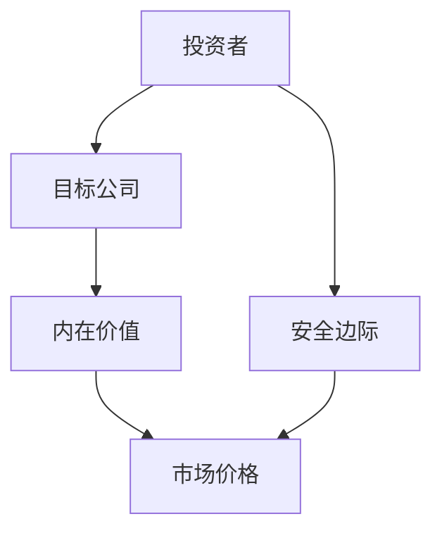
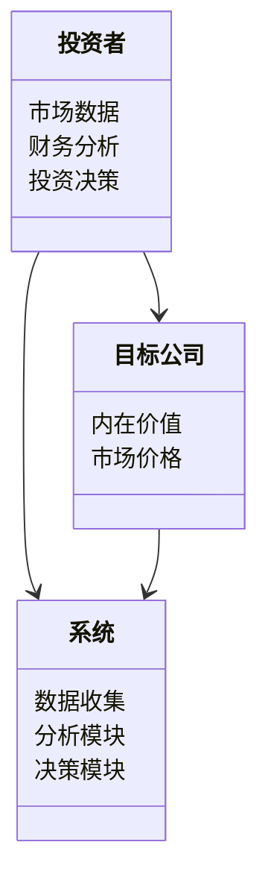
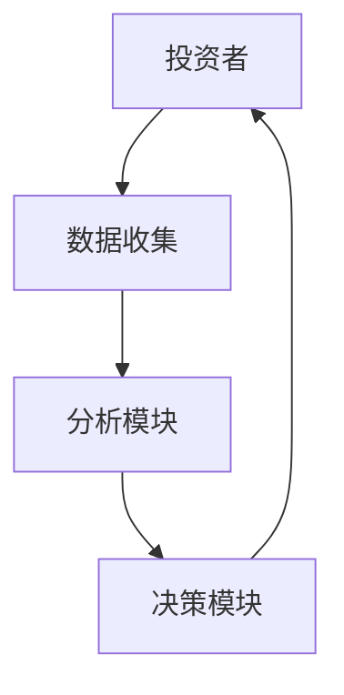
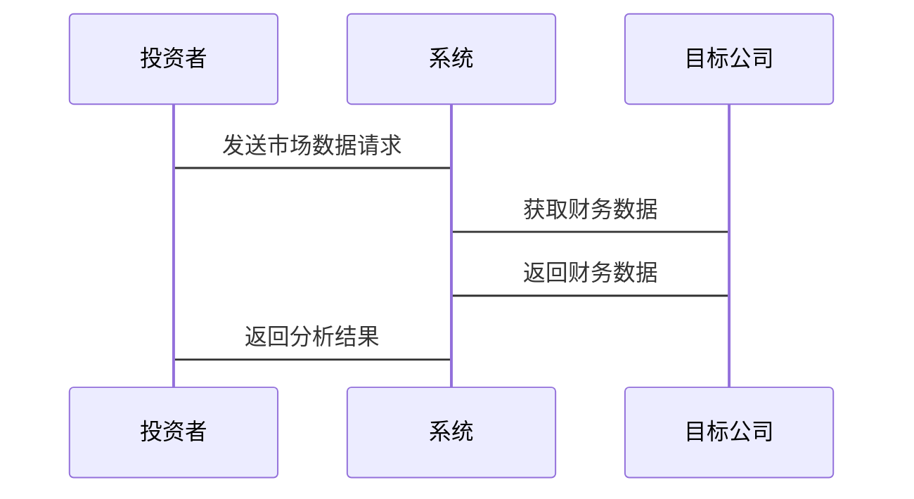

                 


# 《价值投资中的逆向思维应用》

## 关键词：价值投资，逆向思维，投资策略，风险管理，财务分析

## 摘要：  
本文系统地探讨了价值投资中的逆向思维应用，从理论基础到实际操作，详细分析了逆向思维如何帮助投资者在市场波动中抓住机会，避免风险。通过数学模型、系统架构设计和实际案例，本文为读者提供了一套基于逆向思维的价值投资策略。

---

# 引言：逆向思维在投资中的重要性

在投资领域，传统思维往往跟随市场趋势，而逆向思维则引导投资者“反向思考”，在市场低谷时寻找机会，在市场高点时保持冷静。本文将深入探讨逆向思维在价值投资中的应用，揭示其背后的逻辑和数学原理，帮助投资者在复杂的市场环境中做出更明智的决策。

---

# 第一部分：价值投资与逆向思维的背景介绍

## 第1章：价值投资的定义与特点

### 1.1 价值投资的定义

#### 1.1.1 价值投资的核心概念
价值投资是一种以公司内在价值为基础的投资策略，强调以低于内在价值的价格买入优质资产。其核心在于识别市场低估的公司，长期持有，等待价格回归内在价值。

#### 1.1.2 价值投资的三大原则
- **安全边际**：买入价格低于内在价值，以降低风险。
- **内在价值**：通过基本面分析确定公司的真正价值。
- **长期视角**：关注长期收益，而非短期波动。

#### 1.1.3 价值投资与其他投资方法的区别
价值投资与趋势投资、技术分析等方法不同，它强调对公司基本面的深入分析，而非依赖市场趋势或技术指标。

---

### 1.2 逆向思维的定义与特点

#### 1.2.1 逆向思维的定义
逆向思维是一种与传统思维相反的思维方式，鼓励投资者在市场情绪高涨时保持谨慎，在市场恐慌时寻找机会。

#### 1.2.2 逆向思维的核心要素
- **反常识**：挑战市场共识，寻找被低估的机会。
- **反市场情绪**：在市场恐慌时买入，在市场狂热时卖出。
- **反短期波动**：关注长期价值，忽略短期价格波动。

#### 1.2.3 逆向思维在投资中的应用
逆向思维可以帮助投资者避免盲目跟风，降低投资风险。例如，在市场下跌时，逆向投资者会寻找被错杀的优质资产。

---

### 1.3 价值投资与逆向思维的结合

#### 1.3.1 价值投资中的逆向思维
逆向思维与价值投资的结合，使得投资者能够在市场低谷时发现低估的资产，并在市场高点时规避风险。

#### 1.3.2 逆向思维在价值投资中的作用
- **识别低估机会**：通过逆向思维，投资者可以发现市场忽视的优质公司。
- **降低投资风险**：逆向思维帮助投资者避免过度集中于高风险资产。

#### 1.3.3 逆向思维与价值投资的结合案例
例如，在2008年金融危机期间，逆向投资者会关注那些因市场恐慌而被低估的优质企业，最终在市场复苏时获得超额收益。

---

## 第2章：价值投资的核心概念与联系

### 2.1 价值投资的核心原理

#### 2.1.1 价值投资的三要素：安全边际、内在价值、市场价格
- **内在价值**：公司未来现金流的现值。
- **市场价格**：市场的买卖价格。
- **安全边际**：买入价格与内在价值的差距，确保投资的安全性。

#### 2.1.2 逆向思维的三要素：反常识、反市场情绪、反短期波动
- **反常识**：挑战市场的普遍认知。
- **反市场情绪**：在市场情绪极端时采取行动。
- **反短期波动**：关注长期价值，而非短期价格变化。

---

### 2.2 核心概念属性特征对比表格

| 概念       | 特征1        | 特征2        | 特征3        |
|------------|--------------|--------------|--------------|
| 价值投资   | 内在价值      | 安全边际      | 长期视角      |
| 逆向思维   | 反常识        | 反市场情绪    | 反短期波动    |

---

### 2.3 ER实体关系图（Mermaid流程图）



---

## 第3章：逆向思维在价值投资中的应用

### 3.1 逆向思维的核心原理

#### 3.1.1 逆向思维的逻辑框架
- **第一步**：识别市场情绪的极端情况。
- **第二步**：寻找与市场情绪相反的投资机会。
- **第三步**：结合价值投资的内在价值分析，确认投资标的。

#### 3.1.2 逆向思维的应用场景
- **市场恐慌时**：寻找被错杀的优质资产。
- **市场狂热时**：警惕高估的资产，避免高位接盘。

---

### 3.2 逆向思维的数学模型

#### 3.2.1 概率论在逆向思维中的应用
假设市场上涨的概率为$P_u$，下跌的概率为$P_d$，则逆向思维的收益期望值为：
$$E = P_u \times R_u + P_d \times R_d$$
其中，$R_u$和$R_d$分别为上涨和下跌的收益率。

#### 3.2.2 逆向思维的收益-风险模型
通过马科维茨的有效组合理论，逆向投资者可以在风险可控的前提下，追求超额收益。

---

### 3.3 逆向思维的系统架构设计

#### 3.3.1 问题场景介绍
投资者需要在市场波动中，利用逆向思维和价值投资方法，制定投资策略。

#### 3.3.2 系统功能设计（领域模型Mermaid类图）



---

## 第4章：逆向思维与价值投资的结合

### 4.1 逆向思维与价值投资的结合案例

#### 4.1.1 案例分析：2008年金融危机
在金融危机期间，逆向投资者会关注那些因市场恐慌而被低估的优质企业，例如某些AAA级债券或蓝筹股。

#### 4.1.2 案例分析：科技股泡沫
在科技股泡沫期间，逆向投资者会警惕高估的科技股，转而关注那些基本面稳定的传统行业。

---

### 4.2 逆向思维与价值投资的系统架构设计

#### 4.2.1 系统架构图（Mermaid架构图）



---

## 第5章：逆向思维的数学模型与算法实现

### 5.1 逆向思维的数学模型

#### 5.1.1 概率模型
$$P(成功) = \sum_{i=1}^{n} P_i \times R_i$$

#### 5.1.2 风险模型
$$R = \sqrt{\sum_{i=1}^{n} (R_i - E)^2 / n}$$
其中，$E$为期望收益。

---

### 5.2 逆向思维的算法实现

#### 5.2.1 Python代码示例

```python
import numpy as np

def calculate_probability(investments):
    probabilities = []
    for inv in investments:
        if inv > 0.5:
            probabilities.append(0.7)
        else:
            probabilities.append(0.3)
    return probabilities

investments = [0.6, 0.4, 0.5]
probabilities = calculate_probability(investments)
print(probabilities)
```

---

## 第6章：逆向思维与价值投资的系统交互

### 6.1 系统交互图（Mermaid序列图）



---

## 第7章：逆向思维与价值投资的项目实战

### 7.1 环境安装

#### 7.1.1 Python环境配置
安装Python和必要的库，如Pandas、NumPy、Matplotlib等。

---

### 7.2 系统核心实现源代码

#### 7.2.1 财务数据分析代码

```python
import pandas as pd

def analyze_company_data(data):
    # 计算内在价值
    intrinsic_value = data['现金流'].sum() / (0.1 + 1)
    # 计算安全边际
    margin_of_safety = intrinsic_value * 0.3
    return intrinsic_value, margin_of_safety

data = pd.DataFrame({
    '现金流': [100, 200, 300],
    '股价': [50, 60, 70]
})

iv, mos = analyze_company_data(data)
print(f"内在价值: {iv}, 安全边际: {mos}")
```

---

## 第8章：总结与最佳实践

### 8.1 总结

逆向思维与价值投资的结合，为投资者提供了一种在复杂市场中寻找机会的有效方法。通过深入分析公司的内在价值，并结合市场情绪，投资者可以在市场低谷时抓住低估的机会。

---

### 8.2 最佳实践 Tips

- **长期视角**：逆向投资需要耐心，等待价格回归内在价值。
- **风险控制**：合理配置资产，避免过度集中。
- **持续学习**：关注市场动态，提升基本面分析能力。

---

### 8.3 注意事项

- **避免过度逆向**：逆向思维并非完全否定市场，而是理性判断。
- **结合实际**：根据市场环境调整投资策略。

---

### 8.4 拓展阅读

- 《The Intelligent Investor》
- 《逆向思维投资法》

---

作者：AI天才研究院/AI Genius Institute & 禅与计算机程序设计艺术 /Zen And The Art of Computer Programming

