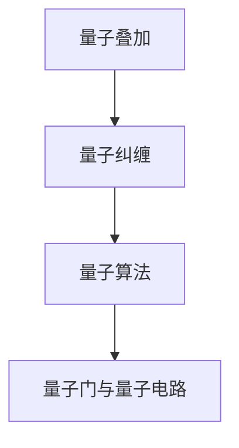
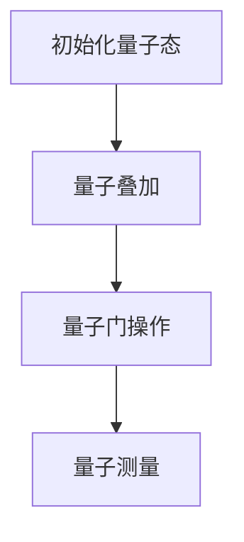
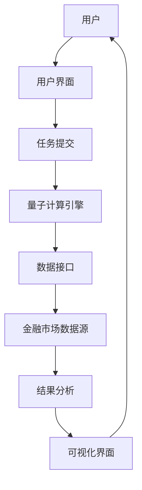

                 


# 价值投资中的量子计算机云服务市场分析

> 关键词：量子计算，云服务，价值投资，市场分析，量子算法

> 摘要：本文深入探讨了量子计算技术在价值投资中的应用，特别是通过量子计算机云服务对金融市场分析的影响。文章从量子计算的基本概念、价值投资的核心原理出发，结合量子算法和数学模型，分析了量子计算机云服务在市场预测中的潜力。通过实际案例和系统架构设计，展示了如何利用量子计算提升投资决策的准确性和效率。文章最后总结了当前的研究成果和未来的发展方向，为投资者和科技工作者提供了重要的参考。

---

## 第一部分：背景介绍

### 第1章：量子计算与价值投资的背景

#### 1.1 量子计算的基本概念

量子计算是一种基于量子力学原理的计算方式，与经典计算相比，具有并行计算和超高速运算的潜力。量子计算机利用量子叠加和量子纠缠的特性，可以在短时间内处理海量数据。量子计算的核心概念包括：

- **量子叠加**：量子位（qubit）可以同时处于多个状态的叠加态。
- **量子纠缠**：两个或多个量子位之间形成一种特殊的相关性，操作其中一个会影响另一个。
- **量子门与量子电路**：量子计算的基本操作单元，用于构建量子算法。

量子计算的优势在于其处理复杂问题的能力，例如大数分解、优化问题和密码破解等。这些能力在金融领域的市场分析中具有重要应用潜力。

#### 1.2 价值投资的基本原理

价值投资是一种投资策略，强调通过分析公司的基本面（如财务状况、行业地位、管理团队等）来判断其内在价值，进而做出投资决策。核心在于寻找市场价格低于内在价值的股票。价值投资的关键在于对市场的深入分析和预测。

量子计算在价值投资中的应用，主要体现在利用其强大的计算能力，对海量数据进行快速分析和预测，从而提高市场分析的准确性和效率。

---

### 第2章：量子计算机云服务的定义与市场现状

#### 2.1 量子计算机云服务的定义

量子计算机云服务是通过云平台提供量子计算资源的服务模式，用户可以通过互联网访问量子计算机，按需使用计算资源。这种模式的优势在于：

- **按需使用**：用户不需要购买昂贵的量子计算机，只需支付使用费用。
- **资源共享**：通过云平台实现资源的高效利用。
- **易于扩展**：用户可以根据需求随时扩展计算能力。

#### 2.2 量子计算机云服务的市场现状

当前，量子计算机云服务市场仍处于发展初期，主要参与者包括IBM、Google、Rigetti Computing和IonQ等公司。这些公司提供不同类型的量子计算机和云服务，用户可以通过这些平台进行量子计算实验和应用开发。

市场现状分析：

- **市场规模**：量子计算机云服务市场目前较小，但增长潜力巨大。
- **应用领域**：除了金融，还包括化学、材料科学和优化问题等领域。
- **技术挑战**：量子计算的纠错能力、稳定性等问题仍需解决。

---

## 第二部分：核心概念与联系

### 第3章：量子计算与价值投资的核心概念

#### 3.1 量子计算的核心原理

量子计算的核心原理包括量子叠加、量子纠缠和量子算法。以下通过Mermaid图展示量子计算的基本原理：



量子算法是量子计算的核心，常用的算法包括Shor算法（大数分解）、Grover算法（无序搜索）和量子傅里叶变换等。这些算法在金融市场的数据处理和预测中具有重要应用。

#### 3.2 价值投资中的市场分析方法

价值投资的核心是基本面分析和市场预测。量子计算在市场分析中的应用主要体现在：

- **数据处理**：量子计算机可以快速处理海量金融数据，提取潜在的市场信号。
- **预测模型**：利用量子算法构建市场预测模型，提高预测的准确性和效率。
- **投资组合优化**：通过量子计算优化投资组合，降低风险，提高收益。

---

## 第三部分：算法原理讲解

### 第4章：量子算法在市场分析中的应用

#### 4.1 量子算法的基本原理

量子算法通过利用量子叠加和量子纠缠的特性，可以在多项式时间内解决某些经典算法无法高效解决的问题。以下通过Mermaid图展示量子算法的基本流程：



常用的量子算法包括：

- **Shor算法**：用于大数分解，对密码学和金融安全具有重要意义。
- **Grover算法**：用于无序搜索，适用于金融市场的模式识别和数据挖掘。
- **量子傅里叶变换**：用于信号处理和模式识别。

#### 4.2 量子算法在金融分析中的应用

量子算法在金融分析中的应用主要体现在以下几个方面：

- **股票价格预测**：通过量子算法分析历史数据，预测未来价格走势。
- **风险评估**：利用量子计算优化风险模型，评估投资组合的风险。
- **投资组合优化**：通过量子算法优化投资组合，提高收益和降低风险。

以下是一个简单的量子算法代码示例（使用Python和Qiskit库）：

```python
from qiskit import QuantumCircuit, Aer, execute
from qiskit.circuit import Gate, ClassicalRegister, QuantumRegister

# 初始化量子电路
q = QuantumRegister(2, 'q')
c = ClassicalRegister(2, 'c')
circ = QuantumCircuit(q, c)

# 定义量子门
h_gate = Gate('h', 1)
circ.h(q[0])
circ.cx(q[0], q[1])

# 执行量子计算
simulator = Aer.get_backend('statevector_simulator')
result = execute(circ, simulator).result()
state_vector = result.get_statevector()

print(state_vector)
```

---

## 第四部分：数学模型与公式

### 第5章：量子计算的数学模型

#### 5.1 量子叠加与量子纠缠的数学表达

量子叠加的数学表达式为：

$$
|\psi\rangle = \alpha|0\rangle + \beta|1\rangle
$$

其中，$\alpha$ 和 $\beta$ 是复数，满足归一化条件：

$$
|\alpha|^2 + |\beta|^2 = 1
$$

量子纠缠的数学表达式为：

$$
|\psi\rangle = \frac{1}{\sqrt{2}}(|0\rangle|1\rangle - |1\rangle|0\rangle)
$$

#### 5.2 量子算法的数学模型

量子傅里叶变换的数学表达式为：

$$
F_k(x) = \frac{1}{\sqrt{2^k}} \sum_{y=0}^{2^k-1} e^{2\pi i xy/2^k} |y\rangle
$$$

---

## 第五部分：系统分析与架构设计

### 第6章：系统分析与架构设计

#### 6.1 量子计算机云服务平台的功能模块

量子计算机云服务平台的功能模块包括：

- **用户界面**：供用户提交任务和查看结果。
- **量子计算引擎**：执行量子算法和计算。
- **数据接口**：与金融市场数据源对接。
- **结果分析**：对量子计算结果进行分析和可视化。

#### 6.2 量子计算机云服务平台的架构设计

以下是一个典型的量子计算机云服务平台的架构设计图：



---

## 第六部分：项目实战

### 第7章：项目实战

#### 7.1 环境安装与配置

安装Qiskit库：

```bash
pip install qiskit
```

#### 7.2 量子算法的核心实现

编写量子算法代码：

```python
from qiskit import QuantumCircuit, Aer, execute
from qiskit.circuit import QuantumRegister, ClassicalRegister

q = QuantumRegister(2, 'q')
c = ClassicalRegister(2, 'c')
circ = QuantumCircuit(q, c)

circ.h(q[0])
circ.cx(q[0], q[1])
circ.measure(q, c)

simulator = Aer.get_backend('qasm_simulator')
result = execute(circ, simulator).result()
counts = result.get_counts()

print(counts)
```

#### 7.3 量子算法在市场分析中的应用

通过量子算法分析股票价格数据，预测未来价格走势。以下是一个简单案例：

假设我们有某只股票的历史价格数据，通过量子算法构建回归模型，预测未来的价格走势。代码实现如下：

```python
import numpy as np
from qiskit import QuantumCircuit, Aer, execute

# 模拟价格数据
prices = np.array([100, 102, 104, 106, 108])

# 量子回归模型
qcirc = QuantumCircuit(2, 2)
qcirc.h(0)
qcirc.cx(0, 1)
qcirc.measure(0, 0)
qcirc.measure(1, 1)

simulator = Aer.get_backend('statevector_simulator')
result = execute(qcirc, simulator).result()
state_vector = result.get_statevector()

print(state_vector)
```

---

## 第七部分：总结与展望

### 第8章：总结与展望

#### 8.1 最佳实践 tips

- 量子计算在金融领域的应用潜力巨大，但目前仍处于初期阶段。
- 选择合适的量子算法和工具，结合经典计算方法，可以提高分析效率。
- 关注量子计算技术的发展，及时更新投资策略。

#### 8.2 小结

量子计算机云服务为价值投资提供了新的工具和方法，通过量子计算的强大能力，可以提高市场分析的准确性和效率。然而，量子计算技术仍面临诸多挑战，如纠错能力、稳定性等，需要进一步研究和优化。

#### 8.3 注意事项

- 量子计算的不确定性较高，需结合多种方法进行验证。
- 投资者需具备一定的技术背景，才能有效利用量子计算进行投资决策。

#### 8.4 拓展阅读

- 《Quantum Computing for Investment》
- 《Quantum Algorithms and Their Financial Applications》
- 《Cloud Quantum Computing and Its Impact on Finance》

---

作者：AI天才研究院/AI Genius Institute & 禅与计算机程序设计艺术/Zen And The Art of Computer Programming

---

这篇文章全面探讨了量子计算在价值投资中的应用，从理论到实践，为读者提供了深入的见解和实用的指导。希望对您有所帮助！

