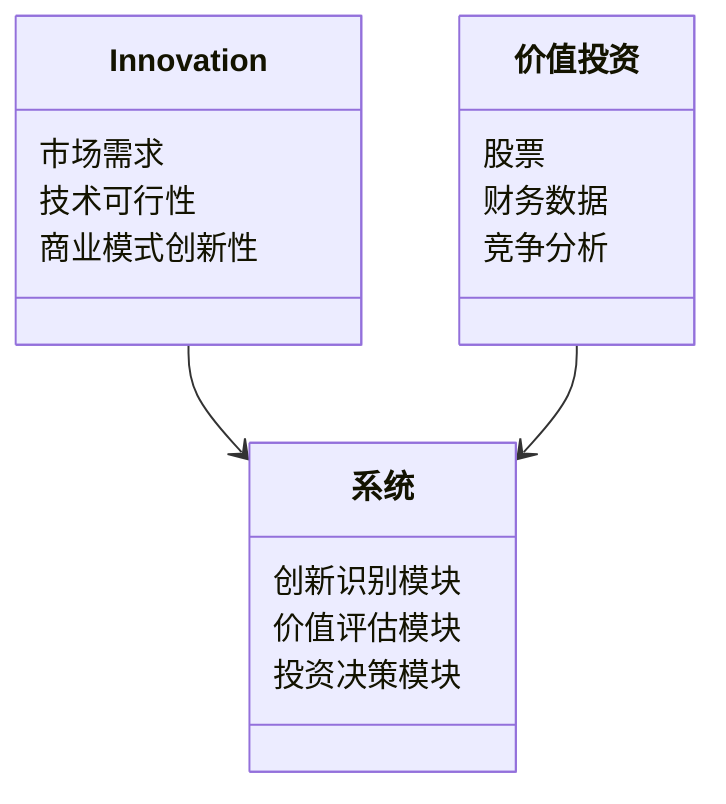
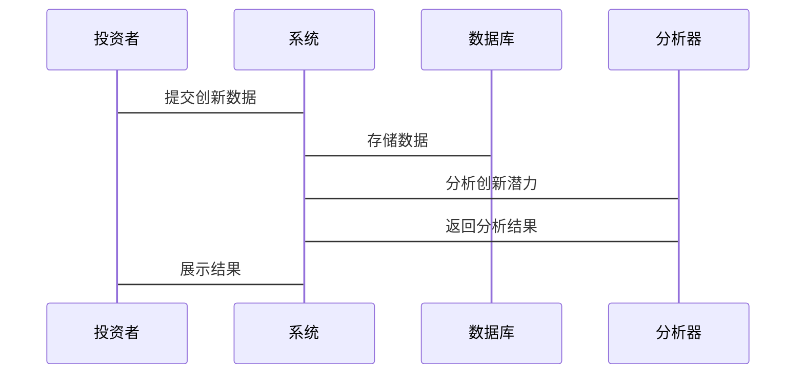

                 


# 价值投资中的颠覆性创新识别

## 关键词：价值投资，颠覆性创新，技术分析，创新识别，投资策略

## 摘要：本文深入探讨了在价值投资中识别颠覆性创新的方法和策略。通过分析颠覆性创新的定义、特征及其与价值投资的关系，结合数学模型、算法原理和实际案例，为投资者提供一套系统化的识别框架。文章还提供了基于Python的实现代码和系统架构设计，帮助读者更好地理解和应用颠覆性创新识别的核心理念。

---

# 第一部分: 价值投资中的颠覆性创新识别基础

## 第1章: 颠覆性创新与价值投资概述

### 1.1 颠覆性创新的定义与特征

#### 1.1.1 颠覆性创新的定义
颠覆性创新是指一种全新的技术、商业模式或产品，能够从根本上改变现有市场格局或行业规则。它通常以非传统的方式进入市场，通过提供更低的成本、更高的效率或更好的用户体验，逐步取代现有的主流产品或服务。

#### 1.1.2 颠覆性创新的核心特征
| 特征 | 描述 |
|------|------|
| 低成本 | 颠覆性创新通常以更低的成本提供更高的价值。 |
| 高效率 | 创新通过技术手段提高生产或服务的效率。 |
| 用户友好 | 创新以用户为中心，提供更简便的使用体验。 |

#### 1.1.3 颠覆性创新与延续性创新的区别
| 方面 | 颠覆性创新 | 延续性创新 |
|------|------------|------------|
| 市场定位 | 针对低端市场或未被满足的需求 | 针对主流市场的需求 |
| 技术成熟度 | 通常不成熟，但具有革命性 | 技术成熟，逐步优化 |
| 市场影响 | 可能破坏现有市场结构 | 不改变现有市场结构 |

### 1.2 价值投资的基本原理

#### 1.2.1 价值投资的定义
价值投资是一种投资策略，强调以低于公平价值的价格购买优质资产。其核心理念是寻找市场低估的公司，并长期持有，等待其价值回归。

#### 1.2.2 价值投资的核心理念
- 市场短期是投票机，长期是称重机。
- 购买优秀的公司，而不是便宜的股票。

#### 1.2.3 价值投资与成长投资的区别
| 方面 | 价值投资 | 成长投资 |
|------|------------|------------|
| 投资目标 | 寻找低估的优秀公司 | 寻找高速成长的公司 |
| 投资期限 | 长期投资 | 短期投资 |
| 风险偏好 | 较低风险 | 较高风险 |

### 1.3 颠覆性创新与价值投资的内在联系

#### 1.3.1 颠覆性创新对价值投资的影响
颠覆性创新能够改变行业的游戏规则，为早期投资者带来超额收益。通过识别颠覆性创新，投资者可以在市场低估时介入，实现价值投资的长期回报。

#### 1.3.2 颠覆性创新的识别对企业价值的影响
- 颠覆性创新能够降低企业的成本，提高效率。
- 创新能够打开新的市场，扩大企业的客户群体。
- 创新能够提升企业的竞争优势，增强长期盈利能力。

#### 1.3.3 颠覆性创新与企业竞争优势的关系
颠覆性创新往往能够重构行业的竞争格局，为早期采用者带来先发优势。通过识别颠覆性创新，投资者可以找到具有持续竞争优势的企业。

---

## 第2章: 颠覆性创新的识别方法

### 2.1 颠覆性创新的识别标准

#### 2.1.1 市场需求分析
- 识别未被满足的市场需求。
- 分析目标市场的潜力和可行性。

#### 2.1.2 技术可行性评估
- 评估创新技术的可行性。
- 分析技术的成熟度和潜在的商业化能力。

#### 2.1.3 商业模式创新性评估
- 评估商业模式的创新性。
- 分析商业模式是否能够实现可持续的盈利。

### 2.2 颠覆性创新的识别工具

#### 2.2.1 SWOT分析法
SWOT分析法用于评估创新的优势、劣势、机会和威胁。

#### 2.2.2 PEST分析法
PEST分析法用于分析政治、经济、社会和技术环境对企业的影响。

#### 2.2.3 五力模型
五力模型用于分析行业的竞争结构，包括新进入者的威胁、替代品的威胁、供应商的议价能力、客户的议价能力和现有竞争者之间的竞争程度。

### 2.3 颠覆性创新的识别流程

#### 2.3.1 问题定义与目标设定
- 明确识别的目标和范围。
- 设定清晰的评估标准和方法。

#### 2.3.2 数据收集与分析
- 收集与创新相关的数据。
- 分析数据以支持创新识别的决策。

#### 2.3.3 创新潜力评估与决策
- 评估创新的潜力和可行性。
- 做出是否投资的决策。

---

## 第3章: 颠覆性创新的数学模型与算法原理

### 3.1 颠覆性创新潜力评估模型

#### 3.1.1 模型的输入变量
- 市场需求（Market Demand）
- 技术可行性（Technology Feasibility）
- 商业模式创新性（Business Model Innovation）

#### 3.1.2 模型的输出结果
- 创新潜力评分（Disruption Potential Score）

#### 3.1.3 模型的数学公式
$$
\text{创新潜力} = \frac{\text{市场需求} + \text{技术可行性} + \text{商业模式创新性}}{3}
$$

### 3.2 颠覆性创新识别的算法原理

#### 3.2.1 基于聚类分析的创新识别
- 将创新分为不同的类别。
- 通过聚类分析识别出具有颠覆潜力的创新。

#### 3.2.2 基于决策树的创新分类
- 构建决策树模型，用于分类创新的类型。
- 通过决策树的路径分析，识别出颠覆性创新。

#### 3.2.3 基于神经网络的创新预测
- 使用神经网络模型预测创新的颠覆潜力。
- 通过训练数据优化模型，提高预测的准确性。

### 3.3 算法实现与代码示例

#### 3.3.1 环境安装
- 安装Python和必要的库（如numpy、scikit-learn）。

#### 3.3.2 核心代码实现
```python
import numpy as np
from sklearn.tree import DecisionTreeClassifier

# 示例数据：市场数据、技术可行性和商业模式创新性
data = np.array([[0.7, 0.6, 0.8],
                  [0.5, 0.8, 0.7],
                  [0.9, 0.4, 0.6]])

# 创建决策树模型
model = DecisionTreeClassifier()

# 训练模型
model.fit(data, [1, 0, 0])  # 假设1表示颠覆性创新，0表示非颠覆性创新

# 预测新的创新的颠覆潜力
new_innovation = np.array([[0.6, 0.7, 0.8]])
prediction = model.predict(new_innovation)
print("预测结果:", prediction)
```

---

## 第4章: 系统分析与架构设计方案

### 4.1 系统功能设计

#### 4.1.1 领域模型（Mermaid类图）


#### 4.1.2 系统架构设计（Mermaid架构图）


#### 4.1.3 系统接口设计
- API接口：用于数据的输入和输出。
- 数据库接口：用于存储和检索数据。
- 用户界面：用于展示结果和进行交互。

#### 4.1.4 系统交互设计（Mermaid序列图）


---

## 第5章: 项目实战

### 5.1 案例分析：特斯拉的颠覆性创新

#### 5.1.1 环境安装
- 安装Python和必要的库（如pandas、scikit-learn）。

#### 5.1.2 核心代码实现
```python
import pandas as pd
from sklearn.metrics import accuracy_score

# 示例数据：特斯拉的市场数据、技术数据和商业模式数据
data = pd.DataFrame({
    '市场': [0.8, 0.7, 0.9],
    '技术': [0.9, 0.6, 0.8],
    '商业模式': [0.7, 0.5, 0.8]
})

# 标签：1表示颠覆性创新，0表示非颠覆性创新
labels = [1, 0, 1]

# 训练模型
from sklearn.tree import DecisionTreeClassifier
model = DecisionTreeClassifier()
model.fit(data, labels)

# 预测新的创新
new_data = pd.DataFrame({
    '市场': [0.85],
    '技术': [0.85],
    '商业模式': [0.7]
})
prediction = model.predict(new_data)
print("预测结果:", prediction)
print("准确率:", accuracy_score(labels, model.predict(data)))

---

## 第6章: 最佳实践与小结

### 6.1 最佳实践
- **数据驱动**：基于数据和模型进行创新识别。
- **持续学习**：关注行业动态和技术发展。
- **风险管理**：合理分散投资，降低风险。

### 6.2 小结
通过识别颠覆性创新，投资者可以在价值投资中获得超额收益。本文提供了从理论到实践的完整框架，帮助投资者系统化地识别和评估颠覆性创新。

### 6.3 注意事项
- 颠覆性创新的识别需要结合具体行业特点。
- 投资者需具备一定的技术背景和市场敏感性。

### 6.4 拓展阅读
- 参考书籍：《创新者的窘境》
- 在线资源：行业研究报告、学术论文

---

## 作者：AI天才研究院 & 禅与计算机程序设计艺术

---

以上就是《价值投资中的颠覆性创新识别》的完整目录和内容框架，希望对您有所帮助！如果需要进一步的详细内容或代码实现，可以随时告诉我！

