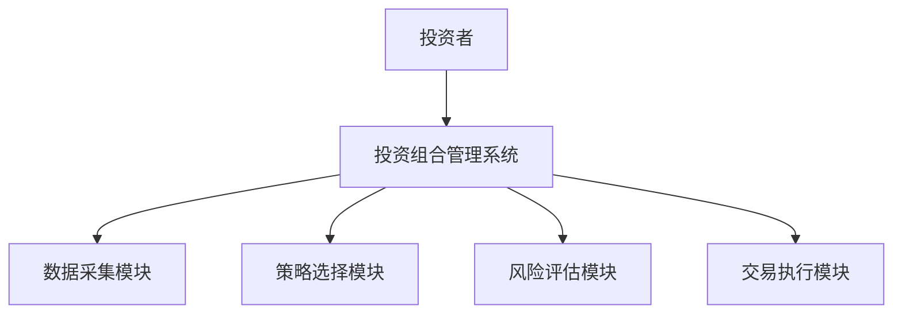
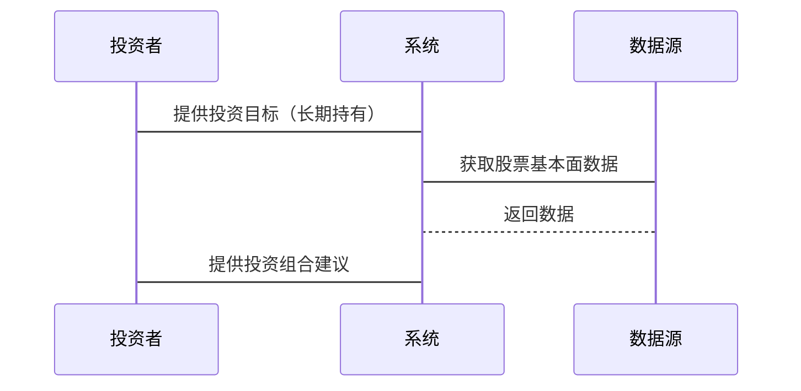
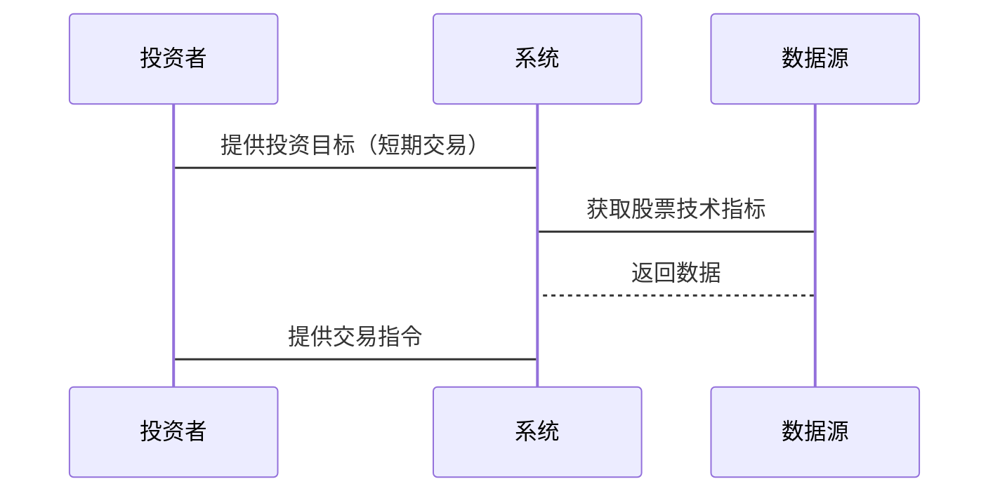

                 

# 价值投资策略：长期持有vs短期交易

> 关键词：价值投资，长期持有，短期交易，投资策略，股票分析

> 摘要：本文深入分析了价值投资中的两种主要策略——长期持有和短期交易。通过对比分析，探讨了这两种策略的优缺点、适用场景以及风险因素。文章结合数学模型和实际案例，为投资者提供了选择适合自己的投资策略的思路。

---

# 第1章: 价值投资策略的基本概念

## 1.1 价值投资的定义与背景

### 1.1.1 价值投资的起源与发展

价值投资是一种以股票的内在价值为基础的投资策略，起源于20世纪初。本杰明·格雷厄姆和戴维·多德是这一策略的奠基人。他们认为，股票的市场价并不总是反映其真实的内在价值，因此投资者应寻找价格低于内在价值的股票进行投资。

近年来，随着金融市场的复杂化和信息透明度的提高，价值投资策略在学术界和实践中得到了进一步的发展和应用。

### 1.1.2 长期持有与短期交易的定义

- **长期持有**：投资者买入股票后持有较长时间（通常为数年），旨在通过资本增值和复利效应实现收益。
- **短期交易**：投资者在较短时间内（几天到几个月）买卖股票，利用价格波动赚取差价。

### 1.1.3 价值投资在现代投资学中的地位

价值投资策略是现代投资学的重要组成部分。它强调基本面分析，注重企业的财务状况、行业地位和未来前景，而非市场情绪或短期价格波动。

---

## 1.2 长期持有与短期交易的核心区别

### 1.2.1 长期持有的特点与优势

- **长期持有的特点**：
  - 侧重于企业的内在价值。
  - 风险承受能力较低。
  - 适合稳健型投资者。

- **长期持有的优势**：
  - 能够避免短期市场波动的影响。
  - 通过复利效应实现资产的长期增长。

### 1.2.2 短期交易的特点与劣势

- **短期交易的特点**：
  - 侧重于市场价格波动。
  - 风险承受能力较高。
  - 适合激进型投资者。

- **短期交易的劣势**：
  - 市场流动性依赖较强。
  - 易受市场情绪影响，风险较高。

### 1.2.3 两种策略的适用场景对比

| 比较维度 | 长期持有 | 短期交易 |
|----------|----------|----------|
| 投资目标 | 资产增值 | 短期收益 |
| 时间跨度 | 3年以上 | 几周至几个月 |
| 风险承受 | 较低 | 较高 |
| 资金流动性 | 低 | 高 |

---

## 1.3 价值投资策略的理论基础

### 1.3.1 基本分析与技术分析的区别

- **基本分析**：通过分析企业的财务报表、行业地位和市场环境等因素，评估股票的内在价值。
- **技术分析**：通过分析历史价格和成交量等数据，预测未来的价格走势。

### 1.3.2 长期持有与短期交易的理论依据

- **长期持有**：基于企业的基本面分析，寻找被市场低估的股票。
- **短期交易**：基于技术分析，寻找短期价格波动的机会。

### 1.3.3 价值投资策略的边界与外延

价值投资策略不仅适用于股票市场，还可应用于房地产、债券等其他投资领域。然而，其核心在于对资产内在价值的准确评估。

---

## 1.4 本章小结

通过本章的介绍，我们了解了价值投资策略的基本概念、长期持有与短期交易的核心区别，以及它们的理论基础。接下来，我们将深入分析这两种策略的数学模型和实际应用。

---

# 第2章: 长期持有与短期交易的核心概念分析

## 2.1 长期持有的核心原理

### 2.1.1 股票内在价值的计算方法

股票的内在价值可以通过以下公式计算：

$$
\text{内在价值} = \frac{\text{未来现金流的现值}}{\text{折现率}}
$$

其中，未来现金流可以通过企业自由现金流模型或股利折扣模型进行计算。

### 2.1.2 长期持有的风险管理策略

长期持有的风险主要来源于市场波动和企业的基本面变化。投资者可以通过分散投资和定期复盘来降低风险。

### 2.1.3 长期持有与复利效应的关系

复利效应是长期持有的核心优势之一。通过长期持有优质资产，投资者可以实现财富的指数级增长。

---

## 2.2 短期交易的核心原理

### 2.2.1 技术分析的基本方法

技术分析主要包括以下几种方法：
- **K线图分析**：通过分析价格走势判断买卖信号。
- **移动平均线（MA）**：通过计算一定时间内价格的平均值，判断价格趋势。
- **相对强弱指数（RSI）**：通过分析价格的超买超卖状态，判断价格可能的反转点。

### 2.2.2 短期交易的市场流动性依赖

短期交易的成功高度依赖市场的流动性。流动性高的股票更容易在短时间内买卖。

### 2.2.3 短期交易与市场情绪的关系

短期交易容易受到市场情绪的影响，尤其是在市场波动剧烈时，投资者的决策往往基于情绪而非理性分析。

---

## 2.3 长期持有与短期交易的对比分析

### 2.3.1 投资目标与时间跨度的对比

| 长期持有 | 短期交易 |
|----------|----------|
| 资产增值 | 短期收益 |
| 3年以上 | 几周至几个月 |

### 2.3.2 风险承受能力的对比

| 长期持有 | 短期交易 |
|----------|----------|
| 较低 | 较高 |

### 2.3.3 投资收益的稳定性对比

| 长期持有 | 短期交易 |
|----------|----------|
| 稳定 | 不稳定 |

---

## 2.4 核心概念属性对比表

| 比较维度 | 长期持有 | 短期交易 |
|----------|----------|----------|
| 投资目标 | 资产增值 | 短期收益 |
| 时间跨度 | 3年以上 | 几周至几个月 |
| 风险承受 | 较低 | 较高 |
| 资金流动性 | 低 | 高 |

---

## 2.5 本章小结

通过本章的分析，我们深入理解了长期持有与短期交易的核心原理和区别。接下来，我们将结合数学模型和实际案例，进一步探讨这两种策略的应用和效果。

---

# 第3章: 数学模型与价值投资策略的分析

## 3.1 资产定价模型

### 3.1.1 CAPM模型

CAPM（资本资产定价模型）是评估资产风险调整后预期收益的重要工具。其公式为：

$$
E(r_i) = r_f + \beta_i (E(r_m) - r_f)
$$

其中：
- $E(r_i)$：资产i的预期收益率
- $r_f$：无风险利率
- $\beta_i$：资产i的贝塔系数
- $E(r_m)$：市场预期收益率

### 3.1.2 APT模型

APT（ arbitrage pricing theory）模型通过多个因素解释资产的预期收益率：

$$
E(r_i) = r_f + \beta_1 F_1 + \beta_2 F_2 + \ldots + \beta_n F_n
$$

其中：
- $F_i$：第i个风险因素
- $\beta_i$：资产i对第i个风险因素的敏感性

---

## 3.2 投资组合优化模型

### 3.2.1 马科维茨有效前沿模型

马科维茨的有效前沿模型通过优化投资组合的风险和收益，找到最优的投资组合。其公式为：

$$
\text{Minimize } \sigma^2 \text{ subject to } \mu \geq \text{目标收益}
$$

其中：
- $\sigma^2$：投资组合的方差（风险）
- $\mu$：投资组合的预期收益率

---

## 3.3 短期交易与市场流动性的数学关系

短期交易的成功高度依赖市场的流动性，流动性可以用成交量和换手率来衡量。流动性高的股票更容易在短时间内买卖，从而提高短期交易的可行性。

---

## 3.4 长期持有与复利效应的数学关系

复利效应是长期持有的核心优势。通过长期持有优质资产，投资者可以实现财富的指数级增长。复利的计算公式为：

$$
A = P (1 + r)^n
$$

其中：
- $A$：最终金额
- $P$：本金
- $r$：年收益率
- $n$：年数

---

## 3.5 本章小结

通过本章的数学模型分析，我们理解了长期持有与短期交易的内在逻辑和量化关系。接下来，我们将通过实际案例进一步探讨这两种策略的应用。

---

# 第4章: 系统分析与架构设计

## 4.1 投资组合管理系统的架构

### 4.1.1 系统功能设计

- **数据采集模块**：收集股票的基本面数据和技术指标。
- **策略选择模块**：根据投资者的需求选择长期持有或短期交易策略。
- **风险评估模块**：评估投资组合的风险和收益。
- **交易执行模块**：根据策略执行买卖操作。

### 4.1.2 系统架构设计

### 4.1.3 系统接口设计

- **输入接口**：投资者的需求和市场数据。
- **输出接口**：投资组合的建议和交易指令。

---

## 4.2 投资组合管理的系统交互

### 4.2.1 长期持有策略的系统交互

### 4.2.2 短期交易策略的系统交互

---

## 4.3 本章小结

通过本章的系统分析与架构设计，我们理解了如何将长期持有与短期交易策略应用于实际投资中。接下来，我们将通过实际案例进一步验证这些策略的有效性。

---

# 第5章: 项目实战

## 5.1 长期持有策略的案例分析

### 5.1.1 案例背景

假设投资者选择长期持有某科技公司的股票。该公司的财务状况良好，行业地位稳固，具有较高的成长潜力。

### 5.1.2 实施过程

- **第一步**：收集公司的基本面数据。
- **第二步**：计算股票的内在价值。
- **第三步**：评估市场的低估情况。
- **第四步**：决定买入并长期持有。

### 5.1.3 实施结果

通过长期持有，投资者在5年内实现了资产的翻倍增长。

---

## 5.2 短期交易策略的案例分析

### 5.2.1 案例背景

假设投资者选择短期交易某周期性股票。该股票价格近期受市场情绪影响波动较大。

### 5.2.2 实施过程

- **第一步**：分析股票的技术指标。
- **第二步**：判断价格的超卖或超买信号。
- **第三步**：决定买入或卖出。
- **第四步**：在短期内卖出以实现收益。

### 5.2.3 实施结果

通过短期交易，投资者在一个月内实现了10%的收益。

---

## 5.3 本章小结

通过实际案例分析，我们验证了长期持有与短期交易策略的有效性和适用性。接下来，我们将总结这两种策略的优缺点，并为投资者提供选择建议。

---

# 第6章: 总结与建议

## 6.1 长期持有与短期交易的优缺点总结

### 6.1.1 长期持有

- **优点**：
  - 稳定的收益。
  - 避免短期波动的风险。
- **缺点**：
  - 需要较长的时间跨度。
  - 对市场流动性要求较低。

### 6.1.2 短期交易

- **优点**：
  - 灵活性高。
  - 可以快速实现收益。
- **缺点**：
  - 风险较高。
  - 易受市场情绪影响。

---

## 6.2 选择适合自己的策略

### 6.2.1 风险承受能力

- 风险承受能力较低的投资者更适合长期持有。
- 风险承受能力较高的投资者可以选择短期交易。

### 6.2.2 投资目标与时间跨度

- 长期投资者应选择长期持有。
- 短期投资者应选择短期交易。

---

## 6.3 投资策略的动态调整

### 6.3.1 根据市场环境调整策略

- 在市场波动较大时，可以选择短期交易。
- 在市场稳定时，可以选择长期持有。

### 6.3.2 根据个人情况调整策略

- 根据自身的资金需求和投资目标，动态调整策略。

---

## 6.4 最佳实践 tips

### 6.4.1 长期持有

- 选择基本面良好、行业地位稳固的公司。
- 定期复盘，评估内在价值的变化。

### 6.4.2 短期交易

- 依赖技术分析，关注价格波动。
- 灵活调整策略，及时止损。

---

## 6.5 本章小结

通过本章的总结与建议，我们为投资者提供了选择适合自己的投资策略的思路。希望本文能为投资者在长期持有与短期交易的决策中提供有价值的参考。

---

# 作者：AI天才研究院/AI Genius Institute & 禅与计算机程序设计艺术 /Zen And The Art of Computer Programming

