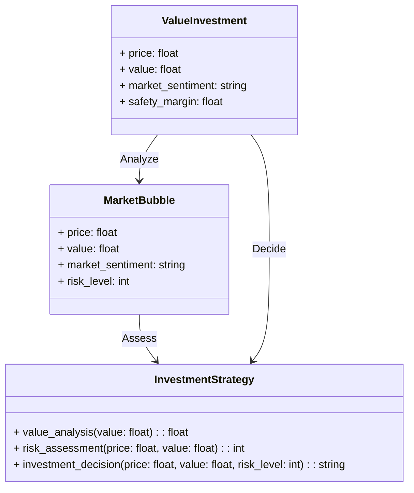
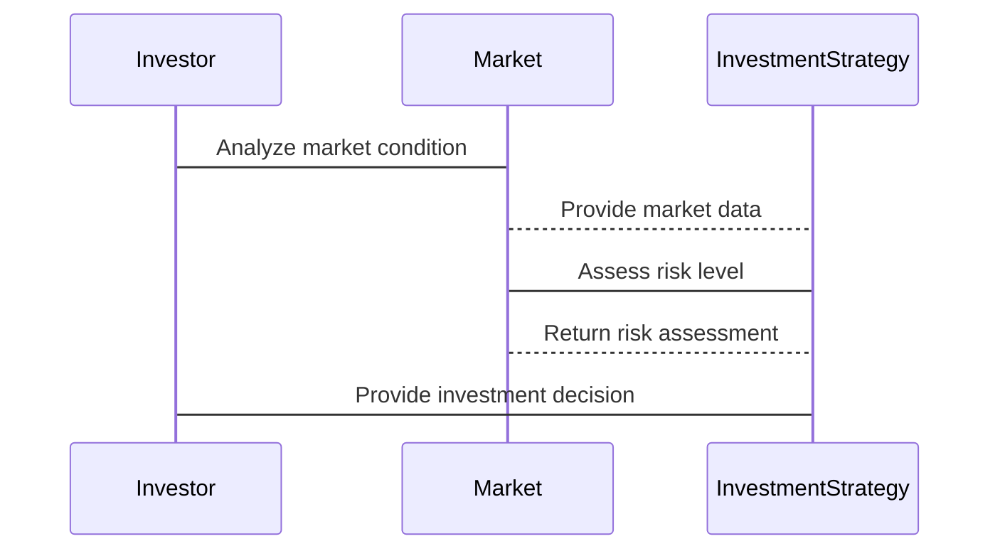
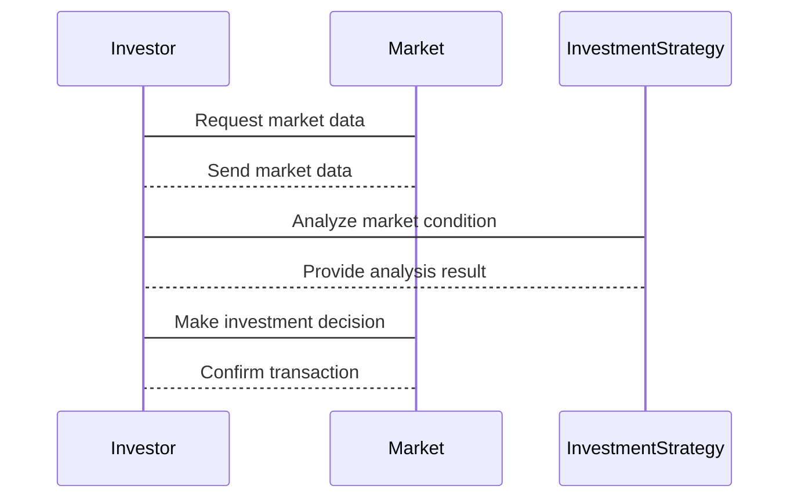

                 


# 价值投资者如何应对市场泡沫

## 关键词：
价值投资、市场泡沫、风险管理、逆向投资、安全边际

## 摘要：
在市场波动剧烈的环境中，价值投资者如何在市场泡沫中找到机会并规避风险是投资者关注的核心问题。本文从价值投资的基本原理出发，分析市场泡沫的形成机制，探讨价值投资者应对市场泡沫的具体策略，包括逆向投资、安全边际、仓位管理和长期投资策略。通过结合实际案例和系统化的方法，本文为价值投资者提供了应对市场泡沫的有效指导。

---

## 第一部分: 价值投资的背景与基础

### 第1章: 价值投资的起源与发展

#### 1.1 价值投资的起源

##### 1.1.1 价值投资的定义与核心理念
价值投资是一种以基本面分析为基础的投资策略，核心理念是寻找市场价格低于其内在价值的资产。这种投资方法强调长期持有优质资产，追求内在价值的逐步实现。价值投资的关键在于识别市场的非理性波动，利用市场的短期失衡获得长期收益。

##### 1.1.2 价值投资的历史发展
价值投资起源于20世纪初，由本杰明·格雷厄姆和戴维·多德等人发展完善。格雷厄姆提出了“安全边际”概念，强调在购买资产时，市场价格应显著低于其内在价值。这一理念成为价值投资的核心思想。

##### 1.1.3 价值投资与市场泡沫的关系
市场泡沫的形成源于市场的非理性繁荣，而价值投资者通过识别市场的非理性定价，能够在泡沫形成阶段提前布局，或在泡沫破裂时抓住被低估的资产。价值投资强调长期视角，避免被短期市场波动所左右。

#### 1.2 价值投资的核心理念

##### 1.2.1 市场的有效性与非有效性
市场在长期中趋于有效，但在短期中可能出现非理性定价。价值投资者利用市场的非有效性，寻找价格与价值偏离的资产。

##### 1.2.2 价值投资的三要素：价格、价值与市场情绪
- **价格**：资产的市场价格。
- **价值**：资产的内在价值，通常通过基本面分析确定。
- **市场情绪**：市场参与者的情绪波动影响价格与价值的偏离程度。

##### 1.2.3 价值投资的哲学基础
价值投资的哲学基础是“价格是价值的_slave”，即价格围绕价值波动。投资者应关注企业的内在价值，而非市场的短期波动。

#### 1.3 价值投资与市场泡沫

##### 1.3.1 市场泡沫的定义与特征
市场泡沫是指资产价格远高于其内在价值的非理性现象，通常由过度投机和市场情绪驱动。

##### 1.3.2 价值投资在泡沫中的机会与挑战
- **机会**：泡沫期间，优质资产可能被高估，但价值投资者可以通过寻找低估的资产或在泡沫破裂前布局，获得超额收益。
- **挑战**：泡沫期间，市场的非理性定价可能掩盖资产的真实价值，投资者需要具备独立思考和判断能力。

##### 1.3.3 泡沫破裂对价值投资者的影响
泡沫破裂可能导致资产价格大幅下跌，但价值投资者通过安全边际和长期持有策略，能够在泡沫破裂后逐步恢复并实现收益。

---

## 第二部分: 市场泡沫的形成机制与识别

### 第2章: 泡沫的形成机制

#### 2.1 市场泡沫的根源

##### 2.1.1 人性的贪婪与恐惧
市场泡沫的形成源于人性的贪婪与恐惧。当市场上涨时，投资者倾向于追涨，导致价格超出合理范围；当市场下跌时，投资者倾向于恐慌性抛售，导致价格进一步下跌。

##### 2.1.2 资金的过度流动
资金的过度流动，特别是杠杆资金的涌入，可能导致资产价格的快速上涨，形成泡沫。

##### 2.1.3 市场参与者的羊群效应
投资者的羊群效应使得市场情绪容易被放大，形成非理性波动。

#### 2.2 市场泡沫的历史案例分析

##### 2.2.1 荷兰郁金香泡沫
17世纪的荷兰郁金香泡沫是历史上著名的市场泡沫案例。当时，郁金香球茎的价格被炒到极高的水平，最终泡沫破裂导致投资者的巨大损失。

##### 2.2.2 互联网泡沫
20世纪90年代末，互联网公司的股票价格被过度炒作，形成了互联网泡沫。2000年泡沫破裂后，许多互联网公司倒闭或大幅裁员。

##### 2.2.3 房地产泡沫
2008年全球金融危机的根源之一是房地产市场的泡沫。次贷危机导致房价大幅下跌，引发了全球性的经济衰退。

#### 2.3 泡沫的经济周期分析

##### 2.3.1 经济周期与市场泡沫的关系
市场泡沫通常出现在经济周期的扩张阶段，特别是在经济增长放缓但市场预期乐观的情况下。

##### 2.3.2 货币政策与市场泡沫的关联
宽松的货币政策可能导致资金过度流入市场，推高资产价格，形成泡沫。

##### 2.3.3 利率变化对市场泡沫的影响
低利率环境可能导致投资者转向高风险资产，进一步推动市场泡沫的形成。

---

## 第三部分: 价值投资者应对市场泡沫的策略

### 第3章: 逆向投资策略

#### 3.1 逆向投资的定义与特点

##### 3.1.1 逆向投资的核心理念
逆向投资是指在市场恐慌时买入，在市场狂热时卖出。这种方法与市场情绪相反，能够在市场底部获得资产，避免在市场顶部买入。

##### 3.1.2 逆向投资与价值投资的区别与联系
- **区别**：逆向投资关注市场情绪，而价值投资关注资产的内在价值。
- **联系**：逆向投资是一种策略，而价值投资是一种方法论，两者可以结合使用。

#### 3.2 逆向投资的实施步骤

##### 3.2.1 确定投资标的的内在价值
通过基本面分析，确定资产的内在价值，找到市场价格与内在价值的偏离程度。

##### 3.2.2 识别市场的非理性
通过分析市场情绪和市场参与者的行为，识别市场的非理性定价。

---

## 系统架构与架构设计方案

### 系统功能设计（领域模型）



### 系统架构设计


### 系统接口设计



### 系统交互流程图



---

## 项目实战

### 环境安装
- **Python 3.x**
- **Pandas、NumPy、Matplotlib**

### 核心实现源代码

```python
import pandas as pd
import numpy as np
import matplotlib.pyplot as plt

def calculate_intrinsic_value(financials):
    # 简单的内在价值计算方法
    return financials['revenue'] / 10

def calculate_safety_margin(price, intrinsic_value):
    return intrinsic_value - price

def assess_market_sentiment(prices):
    # 简单的市场情绪评估
    if prices[-1] > prices.mean():
        return 'bullish'
    else:
        return 'bearish'

# 示例数据
prices = pd.Series([100, 110, 120, 90, 80])
intrinsic_values = [150, 120, 130, 110, 100]

# 计算安全边际
safety_margins = [calculate_safety_margin(p, iv) for p, iv in zip(prices, intrinsic_values)]

# 评估市场情绪
market_sentiment = assess_market_sentiment(prices)

# 生成投资建议
for price, iv in zip(prices, intrinsic_values):
    if iv > price:
        print(f"买入，价格{price}，内在价值{iv}")
    else:
        print(f"卖出，价格{price}，内在价值{iv}")
```

### 应用解读与分析
上述代码示例展示了如何通过基本面分析计算内在价值和安全边际，以及如何根据市场情绪做出投资决策。投资者可以根据实际数据调整模型，以适应不同的市场环境。

---

## 结语

价值投资者在应对市场泡沫时，需要结合基本面分析、市场情绪和风险管理策略，制定科学的投资计划。通过逆向投资、安全边际和长期持有的策略，价值投资者能够在市场泡沫中找到机会，规避风险，实现长期稳健的投资回报。

---

## 作者：AI天才研究院/AI Genius Institute & 禅与计算机程序设计艺术 /Zen And The Art of Computer Programming

