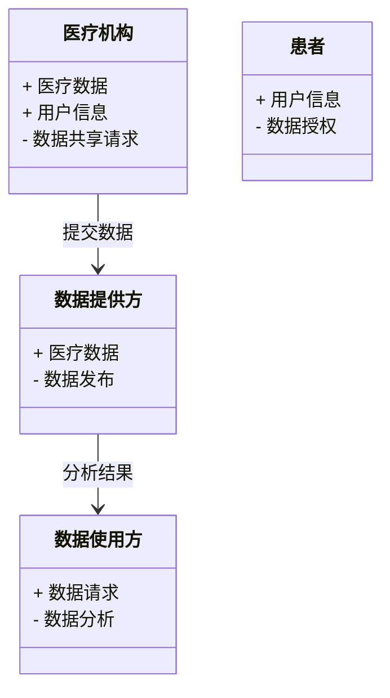
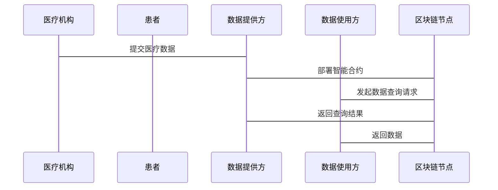

                 


# 价值投资视角下的智慧医疗区块链数据共享系统

---

## 关键词：
价值投资、智慧医疗、区块链、数据共享、共识算法、智能合约

---

## 摘要：
本文从价值投资的视角，探讨了智慧医疗领域的区块链数据共享系统。通过对现有医疗数据共享问题的分析，结合区块链技术的核心原理，提出了基于价值投资的医疗数据共享系统设计。文章详细讲解了共识算法、智能合约等技术的实现原理，并通过系统架构设计和实际案例分析，展示了如何将区块链技术应用于医疗数据共享，实现数据的安全、高效和可信共享。最后，本文总结了系统的优势和未来的发展方向。

---

# 第1章: 背景介绍

## 1.1 价值投资与智慧医疗的结合

### 1.1.1 价值投资的核心概念
价值投资是一种长期投资策略，注重分析企业的基本面，寻找具有长期竞争优势和良好治理结构的企业进行投资。其核心在于通过深入研究企业内在价值，寻找市场价格低于内在价值的投资机会。

### 1.1.2 智慧医疗的定义与特点
智慧医疗是指通过信息化手段，整合医疗信息资源，利用大数据、人工智能、区块链等技术，提升医疗服务的效率和质量。其特点是数据驱动、智能化和实时性。

### 1.1.3 区块链技术在医疗数据共享中的作用
区块链技术具有去中心化、不可篡改和可追溯等特点，能够有效解决医疗数据共享中的信任问题和数据安全问题。区块链可以为医疗数据的共享提供一个安全、透明的平台。

---

## 1.2 医疗数据共享的现状与挑战

### 1.2.1 当前医疗数据共享的问题
- 数据孤岛现象严重：不同医疗机构之间的数据无法有效共享，导致重复检查和医疗资源浪费。
- 数据安全问题：医疗数据涉及患者隐私，容易被篡改或泄露。
- 数据信任问题：缺乏统一的信任机制，导致数据共享的难度增加。

### 1.2.2 区块链技术如何解决这些问题
- 解决数据孤岛：区块链的去中心化特性可以实现跨机构的数据共享。
- 数据安全：区块链的不可篡改性确保了数据的安全性。
- 建立信任机制：区块链的透明性和可追溯性能够增强各方的信任。

### 1.2.3 价值投资视角下的医疗数据共享模式
通过区块链技术构建医疗数据共享平台，为投资者提供透明、高效、安全的医疗数据，从而实现医疗资源的优化配置和价值最大化。

---

# 第2章: 核心概念与联系

## 2.1 价值投资视角下的医疗数据共享系统

### 2.1.1 价值投资的核心原理
价值投资注重企业的内在价值，通过长期持有优质资产来实现收益。在医疗数据共享系统中，区块链技术可以作为提升医疗数据价值的工具，为投资者提供高价值的数据服务。

### 2.1.2 医疗数据共享系统的结构与功能
医疗数据共享系统需要具备数据采集、存储、共享、分析等功能，同时需要确保数据的安全性和隐私保护。

### 2.1.3 区块链技术在系统中的应用
区块链技术可以通过智能合约和共识算法实现医疗数据的安全共享和自动化处理。

---

## 2.2 核心概念的属性对比

### 2.2.1 价值投资与传统投资的对比

| 属性       | 价值投资             | 传统投资             |
|------------|----------------------|----------------------|
| 投资策略   | 长期持有，注重内在价值 | 短期交易，注重市场波动 |
| 分析方法   | 基于基本面分析       | 基于技术分析或市场情绪 |
| 风险控制   | 严格控制，注重安全边际 | 风险较高，注重收益与风险的平衡 |

### 2.2.2 医疗数据共享与传统共享的对比

| 属性       | 医疗数据共享             | 传统共享             |
|------------|--------------------------|----------------------|
| 数据类型   | 医疗相关数据，隐私性高   | 各类数据，隐私性较低 |
| 共享方式   | 基于区块链的去中心化共享 | 中心化共享           |
| 数据安全   | 区块链确保数据不可篡改   | 中心化存储存在安全隐患 |

### 2.2.3 区块链技术与传统数据存储技术的对比

| 属性       | 区块链技术             | 传统数据存储技术     |
|------------|------------------------|----------------------|
| 数据存储   | 分布式存储             | 中心化存储           |
| 数据修改   | 难以篡改                | 容易修改              |
| 数据访问   | 基于权限控制           | 基于权限控制或公开    |

---

# 第3章: 算法原理讲解

## 3.1 区块链共识算法

### 3.1.1 共识算法的定义与分类
共识算法是区块链技术的核心组成部分，用于确保所有节点达成一致。常见的共识算法包括工作量证明（PoW）、权益证明（PoS）、 delegated proof of stake（Dpos）等。

### 3.1.2 常见共识算法的原理
#### 工作量证明（PoW）
- 节点通过计算哈希值来争夺记账权，计算出正确的哈希值即可获得记账权。
- 优点：安全性高，抗女婿攻击。
- 缺点：计算资源消耗大，效率较低。

#### 权益证明（PoS）
- 根据节点持有的代币数量来分配记账权。
- 优点：资源消耗低，效率高。
- 缺点：存在“富者愈富”的风险。

#### 担任证明（Dpos）
- 节点通过持有代币的数量和时间选举代表，代表负责记账和验证。
- 优点：效率高，安全性较好。
- 缺点：依赖于选举机制的公平性。

### 3.1.3 医疗数据共享中的共识算法选择
在医疗数据共享中，Dpos算法可能更适合，因为它可以在保证效率的同时，确保数据的可信性。

---

## 3.2 智能合约的原理与实现

### 3.2.1 智能合约的定义与特点
智能合约是基于区块链的自动执行程序，用于在区块链上自动执行合同条款。其特点包括去中心化、自动执行、不可篡改等。

### 3.2.2 智能合约的实现流程
1. **需求分析**：明确智能合约的功能需求。
2. **合约编写**：使用Solidity等编程语言编写智能合约代码。
3. **合约部署**：将智能合约部署到区块链网络。
4. **合约测试**：进行测试用例验证，确保合约功能正常。
5. **合约上线**：正式投入使用。

### 3.2.3 医疗数据共享中的智能合约设计
在医疗数据共享系统中，智能合约可以用于数据访问权限的管理、数据共享的自动化处理等。

---

# 第4章: 系统分析与架构设计

## 4.1 问题场景介绍

### 4.1.1 医疗数据共享的痛点
- 数据孤岛：不同医疗机构之间的数据无法共享。
- 数据安全：医疗数据涉及患者隐私，容易被泄露。
- 数据信任：缺乏统一的信任机制，导致数据共享的难度增加。

### 4.1.2 系统目标
通过区块链技术构建一个安全、透明、高效的医疗数据共享平台，实现医疗数据的跨机构共享和高效利用。

### 4.1.3 系统边界与外延
系统主要涵盖医疗机构、患者、数据提供方、数据使用方等多方参与者。

---

## 4.2 系统功能设计

### 4.2.1 领域模型
以下是医疗数据共享系统的领域模型：



---

## 4.3 系统架构设计

### 4.3.1 系统架构图
以下是医疗数据共享系统的架构图：

```mermaid
client
    interface 医疗机构
    interface 患者
    interface 数据提供方
    interface 数据使用方

server
    service 区块链节点
    service 智能合约管理
    service 数据存储

database
    data 医疗数据
    data 用户信息
```

---

## 4.4 系统接口设计

### 4.4.1 接口描述
- 数据提交接口：医疗机构提交医疗数据到区块链节点。
- 数据查询接口：数据使用方通过智能合约查询数据。
- 数据授权接口：患者授权数据的共享权限。

---

## 4.5 系统交互流程

### 4.5.1 医疗数据共享交互流程



---

# 第5章: 项目实战

## 5.1 环境安装

### 5.1.1 安装以太坊开发环境
- 下载并安装以太坊钱包（如MetaMask）。
- 安装Solidity编译器和以太坊节点客户端（如Geth或Node.js）。

### 5.1.2 安装智能合约开发工具
- 使用Truffle框架进行智能合约开发。
- 安装Truffle、Ganache等工具。

---

## 5.2 系统核心实现源代码

### 5.2.1 智能合约实现

以下是医疗数据共享系统的智能合约代码：

```solidity
// SPDX-License-Identifier: MIT
pragma solidity ^0.8.0;

contract MedicalDataSharing {
    // 数据记录结构
    struct DataRecord {
        uint256 id;
        address provider;
        bytes32 hash;
        uint256 timestamp;
    }

    // 数据存储数组
    DataRecord[] public dataRecords;

    // 用户授权记录
    mapping(address => bool) public authorizedUsers;

    // 数据提交函数
    function submitData(address provider, bytes32 hash, uint256 timestamp) public {
        DataRecord memory record = DataRecord({
            id: dataRecords.length,
            provider: provider,
            hash: hash,
            timestamp: timestamp
        });
        dataRecords.push(record);
    }

    // 数据查询函数
    function queryData(uint256 id) public view returns (DataRecord memory) {
        return dataRecords[id];
    }

    // 用户授权函数
    function authorizeUser(address user) public {
        authorizedUsers[user] = true;
    }

    // 用户取消授权函数
    function revokeUser(address user) public {
        authorizedUsers[user] = false;
    }
}
```

---

## 5.3 实际案例分析与解读

### 5.3.1 案例背景
某医院需要将患者的医疗数据共享给第三方研究机构，用于疾病研究。通过区块链技术，可以实现数据的安全共享和权限管理。

### 5.3.2 实施步骤
1. 医院提交医疗数据到区块链节点。
2. 第三方研究机构通过智能合约查询数据。
3. 患者授权数据的共享权限。

### 5.3.3 代码应用解读
- 医院调用`submitData`函数提交数据。
- 研究机构调用`queryData`函数查询数据。
- 患者调用`authorize`函数授权数据共享。

---

## 5.4 项目小结

通过区块链技术实现医疗数据的共享，能够有效解决数据孤岛和隐私安全问题。智能合约的应用使得数据的权限管理和自动化处理成为可能，为医疗数据的高效利用提供了新的思路。

---

# 第6章: 小结与展望

## 6.1 系统优势
- 数据安全性高：区块链技术确保数据不可篡改。
- 数据共享高效：智能合约实现数据的自动化处理。
- 数据隐私保护：通过权限控制实现数据的分级共享。

## 6.2 系统劣势
- 技术复杂性高：区块链技术的实现需要较高的技术门槛。
- 系统性能限制：区块链的共识算法可能影响系统的处理效率。

## 6.3 未来展望
随着区块链技术的不断发展，医疗数据共享系统将更加智能化和高效化。未来，可以进一步研究跨链技术，实现不同区块链平台之间的数据共享，进一步推动医疗数据的互联互通。

---

# 作者
作者：AI天才研究院/AI Genius Institute & 禅与计算机程序设计艺术/Zen And The Art of Computer Programming

