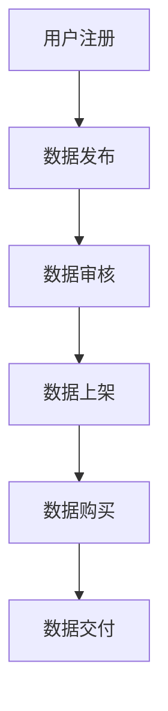
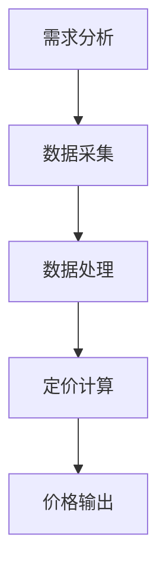
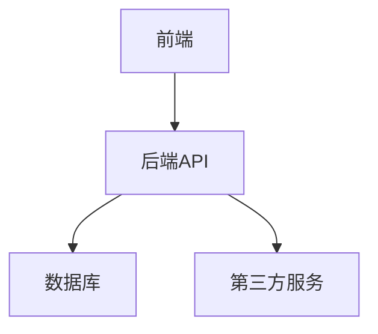
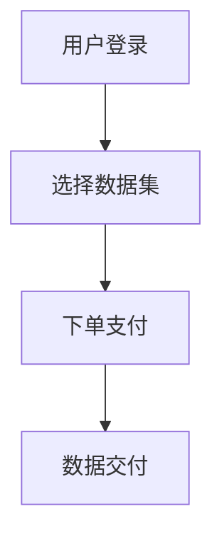

                 


# 价值投资视角下的智能城市数据市场化

## 关键词：
智能城市、数据市场化、价值投资、数据资产化、数据定价模型、数据交易机制

## 摘要：
本文从价值投资的视角，分析智能城市数据市场化的核心概念、定价模型和交易机制。通过设计数据定价算法和交易平台系统架构，结合实际案例，探讨数据资产化在智慧城市建设中的潜力和应用。文章详细阐述了数据资产化的定义、数据定价模型的设计、数据交易机制的优化，并通过系统架构图和交互流程图展示了数据交易的实现过程。最后，本文总结了智能城市数据市场化的价值和未来发展趋势。

---

## 第一部分：引言

### 1.1 研究背景

#### 1.1.1 智慧城市建设的现状与趋势
智慧城市建设已成为全球城市发展的重要方向，通过数据的采集、分析和应用，提升城市的管理效率和服务质量。数据作为智慧城市的基础设施，其价值日益凸显。

#### 1.1.2 数据市场化的必要性
数据的商业化应用需求不断增长，数据市场化是实现数据价值的重要途径。然而，数据市场的规范性和透明度不足，限制了其发展潜力。

#### 1.1.3 价值投资视角的引入
价值投资强调长期回报和资产质量，适用于评估数据资产的价值。通过价值投资视角，可以更准确地评估数据资产的潜在收益和风险。

### 1.2 研究意义
通过研究智能城市数据市场化，可以为智慧城市建设提供理论支持和实践指导，促进数据资源的高效配置和利用。

### 1.3 研究目标与内容框架
本文旨在探讨智能城市数据市场化中的价值投资策略，设计数据定价模型和交易机制，并通过实际案例验证其可行性。

---

## 第二部分：智能城市与数据市场化背景

### 2.1 智慧城市的定义与特征

#### 2.1.1 智慧城市的定义
智慧城市是指通过智能化技术手段，优化城市资源配置，提升居民生活质量的城市发展模式。

#### 2.1.2 智慧城市的核心特征
- 数据驱动：依赖数据进行决策和管理。
- 智能化：利用人工智能等技术提升城市管理效率。
- 可持续性：注重资源的高效利用和环境保护。

#### 2.1.3 数据在智慧城市建设中的作用
数据是智慧城市建设的基础，贯穿于城市规划、管理和服务的全过程。

### 2.2 数据市场化的概念与现状

#### 2.2.1 数据市场化的定义
数据市场化是指通过市场机制配置数据资源，实现数据的商业化应用和价值创造。

#### 2.2.2 数据市场的类型与特点
- 数据交易平台：提供数据买卖的平台。
- 数据经纪商：撮合数据供需双方的交易。
- 数据开放平台：免费或低价提供公共数据。

#### 2.2.3 当前数据市场化的现状与挑战
数据市场化的现状：数据交易平台逐渐兴起，数据经纪商活跃，数据开放平台增多。然而，数据质量、隐私保护、数据安全等问题仍亟待解决。

### 2.3 价值投资的基本原理

#### 2.3.1 价值投资的定义
价值投资是以低于内在价值的价格买入优质资产，长期持有的投资策略。

#### 2.3.2 价值投资的核心理念
- 重视资产的内在价值。
- 长期持有优质资产，获取稳定收益。

#### 2.3.3 价值投资在数据资产中的应用
通过评估数据资产的长期价值，选择具有持续收益潜力的数据资源进行投资。

---

## 第三部分：智能城市数据市场化的核心概念

### 3.1 数据资产化

#### 3.1.1 数据资产化的定义
数据资产化是将数据视为可量化、可交易的资产，通过评估其价值实现资产化。

#### 3.1.2 数据资产化的关键要素
- 数据的可量化性：数据价值的量化方法。
- 数据的可交易性：数据的交易方式和流程。
- 数据的可确权性：数据的产权归属。

#### 3.1.3 数据资产化的意义
- 提升数据资源的利用效率。
- 实现数据资源的市场化配置。
- 促进数据资源的价值创造。

### 3.2 数据定价模型

#### 3.2.1 数据定价模型的定义
数据定价模型是基于数据的供需关系、质量、用途等因素，计算数据价格的数学模型。

#### 3.2.2 数据定价模型的设计
- 基于供需的定价模型：价格由市场供需决定。
- 基于质量的定价模型：价格根据数据的准确性和完整性确定。
- 基于收益的定价模型：价格基于数据的应用价值和收益。

#### 3.2.3 数据定价模型的实现
使用数学公式描述定价模型，如基于供需的定价公式：
$$ P = f(S, D) $$
其中，$P$ 是价格，$S$ 是供给量，$D$ 是需求量。

### 3.3 数据交易机制

#### 3.3.1 数据交易机制的定义
数据交易机制是数据供需双方进行交易的规则和流程。

#### 3.3.2 数据交易机制的类型
- 中心化交易：通过交易平台撮合交易。
- 去中心化交易：通过区块链等技术实现点对点交易。
- 共享经济模式：数据资源的共享与利用。

#### 3.3.3 数据交易机制的设计
通过mermaid流程图展示数据交易的流程：



---

## 第四部分：数据定价算法原理

### 4.1 数据定价模型的数学模型

#### 4.1.1 基于供需的定价模型
$$ P = a \times Q_d + b \times Q_s $$
其中，$Q_d$ 是需求量，$Q_s$ 是供给量，$a$ 和 $b$ 是系数。

#### 4.1.2 基于质量的定价模型
$$ P = c \times Q $$
其中，$Q$ 是数据质量评分，$c$ 是单价。

#### 4.1.3 基于收益的定价模型
$$ P = d \times R $$
其中，$R$ 是数据应用的预期收益，$d$ 是分成比例。

### 4.2 数据定价算法的实现

#### 4.2.1 数据定价算法的流程
通过mermaid流程图展示定价流程：



#### 4.2.2 核心代码实现
```python
def calculate_price(data_quality, demand, supply):
    # 基于质量的定价
    price_quality = 0.5 * data_quality
    # 基于供需的定价
    price_supplyDemand = 1.0 * (demand - supply)
    # 综合定价
    final_price = price_quality + price_supplyDemand
    return final_price

# 示例数据
data_quality = 0.8
demand = 100
supply = 50

# 调用定价函数
price = calculate_price(data_quality, demand, supply)
print(f"数据价格为: {price}")
```

---

## 第五部分：数据交易平台系统架构

### 5.1 系统功能设计

#### 5.1.1 用户模块
- 用户注册与登录。
- 数据发布与购买。

#### 5.1.2 数据模块
- 数据采集与存储。
- 数据处理与分析。

#### 5.1.3 交易模块
- 数据上架与下架。
- 交易订单管理。

### 5.2 系统架构设计

#### 5.2.1 系统架构图
通过mermaid展示系统架构：



#### 5.2.2 系统交互流程图
通过mermaid展示用户购买数据的流程：



---

## 第六部分：项目实战

### 6.1 开发环境搭建

#### 6.1.1 工具安装
- Python 3.8+
- Flask框架
- MongoDB数据库

### 6.2 核心代码实现

#### 6.2.1 数据模型定义
```python
from flask import Flask
from flask_restful import Resource, Api
from pymongo import MongoClient

app = Flask(__name__)
api = Api(app)
client = MongoClient('mongodb://localhost:27017/')
db = client['data_market']
```

#### 6.2.2 API实现
```python
class DataResource(Resource):
    def get(self):
        return {'data': 'Hello, World!'}
    
api.add_resource(DataResource, '/data')

if __name__ == '__main__':
    app.run(debug=True)
```

### 6.3 案例分析

#### 6.3.1 案例背景
某城市交通数据交易平台的开发与运营。

#### 6.3.2 实施过程
- 数据采集：交通流量、拥堵数据。
- 数据处理：分析数据并上架平台。
- 交易过程：用户购买数据，平台提供数据交付。

#### 6.3.3 项目总结
通过案例分析，验证了数据交易平台的可行性，并总结了项目实施的经验和教训。

---

## 第七部分：结论与展望

### 7.1 研究总结
本文从价值投资视角，探讨了智能城市数据市场化的关键问题，设计了数据定价模型和交易平台系统架构，并通过案例分析验证了其可行性。

### 7.2 未来展望
未来，数据市场化的研究将重点放在数据隐私保护、数据质量提升和数据交易的规范化上。同时，随着人工智能和区块链技术的发展，数据交易将更加智能化和安全。

---

## 作者：AI天才研究院 & 禅与计算机程序设计艺术

---

以上是文章的完整内容，涵盖了从理论到实践的各个方面，结合了技术细节和实际案例，确保读者能够全面理解智能城市数据市场化的价值投资策略。

