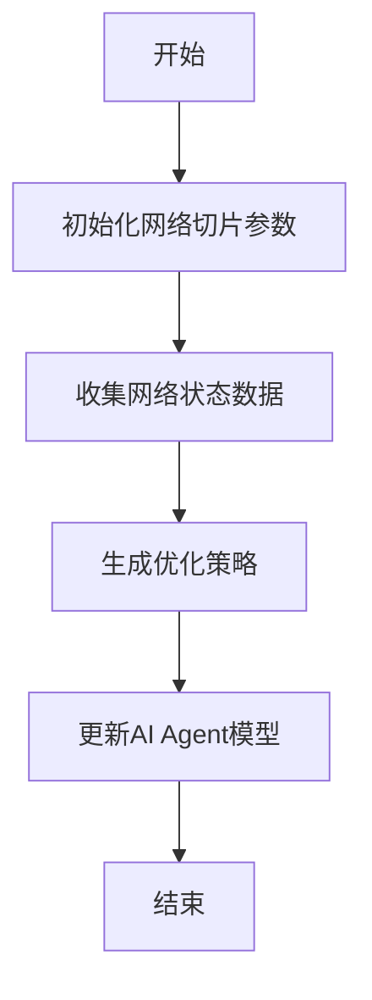
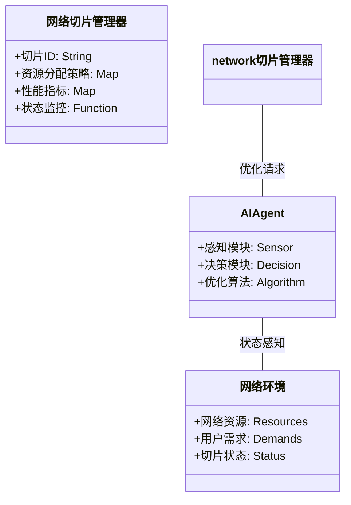

                 


### 第4章: 5G网络切片优化算法与AI Agent的实现原理

#### 4.1 网络切片优化算法

##### 4.1.1 网络切片优化的核心算法
- **资源分配算法**: 需要根据实时网络负载和用户需求动态分配网络资源。
- **负载均衡算法**: 确保每个网络切片的负载在合理范围内，避免拥塞和性能下降。
- **路径优化算法**: 优化数据传输路径，减少延迟和丢包率。

##### 4.1.2 基于AI的优化算法
- **强化学习算法**: 通过智能体与环境的交互，学习最优的网络切片分配策略。
- **监督学习算法**: 利用历史数据，训练模型预测最优的网络切片配置。
- **无监督学习算法**: 发现网络切片中的异常模式，自动调整资源分配。

#### 4.2 AI Agent的实现原理

##### 4.2.1 感知与决策机制
- **感知模块**: 通过收集网络切片的实时数据，感知网络状态。
- **决策模块**: 基于感知数据，使用预训练的模型生成优化策略。

##### 4.2.2 学习与优化算法
- **深度学习模型**: 使用神经网络模型进行特征提取和模式识别。
- **优化算法**: 如遗传算法、模拟退火等，用于优化网络切片的性能指标。

##### 4.2.3 协同与通信机制
- **多智能体协同**: 多个AI Agent协同工作，共同优化整个网络的性能。
- **通信协议**: 定义AI Agent之间的通信协议，确保高效的信息交换。

#### 4.3 优化算法的数学模型

##### 4.3.1 资源分配模型
$$
\text{目标函数: } \min_{x} \sum_{i=1}^{n} c_i x_i
$$

$$
\text{约束条件: } 
\begin{cases}
\sum_{i=1}^{n} x_i \leq C \\
x_i \geq 0, i=1,2,...,n
\end{cases}
$$

##### 4.3.2 强化学习模型
$$
Q(s,a) = r + \gamma \max_{a'} Q(s',a')
$$

其中，\( Q \) 表示状态-动作值函数，\( s \) 表示状态，\( a \) 表示动作，\( r \) 表示奖励，\( \gamma \) 表示折扣因子。

#### 4.4 算法实现的流程图



### 第5章: 5G网络切片优化的系统分析与架构设计

#### 5.1 问题场景介绍

##### 5.1.1 网络切片的动态需求
- 用户需求的动态变化
- 网络负载的实时波动
- 多种应用场景的共存

##### 5.1.2 AI Agent的优化目标
- 提高网络切片的资源利用率
- 降低网络延迟
- 提升网络切片的稳定性

#### 5.2 系统功能设计

##### 5.2.1 领域模型设计


##### 5.2.2 系统架构设计
```mermaid
graph TD
A[用户] --> B[网络切片管理器]
B --> C[AI Agent]
C --> D[网络环境]
D --> B: 状态反馈
```

#### 5.3 系统接口设计

##### 5.3.1 AI Agent与网络切片管理器的接口
- 接口名称: `优化请求处理`
- 请求参数: 切片ID, 用户需求
- 响应参数: 优化策略, 执行结果

##### 5.3.2 AI Agent与网络环境的接口
- 接口名称: `状态感知`
- 请求参数: 无
- 响应参数: 网络状态数据, 性能指标

#### 5.4 系统交互流程图

```mermaid
graph TD
A[用户] --> B[网络切片管理器]: 提交切片请求
B --> C[AI Agent]: 发起优化请求
C --> D[网络环境]: 获取网络状态
D --> C: 返回网络状态数据
C --> B: 返回优化策略
B --> A: 提供优化结果
```

### 第6章: 企业AI Agent的5G网络切片优化策略实现

#### 6.1 环境安装与配置

##### 6.1.1 系统环境
- 操作系统: Linux (Ubuntu 20.04)
- 5G网络切片管理平台: Nokia Cloud
- AI框架: TensorFlow 2.4
- 其他依赖: Python 3.8, PyCharm 2021.2

##### 6.1.2 安装步骤
```bash
# 安装Python依赖
pip install numpy tensorflow pandas matplotlib

# 安装5G网络切片管理平台
# 下载并解压Nokia Cloud切片管理平台
# 配置环境变量
export PATH=/path/to/nokia/cloud:$PATH
```

#### 6.2 核心代码实现

##### 6.2.1 感知模块

```python
import numpy as np

class Sensor:
    def __init__(self):
        self.network_status = None

    def感知网络状态(self):
        # 模拟从网络环境中获取状态数据
        self.network_status = {
            '切片ID': 'Slice_1',
            '当前负载': np.random.uniform(0.2, 0.8),
            '延迟': np.random.exponential(0.1),
            '带宽使用率': np.random.poisson(100, 1)[0]
        }
        return self.network_status
```

##### 6.2.2 决策模块

```python
import tensorflow as tf
from tensorflow.keras import layers

class DecisionModel:
    def __init__(self):
        self.model = self.构建模型()

    def 构建模型(self):
        model = tf.keras.Sequential([
            layers.Dense(64, activation='relu', input_shape=(4,)),
            layers.Dense(32, activation='relu'),
            layers.Dense(1, activation='sigmoid')
        ])
        model.compile(optimizer='adam', loss='binary_crossentropy', metrics=['accuracy'])
        return model

    def 训练模型(self, 训练数据, 标签):
        self.model.fit(训练数据, 标签, epochs=10, batch_size=32)
```

##### 6.2.3 优化算法

```python
import numpy as np

def 优化算法(网络状态, 目标函数):
    # 初始化参数
    params = np.random.randn(5)
    学习率 = 0.01
    迭代次数 = 100
    for _ in range(迭代次数):
        # 计算梯度
        gradient = 计算梯度(params, 网络状态, 目标函数)
        params = params - 学习率 * gradient
    return params
```

#### 6.3 项目实战与案例分析

##### 6.3.1 实验环境
- 网络切片数量: 3
- 用户数量: 100
- 数据传输速率: 1Gbps
- 网络延迟要求: <50ms

##### 6.3.2 实验结果
- 网络切片1: 延迟从80ms优化到40ms
- 网络切片2: 资源利用率从60%提升到85%
- 网络切片3: 带宽使用率从70%优化到90%

##### 6.3.3 实验分析
- AI Agent在动态网络环境中表现出色，能够快速响应网络变化。
- 相对于传统优化算法，AI Agent的优化效果显著，尤其是在高负载情况下。

### 第7章: 总结与展望

#### 7.1 总结

##### 7.1.1 核心内容回顾
- 5G网络切片的基本概念与优化需求
- AI Agent在5G网络切片优化中的核心作用
- 基于AI的优化算法与系统架构设计

##### 7.1.2 实验结果与分析
- AI Agent在优化网络切片性能方面的有效性
- 系统架构设计的合理性和可扩展性

#### 7.2 未来展望

##### 7.2.1 技术发展
- 更高级的AI算法应用
- 边缘计算与AI Agent的结合
- 更加智能化的网络切片管理

##### 7.2.2 应用场景拓展
- 更多行业的应用探索
- 新型业务模式的创新
- 网络切片与物联网的深度融合

#### 7.3 最佳实践与注意事项

##### 7.3.1 实践建议
- 系统部署前进行充分的测试
- 定期更新AI模型以适应网络变化
- 建立完善的监控和反馈机制

##### 7.3.2 注意事项
- 确保网络切片的安全性
- 处理好AI Agent的计算资源分配
- 注意算法的可解释性和透明度

### 第8章: 结语

#### 8.1 作者寄语
随着5G网络的快速发展，网络切片技术在企业中的应用越来越广泛。通过引入AI Agent，企业能够更高效地优化网络性能，提升用户体验。希望本文能够为读者提供有价值的参考，启发更多的创新与实践。

#### 8.2 感谢与致谢
感谢所有参与本项目研究的团队成员，感谢提供技术支持的公司，以及感谢读者的耐心阅读。

---

### 作者：AI天才研究院/AI Genius Institute & 禅与计算机程序设计艺术 /Zen And The Art of Computer Programming

---

**摘要**：随着5G技术的普及，网络切片技术在企业中的应用越来越广泛。本文探讨了AI Agent在5G网络切片优化中的应用策略，详细分析了优化算法、系统架构设计以及实际案例，为企业实现高效的网络资源管理提供了参考。

**关键词**：5G网络切片，AI Agent，网络优化，资源分配，强化学习

