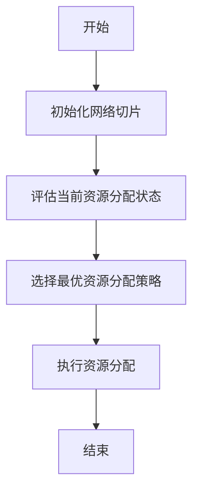
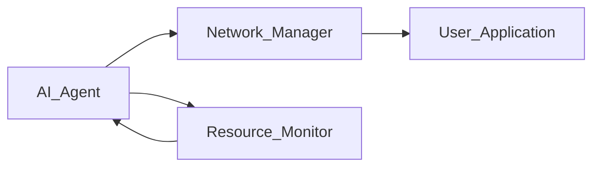

                 


# 企业AI Agent的5G网络切片资源分配

> 关键词：AI Agent，5G网络切片，资源分配，算法，系统架构，项目实战

> 摘要：本文详细探讨企业AI Agent在5G网络切片资源分配中的应用，涵盖从理论到实践的各个方面。首先介绍5G网络切片与AI Agent的基本概念，然后分析核心概念与联系，接着讲解资源分配算法的原理与实现，再设计系统架构并提供项目实战案例，最后总结最佳实践与未来方向。

## 第1章: 5G网络切片与AI Agent概述

### 1.1 5G网络切片的基本概念

#### 1.1.1 5G网络切片的定义
5G网络切片是将物理网络分割成多个虚拟网络的技术，每个切片专为特定应用场景设计，提供定制化的网络性能。

#### 1.1.2 5G网络切片的特点
- **隔离性**：确保不同切片之间的资源互不影响。
- **灵活性**：支持多种应用场景，如工业物联网、视频传输等。
- **可扩展性**：根据需求动态调整资源分配。

#### 1.1.3 5G网络切片的应用场景
- 工业自动化：实时设备连接与控制。
- 健康医疗：远程手术与患者数据传输。
- 智慧城市：智能交通与公共设施管理。

### 1.2 AI Agent的基本概念

#### 1.2.1 AI Agent的定义
AI Agent是一种智能实体，能够感知环境、自主决策，并采取行动以实现目标。

#### 1.2.2 AI Agent的核心特点
- **自主性**：无需人工干预，自主决策。
- **反应性**：能实时感知环境变化并做出反应。
- **学习能力**：通过数据学习优化决策。

#### 1.2.3 AI Agent与传统网络管理的区别
AI Agent采用自适应和预测性方法，能动态调整资源分配，而传统方法依赖静态配置。

### 1.3 5G网络切片资源分配的背景与意义

#### 1.3.1 5G网络切片资源分配的背景
随着5G技术的普及，企业对定制化网络服务的需求日益增加，传统静态资源分配方式已无法满足动态变化的业务需求。

#### 1.3.2 5G网络切片资源分配的意义
- 提高网络资源利用率。
- 支持多样化的业务需求。
- 实现高效、智能的网络管理。

#### 1.3.3 企业AI Agent在5G网络切片资源分配中的作用
AI Agent通过实时分析网络状态，动态调整资源分配策略，优化网络性能，确保各业务应用的高质量服务。

## 第2章: 5G网络切片资源分配的核心概念与联系

### 2.1 核心概念原理

#### 2.1.1 5G网络切片的资源分配机制
资源分配机制涉及带宽、延迟、吞吐量等多个维度的优化，确保各切片的性能指标达成。

#### 2.1.2 AI Agent在资源分配中的作用
AI Agent通过收集实时数据，利用机器学习模型预测网络负载，优化资源分配策略。

### 2.2 核心概念属性特征对比

| 属性 | 5G网络切片 | AI Agent |
|------|------------|----------|
| 自主性 | 无         | 有       |
| 反应性 | 低         | 高       |
| 学习能力 | 无         | 有       |
| 资源分配 | 静态配置   | 动态调整 |

#### 2.2.3 ER实体关系图架构
```mermaid
er
  actor(AI Agent)
  actor(5G网络)
  actor(用户)
  actor(网络切片)
  relation(资源分配)
  relation(服务需求)
  relation(性能优化)
```

## 第3章: 5G网络切片资源分配的算法原理

### 3.1 算法原理概述

#### 3.1.1 基于强化学习的资源分配算法
通过强化学习模型，AI Agent学习最优资源分配策略，最大化网络性能。

#### 3.1.2 基于图论的资源分配算法
利用图论中的最小生成树算法，优化资源分配路径，降低网络延迟。

#### 3.1.3 基于博弈论的资源分配算法
模拟多个切片之间的资源竞争，通过博弈论找到纳什均衡，实现资源的公平分配。

### 3.2 算法流程图



### 3.3 算法数学模型与公式

#### 3.3.1 资源分配优化目标函数
最大化网络性能：
$$ \text{最大化} \sum_{i=1}^{n} w_i x_i $$
其中，\( w_i \) 为资源权重，\( x_i \) 为资源分配变量。

#### 3.3.2 约束条件
总资源限制：
$$ \sum_{i=1}^{n} x_i \leq R $$

## 第4章: 5G网络切片资源分配的系统架构设计

### 4.1 系统架构概述

#### 4.1.1 系统架构设计
- **AI Agent模块**：负责决策和资源分配。
- **网络管理模块**：执行具体的网络操作。
- **资源监控模块**：实时收集网络状态数据。

#### 4.1.2 系统架构图



### 4.2 系统功能设计

#### 4.2.1 系统功能模块
- AI Agent模块：分析数据，制定策略。
- 网络管理模块：执行资源分配。
- 资源监控模块：实时监控网络状态。

#### 4.2.2 系统功能流程

```mermaid
sequence
    用户发起资源请求
    -->
    AI_Agent 分析请求
    -->
    资源监控模块提供当前资源状态
    -->
    AI_Agent 制定资源分配策略
    -->
    网络管理模块执行分配
    -->
    返回确认信息
```

## 第5章: 5G网络切片资源分配的项目实战

### 5.1 项目背景与目标

#### 5.1.1 项目背景
在智能制造场景下，多个设备需要实时连接，对网络切片资源分配提出高要求。

#### 5.1.2 项目目标
实现AI Agent动态分配网络资源，确保设备间通信的低延迟和高可靠性。

### 5.2 项目实现

#### 5.2.1 环境安装
- 安装Python 3.8+
- 安装TensorFlow、Keras等机器学习库
- 配置5G网络切片环境

#### 5.2.2 核心代码实现

```python
import tensorflow as tf
from tensorflow.keras import layers

# 定义强化学习模型
class AIAgent:
    def __init__(self, state_space, action_space):
        self.model = self.build_model(state_space, action_space)
    
    def build_model(self, state_space, action_space):
        model = tf.keras.Sequential([
            layers.Dense(64, activation='relu', input_dim=state_space),
            layers.Dense(64, activation='relu'),
            layers.Dense(action_space, activation='linear')
        ])
        model.compile(optimizer='adam', loss='mean_squared_error')
        return model
    
    def train(self, state, action, reward):
        self.model.fit(state, action, epochs=1, verbose=0)
```

### 5.3 项目案例分析

#### 5.3.1 案例分析
在智能制造中，AI Agent根据实时设备负载，动态调整网络切片的带宽和延迟参数，确保关键设备的通信质量。

#### 5.3.2 详细讲解
AI Agent通过强化学习不断优化资源分配策略，提升整体网络性能，减少资源浪费。

## 第6章: 总结与展望

### 6.1 总结
企业AI Agent在5G网络切片资源分配中发挥着关键作用，通过智能化的资源管理，显著提升了网络性能和资源利用率。

### 6.2 展望
未来的研究方向包括多目标优化、边缘计算的结合，以及更高效的AI算法在资源分配中的应用。

---

作者：AI天才研究院/AI Genius Institute & 禅与计算机程序设计艺术 /Zen And The Art of Computer Programming

