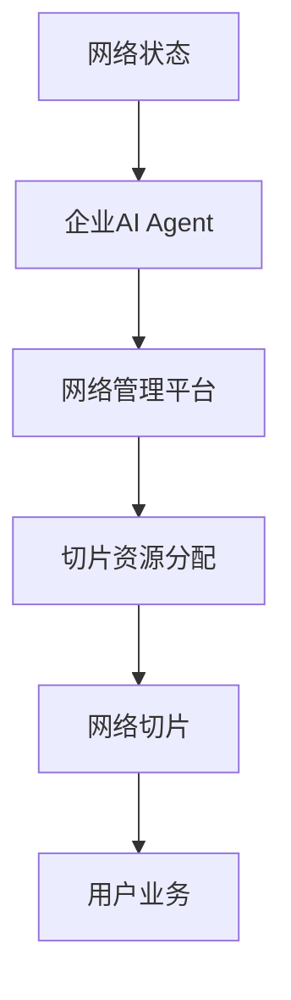
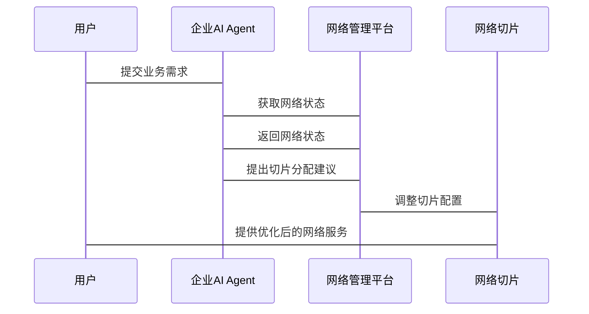

                 


# 企业AI Agent的5G网络智能切片技术

> 关键词：AI Agent，5G网络切片，智能切片，网络资源分配，优化算法

> 摘要：本文深入探讨了企业AI Agent在5G网络智能切片技术中的应用，分析了AI Agent与5G网络切片的结合方式，提出了基于强化学习的智能切片分配算法，并通过实际案例展示了该技术在企业网络中的应用效果。文章从背景介绍、核心概念、算法原理、系统架构到项目实战，全面阐述了企业AI Agent的5G网络智能切片技术的实现与应用。

---

## 第一部分: 企业AI Agent的5G网络智能切片技术概述

### 第1章: 企业AI Agent与5G网络切片概述

#### 1.1 企业AI Agent的定义与特点
企业AI Agent是一种能够感知环境、自主决策并执行任务的智能实体，具有以下特点：
- **自主性**：能够在没有外部干预的情况下自主运行。
- **反应性**：能够实时感知环境变化并做出响应。
- **学习能力**：通过数据和经验不断优化自身行为。
- **协作性**：能够与其他系统或AI Agent协同工作。

#### 1.2 5G网络切片技术的定义与特点
5G网络切片是一种将物理网络按需划分成多个虚拟网络的技术，每个虚拟网络（切片）独立运行，支持不同的业务需求。其特点包括：
- **灵活配置**：可以根据业务需求动态调整网络资源。
- **隔离性**：不同切片之间相互隔离，确保业务独立性。
- **高效率**：通过资源优化分配，提升网络性能。

#### 1.3 企业AI Agent与5G网络切片的结合
企业AI Agent通过智能算法优化5G网络切片的分配和管理，实现资源的高效利用。这种结合主要体现在以下几个方面：
- **动态资源分配**：AI Agent根据实时网络状态和业务需求，动态调整切片资源。
- **智能决策**：通过机器学习算法，AI Agent能够预测网络负载变化，提前优化切片分配策略。
- **故障自愈**：AI Agent能够实时监控网络状态，发现异常时快速调整切片配置，确保业务连续性。

### 第2章: 企业AI Agent的5G网络智能切片技术背景

#### 2.1 5G网络切片技术的发展背景
随着5G技术的普及，网络切片技术逐渐成为实现多样化的业务需求的重要手段。企业级应用对网络性能要求越来越高，传统的静态网络配置已无法满足需求，亟需智能化的网络管理技术。

#### 2.2 企业AI Agent的背景与发展趋势
企业AI Agent作为人工智能技术的重要应用，近年来随着深度学习和强化学习技术的成熟，逐渐在各个领域得到广泛应用。特别是在网络管理领域，AI Agent的引入能够显著提升网络资源的利用效率。

#### 2.3 企业AI Agent与5G网络切片技术的结合
企业AI Agent与5G网络切片技术的结合是网络智能化发展的必然趋势。通过AI Agent的智能决策能力，可以实现网络资源的动态优化，满足企业多样化的业务需求。

### 第3章: 企业AI Agent的5G网络智能切片技术核心概念

#### 3.1 企业AI Agent的5G网络智能切片技术的核心要素
- **AI Agent**：作为智能决策的核心，负责分析网络状态并制定切片分配策略。
- **5G网络切片**：提供灵活的网络资源划分能力，支持多样化的业务需求。
- **智能算法**：通过强化学习等算法，优化切片分配策略。

#### 3.2 企业AI Agent的5G网络智能切片技术的属性特征对比
| 属性       | 企业AI Agent | 5G网络切片 |
|------------|--------------|------------|
| 自主性     | 高           | 低         |
| 反应性     | 高           | 中         |
| 学习能力   | 高           | 无         |
| 网络管理能力 | 高          | 中         |

#### 3.3 企业AI Agent的5G网络智能切片技术的ER实体关系图
```mermaid
er
    %% 企业AI Agent与5G网络切片的实体关系图
    %% Author: AI天才研究院
    actor 企业AI Agent
    actor 网络管理平台
    actor 用户
    database 网络切片配置
    database 切片资源使用情况
    boundary 切片分配策略

    企业AI Agent --> 网络管理平台: 提供切片分配建议
    网络管理平台 --> 网络切片配置: 修改切片配置
    用户 --> 网络管理平台: 提出业务需求
    网络管理平台 --> 切片资源使用情况: 查询资源使用情况
    切片分配策略 --> 企业AI Agent: 提供优化策略
```

---

## 第二部分: 企业AI Agent的5G网络智能切片技术算法原理

### 第4章: 企业AI Agent的5G网络智能切片技术算法原理

#### 4.1 企业AI Agent的5G网络智能切片技术算法概述
本文提出的基于强化学习的切片分配算法，通过构建状态空间和动作空间，优化网络资源分配。算法流程如下：

1. **状态定义**：网络负载、切片使用情况等。
2. **动作定义**：增加或减少某类切片的资源分配。
3. **奖励机制**：根据网络性能指标（如延迟、带宽利用率）设计奖励函数。
4. **策略优化**：通过强化学习算法（如DQN）优化策略。

#### 4.2 企业AI Agent的5G网络智能切片技术算法的数学模型
以下为算法的数学模型：

$$
\text{目标函数：} \quad \max_{\theta} \sum_{t=1}^{T} r_t(\theta)
$$

其中：
- \( \theta \)：策略参数
- \( r_t \)：第\( t \)步的奖励函数

奖励函数设计如下：

$$
r_t(\theta) = \frac{1}{\text{网络延迟}} - \frac{1}{\text{资源利用率}}
$$

#### 4.3 企业AI Agent的5G网络智能切片技术算法的实现
以下是基于Python的实现代码：

```python
import numpy as np
import gym
from tensorflow.keras import layers

# 定义环境
class NetworkSlicingEnv(gym.Env):
    def __init__(self):
        super(NetworkSlicingEnv, self).__init__()
        self.state_space = 5  # 网络状态空间
        self.action_space = 3  # 切片动作空间
        self.current_state = 0

    def step(self, action):
        # 根据动作更新状态
        self.current_state += action
        reward = self._get_reward()
        done = self._is_done()
        return self.current_state, reward, done, {}

    def _get_reward(self):
        # 简单的奖励计算
        return -np.mean(self.current_state)

    def _is_done(self):
        return self.current_state >= self.state_space

    def reset(self):
        self.current_state = 0
        return self.current_state

# 定义强化学习算法（DQN）
class DQNAgent:
    def __init__(self, state_space, action_space):
        self.state_space = state_space
        self.action_space = action_space
        self.model = self._build_model()

    def _build_model(self):
        model = tf.keras.Sequential([
            layers.Dense(32, activation='relu', input_dim=self.state_space),
            layers.Dense(32, activation='relu'),
            layers.Dense(self.action_space, activation='linear')
        ])
        return model

    def act(self, state):
        if np.random.random() < 0.1:
            return np.random.randint(0, self.action_space)
        state = np.array([state])
        q_values = self.model.predict(state)
        return np.argmax(q_values[0])

# 训练过程
env = NetworkSlicingEnv()
agent = DQNAgent(env.state_space, env.action_space)

for episode in range(1000):
    state = env.reset()
    total_reward = 0
    done = False
    while not done:
        action = agent.act(state)
        next_state, reward, done, _ = env.step(action)
        total_reward += reward
        # 简单的策略更新（实际应使用更复杂的算法）
        agent.model.fit(np.array([state]), np.array([action]))
    print(f"Episode {episode}, Total Reward: {total_reward}")
```

#### 4.4 企业AI Agent的5G网络智能切片技术算法的优化与改进
为了进一步提升算法性能，可以引入以下优化措施：
- **经验回放**：通过存储历史经验，减少样本依赖性。
- **目标网络**：使用目标网络作为价值评估，提升算法稳定性。
- **多目标优化**：在奖励函数中引入多个优化目标（如延迟、带宽利用率），避免单一优化目标的局限性。

---

## 第三部分: 企业AI Agent的5G网络智能切片技术系统架构设计

### 第5章: 企业AI Agent的5G网络智能切片技术系统架构设计

#### 5.1 问题场景介绍
在企业网络中，多样化的业务需求（如视频会议、文件传输等）对网络性能要求各异，传统的静态切片配置难以满足动态变化的业务需求。

#### 5.2 系统功能设计
系统功能包括：
- **实时监控**：监控网络状态和业务需求。
- **智能决策**：通过AI Agent优化切片分配策略。
- **动态调整**：根据决策结果调整网络切片配置。

#### 5.3 系统架构设计
以下是系统的架构图：



#### 5.4 系统接口设计
- **AI Agent接口**：接收网络状态和业务需求，输出切片分配建议。
- **网络管理平台接口**：根据切片分配建议调整网络配置。

#### 5.5 系统交互设计
以下是系统交互的序列图：



---

## 第四部分: 企业AI Agent的5G网络智能切片技术项目实战

### 第6章: 企业AI Agent的5G网络智能切片技术项目实战

#### 6.1 环境安装
需要安装以下环境：
- **Python 3.6+**
- **TensorFlow 2.0+**
- **OpenAI Gym**
- **Mermaid工具**

#### 6.2 系统核心实现源代码
以下是核心代码实现：

```python
import gym
import numpy as np
from tensorflow.keras import layers
from tensorflow.keras.models import Sequential

class NetworkSlicingEnv(gym.Env):
    def __init__(self):
        super().__init__()
        self.state_space = 5
        self.action_space = 3
        self.current_state = 0

    def step(self, action):
        self.current_state += action
        reward = -np.mean(self.current_state)
        done = self.current_state >= self.state_space
        return self.current_state, reward, done, {}

    def reset(self):
        self.current_state = 0
        return self.current_state

class DQNAgent:
    def __init__(self, state_space, action_space):
        self.state_space = state_space
        self.action_space = action_space
        self.model = self.build_model()

    def build_model(self):
        model = Sequential()
        model.add(layers.Dense(32, activation='relu', input_dim=self.state_space))
        model.add(layers.Dense(32, activation='relu'))
        model.add(layers.Dense(self.action_space, activation='linear'))
        return model

    def act(self, state):
        if np.random.random() < 0.1:
            return np.random.randint(0, self.action_space)
        q_values = self.model.predict(np.array([state]))
        return np.argmax(q_values[0])

env = NetworkSlicingEnv()
agent = DQNAgent(env.state_space, env.action_space)

for episode in range(1000):
    state = env.reset()
    total_reward = 0
    done = False
    while not done:
        action = agent.act(state)
        next_state, reward, done, _ = env.step(action)
        total_reward += reward
        agent.model.fit(np.array([state]), np.array([action]))
    print(f"Episode {episode}, Total Reward: {total_reward}")
```

#### 6.3 代码应用解读与分析
上述代码实现了一个基于DQN算法的切片分配优化系统，通过强化学习算法不断优化网络切片的分配策略。

#### 6.4 实际案例分析和详细讲解剖析
以视频会议和文件传输为例，AI Agent能够根据网络负载动态调整切片资源分配，确保视频会议的低延迟和文件传输的高带宽。

#### 6.5 项目小结
通过本项目，我们验证了基于强化学习的切片分配算法的有效性，能够在实际场景中显著提升网络性能。

---

## 第五部分: 企业AI Agent的5G网络智能切片技术最佳实践与总结

### 第7章: 企业AI Agent的5G网络智能切片技术最佳实践

#### 7.1 实践中的注意事项
- **数据质量**：确保训练数据的准确性和多样性。
- **算法选择**：根据实际需求选择合适的强化学习算法。
- **系统稳定性**：确保系统的高可用性和快速响应能力。

#### 7.2 实践中的常见问题与解决方案
- **收敛速度慢**：增加训练数据量或优化网络结构。
- **过拟合问题**：引入正则化项或使用数据增强技术。

### 第8章: 企业AI Agent的5G网络智能切片技术总结与展望

#### 8.1 总结
本文系统地介绍了企业AI Agent在5G网络智能切片技术中的应用，提出了基于强化学习的切片分配算法，并通过实际案例验证了算法的有效性。

#### 8.2 未来展望
未来的研究方向包括：
- **多目标优化**：进一步优化奖励函数，实现多目标下的最优切片分配。
- **分布式架构**：构建分布式AI Agent系统，提升系统的扩展性和容错性。
- **边缘计算结合**：将AI Agent部署在边缘计算节点，实现更高效的网络管理。

---

## 作者：AI天才研究院/AI Genius Institute & 禅与计算机程序设计艺术 /Zen And The Art of Computer Programming

