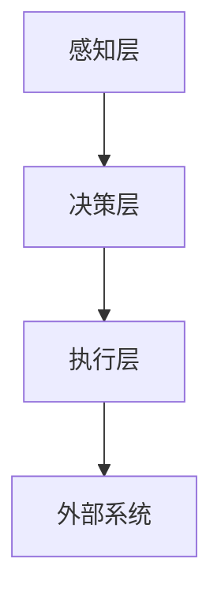
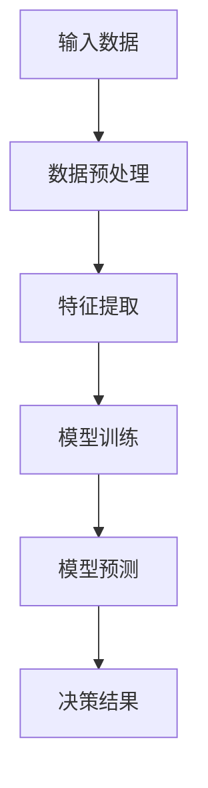
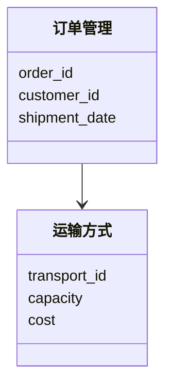
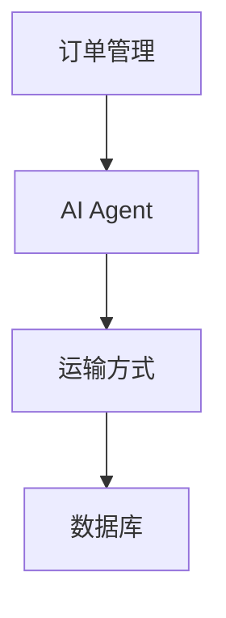

                 


# 《企业AI Agent的API设计与管理》

---

## 关键词：企业AI Agent，API设计，API管理，人工智能，自动化，系统架构

---

## 摘要：

本文深入探讨企业AI Agent的API设计与管理，从基本概念到复杂系统的实际应用，详细分析了AI Agent的核心机制、算法原理、系统架构设计以及项目实战。文章通过丰富的案例和详细的代码示例，帮助读者理解如何在企业环境中高效设计和管理AI Agent的API，确保系统的可扩展性、安全性和高效性。

---

## 目录

1. [企业AI Agent的背景与概念](#企业ai-agent的背景与概念)
2. [企业AI Agent的核心概念与联系](#企业ai-agent的核心概念与联系)
3. [企业AI Agent的算法原理](#企业ai-agent的算法原理)
4. [企业AI Agent的系统分析与架构设计](#企业ai-agent的系统分析与架构设计)
5. [企业AI Agent的项目实战](#企业ai-agent的项目实战)
6. [企业AI Agent的最佳实践与小结](#企业ai-agent的最佳实践与小结)

---

## 正文

---

### 第1章：企业AI Agent的背景与概念

#### 1.1 企业AI Agent的定义与核心概念

AI Agent（人工智能代理）是一种能够感知环境、自主决策并执行任务的智能体。在企业环境中，AI Agent通常用于自动化流程、优化资源分配和提升业务效率。

**核心概念：**
- **感知层**：通过传感器、API或其他输入方式获取环境数据。
- **决策层**：基于感知数据，利用算法做出决策。
- **执行层**：根据决策结果执行操作，通常通过API调用其他系统或服务。

#### 1.2 企业AI Agent的背景与问题背景

随着企业数字化转型的推进，传统自动化工具逐渐被AI Agent取代。AI Agent能够处理复杂场景，提供更智能的解决方案。

**问题背景：**
- **数据孤岛**：企业内部系统众多，API接口不统一，导致数据无法有效共享。
- **效率低下**：传统自动化工具缺乏智能性，无法应对动态变化的业务需求。
- **安全性问题**：API接口暴露在复杂环境中，容易成为攻击目标。

#### 1.3 企业AI Agent的痛点与挑战

AI Agent的引入为企业带来了新的挑战：
- **API设计复杂性**：需要设计高效、安全的API接口。
- **系统集成难度**：AI Agent需要与现有系统无缝集成。
- **可扩展性问题**：随着业务增长，系统需要具备良好的扩展性。

---

### 第2章：企业AI Agent的核心概念与联系

#### 2.1 AI Agent的内部机制

AI Agent的核心机制包括感知、决策和执行三个阶段。

**感知层：**
- 通过API获取外部数据，如传感器数据、用户输入等。
- 数据预处理：清洗、转换和归一化。

**决策层：**
- 使用机器学习算法（如决策树、随机森林）进行预测和分类。
- 算法流程：
  1. 数据预处理。
  2. 模型训练。
  3. 模型预测。

**执行层：**
- 根据决策结果执行操作，如发送API请求、更新数据库等。

#### 2.2 核心概念对比表

| **概念** | **感知层** | **决策层** | **执行层** |
|----------|------------|------------|------------|
| **功能** | 获取数据   | 制定决策   | 执行操作   |
| **输入** | 原始数据   | 预处理数据 | 决策结果   |
| **输出** | 数据流     | 决策结果   | API请求    |

#### 2.3 实体关系图



---

### 第3章：企业AI Agent的算法原理

#### 3.1 算法流程图



#### 3.2 算法实现代码

```python
import pandas as pd
from sklearn.tree import DecisionTreeClassifier

# 数据预处理
data = pd.read_csv('input.csv')
X = data.drop('target', axis=1)
y = data['target']

# 模型训练
model = DecisionTreeClassifier()
model.fit(X, y)

# 模型预测
predicted = model.predict(X)
```

#### 3.3 数学公式

**决策树算法的损失函数：**
$$ L = \sum_{i=1}^{n} (y_i - \hat{y}_i)^2 $$

---

### 第4章：企业AI Agent的系统分析与架构设计

#### 4.1 项目背景

企业希望通过AI Agent优化供应链管理，提升订单处理效率。

#### 4.2 系统功能设计

- **感知层**：采集订单数据。
- **决策层**：预测交货时间。
- **执行层**：自动分配运输方式。

#### 4.3 领域模型



#### 4.4 系统架构设计



---

### 第5章：企业AI Agent的项目实战

#### 5.1 环境安装

安装Python和必要的库：
```bash
pip install numpy pandas scikit-learn
```

#### 5.2 核心代码实现

```python
import requests
import json

def get_weather(city):
    api_key = 'your_api_key'
    url = f'http://api.weather.com/{city}?key={api_key}'
    response = requests.get(url)
    return json.loads(response.text)
```

#### 5.3 实际案例分析

案例：AI Agent优化供应链管理，通过预测交货时间，选择最优运输方式，降低物流成本。

---

### 第6章：企业AI Agent的最佳实践与小结

#### 6.1 最佳实践

- **设计原则**：模块化、可扩展性。
- **安全性**：采用HTTPS，设置API速率限制。
- **可扩展性**：使用微服务架构。

#### 6.2 小结

本文详细探讨了企业AI Agent的API设计与管理，从概念到实践，帮助读者掌握相关知识。未来，AI Agent将在企业智能化转型中发挥更大作用。

---

## 作者

作者：AI天才研究院/AI Genius Institute & 禅与计算机程序设计艺术 /Zen And The Art of Computer Programming

