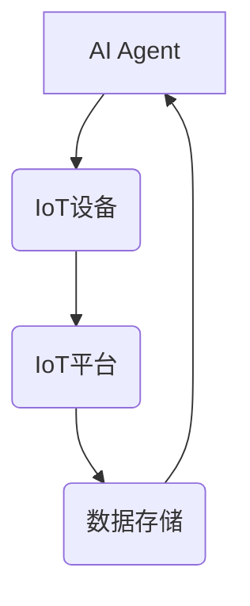
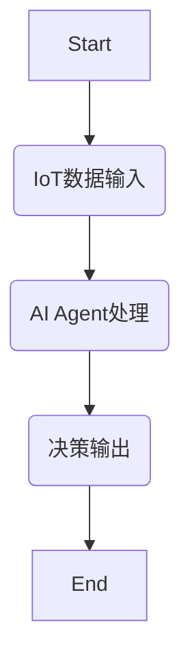
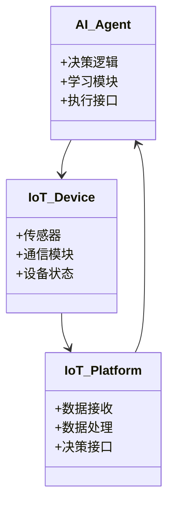
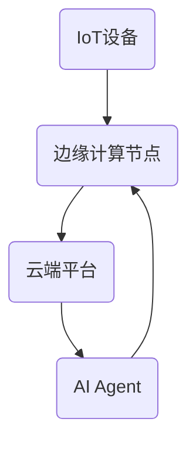
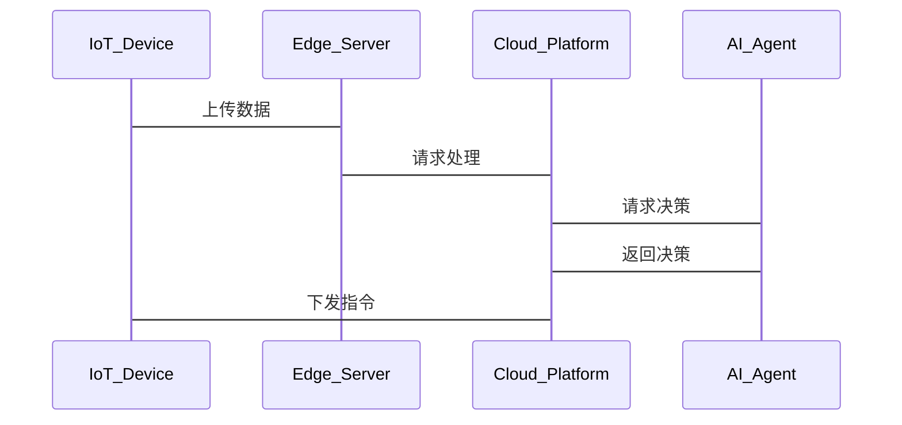

                 


# 企业AI Agent的IoT集成策略

> 关键词：企业AI Agent，IoT集成，智能化应用，系统架构，数据驱动

> 摘要：本文深入探讨了企业AI Agent与IoT的集成策略，分析了AI Agent与IoT的核心概念与联系，详细讲解了集成的算法原理、系统架构设计、项目实战与最佳实践，为企业实现智能化IoT应用提供指导。

---

## 第1章：企业AI Agent与IoT的背景与概念

### 1.1 AI Agent的基本概念
#### 1.1.1 AI Agent的定义与核心特征
AI Agent（人工智能代理）是指能够感知环境并采取行动以实现目标的智能实体。其核心特征包括：
- **自主性**：无需外部干预，自主决策。
- **反应性**：实时感知环境并做出反应。
- **目标导向**：基于目标驱动行为。
- **学习能力**：通过数据和经验不断优化。

#### 1.1.2 AI Agent的分类与应用场景
AI Agent可以分为**简单反射型**、**基于模型的反射型**、**目标驱动型**和**效用驱动型**。应用场景包括智能助手、自动化控制、机器人协作等。

#### 1.1.3 AI Agent在企业中的价值与挑战
- **价值**：提高效率、优化决策、增强用户体验。
- **挑战**：数据隐私、计算资源限制、多 Agent 协作复杂性。

---

### 1.2 IoT的基本概念与体系结构
#### 1.2.1 IoT的定义与发展现状
IoT（物联网）是指通过互联网连接物理设备，实现智能化数据交换与通信。目前，IoT已广泛应用于智能家居、工业自动化、智慧城市等领域。

#### 1.2.2 IoT的核心技术与组成部分
IoT系统由**感知层**（传感器）、**网络层**（通信协议）、**计算层**（数据处理）和**应用层**（用户交互）组成。

#### 1.2.3 IoT在企业中的应用与发展趋势
企业IoT应用包括资产跟踪、设备监控、智能工厂等。发展趋势是**边缘计算**、**5G网络**和**AI驱动**。

---

### 1.3 AI Agent与IoT的结合与集成
#### 1.3.1 AI Agent在IoT中的作用与优势
AI Agent可以增强IoT系统的智能化，实现数据的自动分析与决策。

#### 1.3.2 IoT数据驱动AI Agent的潜力
IoT提供实时数据，AI Agent通过分析这些数据优化决策。

#### 1.3.3 企业AI Agent-IoT集成的总体架构
AI Agent-IoT集成的总体架构包括**数据采集**、**数据处理**、**决策制定**和**反馈执行**四个阶段。

---

## 第2章：企业AI Agent-IoT集成的核心概念与联系

### 2.1 核心概念原理
#### 2.1.1 AI Agent的感知与决策机制
AI Agent通过感知环境数据，利用算法进行分析并制定决策。

#### 2.1.2 IoT的数据采集与传输机制
IoT设备采集数据并通过网络层传输到云端或边缘计算节点。

#### 2.1.3 AI Agent与IoT的交互流程
数据从IoT设备传输到AI Agent，经过处理后生成决策并反馈到IoT系统。

---

### 2.2 核心概念属性对比
#### 2.2.1 AI Agent与IoT的属性对比表格
| 属性       | AI Agent                          | IoT                          |
|------------|-----------------------------------|------------------------------|
| 核心功能    | 感知与决策                        | 数据采集与传输                |
| 依赖数据    | 高                                | 中                            |
| 响应速度    | 快                                | 较快                          |

#### 2.2.2 实体关系图（ER图）架构


---

## 第3章：企业AI Agent-IoT集成的算法原理

### 3.1 算法原理概述
#### 3.1.1 数据流驱动的AI Agent-IoT协同算法
AI Agent通过数据流驱动IoT设备的运行，实现动态协同。

#### 3.1.2 基于事件驱动的AI Agent-IoT交互算法
IoT设备触发事件，AI Agent基于事件做出反应。

---

### 3.2 算法流程图


---

### 3.3 算法实现代码
```python
def process_iot_data(data):
    # 数据预处理
    processed_data = data_processor(data)
    # AI Agent决策
    decision = agent.decision_making(processed_data)
    return decision
```

---

### 3.4 数学模型与公式
#### 3.4.1 数据融合模型
$$ y = f(x_1, x_2, ..., x_n) $$
其中，$x_i$表示IoT设备采集的数据，$y$表示AI Agent的决策输出。

---

## 第4章：企业AI Agent-IoT集成的系统架构设计

### 4.1 项目介绍
本项目旨在通过AI Agent优化IoT设备的运行效率。

### 4.2 系统功能设计
#### 4.2.1 领域模型（类图）


---

### 4.3 系统架构设计


---

### 4.4 系统接口设计
#### 4.4.1 API接口
- **输入接口**：`/api/v1/iot/data`
- **输出接口**：`/api/v1/agent/decision`

#### 4.4.2 交互流程


---

## 第5章：企业AI Agent-IoT集成的项目实战

### 5.1 环境安装
- 操作系统：Linux（Ubuntu 20.04）
- 依赖工具：Python 3.8、Django 2.2、Kafka 2.8、Redis 6.0

---

### 5.2 系统核心实现源代码
```python
# AI Agent核心逻辑实现
class AI_Agent:
    def __init__(self):
        self.learning_model = self._initialize_model()
    
    def _initialize_model(self):
        # 初始化模型
        pass
    
    def decision_making(self, data):
        # 数据分析与决策
        return "执行操作X"
```

---

### 5.3 代码应用解读与分析
- **AI Agent类**：负责数据处理与决策制定。
- **数据处理方法**：`decision_making`方法接收数据并返回决策结果。

---

### 5.4 实际案例分析
以智能工厂为例，IoT设备实时采集生产线数据，AI Agent分析数据后优化生产流程。

---

## 第6章：企业AI Agent-IoT集成的最佳实践与总结

### 6.1 最佳实践 tips
- **数据隐私**：确保IoT数据的安全传输。
- **计算资源**：合理分配边缘计算与云端计算资源。
- **多 Agent 协作**：制定高效的协作机制。

### 6.2 项目小结
通过AI Agent与IoT的集成，企业可以实现智能化的物联网应用，显著提升效率与用户体验。

### 6.3 注意事项
- 定期更新AI Agent模型以保持决策准确性。
- 监控系统运行状态，及时发现并解决问题。

### 6.4 拓展阅读
推荐阅读《AI in IoT: A Comprehensive Survey》深入了解AI与IoT的结合。

---

## 作者信息

作者：AI天才研究院/AI Genius Institute  
声明：禁止以任何形式转载、翻译、改编、摘录、引用此文章内容用于商业用途，违者必究。

---

通过以上结构，您可以逐步撰写完整的技术博客文章，确保每个部分都详细展开，满足技术深度和逻辑性要求。

