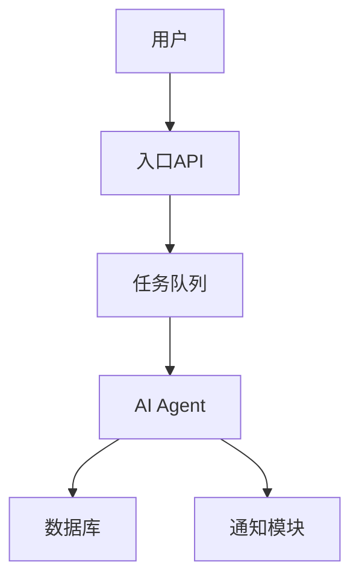

                 

# 企业AI Agent的serverless架构优化

> 关键词：企业AI Agent，serverless架构，优化，计算资源，自动化，云服务

> 摘要：本文深入探讨了如何通过serverless架构优化企业AI Agent的性能和效率。结合具体案例，分析了serverless架构的优势及其在企业AI Agent中的应用，详细讲解了优化策略和实现方法。

---

## 第1章: 企业AI Agent的背景与概述

### 1.1 企业AI Agent的基本概念
#### 1.1.1 AI Agent的定义与核心功能
AI Agent（智能代理）是一种能够感知环境并采取行动以实现目标的计算机系统。它能够理解用户需求、执行任务、优化流程并提供智能化服务。

#### 1.1.2 企业AI Agent的应用场景
在企业环境中，AI Agent可以应用于自动化处理邮件、安排会议、监控系统状态、优化供应链、客户关系管理等领域。

#### 1.1.3 企业AI Agent与传统自动化系统的区别
企业AI Agent具备智能决策能力，能够处理复杂任务，而传统自动化系统通常执行固定流程。

### 1.2 Serverless架构的基本概念
#### 1.2.1 Serverless架构的定义
Serverless是一种计算模型，开发者无需管理服务器，云服务提供商负责资源分配和维护。

#### 1.2.2 Serverless架构的优势
- 按需扩展，节省成本。
- 简化运维，提高开发效率。
- 支持高并发请求。

#### 1.2.3 Serverless架构的适用场景
适用于请求量波动大、需要快速响应的应用场景，如移动应用后端、API网关等。

### 1.3 企业AI Agent与Serverless架构的结合
#### 1.3.1 企业AI Agent对计算资源的需求
AI Agent需要处理大量数据和复杂任务，对计算资源的需求较高。

#### 1.3.2 Serverless架构如何满足AI Agent的需求
通过动态分配计算资源，Serverless架构能够弹性扩展，满足AI Agent的高并发需求。

#### 1.3.3 企业AI Agent在Serverless架构中的应用优势
- 灵活扩展，降低运营成本。
- 快速响应，提升用户体验。

### 1.4 本章小结
企业AI Agent需要高效、可靠的计算资源，Serverless架构通过动态扩展和简化运维，完美满足其需求。

---

## 第2章: 企业AI Agent的核心概念与Serverless架构的联系

### 2.1 企业AI Agent的核心概念
#### 2.1.1 智能决策模块
AI Agent通过机器学习模型做出决策。

#### 2.1.2 任务执行模块
负责执行AI决策的任务，如发送邮件、更新数据库等。

### 2.2 Serverless架构的核心概念
#### 2.2.1 函数即服务（FaaS）
开发者编写函数，云服务提供商负责运行和扩展。

#### 2.2.2 事件驱动
Serverless函数由事件触发，如HTTP请求、数据库变更等。

### 2.3 企业AI Agent与Serverless架构的结合
#### 2.3.1 智能决策模块的实现
使用机器学习模型，部署在Serverless函数中，根据输入数据生成决策。

#### 2.3.2 任务执行模块的优化
通过Serverless函数实现任务异步处理，提高效率。

### 2.4 本章小结
企业AI Agent的核心模块与Serverless架构的事件驱动、函数扩展特性相结合，提升了系统的灵活性和响应速度。

---

## 第3章: 企业AI Agent的算法原理

### 3.1 机器学习模型的选择
#### 3.1.1 监督学习
用于分类和回归任务，如客户 churn 预测。

#### 3.1.2 无监督学习
用于聚类和降维，如客户群体分析。

#### 3.1.3 深度学习
用于复杂任务，如自然语言处理和图像识别。

### 3.2 算法实现
#### 3.2.1 训练过程
使用训练数据训练模型，调整参数以最小化损失函数。

#### 3.2.2 模型部署
将训练好的模型部署到Serverless函数中，提供API接口供其他系统调用。

### 3.3 算法优化
#### 3.3.1 模型压缩
减少模型大小，提高推理速度。

#### 3.3.2 模型并行
在多台服务器上并行推理，提高处理能力。

### 3.4 本章小结
选择合适的算法，优化模型，确保AI Agent在Serverless架构中高效运行。

---

## 第4章: Serverless架构的优化策略

### 4.1 优化目标
提高系统的响应速度、降低运行成本、减少延迟。

### 4.2 优化措施
#### 4.2.1 函数优化
减少函数启动时间，避免资源泄漏。

#### 4.2.2 资源分配
合理分配计算资源，避免浪费。

#### 4.2.3 监控与日志
实时监控函数状态，记录运行日志，便于排查问题。

### 4.3 本章小结
通过函数优化、资源分配和监控，提升Serverless架构的整体性能。

---

## 第5章: 企业AI Agent的系统架构设计

### 5.1 系统功能设计
#### 5.1.1 用户管理模块
管理用户信息，提供身份验证。

#### 5.1.2 任务调度模块
根据优先级安排任务执行顺序。

#### 5.1.3 日志管理模块
记录系统运行日志，便于排查问题。

### 5.2 系统架构图

### 5.3 接口设计
#### 5.3.1 API接口
提供RESTful API，供外部系统调用。

#### 5.3.2 接口文档
详细描述接口参数、返回值和错误处理。

### 5.4 本章小结
合理设计系统架构，确保各模块协同工作，提升整体性能。

---

## 第6章: 项目实战

### 6.1 环境安装
安装必要的工具，如AWS CLI、Python、Docker。

### 6.2 核心代码实现
#### 6.2.1 函数实现
编写AI Agent的核心函数，处理用户请求。

#### 6.2.2 优化代码
优化函数启动时间和资源使用。

### 6.3 代码解读与分析
详细分析核心代码，解释其功能和优化策略。

### 6.4 本章小结
通过实战项目，验证优化策略的有效性，积累实践经验。

---

## 第7章: 最佳实践与小结

### 7.1 最佳实践
#### 7.1.1 合理选择云服务提供商
根据需求选择适合的Serverless平台。

#### 7.1.2 优化函数性能
减少启动时间，避免资源泄漏。

#### 7.1.3 监控与日志管理
实时监控函数状态，记录运行日志。

### 7.2 小结
通过Serverless架构优化企业AI Agent，能够显著提高系统的效率和可靠性。

### 7.3 注意事项
- 避免过度优化，确保代码的可读性。
- 定期监控系统性能，及时调整资源分配。

### 7.4 拓展阅读
推荐阅读相关技术书籍和博客，深入了解Serverless架构的最新发展。

---

## 作者信息
作者：AI天才研究院 & 禅与计算机程序设计艺术

---

通过以上步骤，详细分析了企业AI Agent在Serverless架构中的优化策略，结合具体案例，深入讲解了实现细节和优化方法。希望对读者在实际应用中有所帮助。

