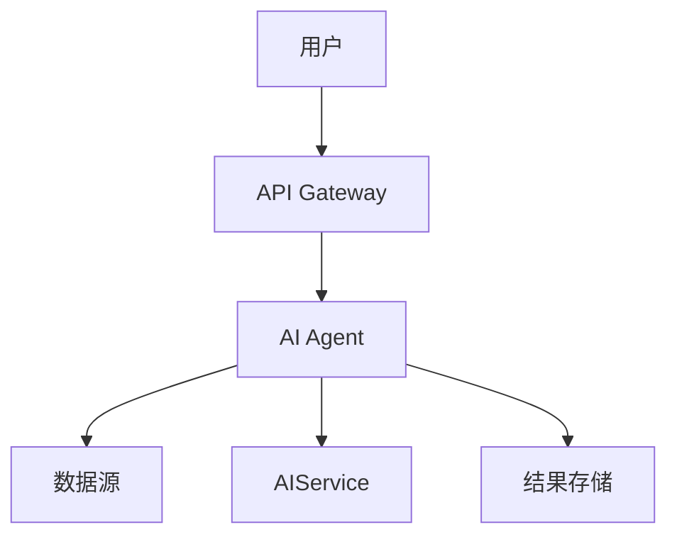
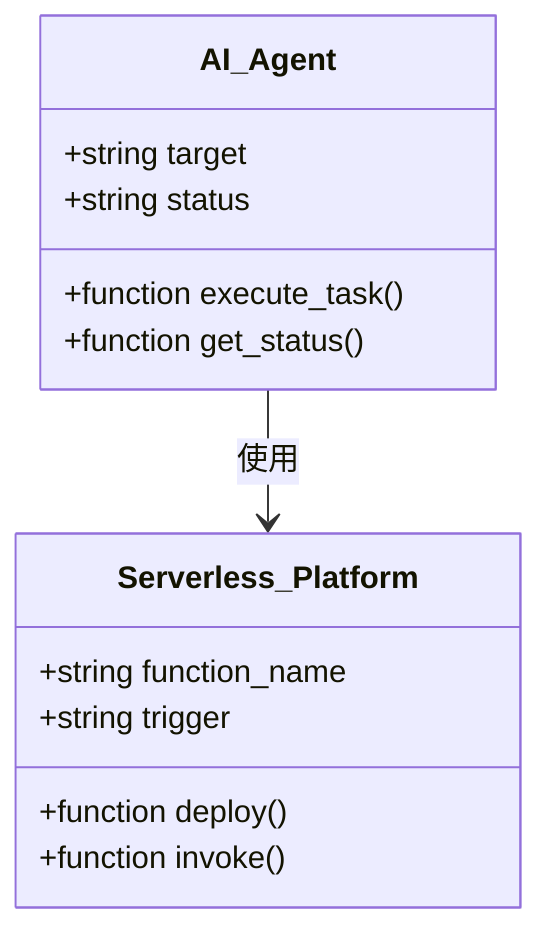
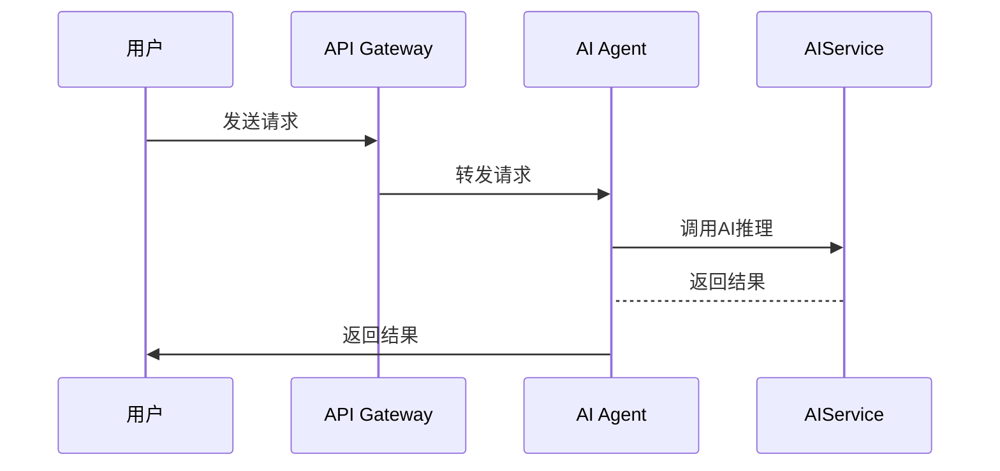

                 


# 企业AI Agent的Serverless架构设计

> 关键词：企业AI Agent，Serverless架构，无服务器计算，函数即服务（FaaS），事件驱动架构

> 摘要：本文详细探讨了在企业环境中设计和实现AI Agent的Serverless架构。文章从AI Agent的基本概念和需求分析入手，结合Serverless架构的特点，分析了两者结合的优势和挑战。通过系统架构设计、项目实战和最佳实践，为读者提供了全面的指导。

---

## 第1章 企业AI Agent与Serverless架构概述

### 1.1 企业AI Agent的基本概念

#### 1.1.1 什么是AI Agent
AI Agent（人工智能代理）是一种能够感知环境、采取行动以实现特定目标的智能实体。它通常具备以下核心特征：
- **自主性**：能够在没有外部干预的情况下独立运作。
- **反应性**：能够实时感知环境变化并做出响应。
- **目标导向**：所有行动都以实现预设目标为核心。

#### 1.1.2 AI Agent的核心特征
- **感知能力**：通过传感器或API获取环境数据。
- **决策能力**：基于感知数据进行分析和决策。
- **执行能力**：通过执行器或API调用外部服务完成任务。

#### 1.1.3 企业级AI Agent的应用场景
- **自动化运维**：监控系统状态，自动修复问题。
- **智能客服**：处理客户咨询，提供个性化服务。
- **数据分析**：实时处理数据，提供决策支持。

### 1.2 Serverless架构的基本概念

#### 1.2.1 什么是Serverless架构
Serverless架构是一种云计算模型，允许开发者编写代码而无需管理底层服务器。核心思想是“按需付费，不用时不用管”。

#### 1.2.2 Serverless架构的特点
- **弹性扩展**：根据请求量自动扩展资源。
- **按需付费**：仅按实际使用的资源付费。
- **简化管理**：无需处理服务器维护和扩展。

#### 1.2.3 Serverless架构的优势与劣势
- **优势**：快速部署、弹性扩展、成本优化。
- **劣势**：冷启动延迟、资源限制、监控复杂。

### 1.3 企业AI Agent与Serverless架构的结合

#### 1.3.1 结合的背景与意义
随着企业对智能化需求的增加，Serverless架构的弹性和高效性使其成为AI Agent的理想选择。

#### 1.3.2 结合的核心优势
- **资源利用率高**：按需分配资源，避免浪费。
- **快速响应**：Serverless的弹性扩展确保AI Agent能够及时处理大量请求。
- **简化管理**：无需维护底层服务器，降低运维成本。

#### 1.3.3 结合的应用前景
- **智能监控**：实时监控企业系统，自动响应异常。
- **自动化处理**：自动执行复杂任务，提升效率。

### 1.4 本章小结
本章介绍了AI Agent和Serverless架构的基本概念，分析了它们结合的背景和优势，为后续设计奠定了基础。

---

## 第2章 企业AI Agent的需求分析

### 2.1 企业AI Agent的功能需求

#### 2.1.1 任务执行需求
AI Agent需要能够执行多种任务，如数据处理、模型推理等。

#### 2.1.2 自动化决策需求
基于实时数据，AI Agent需要做出决策并执行相应操作。

#### 2.1.3 数据处理需求
处理结构化和非结构化数据，支持多种数据源。

### 2.2 企业AI Agent的性能需求

#### 2.2.1 响应时间要求
AI Agent需要在规定时间内完成任务，避免影响用户体验。

#### 2.2.2 并发处理能力
能够同时处理大量请求，确保系统稳定运行。

#### 2.2.3 资源利用率优化
通过优化算法和资源分配，降低运行成本。

### 2.3 企业AI Agent的扩展性需求

#### 2.3.1 功能扩展性
支持新增功能模块，如新的AI模型或接口。

#### 2.3.2 服务扩展性
能够根据负载自动扩展服务实例，确保系统弹性。

#### 2.3.3 性能扩展性
通过优化算法和资源分配，提升系统性能。

### 2.4 本章小结
本章详细分析了企业AI Agent的需求，为后续设计提供了明确的方向。

---

## 第3章 Serverless架构的原理与实现

### 3.1 Serverless架构的原理

#### 3.1.1 函数即服务（FaaS）模型
FaaS模型允许开发者以函数为单位部署代码，平台自动处理扩展和负载均衡。

#### 3.1.2 无服务器计算的核心思想
通过抽象底层服务器，简化开发者的运维工作，按需分配资源。

#### 3.1.3 Serverless架构的关键技术
- **事件驱动**：通过触发事件启动函数执行。
- **弹性计算**：根据请求量自动扩展计算资源。
- **按需付费**：仅根据实际使用的资源付费。

### 3.2 Serverless架构的主要实现方式

#### 3.2.1 基于云平台的Serverless服务
- **AWS Lambda**：由亚马逊提供的FaaS服务。
- **Google Cloud Functions**：由谷歌提供的FaaS服务。
- **Azure Functions**：由微软提供的FaaS服务。

#### 3.2.2 自建Serverless平台
- **OpenFaaS**：开源的Serverless框架，支持多种后端。
- **Knative**：开源的Serverless框架，支持Kubernetes。

### 3.3 Serverless架构的实现步骤

#### 3.3.1 环境搭建
选择合适的云平台或自建Serverless环境。

#### 3.3.2 函数开发
使用Python、JavaScript等语言编写函数代码。

#### 3.3.3 事件配置
配置触发事件，如HTTP请求、数据库变更等。

#### 3.3.4 测试与部署
测试函数功能，部署到Serverless平台。

### 3.4 本章小结
本章详细讲解了Serverless架构的原理和实现方式，为后续设计提供了技术基础。

---

## 第4章 企业AI Agent的Serverless架构设计

### 4.1 系统功能设计

#### 4.1.1 功能模块划分
- **数据采集模块**：从多种数据源采集数据。
- **数据处理模块**：清洗、转换数据。
- **AI推理模块**：运行AI模型进行推理。
- **结果反馈模块**：将结果返回给用户或触发下一个任务。

#### 4.1.2 数据流设计
数据从采集模块进入，经过处理模块后，进入AI推理模块，最后由反馈模块输出结果。

#### 4.1.3 交互流程设计
用户触发请求，AI Agent接收请求，处理后返回结果。

### 4.2 系统架构设计

#### 4.2.1 系统架构图


#### 4.2.2 类图


#### 4.2.3 序列图


### 4.3 本章小结
本章详细设计了企业AI Agent的Serverless架构，包括功能模块、架构图和交互流程。

---

## 第5章 项目实战：企业AI Agent的Serverless实现

### 5.1 环境搭建

#### 5.1.1 选择云平台
选择AWS Lambda、Google Cloud Functions或Azure Functions等。

#### 5.1.2 安装必要的工具
安装AWS CLI、Python SDK等。

### 5.2 核心代码实现

#### 5.2.1 数据采集模块
```python
import boto3

def fetch_data():
    # 从数据库获取数据
    dynamodb = boto3.resource('dynamodb')
    table = dynamodb.Table('UserData')
    response = table.scan()
    return response['Items']
```

#### 5.2.2 数据处理模块
```python
def process_data(data):
    # 数据清洗和转换
    processed = []
    for item in data:
        processed.append({
            'id': item['id'],
            'name': item['name'].lower()
        })
    return processed
```

#### 5.2.3 AI推理模块
```python
import joblib

model = joblib.load('model.pkl')

def predict(data):
    # 使用模型进行预测
    return model.predict(data)
```

#### 5.2.4 结果反馈模块
```python
def feedback_result(result):
    # 将结果存储到数据库
    dynamodb = boto3.resource('dynamodb')
    table = dynamodb.Table('Results')
    response = table.put_item(Item=result)
    return response['ResponseMetadata']['HTTPStatusCode'] == 200
```

### 5.3 测试与优化

#### 5.3.1 测试用例设计
编写单元测试和集成测试，确保各模块功能正常。

#### 5.3.2 性能优化
优化算法和代码，减少执行时间，提高资源利用率。

### 5.4 本章小结
本章通过实际项目展示了企业AI Agent的Serverless实现，包括环境搭建、代码实现和测试优化。

---

## 第6章 最佳实践与注意事项

### 6.1 最佳实践

#### 6.1.1 合理选择Serverless平台
根据需求选择合适的云平台，考虑成本、性能和功能。

#### 6.1.2 优化函数设计
函数应尽量无状态，避免长时间运行，减少资源占用。

#### 6.1.3 处理冷启动问题
通过优化代码和选择合适的触发机制，减少冷启动延迟。

### 6.2 注意事项

#### 6.2.1 资源限制
注意Serverless平台的资源限制，避免超出配额。

#### 6.2.2 安全性
确保数据和代码的安全性，防止潜在的安全漏洞。

#### 6.2.3 监控与日志
配置监控和日志系统，及时发现和解决问题。

### 6.3 本章小结
本章总结了企业AI Agent的Serverless设计中的最佳实践和注意事项，帮助开发者避免常见问题。

---

## 第7章 总结与展望

### 7.1 总结
本文详细探讨了企业AI Agent的Serverless架构设计，从理论分析到实际实现，为读者提供了全面的指导。

### 7.2 展望
未来，随着AI技术的发展，Serverless架构在企业AI Agent中的应用将更加广泛，技术也将更加成熟。

### 7.3 本章小结
本文总结了设计过程，并展望了未来的发展方向。

---

## 附录

### 附录A 常用Serverless工具推荐
- **AWS Lambda**
- **Google Cloud Functions**
- **Azure Functions**
- **OpenFaaS**

### 附录B 术语表
- **AI Agent**：人工智能代理
- **Serverless架构**：无服务器架构
- **FaaS**：函数即服务

### 附录C 参考文献
- [1] AWS官方文档
- [2] Google Cloud官方文档
- [3] Azure官方文档

---

## 作者：AI天才研究院 & 禅与计算机程序设计艺术

---

以上是《企业AI Agent的Serverless架构设计》的完整目录和部分内容示例，涵盖了从基础概念到实际应用的各个方面，旨在为企业开发者和技术爱好者提供深入的技术指导。

