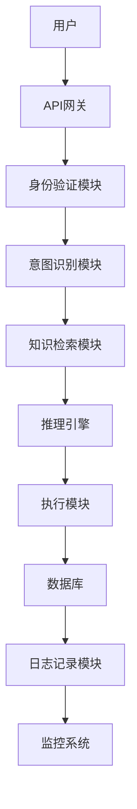

                 


# 企业AI Agent的serverless计算架构

> 关键词：企业AI Agent, serverless计算, 无服务器架构, AI代理, 云计算架构

> 摘要：本文详细探讨了企业AI Agent与serverless计算架构的结合，从概念、原理、算法、系统设计到实际应用，全面解析了企业AI Agent在serverless环境下的实现与优化方案。通过理论分析与实践案例相结合的方式，为企业技术架构师和AI开发者提供了宝贵的参考。

---

# 第一部分: 企业AI Agent的serverless计算架构概述

## 第1章: 企业AI Agent与serverless计算概述

### 1.1 企业AI Agent的背景与现状

#### 1.1.1 AI Agent的定义与特点
AI Agent（人工智能代理）是指能够感知环境、自主决策并执行任务的智能实体。它具备以下特点：
- **自主性**：能够在没有外部干预的情况下自主运行。
- **反应性**：能够实时感知环境变化并做出响应。
- **目标导向**：基于目标或任务驱动执行操作。
- **学习能力**：通过数据和经验不断优化自身行为。

#### 1.1.2 企业AI Agent的应用场景
企业AI Agent的应用场景广泛，主要包括：
1. **智能客服**：通过自然语言处理技术为用户提供7×24小时的智能咨询服务。
2. **自动化运维**：用于系统监控、故障排查和自动修复。
3. **供应链优化**：通过预测需求和优化资源配置，提升供应链效率。
4. **风险管理**：实时监控企业运营中的风险点，提前预警并提出解决方案。

#### 1.1.3 当前企业AI Agent的发展趋势
随着AI技术的成熟和企业数字化转型的推进，AI Agent正在向以下几个方向发展：
1. **智能化**：基于大语言模型（LLM）实现更复杂的认知任务。
2. **实时性**：对实时数据的处理能力要求越来越高。
3. **可扩展性**：需要支持大规模并发请求和复杂场景的处理。

### 1.2 serverless计算的背景与特点

#### 1.2.1 serverless计算的定义
Serverless（无服务器）计算是一种计算范式，通过将计算资源托管在第三方平台上，企业无需自行管理和维护底层基础设施。其核心理念是“按需付费，不用则不付”。

#### 1.2.2 serverless计算的核心优势
- **资源弹性扩展**：根据请求量自动调整资源分配。
- **开发效率高**：开发者只需关注业务逻辑，无需关心服务器部署和维护。
- **成本优化**：按需使用，避免了传统服务器架构的闲置资源浪费。

#### 1.2.3 serverless计算的适用场景
1. **事件驱动的应用**：如API网关触发的后端服务。
2. **短期任务处理**：如批量数据处理或文件转换。
3. **微服务架构**：通过拆分服务实现高效的资源利用。

### 1.3 企业AI Agent与serverless计算的结合

#### 1.3.1 企业AI Agent对serverless计算的需求
- **弹性计算资源**：AI Agent的请求量波动较大，serverless架构能够弹性扩展资源。
- **快速部署**：通过serverless平台可以快速部署AI Agent服务。
- **按需付费**：避免了传统架构下的资源浪费。

#### 1.3.2 serverless计算对AI Agent的支持
- **高效的资源利用**：serverless架构能够根据请求量动态分配计算资源。
- **降低开发成本**：通过serverless平台提供的工具和服务，降低了AI Agent的开发门槛。
- **支持复杂任务**：通过组合多个serverless函数，可以实现复杂的AI Agent逻辑。

#### 1.3.3 两者的结合对企业的影响
1. **提升效率**：通过serverless架构，企业可以快速部署和扩展AI Agent服务。
2. **降低成本**：按需付费的模式避免了传统架构的资源浪费。
3. **加速创新**：企业可以更快地将AI Agent服务推向市场。

### 1.4 本章小结
本章主要介绍了企业AI Agent和serverless计算的基本概念、特点和发展趋势，并探讨了两者结合对企业的影响。通过这一部分的内容，读者可以初步理解企业AI Agent与serverless计算结合的背景和意义。

---

## 第2章: AI Agent的核心概念与原理

### 2.1 AI Agent的定义与组成

#### 2.1.1 AI Agent的基本定义
AI Agent是一种能够感知环境、自主决策并执行任务的智能实体。它可以基于规则、基于知识、基于模型或基于学习的方式实现任务目标。

#### 2.1.2 AI Agent的核心组成要素
1. **感知模块**：负责接收外部输入和内部状态信息。
2. **推理模块**：基于感知信息进行分析和推理。
3. **决策模块**：根据推理结果制定行动计划。
4. **执行模块**：将决策结果转化为具体行动。

#### 2.1.3 AI Agent的分类与特点
- **简单反射型AI Agent**：基于简单的规则进行反应式操作。
- **基于知识的AI Agent**：利用知识库进行推理和决策。
- **基于模型的AI Agent**：通过建模环境和自身状态实现复杂任务。
- **基于学习的AI Agent**：通过机器学习算法不断优化自身行为。

### 2.2 AI Agent的核心算法原理

#### 2.2.1 基于大模型的自然语言处理算法
- **模型训练**：基于大规模数据训练语言模型，如GPT系列。
- **推理过程**：通过解码器生成符合上下文的回复。
- **优化策略**：使用强化学习优化模型的生成效果。

#### 2.2.2 基于强化学习的决策算法
- **状态空间**：定义AI Agent可能遇到的所有状态。
- **动作空间**：定义AI Agent在每个状态下可能执行的动作。
- **奖励函数**：定义AI Agent在执行动作后获得的奖励，用于指导学习方向。

#### 2.2.3 基于图神经网络的知识图谱构建算法
- **知识抽取**：从文本中提取实体和关系。
- **图构建**：将实体和关系构建为图结构。
- **图推理**：通过图遍历算法进行推理和决策。

### 2.3 AI Agent的交互机制

#### 2.3.1 用户意图识别
- **意图分类**：通过自然语言处理技术识别用户的意图。
- **上下文理解**：结合上下文信息进行更准确的意图识别。
- **意图修正**：根据用户反馈调整意图识别结果。

#### 2.3.2 多轮对话管理
- **对话状态跟踪**：记录对话的历史信息。
- **对话策略**：根据当前状态选择合适的回复策略。
- **对话优化**：通过机器学习优化对话流程。

#### 2.3.3 基于反馈的自适应优化
- **反馈收集**：收集用户的反馈信息。
- **模型优化**：根据反馈信息优化AI Agent的行为。
- **持续改进**：通过不断优化提升用户体验。

### 2.4 本章小结
本章详细介绍了AI Agent的核心概念、组成要素、分类特点以及核心算法原理。通过这一部分的内容，读者可以深入理解AI Agent的实现机制和优化方法。

---

## 第3章: serverless计算架构的核心原理

### 3.1 serverless计算的运行机制

#### 3.1.1 函数即服务（FaaS）模型
- **函数定义**：将业务逻辑封装成函数。
- **触发机制**：通过事件触发函数执行。
- **资源分配**：根据请求量动态分配计算资源。

#### 3.1.2 事件驱动的触发机制
- **触发源**：如API调用、数据库变更、消息队列等。
- **触发方式**：通过配置触发规则启动函数。
- **异步执行**：函数执行完成后返回响应。

#### 3.1.3 资源自动扩缩容原理
- **自动扩缩**：根据请求量动态调整资源规模。
- **资源隔离**：每个函数运行在独立的容器中，互不影响。
- **负载均衡**：自动分配请求到不同的节点，避免单点过载。

### 3.2 serverless计算的资源管理

#### 3.2.1 函数的冷启动问题
- **冷启动现象**：首次调用函数时需要重新启动容器，导致延迟较高。
- **优化策略**：通过预热函数或优化容器启动流程减少冷启动时间。

#### 3.2.2 资源分配与调度算法
- **资源分配**：根据函数的执行时间、内存需求等因素动态分配资源。
- **调度策略**：采用轮询调度、最少负载调度等算法实现资源均衡分配。

#### 3.2.3 性能优化策略
- **函数优化**：通过代码优化减少函数执行时间。
- **资源超分配**：在资源充足的情况下适当超分配资源以提高吞吐量。
- **监控与调优**：通过监控系统性能数据进行动态调优。

### 3.3 serverless计算的容错机制

#### 3.3.1 函数调用的可靠性保障
- **重试机制**：在函数执行失败时自动重试。
- **超时处理**：设置合理的超时时间，避免长时间占用资源。
- **日志记录**：记录函数执行过程中的日志信息，便于排查问题。

#### 3.3.2 任务重试与补偿机制
- **重试策略**：根据任务类型选择合适的重试策略。
- **补偿机制**：在任务失败时采取补救措施，确保整体任务目标的达成。

#### 3.3.3 日志与监控方案
- **日志管理**：集中收集和管理函数执行日志。
- **监控系统**：实时监控系统运行状态，及时发现和处理异常。
- **告警机制**：当系统出现异常时，及时通知相关人员进行处理。

### 3.4 本章小结
本章详细介绍了serverless计算架构的核心原理，包括运行机制、资源管理和容错机制等方面。通过这一部分的内容，读者可以深入理解serverless架构的优势和挑战。

---

## 第4章: 企业AI Agent的serverless计算架构

### 4.1 企业AI Agent的场景与需求

#### 4.1.1 场景介绍
企业AI Agent的应用场景广泛，包括智能客服、自动化运维、供应链优化和风险管理等。

#### 4.1.2 需求分析
- **高性能处理**：需要快速响应用户的请求。
- **弹性扩展能力**：应对突发的请求量增长。
- **高可用性**：确保服务的稳定性和可靠性。

### 4.2 系统功能设计

#### 4.2.1 领域模型设计
- **用户交互模块**：负责与用户进行交互。
- **知识库模块**：存储和管理相关知识。
- **推理引擎**：负责逻辑推理和决策。
- **执行模块**：将决策结果转化为具体操作。

#### 4.2.2 系统功能模块
- **用户身份验证**：验证用户身份，确保安全性。
- **意图识别**：识别用户的意图和需求。
- **知识检索**：从知识库中检索相关信息。
- **决策推理**：基于检索到的信息进行推理和决策。
- **执行操作**：根据决策结果执行具体操作。

### 4.3 系统架构设计

#### 4.3.1 架构设计思路
- **模块化设计**：将系统划分为多个功能模块，便于管理和维护。
- **分布式架构**：通过分布式部署提升系统的可用性和扩展性。
- **高可用性设计**：通过负载均衡、容灾备份等技术确保系统的高可用性。

#### 4.3.2 架构图


#### 4.3.3 接口设计
- **API接口**：定义RESTful API接口，便于与其他系统集成。
- **消息队列**：通过消息队列实现异步通信，提高系统的吞吐量。

### 4.4 项目实战

#### 4.4.1 环境安装
- **安装serverless平台**：选择合适的serverless平台，如AWS Lambda、Google Cloud Functions等。
- **安装开发工具**：安装必要的开发工具，如IDE、命令行工具等。
- **安装依赖库**：安装所需的Python库，如boto3、requests等。

#### 4.4.2 核心功能实现
- **函数编写**：编写实现AI Agent功能的serverless函数。
- **配置触发条件**：配置函数的触发条件，如API调用、消息队列触发等。
- **测试与调试**：通过测试用例验证函数的正确性，调试过程中发现并解决问题。

#### 4.4.3 代码实现
```python
import boto3

def handle(event, context):
    # 解析请求参数
    params = event['queryStringParameters']
    user_id = params['user_id']
    
    # 查询用户信息
    dynamodb = boto3.resource('dynamodb')
    table = dynamodb.Table('UserTable')
    response = table.get_item(Key={'user_id': user_id})
    
    return {
        'statusCode': 200,
        'body': response['Item']
    }
```

#### 4.4.4 案例分析
通过实际案例分析，验证企业AI Agent在serverless架构下的实现效果，总结经验和教训。

### 4.5 本章小结
本章详细介绍了企业AI Agent的场景与需求，系统功能设计，系统架构设计和项目实战。通过这一部分的内容，读者可以掌握企业AI Agent在serverless架构下的实现方法和注意事项。

---

## 第5章: 最佳实践与注意事项

### 5.1 最佳实践

#### 5.1.1 函数设计
- **函数粒度**：将功能模块化，每个函数只负责单一任务。
- **无副作用**：确保函数执行不会产生副作用，保证系统的稳定性。
- **超时设置**：合理设置函数的超时时间，避免长时间占用资源。

#### 5.1.2 资源优化
- **资源分配**：根据函数的需求合理分配资源，避免资源浪费。
- **冷启动优化**：通过预热函数或优化启动流程减少冷启动时间。
- **日志管理**：合理配置日志收集和存储策略，便于排查问题。

#### 5.1.3 安全性
- **权限管理**：合理配置函数的权限，确保系统的安全性。
- **数据加密**：对敏感数据进行加密处理，防止数据泄露。
- **访问控制**：通过访问控制列表（ACL）限制函数的访问权限。

### 5.2 注意事项

#### 5.2.1 函数执行时间
- **函数执行时间限制**：不同平台对函数的执行时间有不同的限制，需注意不要超过限制。
- **函数执行时间优化**：通过代码优化和资源分配策略减少函数的执行时间。

#### 5.2.2 成本控制
- **资源使用成本**：合理分配资源，避免资源浪费，降低运营成本。
- **成本监控**：通过监控工具实时监控资源使用情况，及时发现和处理异常。

#### 5.2.3 系统可用性
- **高可用性设计**：通过负载均衡、容灾备份等技术确保系统的高可用性。
- **故障容错**：设计合理的容错机制，确保系统在出现故障时仍能正常运行。

### 5.3 本章小结
本章总结了企业AI Agent在serverless架构下的最佳实践和注意事项，帮助读者更好地进行系统设计和优化。

---

## 第6章: 未来展望与总结

### 6.1 未来展望

#### 6.1.1 技术发展趋势
- **AI模型优化**：通过模型压缩、知识蒸馏等技术优化AI模型的性能。
- **serverless架构升级**：通过技术创新提升serverless架构的性能和扩展性。
- **多云部署**：实现多云部署，提升系统的可用性和容灾能力。

#### 6.1.2 应用场景扩展
- **智能化客服**：通过AI Agent实现更智能的客服服务。
- **智能运维**：通过AI Agent实现更高效的运维管理。
- **智能供应链**：通过AI Agent优化供应链的各个环节。

### 6.2 总结

#### 6.2.1 全文总结
本文详细探讨了企业AI Agent与serverless计算架构的结合，从概念、原理、算法、系统设计到实际应用，全面解析了企业AI Agent在serverless环境下的实现与优化方案。

#### 6.2.2 未来展望
随着AI技术和serverless计算的不断发展，企业AI Agent在serverless架构下的应用将更加广泛和深入。通过技术创新和实践积累，企业可以更好地利用AI Agent提升自身的竞争力。

---

## 作者：AI天才研究院/AI Genius Institute & 禅与计算机程序设计艺术 /Zen And The Art of Computer Programming

---

以上是《企业AI Agent的serverless计算架构》的完整目录和部分内容概览。通过本文，读者可以系统地了解企业AI Agent与serverless计算架构的结合，掌握相关的理论知识和实践技能。

