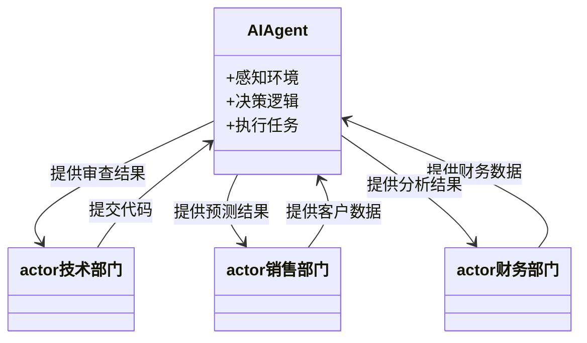
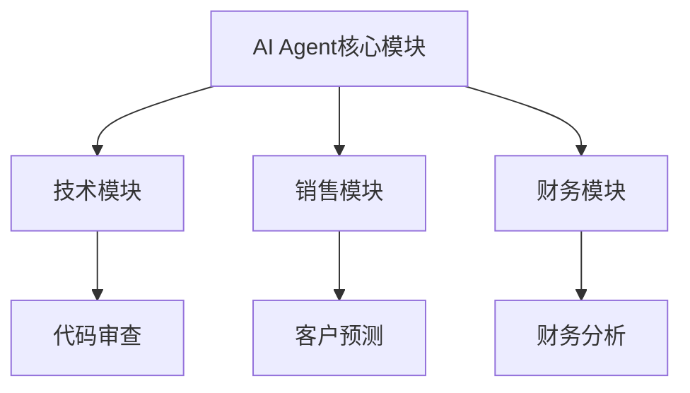
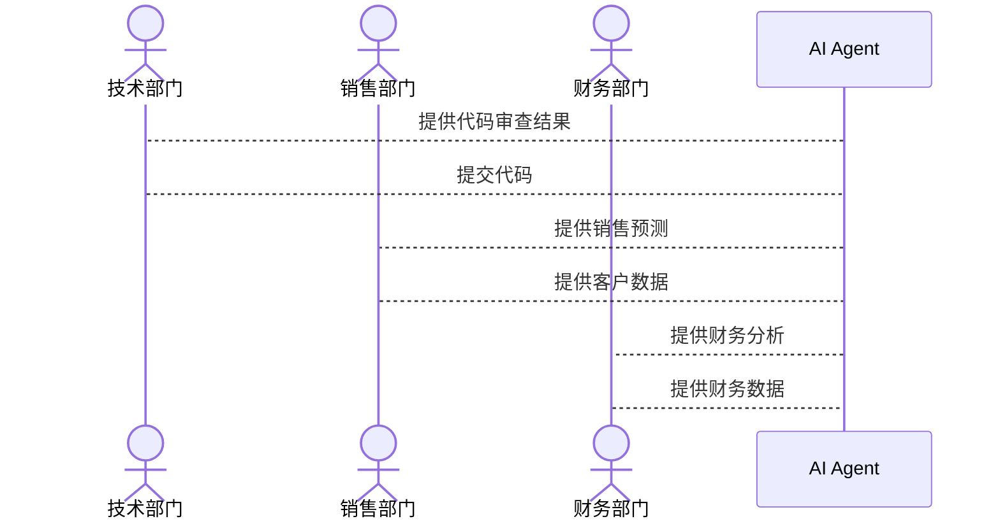

                 


# 企业AI Agent的个性化定制：适应不同部门需求

> 关键词：企业AI Agent，个性化定制，部门需求，人工智能，系统架构，算法原理

> 摘要：随着人工智能技术的迅速发展，企业AI Agent在各个部门中的应用日益广泛。本文详细探讨了企业AI Agent的个性化定制方法，分析了如何根据不同部门的需求设计和实现定制化的AI Agent系统。文章从背景、概念、算法、系统架构到项目实战，全面解析了企业AI Agent的核心原理和应用实践。

---

## 第一部分：企业AI Agent的背景与基础

### 第1章：企业AI Agent的背景与概念

#### 1.1 问题背景与需求分析

企业智能化转型已成为当前的趋势，AI Agent作为人工智能技术的核心应用之一，正在逐步渗透到企业的各个部门。然而，不同部门的需求差异较大，例如：

- **技术部门**：需要快速处理技术问题，自动化代码审查和错误检测。
- **销售部门**：需要实时客户行为分析，预测销售趋势。
- **财务部门**：需要自动化的财务数据分析，风险预警。

这些差异性需求使得通用的AI Agent难以满足企业各部门的需求，因此个性化定制成为必要。

#### 1.2 核心概念与定义

AI Agent是一种能够感知环境、自主决策并执行任务的智能体。其核心特征包括：

- **智能性**：能够理解输入数据并做出决策。
- **自主性**：无需人工干预，自动执行任务。
- **可定制性**：根据需求调整行为和决策逻辑。

个性化定制的核心在于根据部门需求调整AI Agent的行为模式和功能模块。

#### 1.3 企业AI Agent的演进历程

从传统系统到智能化系统的演变过程中，AI Agent逐渐取代了基于规则的传统系统。当前，AI Agent的应用已经从单一功能扩展到多场景适应，未来的发展趋势是实现动态优化和实时响应。

---

## 第二部分：企业AI Agent的核心概念与原理

### 第2章：AI Agent的核心概念与原理

#### 2.1 核心概念与属性

AI Agent的智能性和自主性使其能够适应复杂环境，而可定制性则满足了不同部门的需求。例如，技术部门的AI Agent可以集成代码审查功能，而销售部门的AI Agent则专注于客户行为分析。

#### 2.2 AI Agent与传统系统的对比

- **从规则驱动到数据驱动**：传统系统基于固定规则，而AI Agent通过数据学习动态调整行为。
- **从单一功能到多场景适应**：AI Agent能够同时处理多种任务，适应不同部门的需求。
- **从静态架构到动态优化**：AI Agent通过反馈机制不断优化性能。

#### 2.3 企业AI Agent的系统架构

- **分层架构设计**：包括感知层、决策层和执行层。
- **模块化设计原则**：功能模块化设计，便于根据不同部门需求进行扩展。

---

## 第三部分：企业AI Agent的算法原理与数学模型

### 第3章：AI Agent的核心算法与实现

#### 3.1 强化学习与决策树

- **强化学习的基本原理**：通过奖励机制优化决策策略。
- **决策树的构建与优化**：通过数据训练构建决策树，提高决策效率。

以下是强化学习的基本算法流程图：

```mermaid
graph TD
A[开始]
B[初始化状态]
C[选择动作]
D[执行动作，观察结果]
E[更新策略]
F[判断是否达到目标]
G[结束]
A->B
B->C
C->D
D->E
E->F
F->G
F->C
```

决策树的构建过程如下：

1. 选择特征，划分数据集。
2. 递归分割，直到叶子节点。
3. 剪枝优化，避免过拟合。

---

## 第四部分：系统分析与架构设计方案

### 第4章：系统分析与架构设计

#### 4.1 项目介绍

以某企业为例，设计一个适应不同部门需求的AI Agent系统。

#### 4.2 系统功能设计

- **领域模型**：技术部门、销售部门、财务部门的需求分析。



- **系统架构设计**：模块化架构，支持不同部门的功能扩展。



#### 4.3 系统接口设计

- **技术部门接口**：代码审查接口。
- **销售部门接口**：客户数据接口。
- **财务部门接口**：财务数据接口。

#### 4.4 系统交互设计



---

## 第五部分：项目实战

### 第5章：项目实战与代码实现

#### 5.1 环境安装

安装Python和必要的库，如TensorFlow、Scikit-learn等。

#### 5.2 核心实现

以下是决策树算法的代码实现：

```python
from sklearn.tree import DecisionTreeClassifier
import pandas as pd

# 数据加载
data = pd.read_csv('data.csv')

# 特征提取
X = data.drop('target', axis=1)
y = data['target']

# 模型训练
model = DecisionTreeClassifier()
model.fit(X, y)

# 预测
predictions = model.predict(X)
```

---

## 第六部分：总结与展望

### 第6章：总结与展望

企业AI Agent的个性化定制是实现企业智能化转型的关键。通过分析不同部门的需求，设计适应性强的AI Agent系统，能够显著提升企业的效率和竞争力。

---

## 最佳实践 Tips

- **小结**：本文详细讲解了企业AI Agent的个性化定制方法，从背景到实现，全面分析了其在企业中的应用。
- **注意事项**：在实际应用中，需根据部门需求动态调整AI Agent的行为逻辑。
- **拓展阅读**：推荐阅读相关书籍和论文，深入了解强化学习和决策树算法。

---

## 作者信息

作者：AI天才研究院/AI Genius Institute & 禅与计算机程序设计艺术/Zen And The Art of Computer Programming

---

通过以上步骤，我们可以系统地分析和实现企业AI Agent的个性化定制，为不同部门的需求提供高效的解决方案。

