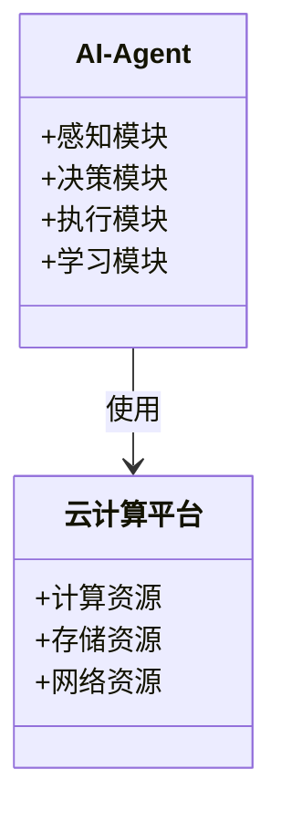

                 


# 《企业AI Agent的云端部署与管理》

---

## 关键词：
- 企业AI Agent，云端部署，云计算，AI模型，容器化技术，系统架构设计，高可用性

---

## 摘要：
本文深入探讨企业AI Agent的云端部署与管理，从基本概念到实际应用，详细分析其核心技术和管理策略。通过系统架构设计和项目实战，为读者提供全面的技术指导。

---

# 第一部分: 企业AI Agent的背景与核心概念

## 第1章: AI Agent的基本概念与应用场景

### 1.1 什么是AI Agent
AI Agent（智能代理）是一种能够感知环境、自主决策并执行任务的智能体。它具备主动性、反应性、社交能力、学习能力和协作性等特点。

#### AI Agent与传统AI的区别
| 特性 | 传统AI | AI Agent |
|------|--------|----------|
| 主动性 | 被动响应输入 | 主动执行任务 |
| 感知能力 | 无实时反馈 | 具备实时反馈机制 |
| 环境交互 | 不与环境交互 | 能够与环境交互 |

### 1.2 AI Agent的应用场景
#### 1.2.1 企业内部流程自动化
AI Agent可以自动处理订单、库存管理和客户关系管理，提高效率。

#### 1.2.2 客户服务与支持
通过自然语言处理技术，AI Agent可以提供24/7的客户服务，解决常见问题。

#### 1.2.3 数据分析与决策支持
AI Agent能够实时分析数据，提供洞察和决策支持，帮助企业在复杂环境中做出明智决策。

---

## 第2章: 企业AI Agent的云端部署背景

### 2.1 云计算与AI Agent的结合
云计算提供弹性计算资源，支持AI Agent的动态扩展和高可用性。容器化技术（如Docker和Kubernetes）简化了部署和管理过程。

#### 云计算的优势
- **弹性扩展**：根据负载自动调整资源。
- **高可用性**：通过负载均衡和容灾设计保证服务可用。
- **成本优化**：按需付费，避免资源浪费。

### 2.2 企业AI Agent云端部署的必要性
- **资源利用效率**：云端资源按需分配，避免本地部署的资源浪费。
- **扩展性**：应对业务增长，快速扩展计算能力。
- **高可用性**：通过冗余设计确保服务不中断。

### 2.3 挑战与解决方案
#### 挑战
- **资源管理复杂性**：需要精细的资源分配策略。
- **安全性与隐私**：数据在云端存储和传输需加密处理。
- **性能优化**：需优化AI模型和部署策略以降低成本。

#### 解决方案
- **容器化技术**：使用Docker和Kubernetes进行容器编排，提高部署效率。
- **模型压缩与优化**：采用模型剪枝、量化等技术降低计算成本。
- **安全措施**：实施数据加密、访问控制和身份认证。

---

## 第3章: AI Agent的核心概念与原理

### 3.1 组成与功能模块
AI Agent由感知模块、决策模块、执行模块和学习模块组成。

#### 模块功能对比
| 模块 | 功能 | 示例 |
|------|------|------|
| 感知模块 | 数据采集与处理 | 从数据库中读取订单信息 |
| 决策模块 | 策略制定与选择 | 选择最优的物流路线 |
| 执行模块 | 行动执行 | 下达订单到物流系统 |
| 学习模块 | 模型优化 | 根据反馈更新预测模型 |

### 3.2 工作原理
AI Agent通过感知环境、处理数据、制定决策并执行行动，形成一个闭环系统。

#### 数据处理流程
1. 感知环境，采集数据。
2. 数据预处理，特征提取。
3. 输入模型进行预测或决策。
4. 根据结果执行相应动作。
5. 反馈机制优化模型。

### 3.3 核心算法与技术
#### 算法原理
- **机器学习**：如支持向量机（SVM）、随机森林（Random Forest）用于分类和预测。
- **自然语言处理**：如BERT模型用于文本理解和生成。
- **强化学习**：如Q-learning用于决策优化。

#### 算法对比
| 技术 | 优点 | 缺点 |
|------|------|------|
| 机器学习 | 稳定性高 | 需大量数据 |
| 强化学习 | 适应动态环境 | 需大量试验 |

---

## 第4章: 企业AI Agent的云端部署基础

### 4.1 云计算平台的选择
选择公有云（如AWS、Azure）、私有云或混合云，需考虑成本、性能和安全性。

#### 选择评估
| 参数 | 公有云 | 私有云 | 混合云 |
|------|--------|--------|--------|
| 成本 | 按需付费 | 高资本支出 | 综合成本 |

### 4.2 容器化技术的应用
使用Docker容器打包AI Agent，通过Kubernetes进行编排，确保高效和可靠。

#### Docker与Kubernetes的优势
- **隔离性**：每个容器独立运行，避免环境冲突。
- **可扩展性**：通过滚动更新和自愈机制确保服务可用。

### 4.3 AI模型的训练与推理
- **训练**：在云端GPU集群上训练大模型，优化模型参数。
- **推理**：使用推理优化技术（如模型剪枝）降低计算成本。

---

## 第5章: 企业AI Agent的系统架构设计

### 5.1 系统功能设计
使用领域模型类图展示系统模块关系，明确各模块职责。

#### 领域模型类图


### 5.2 系统架构设计
采用分层架构，明确各层功能模块，使用Mermaid图展示系统架构。

#### 系统架构图


---

## 第6章: 项目实战

### 6.1 环境配置
- 安装Docker和Kubernetes。
- 配置云平台API密钥。

### 6.2 核心代码实现
#### AI Agent的感知模块代码示例
```python
def感知环境():
    数据 = 从数据库获取订单信息()
    返回 数据
```

### 6.3 系统优化与部署
- 使用容器化部署确保快速迭代和回滚。
- 实施监控和日志管理，及时发现和解决问题。

---

## 第7章: 总结与展望

### 7.1 总结
企业AI Agent的云端部署与管理涉及多方面的技术和策略，通过合理的系统架构设计和最佳实践，可以充分发挥其潜力。

### 7.2 展望
未来，AI Agent将更加智能化和自主化，支持多云部署和更复杂的AI治理框架。

---

## 作者：
作者：AI天才研究院 & 禅与计算机程序设计艺术

---

这篇文章详细探讨了企业AI Agent的云端部署与管理，从理论到实践，为读者提供了全面的技术指导。

