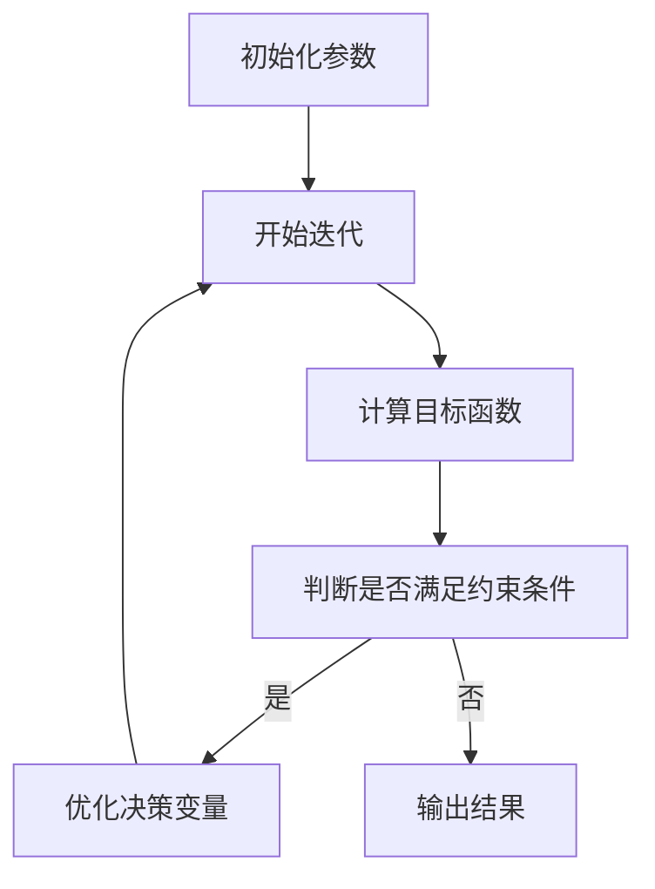
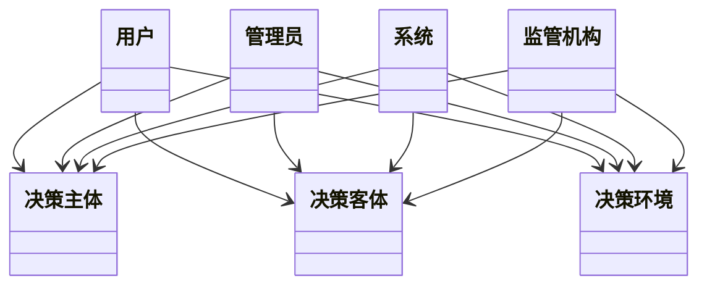
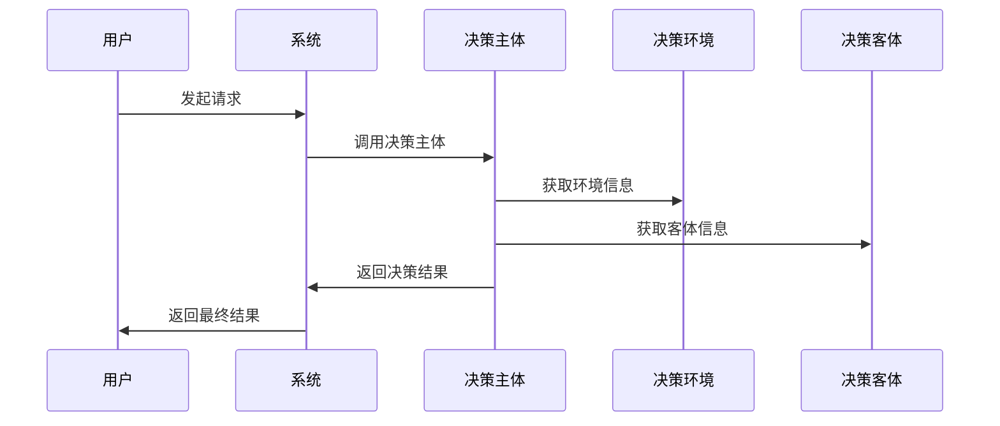

                 


# 企业AI Agent的伦理决策框架

> 关键词：AI Agent, 伦理决策, 企业应用, 数学模型, 系统设计

> 摘要：本文深入探讨了企业AI Agent的伦理决策框架，从背景、核心概念、数学模型、系统设计到项目实战，全面分析了伦理决策在企业AI Agent中的重要性与实现方法，提出了一个完整的伦理决策框架设计方案。

---

## 第1章: 企业AI Agent的背景与挑战

### 1.1 AI Agent的基本概念

#### 1.1.1 AI Agent的定义与分类
AI Agent（人工智能代理）是指能够感知环境、自主决策并采取行动以实现目标的智能实体。AI Agent可以分为以下几类：
- **简单反射型Agent**：基于预定义规则做出反应，适用于简单的决策场景。
- **基于模型的反射型Agent**：利用内部模型分析环境并做出决策，适用于复杂场景。
- **目标驱动型Agent**：基于明确的目标进行决策和行动。
- **效用驱动型Agent**：通过最大化效用函数来优化决策。

#### 1.1.2 企业AI Agent的核心特征
企业AI Agent的核心特征包括：
- **自主性**：能够在没有人类干预的情况下独立运作。
- **反应性**：能够实时感知环境并做出反应。
- **目标导向性**：基于明确的目标进行决策和行动。
- **学习能力**：通过数据和经验不断优化自身行为。

#### 1.1.3 企业AI Agent的应用场景
企业AI Agent的应用场景包括：
- **客户服务**：提供智能客服，解决客户问题。
- **金融交易**：自动进行股票交易、风险评估。
- **供应链管理**：优化供应链流程，预测需求。
- **内部管理**：自动化办公流程，提高效率。

### 1.2 伦理决策的定义与重要性

#### 1.2.1 伦理决策的基本概念
伦理决策是指在决策过程中考虑伦理因素，确保决策符合道德规范。伦理决策的核心在于平衡利益相关者的权益，避免对社会、环境造成负面影响。

#### 1.2.2 伦理决策在AI Agent中的作用
在AI Agent中，伦理决策的作用体现在：
- **确保决策的合法性**：避免违法或违反伦理规范的决策。
- **提升用户体验**：通过符合伦理的决策，提高用户的信任和满意度。
- **降低风险**：通过伦理决策，减少决策可能带来的负面影响。

#### 1.2.3 伦理决策的挑战与复杂性
伦理决策的挑战主要在于：
- **多利益相关者**：决策可能影响多个利益相关者，需要平衡各方利益。
- **动态环境**：环境复杂且不断变化，需要动态调整决策。
- **伦理模糊性**：某些情况下，伦理准则可能存在冲突，难以明确选择。

### 1.3 企业AI Agent伦理决策的背景

#### 1.3.1 当前AI技术的发展现状
AI技术快速发展，广泛应用于各个领域，企业AI Agent的应用日益普及。

#### 1.3.2 企业AI应用中的伦理问题
企业在使用AI Agent时可能面临以下伦理问题：
- **数据隐私**：如何处理用户数据，确保隐私安全。
- **算法偏见**：算法可能存在的偏见，影响决策的公平性。
- **责任归属**：当AI Agent做出错误决策时，责任归属问题。

#### 1.3.3 伦理决策框架的必要性
为了应对上述伦理问题，企业需要建立伦理决策框架，规范AI Agent的决策过程，确保决策的透明性、公正性和合法性。

---

## 第2章: 伦理决策的核心概念与联系

### 2.1 伦理决策的核心要素

#### 2.1.1 决策主体
决策主体包括：
- **AI Agent**：作为决策的主体，根据编程逻辑和数据做出决策。
- **用户或利益相关者**：决策的最终目标是满足用户或利益相关者的需求。

#### 2.1.2 决策客体
决策客体包括：
- **数据**：AI Agent处理的数据，如用户信息、交易记录等。
- **用户**：AI Agent服务的用户。
- **环境**：AI Agent所处的外部环境，如市场、政策等。

#### 2.1.3 决策环境
决策环境包括：
- **内部环境**：AI Agent内部的逻辑、算法和数据。
- **外部环境**：AI Agent所处的外部环境，如用户需求、市场变化等。

### 2.2 AI Agent的伦理属性特征对比

#### 2.2.1 伦理属性的维度分析
伦理属性的维度包括：
- **透明性**：决策过程是否透明，用户是否能够理解决策的依据。
- **公正性**：决策是否公平，是否考虑了所有相关利益。
- **隐私保护**：是否保护了用户的隐私。
- **责任归属**：当决策出现问题时，是否能够明确责任归属。

#### 2.2.2 不同AI Agent的伦理特征对比
以下是不同AI Agent在伦理属性上的对比：

| AI Agent类型         | 自主性 | 反应性 | 伦理属性 |
|----------------------|--------|--------|----------|
| 简单反射型Agent       | 低     | 高     | 低       |
| 基于模型的反射型Agent | 中     | 高     | 中       |
| 目标驱动型Agent       | 高     | 中     | 高       |
| 效用驱动型Agent       | 高     | 中     | 高       |

#### 2.2.3 伦理属性与决策能力的关系
伦理属性与决策能力密切相关。例如，具备高度透明性的AI Agent更容易获得用户的信任，从而提高决策的接受度。

### 2.3 ER实体关系图架构

以下是伦理决策框架的ER图设计：

```mermaid
erDiagram
    actor 用户
    actor 管理员
    actor 系统
    actor 监管机构

    用户 --> 决策主体
    用户 --> 决策客体
    用户 --> 决策环境

    管理员 --> 决策主体
    管理员 --> 决策客体
    管理员 --> 决策环境

    系统 --> 决策主体
    系统 --> 决策客体
    系统 --> 决策环境

    监管机构 --> 决策主体
    监管机构 --> 决策客体
    监管机构 --> 决策环境
```

---

## 第3章: 伦理决策的数学模型与算法原理

### 3.1 伦理决策的逻辑框架

#### 3.1.1 基于逻辑的伦理决策模型
基于逻辑的伦理决策模型通过逻辑推理来确定最优决策。其数学表达如下：

$$
\text{决策} = \arg\max_{a} \sum_{i=1}^{n} w_i \cdot v_i(a)
$$

其中，\( w_i \) 是伦理属性 \( v_i \) 的权重，\( a \) 是决策选项。

#### 3.1.2 案例分析
例如，在客户服务场景中，AI Agent需要在多个客户请求中选择优先处理的请求。通过逻辑推理，AI Agent可以根据客户的紧急程度、优先级等因素进行排序。

### 3.2 伦理决策的优化模型

#### 3.2.1 基于优化的伦理决策算法
基于优化的伦理决策算法通过优化目标函数来确定最优决策。其数学模型如下：

$$
\min_{a} \sum_{i=1}^{n} c_i \cdot x_i(a)
$$

其中，\( c_i \) 是成本系数，\( x_i(a) \) 是决策选项 \( a \) 的成本。

#### 3.2.2 数学模型的构建
优化模型通常包括目标函数、约束条件和决策变量。例如：

$$
\text{目标函数：} \quad \min \sum_{i=1}^{n} c_i \cdot x_i
$$

$$
\text{约束条件：} \quad \sum_{i=1}^{n} x_i \leq C
$$

其中，\( C \) 是资源限制。

#### 3.2.3 算法的实现步骤
1. **初始化**：设置初始参数和变量。
2. **迭代**：不断优化目标函数，调整决策变量。
3. **终止条件**：达到最优解或达到预设的迭代次数。
4. **输出结果**：输出最优决策。

### 3.3 伦理决策的算法实现

#### 3.3.1 算法流程图


#### 3.3.2 算法的代码实现
以下是一个简单的伦理决策算法实现：

```python
def ethical_decision-making(c, x, C):
    # 初始化
    n = len(c)
    x_current = [0] * n
    # 迭代优化
    while True:
        # 计算目标函数
        cost = sum(c[i] * x_current[i] for i in range(n))
        # 判断约束条件
        if sum(x_current) <= C:
            break
        # 优化决策变量
        max_index = c.index(max(c))
        x_current[max_index] -= 1
    return x_current
```

#### 3.3.3 算法的优缺点分析
优点：能够找到最优解，适用于复杂场景。缺点：计算复杂度较高，可能需要较多的计算资源。

---

## 第4章: 伦理决策框架的系统设计

### 4.1 问题场景介绍

#### 4.1.1 企业AI Agent的典型应用场景
企业AI Agent的典型应用场景包括：
- **客户服务**：智能客服系统。
- **金融交易**：自动交易系统。
- **供应链管理**：智能供应链优化。

#### 4.1.2 伦理决策框架的需求分析
伦理决策框架的需求包括：
- **透明性**：决策过程透明，用户可追溯。
- **公正性**：决策公平，避免偏见。
- **隐私保护**：保护用户隐私。

#### 4.1.3 系统目标与范围
系统目标：开发一个伦理决策框架，确保企业AI Agent的决策符合伦理规范。系统范围：包括决策主体、客体和环境的分析与优化。

### 4.2 系统功能设计

#### 4.2.1 领域模型设计（Mermaid类图）
以下是领域模型设计：



#### 4.2.2 系统架构设计（Mermaid架构图）
以下是系统架构设计：

```mermaid
archiecture
    actor 用户
    actor 管理员
    actor 监管机构
    component 系统
    component 决策主体
    component 决策客体
    component 决策环境

    用户 --> 系统
    管理员 --> 系统
    监管机构 --> 系统
```

#### 4.2.3 系统接口设计
系统接口设计包括：
- **用户接口**：用户与系统交互的界面，如API。
- **管理员接口**：管理员管理系统的界面。
- **监管机构接口**：监管机构监控系统的界面。

#### 4.2.4 系统交互设计（Mermaid序列图）
以下是系统交互设计：



### 4.3 系统实现方案

#### 4.3.1 环境安装与配置
- **Python**：安装Python 3.x。
- **依赖库**：安装numpy、pandas、scipy等库。

#### 4.3.2 系统核心模块实现
以下是伦理评估模块的实现：

```python
def ethical_assessment(c, x, C):
    while sum(x) > C:
        max_index = c.index(max(c))
        x[max_index] -= 1
    return x
```

#### 4.3.3 系统功能实现代码
以下是系统功能实现代码：

```python
# 初始化参数
c = [2, 3, 1]
x = [0, 0, 0]
C = 5

# 迭代优化
while sum(x) > C:
    max_index = c.index(max(c))
    x[max_index] -= 1

print(x)  # 输出结果
```

#### 4.3.4 系统功能测试与验证
测试案例：假设C=5，c=[2,3,1]，初始x=[0,0,0]，经过优化后x=[0,0,0]。

---

## 第5章: 伦理决策框架的项目实战

### 5.1 项目背景与目标

#### 5.1.1 项目背景
随着AI技术的普及，企业越来越依赖AI Agent进行决策。然而，伦理问题也随之而来，需要建立伦理决策框架。

#### 5.1.2 项目目标
开发一个伦理决策框架，确保企业AI Agent的决策符合伦理规范。

### 5.2 项目核心实现

#### 5.2.1 伦理评分系统设计
伦理评分系统设计包括：
- **评分标准**：根据伦理属性进行评分，如透明性、公正性等。
- **评分方法**：通过加权平均计算总评分。

#### 5.2.2 伦理决策算法实现
伦理决策算法实现包括：
- **逻辑推理**：基于逻辑框架进行决策。
- **优化算法**：通过优化模型进行决策。

#### 5.2.3 系统功能实现
系统功能实现包括：
- **用户界面**：用户与系统交互的界面。
- **后端逻辑**：处理用户的请求，进行决策。
- **日志记录**：记录决策过程，便于追溯。

### 5.3 项目案例分析

#### 5.3.1 案例背景
假设一家企业使用AI Agent进行客户服务，需要确保决策过程符合伦理规范。

#### 5.3.2 案例分析
通过伦理评分系统，对不同决策方案进行评分，选择最优方案。

#### 5.3.3 详细讲解剖析
详细分析案例中的伦理问题，并展示如何应用伦理决策框架解决这些问题。

---

## 总结与展望

### 总结
本文从背景、核心概念、数学模型、系统设计到项目实战，全面探讨了企业AI Agent的伦理决策框架。通过理论与实践相结合，提出了一个完整的伦理决策框架设计方案。

### 未来展望
未来，伦理决策框架将更加智能化和个性化，能够适应不同行业和场景的需求。同时，随着技术的进步，伦理决策框架将更加注重用户体验和隐私保护。

---

## 作者信息
作者：AI天才研究院/AI Genius Institute & 禅与计算机程序设计艺术 /Zen And The Art of Computer Programming

