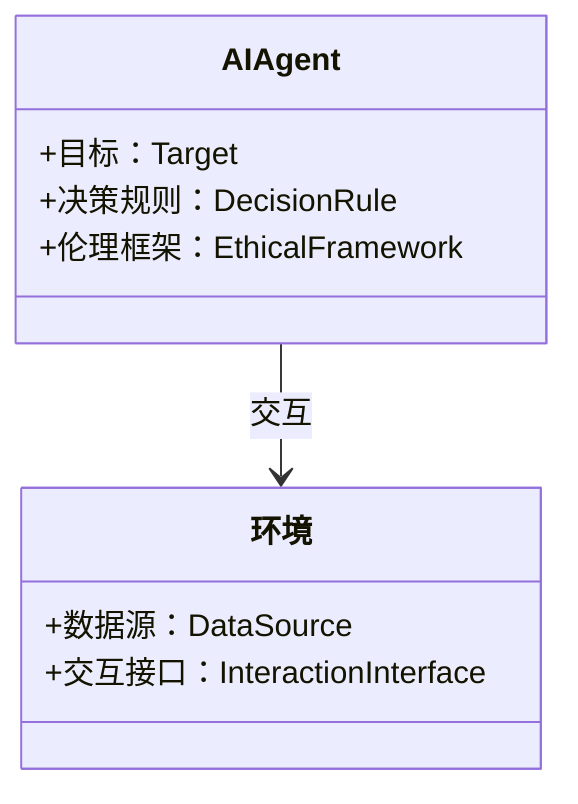
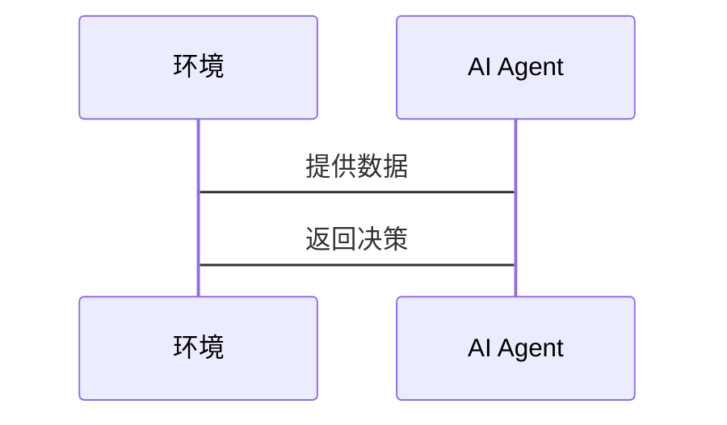

                 


# 企业AI Agent的伦理设计与道德决策框架

## 关键词：企业AI Agent，伦理设计，道德决策，人工智能，决策算法，系统架构

## 摘要：本文探讨了企业在应用AI Agent时面临的伦理设计和道德决策问题。通过分析核心概念、算法原理、系统架构等，提出了构建企业AI Agent的伦理框架和道德决策模型的方法，为技术实现和实际应用提供了指导。

---

# 第1章: 企业AI Agent的背景与问题背景

## 1.1 人工智能代理的基本概念

### 1.1.1 人工智能代理的定义与分类

人工智能代理（AI Agent）是一种智能实体，能够感知环境、自主决策并执行任务。根据功能可分为两类：**反应式代理**（基于当前感知做出反应）和**规划式代理**（基于目标和计划行动）。

### 1.1.2 企业AI Agent的应用场景

在企业中，AI Agent常用于自动化决策、客户互动、风险管理等领域。例如，智能客服、供应链优化、 fraud detection等。

### 1.1.3 企业AI Agent与传统AI的区别

企业AI Agent具备更强的自主性和目标导向性，能够处理复杂情境中的伦理问题。

## 1.2 伦理问题的背景与问题描述

### 1.2.1 AI Agent引发的伦理问题概述

AI Agent的决策可能引发隐私、责任归属、公平性等伦理问题。例如，在金融领域，AI Agent的错误决策可能导致经济损失。

### 1.2.2 企业AI Agent的伦理挑战

- **隐私问题**：处理敏感数据时可能泄露用户隐私。
- **责任问题**：当AI Agent引发负面结果时，责任归属不明确。
- **公平性问题**：算法可能存在偏见，导致不公平的结果。

### 1.2.3 问题的边界与外延

伦理设计需考虑AI Agent的行为、决策过程和结果对社会的影响。

## 1.3 伦理设计的核心要素与概念结构

### 1.3.1 伦理框架的核心要素

包括**目标设定**、**道德原则**、**决策规则**和**结果评估**四个部分。

### 1.3.2 概念结构与核心要素的关联

伦理框架中的目标设定通过道德原则转化为具体的决策规则，最终通过结果评估来验证。

### 1.3.3 伦理设计的系统性特征

伦理设计是动态、迭代的过程，需结合企业的具体情境。

---

# 第2章: 伦理设计的核心概念与联系

## 2.1 伦理框架的核心原理

### 2.1.1 基于伦理框架的决策原理

AI Agent根据预定义的伦理框架进行决策，确保符合伦理标准。

### 2.1.2 道德原则的数学建模

将道德原则转化为数学公式，例如，使用加权和的方法。

### 2.1.3 伦理框架的可扩展性

伦理框架应具备灵活性，以适应不同的应用场景。

## 2.2 核心概念的属性特征对比

### 2.2.1 伦理框架的属性特征对比表

| 属性 | 描述 |
|------|------|
| 灵活性 | 可调整以适应不同场景 |
| 完整性 | 是否包含所有必要的伦理维度 |

### 2.2.2 道德原则的属性特征对比表

| 原则 | 描述 |
|------|------|
| 公平性 | 确保决策不偏袒任何一方 |

### 2.2.3 伦理设计的核心要素对比表

| 要素 | 描述 |
|------|------|
| 目标设定 | 明确AI Agent的任务目标 |

## 2.3 ER实体关系图架构

ER实体关系图展示了伦理框架中各实体及其关系，帮助我们理解系统的结构。

---

# 第3章: 伦理决策算法的原理与实现

## 3.1 伦理决策算法的原理

### 3.1.1 基于伦理框架的决策树算法

决策树是一种常用的伦理决策算法，能够处理复杂的伦理问题。

### 3.1.2 道德评分模型的构建

通过评分模型量化决策的伦理风险。

### 3.1.3 伦理决策的数学模型

数学模型将伦理原则转化为可计算的形式。

## 3.2 算法实现的详细步骤

### 3.2.1 决策树的构建过程

1. 收集数据。
2. 确定决策节点。
3. 构建决策树。

### 3.2.2 道德评分的计算方法

使用加权和的方法计算道德评分。

### 3.2.3 伦理决策的优化策略

通过反馈机制优化决策模型。

## 3.3 算法的数学模型与公式

### 3.3.1 决策树的数学模型

$$
\text{决策树的构建公式}
$$

### 3.3.2 道德评分的计算公式

$$
\text{道德评分} = \sum_{i=1}^{n} w_i \cdot x_i
$$

---

# 第4章: 系统分析与架构设计方案

## 4.1 问题场景介绍

### 4.1.1 问题描述

企业AI Agent在决策过程中可能面临伦理问题。

### 4.1.2 项目介绍

本项目旨在构建企业AI Agent的伦理决策框架。

## 4.2 系统功能设计

### 4.2.1 领域模型mermaid类图



## 4.3 系统架构设计mermaid架构图


## 4.4 系统接口设计

系统接口包括输入接口和输出接口，确保与其他系统的兼容性。

## 4.5 系统交互mermaid序列图



---

# 第5章: 项目实战

## 5.1 环境安装

### 5.1.1 环境配置

安装必要的库，例如Python的scikit-learn和mermaid工具。

## 5.2 系统核心实现源代码

### 5.2.1 决策树实现代码

```python
from sklearn.tree import DecisionTreeClassifier
from sklearn.datasets import make_classification
import pandas as pd

# 生成样本数据
X, y = make_classification(n_samples=100, n_features=4, n_classes=2)
df = pd.DataFrame(X, columns=['feature1', 'feature2', 'feature3', 'feature4'])
df['target'] = y

# 训练决策树模型
model = DecisionTreeClassifier()
model.fit(df[['feature1', 'feature2', 'feature3', 'feature4']], df['target'])

# 预测
predictions = model.predict(df[['feature1', 'feature2', 'feature3', 'feature4']])
```

### 5.2.2 道德评分实现代码

```python
def calculate_moral_score(factors):
    weights = [0.3, 0.4, 0.2, 0.1]
    score = 0
    for i in range(len(factors)):
        score += factors[i] * weights[i]
    return score
```

## 5.3 代码应用解读与分析

详细解读代码的功能和实现逻辑，分析其在实际中的应用。

## 5.4 实际案例分析和详细讲解剖析

通过具体案例分析伦理设计在实际项目中的应用。

## 5.5 项目小结

总结项目实现的关键点和经验教训。

---

# 第6章: 最佳实践 tips、小结、注意事项、拓展阅读

## 6.1 最佳实践 tips

- 定期更新伦理框架，以适应新的伦理挑战。
- 确保透明性，让用户了解AI Agent的决策过程。

## 6.2 小结

企业AI Agent的伦理设计是一个复杂但必要的过程，需要结合技术与伦理的双重考量。

## 6.3 注意事项

- 避免算法偏见，确保公平性。
- 定期进行伦理审查，确保合规性。

## 6.4 拓展阅读

推荐相关书籍和论文，供进一步学习。

---

# 作者：AI天才研究院/AI Genius Institute & 禅与计算机程序设计艺术 /Zen And The Art of Computer Programming

