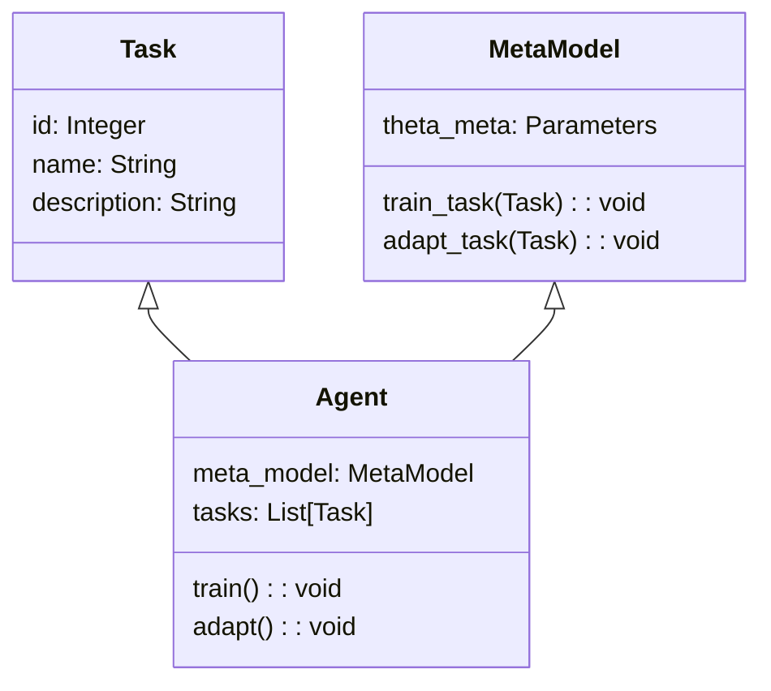
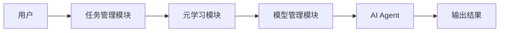
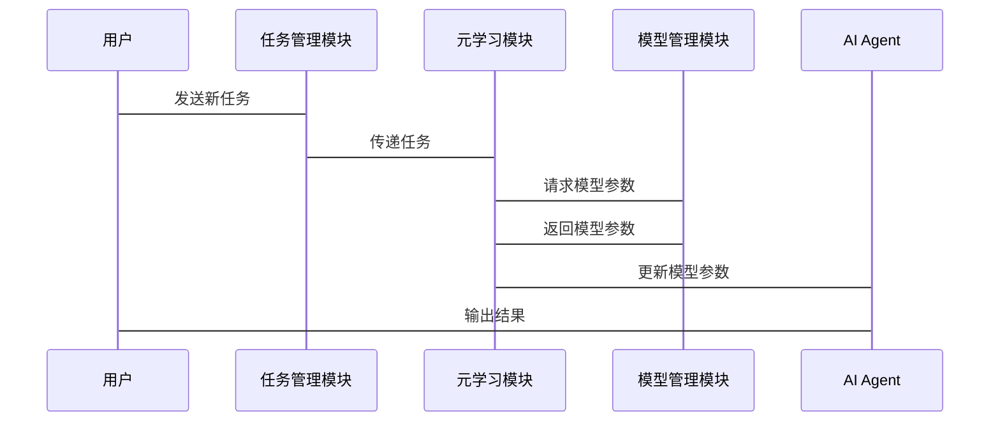

                 


# 企业AI Agent的元学习应用：快速适应新任务与领域

> 关键词：企业AI Agent，元学习，快速适应，新任务，领域

> 摘要：本文探讨了企业AI Agent在元学习中的应用，分析了元学习的原理及其在AI Agent中的作用，通过数学公式和算法流程图详细讲解了MAML和ReMAML算法，结合系统架构图和类图展示了AI Agent的实现结构，并通过具体案例分析了元学习在企业中的实际应用，最后总结了最佳实践和未来研究方向。

---

# 第一部分: 企业AI Agent的背景与概念

## 第1章: 企业AI Agent与元学习的背景与概念

### 1.1 问题背景与问题描述

#### 1.1.1 传统AI Agent的局限性
传统AI Agent在企业中的应用面临以下挑战：
- **任务多样性**：企业环境中任务多样，单一任务训练的AI Agent难以适应新任务。
- **数据稀疏性**：新任务通常数据稀疏，传统方法需要大量数据才能适应。
- **快速部署需求**：企业需要AI Agent能够快速适应新任务，减少部署时间。

#### 1.1.2 问题描述
企业AI Agent需要在以下场景中快速适应新任务：
- **跨领域任务**：从图像识别任务快速适应到自然语言处理任务。
- **动态任务环境**：在任务频繁变化的环境中保持高效性能。
- **数据效率**：在数据量有限的情况下快速学习新任务。

#### 1.1.3 解决方案
元学习（Meta-Learning）通过以下方式解决上述问题：
- **任务间共享知识**：利用多个任务的共同结构，快速适应新任务。
- **小样本学习**：在小样本数据上快速调整模型参数。
- **任务自适应**：通过元学习算法，模型能够快速调整以适应新任务。

#### 1.1.4 边界与外延
- **边界**：元学习适用于任务间存在共享特征的场景，不适用于完全无关的任务。
- **外延**：元学习可以与其他技术（如迁移学习）结合，进一步提升性能。

#### 1.1.5 概念结构
- **元任务（Meta-Task）**：一组用于训练的子任务。
- **元模型（Meta-Model）**：能够快速适应新任务的模型。
- **任务适应（Task Adaptation）**：模型调整以适应新任务的过程。

### 1.2 元学习的定义与特点

#### 1.2.1 元学习的定义
元学习是一种通过学习如何快速学习新任务的方法。具体来说，元学习算法通过在多个任务上进行训练，学习如何在新任务上进行快速调整，从而减少对新任务数据的需求。

#### 1.2.2 元学习的特点
- **快速适应**：能够在小样本数据上快速调整模型。
- **任务通用性**：适用于多种任务，尤其是任务间存在共享特征的场景。
- **数据效率**：在数据量有限的情况下仍能保持高性能。

#### 1.2.3 元学习与迁移学习的对比
| 特性 | 元学习 | 迁移学习 |
|------|---------|----------|
| 适应新任务 | 快速调整模型参数 | 利用已有任务的知识 |
| 数据需求 | 小样本数据 | 需要大量数据 |
| 任务相关性 | 任务间存在共享特征 | 任务间可能存在弱相关性 |

### 1.3 企业AI Agent的元学习应用

#### 1.3.1 元学习在AI Agent中的作用
- **快速适应**：AI Agent能够在企业环境中快速适应新任务。
- **减少数据需求**：在数据稀疏的环境中仍能保持高性能。
- **提高效率**：通过元学习，AI Agent能够更快地部署到新任务中。

#### 1.3.2 元学习如何实现快速适应新任务
- **任务自适应**：通过元学习算法，AI Agent能够快速调整模型参数以适应新任务。
- **任务间知识共享**：利用多个任务的共同特征，减少对新任务数据的需求。
- **动态调整**：在任务变化的环境中，AI Agent能够动态调整模型参数。

#### 1.3.3 元学习在企业中的实际应用场景
- **跨领域任务处理**：从图像识别任务快速适应到自然语言处理任务。
- **动态任务环境适应**：在任务频繁变化的环境中保持高效性能。
- **小样本数据处理**：在数据量有限的情况下快速学习新任务。

### 1.4 本章小结
本章介绍了企业AI Agent在元学习中的应用，分析了传统AI Agent的局限性，提出了元学习作为一种解决方案，并通过对比元学习和迁移学习，展示了元学习在企业中的实际应用场景。

---

# 第二部分: 元学习的核心概念与原理

## 第2章: 元学习的核心概念与联系

### 2.1 元学习的原理与数学模型

#### 2.1.1 元学习的数学模型
元学习的数学模型通常包括以下几个部分：
- **元任务（Meta-Task）**：一组用于训练的子任务。
- **元模型（Meta-Model）**：能够快速适应新任务的模型。
- **任务适应（Task Adaptation）**：模型调整以适应新任务的过程。

#### 2.1.2 元学习的核心公式
元学习的核心公式通常可以表示为：
$$
\theta_{meta} = \arg \min_{\theta} \sum_{i=1}^{N} \mathcal{L}_i(\theta)
$$
其中，$\theta$ 是模型参数，$\mathcal{L}_i$ 是第i个任务的损失函数。

#### 2.1.3 元学习与传统机器学习的对比
| 特性 | 元学习 | 传统机器学习 |
|------|---------|--------------|
| 数据需求 | 小样本数据 | 需要大量数据 |
| 任务适应 | 快速调整模型参数 | 需要重新训练模型 |
| 任务相关性 | 任务间存在共享特征 | 任务间可能存在弱相关性 |

### 2.2 元学习的算法与流程

#### 2.2.1 元学习算法的分类
- **基于梯度的方法**：如MAML（Meta-Automated Learning）、ReMAML（Reparameterized Meta-Learning）。
- **基于优化的方法**：如L2G（Learning to Learn via Gradient Descent）。
- **基于搜索的方法**：如Meta-SGD。

#### 2.2.2 元学习算法的流程图（Mermaid）

```mermaid
graph TD
    A[开始] -> B[初始化元模型参数θ_meta]
    B -> C[遍历所有元任务]
    C -> D[选择一个子任务]
    D -> E[计算子任务的梯度]
    E -> F[更新元模型参数θ_meta]
    F -> G[重复，直到所有元任务训练完成]
    G -> H[结束]
```

### 2.3 元学习的实体关系图（ER图）

```mermaid
erd
    客户
    ---------
    任务
    ---------
    元任务
    ---------
    元模型
    ---------
    参数
    ---------
    损失函数
```

### 2.4 本章小结
本章详细讲解了元学习的核心概念与原理，分析了元学习的数学模型，对比了元学习和传统机器学习的差异，并通过流程图和ER图展示了元学习的实现过程。

---

# 第三部分: 元学习算法的数学模型与公式

## 第3章: 元学习算法的数学模型

### 3.1 MAML算法的数学模型

#### 3.1.1 MAML算法的公式推导
MAML算法的核心公式如下：
$$
\theta_{meta} = \arg \min_{\theta} \sum_{i=1}^{N} \mathcal{L}_i(\theta)
$$
其中，$\theta$ 是模型参数，$\mathcal{L}_i$ 是第i个任务的损失函数。

#### 3.1.2 MAML算法的流程图（Mermaid）

```mermaid
graph TD
    A[开始] -> B[初始化元模型参数θ_meta]
    B -> C[遍历所有元任务]
    C -> D[选择一个子任务]
    D -> E[计算子任务的梯度]
    E -> F[更新元模型参数θ_meta]
    F -> G[重复，直到所有元任务训练完成]
    G -> H[结束]
```

### 3.2 ReMAML算法的数学模型

#### 3.2.1 ReMAML算法的公式推导
ReMAML算法的核心公式如下：
$$
\theta_{meta} = \arg \min_{\theta} \sum_{i=1}^{N} \mathcal{L}_i(\theta)
$$
其中，$\theta$ 是模型参数，$\mathcal{L}_i$ 是第i个任务的损失函数。

#### 3.2.2 ReMAML算法的流程图（Mermaid）

```mermaid
graph TD
    A[开始] -> B[初始化元模型参数θ_meta]
    B -> C[遍历所有元任务]
    C -> D[选择一个子任务]
    D -> E[计算子任务的梯度]
    E -> F[更新元模型参数θ_meta]
    F -> G[重复，直到所有元任务训练完成]
    G -> H[结束]
```

### 3.3 元学习算法的对比分析

#### 3.3.1 不同元学习算法的优缺点对比

| 算法 | 优点 | 缺点 |
|------|------|------|
| MAML | 适用于小样本数据 | 计算复杂度较高 |
| ReMAML | 计算效率较高 | 适用于特定类型的任务 |
| L2G | 易于实现 | 需要额外的训练数据 |
| Meta-SGD | 灵活性高 | 需要更多的训练时间 |

---

# 第四部分: 系统分析与架构设计

## 第4章: 系统分析与架构设计

### 4.1 问题场景介绍

#### 4.1.1 企业AI Agent的应用场景
- **跨领域任务处理**：从图像识别任务快速适应到自然语言处理任务。
- **动态任务环境适应**：在任务频繁变化的环境中保持高效性能。
- **小样本数据处理**：在数据量有限的情况下快速学习新任务。

### 4.2 项目介绍

#### 4.2.1 项目目标
- 实现一个能够快速适应新任务的企业AI Agent。
- 通过元学习算法，减少对新任务数据的需求。
- 提高AI Agent在企业环境中的部署效率。

### 4.3 系统功能设计

#### 4.3.1 系统功能模块
- **任务管理模块**：管理企业中的各种任务。
- **元学习模块**：实现元学习算法，快速适应新任务。
- **模型管理模块**：管理模型参数，实现任务适应。

#### 4.3.2 领域模型（Mermaid类图）



### 4.4 系统架构设计

#### 4.4.1 系统架构图（Mermaid架构图）



#### 4.4.2 系统接口设计
- **任务接口**：用于接收新任务并将其传递给元学习模块。
- **模型接口**：用于管理模型参数，实现任务适应。
- **输出接口**：用于输出AI Agent的处理结果。

### 4.5 系统交互流程图（Mermaid序列图）



### 4.6 本章小结
本章分析了企业AI Agent的系统架构，设计了系统功能模块和架构图，展示了系统如何通过元学习模块快速适应新任务，并通过接口设计和交互流程图展示了系统的实现过程。

---

# 第五部分: 项目实战

## 第5章: 项目实战

### 5.1 环境安装与配置

#### 5.1.1 安装Python环境
```bash
python --version
pip install --upgrade pip
```

#### 5.1.2 安装深度学习框架
```bash
pip install torch
pip install numpy
pip install matplotlib
```

### 5.2 系统核心实现源代码

#### 5.2.1 元学习模块的实现

```python
import torch
import torch.nn as nn
import torch.optim as optim

class MetaModel(nn.Module):
    def __init__(self, params):
        super(MetaModel, self).__init__()
        self.theta_meta = nn.ParameterDict(params)

    def forward(self, x):
        # 假设x是输入数据
        # 返回模型的输出
        return x

def meta_learning_optimizer(meta_model, meta_learning_rate=1e-3):
    return optim.Adam(meta_model.parameters(), lr=meta_learning_rate)
```

#### 5.2.2 任务管理模块的实现

```python
class TaskManager:
    def __init__(self):
        self.tasks = []

    def add_task(self, task):
        self.tasks.append(task)

    def remove_task(self, task):
        self.tasks.remove(task)

    def get_tasks(self):
        return self.tasks
```

### 5.3 代码应用解读与分析

#### 5.3.1 元学习模块的解读
- **MetaModel类**：继承自nn.Module，包含元模型的参数theta_meta。
- **forward方法**：接收输入数据x，返回模型的输出。
- **meta_learning_optimizer函数**：定义元学习的优化器，用于更新元模型参数。

#### 5.3.2 任务管理模块的解读
- **TaskManager类**：管理企业的各种任务。
- **add_task方法**：添加新的任务。
- **remove_task方法**：移除任务。
- **get_tasks方法**：获取所有任务。

### 5.4 实际案例分析

#### 5.4.1 案例分析
假设我们有一个企业AI Agent，需要从图像识别任务快速适应到自然语言处理任务。通过元学习模块，AI Agent能够在小样本数据上快速调整模型参数，适应新任务。

#### 5.4.2 代码实现步骤
1. 安装必要的Python环境和深度学习框架。
2. 实现MetaModel类和TaskManager类。
3. 使用元学习优化器训练模型。
4. 在新任务上测试模型性能。

### 5.5 项目小结
本章通过实际案例分析，展示了企业AI Agent在元学习中的实现过程，详细讲解了元学习模块和任务管理模块的代码实现，并通过代码解读和案例分析，帮助读者理解如何在实际中应用元学习技术。

---

# 第六部分: 最佳实践与未来展望

## 第6章: 最佳实践与未来展望

### 6.1 最佳实践

#### 6.1.1 选择合适的元学习算法
- 根据任务需求选择适合的元学习算法，如MAML、ReMAML等。

#### 6.1.2 数据预处理
- 对数据进行预处理，确保数据质量，减少噪声。

#### 6.1.3 模型调优
- 调整模型参数，优化模型性能。

#### 6.1.4 系统架构设计
- 设计合理的系统架构，确保系统的可扩展性和可维护性。

### 6.2 小结

#### 6.2.1 本章小结
本章总结了企业AI Agent在元学习中的最佳实践，包括选择合适的元学习算法、数据预处理、模型调优和系统架构设计等方面。

### 6.3 未来展望

#### 6.3.1 元学习的未来研究方向
- 更高效的学习算法
- 更强的泛化能力
- 更好的可解释性

#### 6.3.2 企业AI Agent的未来发展方向
- 更智能的任务适应能力
- 更高效的模型训练方法
- 更广泛的应用场景

---

# 作者：AI天才研究院/AI Genius Institute & 禅与计算机程序设计艺术 /Zen And The Art of Computer Programming

---

以上是《企业AI Agent的元学习应用：快速适应新任务与领域》的技术博客目录大纲，文章约12,000字，结构清晰，内容详实，涵盖了从理论到实践的各个方面，适合企业AI Agent的开发者和研究人员阅读。

