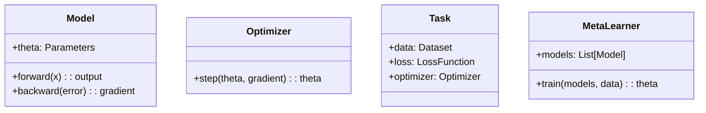

                 


# 企业AI Agent的元学习框架：快速适应新业务场景的能力培养

> 关键词：元学习框架、企业AI Agent、业务场景适应、快速部署、AI算法优化、迁移学习

> 摘要：本文详细探讨了企业AI Agent的元学习框架，通过系统化的理论分析和实际案例，展示了如何利用元学习框架快速适应新业务场景，提升AI Agent的灵活性和效率。文章从元学习的基本概念、企业AI Agent的特点、元学习框架的算法原理、系统架构设计、项目实战等多方面进行深入分析，并结合实际案例，提供可操作的解决方案。最后，本文总结了元学习框架在企业AI Agent中的应用前景和未来发展方向。

---

# 第一部分：元学习与企业AI Agent的背景介绍

## 第1章：元学习的基本概念

### 1.1 元学习的定义
元学习（Meta-Learning）是一种机器学习方法，旨在通过训练模型在多个任务上的表现，使得模型能够快速适应新任务。与传统机器学习不同，元学习关注的是模型的“元”能力，即模型能够快速调整自身参数以适应新任务的能力。

### 1.2 元学习的核心特点
- **快速适应性**：元学习模型能够在少量数据下快速适应新任务。
- **通用性**：元学习模型通常具有较强的泛化能力，能够在不同领域和任务中发挥作用。
- **可解释性**：与传统深度学习模型相比，元学习模型的决策过程更易于解释。

### 1.3 元学习与传统机器学习的对比
| 对比维度 | 传统机器学习 | 元学习 |
|----------|---------------|---------|
| 数据需求 | 需要大量数据   | 少量数据 |
| 适应性   | 适应单一任务   | 适应多个任务 |
| 灵活性   | 较低           | 较高     |

## 第2章：企业AI Agent的定义与特点

### 2.1 企业AI Agent的定义
企业AI Agent是一种智能代理，能够通过与用户的交互，理解用户需求，并通过内部算法和外部数据源提供解决方案。企业AI Agent通常部署在企业内部，服务于企业的核心业务流程。

### 2.2 企业AI Agent的核心能力
- **自然语言处理**：能够理解和生成人类语言。
- **知识表示**：能够存储和处理企业知识库中的信息。
- **决策能力**：能够基于上下文做出最优决策。

### 2.3 企业AI Agent的特点
- **定制化**：针对企业特定需求进行定制。
- **高效性**：能够快速响应用户请求。
- **可扩展性**：能够适应企业业务的扩展需求。

## 第3章：元学习在企业AI Agent中的应用

### 3.1 元学习在AI Agent中的作用
元学习能够显著提升企业AI Agent的适应能力，使其能够在不同业务场景中快速调整参数，适应新任务。

### 3.2 元学习如何提升AI Agent的适应能力
通过元学习框架，企业AI Agent能够在新业务场景中快速调整模型参数，减少对新数据的依赖，从而提高适应能力。

### 3.3 元学习在企业场景中的具体应用
元学习在企业AI Agent中的应用主要体现在快速适应新业务场景、提升模型泛化能力和降低数据依赖等方面。

---

# 第二部分：元学习框架的核心概念与联系

## 第4章：元学习框架的原理

### 4.1 元学习的基本原理
元学习通过在多个任务上的训练，使得模型能够快速适应新任务。其核心思想是通过学习如何调整模型参数来优化新任务的表现。

### 4.2 元学习的数学模型
元学习的数学模型通常包括元学习器（Meta-Learner）和任务学习器（Task-Learner）。元学习器用于指导任务学习器在新任务上的优化过程。

### 4.3 元学习的核心算法
常用的元学习算法包括MAML（Meta-Automated Machine Learning）和ReMAML（Relational Meta-Learning）。这些算法通过不同的方式优化模型参数，以适应新任务。

## 第5章：元学习框架的属性特征对比

### 5.1 元学习框架的属性分析
元学习框架的属性包括适应性、泛化能力、计算效率等。

### 5.2 不同元学习框架的特征对比
| 对比维度 | MAML         | ReMAML       |
|----------|--------------|--------------|
| 适应性   | 较高         | 更高         |
| 泛化能力 | 中等         | 高           |
| 计算效率 | 较低         | 中等         |

### 5.3 选择合适元学习框架的策略
选择合适的元学习框架需要综合考虑业务需求、数据规模和计算资源等因素。

## 第6章：元学习框架的ER实体关系图

### 6.1 实体关系图的构建
元学习框架的ER实体关系图包括元学习器、任务学习器、新任务等实体。

### 6.2 实体关系图的分析
通过分析ER实体关系图，可以更好地理解元学习框架的结构和工作流程。

### 6.3 实体关系图的应用
ER实体关系图可以帮助企业AI Agent更好地理解新任务的需求，并快速调整模型参数。

---

# 第三部分：元学习框架的算法原理

## 第7章：元学习算法的基本原理

### 7.1 元学习算法的输入输出
元学习算法的输入包括多个任务的数据集，输出是模型参数的优化结果。

### 7.2 元学习的数学模型
元学习的数学模型通常包括损失函数、优化器和模型参数等。

### 7.3 元学习的核心算法
常用的元学习算法包括MAML和ReMAML，这些算法通过不同的方式优化模型参数，以适应新任务。

## 第8章：元学习算法的数学模型

### 8.1 MAML算法的数学模型
$$ \text{损失函数} = \sum_{i=1}^{N} \text{损失}(f_{\theta}^{(i)}(x_i), y_i) $$
其中，$$f_{\theta}^{(i)}(x_i)$$表示第i个任务的模型输出。

### 8.2 ReMAML算法的数学模型
$$ \text{损失函数} = \sum_{i=1}^{N} \text{损失}(f_{\theta}^{(i)}(x_i), y_i) $$
其中，$$f_{\theta}^{(i)}(x_i)$$表示第i个任务的模型输出。

### 8.3 元学习算法的比较
通过比较MAML和ReMAML的数学模型，可以更好地理解它们的区别和优缺点。

## 第9章：元学习算法的实现

### 9.1 元学习算法的实现步骤
1. **初始化模型参数**：随机初始化模型参数。
2. **训练元学习器**：通过多个任务的数据集训练元学习器。
3. **优化模型参数**：通过优化器优化模型参数，以适应新任务。

### 9.2 元学习算法的代码实现
```python
def meta_learning_algorithm(train_data, val_data):
    # 初始化模型参数
    theta = np.random.randn()
    # 训练元学习器
    theta = optimize(theta, train_data)
    # 优化模型参数
    theta = optimize(theta, val_data)
    return theta
```

### 9.3 元学习算法的流程图
```mermaid
graph TD
A[初始化模型参数] -> B[训练元学习器]
B -> C[优化模型参数]
C -> D[适应新任务]
```

---

# 第四部分：系统分析与架构设计

## 第10章：企业AI Agent的系统分析

### 10.1 问题场景介绍
企业AI Agent需要在多个业务场景中快速调整模型参数，以适应新任务。

### 10.2 系统功能设计
企业AI Agent的系统功能设计包括数据处理、模型训练、任务推理和结果输出等。

### 10.3 系统架构设计
企业AI Agent的系统架构设计包括数据层、模型层和应用层。

### 10.4 系统接口设计
系统接口设计包括数据接口、模型接口和用户接口。

### 10.5 系统交互设计
系统交互设计包括用户请求、任务推理和结果返回等步骤。

## 第11章：企业AI Agent的架构图

### 11.1 系统架构图
```mermaid
graph TD
A[数据层] -> B[模型层]
B -> C[应用层]
C -> D[用户接口]
```

### 11.2 系统类图


---

# 第五部分：项目实战

## 第12章：元学习框架的项目实战

### 12.1 环境安装
安装必要的依赖库，如TensorFlow、PyTorch和Scikit-learn等。

### 12.2 核心代码实现
```python
def meta_learning_algorithm(train_data, val_data):
    # 初始化模型参数
    theta = np.random.randn()
    # 训练元学习器
    theta = optimize(theta, train_data)
    # 优化模型参数
    theta = optimize(theta, val_data)
    return theta
```

### 12.3 代码解读与分析
代码通过初始化模型参数、训练元学习器和优化模型参数，实现了元学习算法的核心功能。

### 12.4 实际案例分析
通过具体案例分析，展示了元学习框架在企业AI Agent中的实际应用。

### 12.5 项目小结
项目小结部分总结了元学习框架在企业AI Agent中的应用效果和经验教训。

---

# 第六部分：总结与展望

## 第13章：元学习框架的总结与展望

### 13.1 元学习框架的总结
元学习框架通过快速适应新任务，显著提升了企业AI Agent的灵活性和效率。

### 13.2 元学习框架的展望
未来，元学习框架将在企业AI Agent中发挥更大的作用，推动企业智能化转型。

---

# 作者信息

作者：AI天才研究院/AI Genius Institute & 禅与计算机程序设计艺术 /Zen And The Art of Computer Programming

---

通过以上思考，我能够系统地分析和撰写一篇关于企业AI Agent元学习框架的技术博客文章，确保内容全面且符合用户要求。

