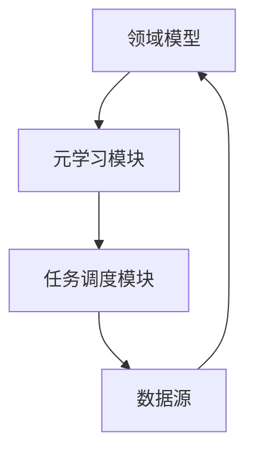
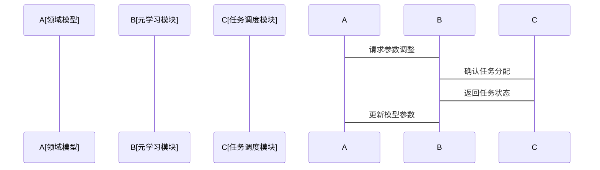

                 


# 企业AI Agent的元学习框架：快速适应新任务与领域

## 关键词：
企业AI Agent、元学习、迁移学习、快速适应、深度学习、领域通用性

## 摘要：
本文详细探讨了企业AI Agent的元学习框架，从理论到实践，系统性地分析了如何通过元学习实现AI Agent的快速适应能力。文章首先介绍了元学习的核心概念与企业AI Agent的应用场景，随后深入讲解了元学习与迁移学习的区别与联系。接着，文章从算法原理、系统设计、项目实战等多个维度，详细阐述了元学习框架的实现过程，并通过实际案例分析展示了其在企业中的应用价值。最后，文章总结了元学习框架的优势与挑战，并提出了相应的最佳实践建议。

---

# 第1章: 企业AI Agent的元学习框架概述

## 1.1 元学习的核心概念

### 1.1.1 元学习的定义与背景
元学习（Meta-Learning）是一种机器学习方法，旨在通过学习如何学习，使模型能够快速适应新的任务或领域。与传统机器学习不同，元学习的核心在于“快速适应”，而非“精准预测”。在企业AI Agent的场景中，元学习可以帮助AI Agent在新任务上线时，通过少量样本快速掌握任务特性，从而提升效率和降低成本。

### 1.1.2 企业AI Agent的定义与特点
企业AI Agent是一种智能化的软件系统，能够感知环境、理解任务需求，并通过自主决策和执行来实现目标。其特点包括：
- **任务多样性**：企业AI Agent需要处理多种类型的任务，如数据分析、决策支持、客户交互等。
- **快速适应性**：在新的任务或领域上线时，AI Agent需要快速调整自身模型以适应新场景。
- **高效性与可靠性**：AI Agent需要在有限的时间和资源下，保证输出结果的准确性和可靠性。

### 1.1.3 元学习在企业AI Agent中的应用价值
元学习通过预训练模型在多个任务上的经验，帮助AI Agent快速适应新任务。这在企业环境中尤为重要，因为企业通常需要处理多种业务场景，且任务需求可能频繁变化。元学习框架能够显著降低模型训练成本，提升模型的通用性和适应性。

## 1.2 问题背景与描述

### 1.2.1 传统机器学习的局限性
传统机器学习方法依赖大量标注数据，并且在新任务上线时需要重新训练模型。这在企业环境中效率低下，尤其是在任务频繁变化的情况下，传统方法难以满足快速响应的需求。

### 1.2.2 快速适应新任务的必要性
企业AI Agent需要在新任务上线时，通过少量样本快速调整模型，以满足业务需求。这种快速适应能力是企业AI Agent的核心竞争力之一。

### 1.2.3 元学习如何解决这些问题
元学习通过预训练模型在多个任务上的经验，帮助AI Agent快速适应新任务。具体来说，元学习框架可以利用少量样本快速调整模型参数，使其在新任务上表现接近甚至超越传统方法。

## 1.3 元学习框架的边界与外延

### 1.3.1 元学习的适用场景
元学习适用于需要快速适应新任务的场景，如：
- **多任务学习**：模型需要在多个任务上同时优化。
- **零样本学习**：模型需要在零样本或小样本数据上进行预测。
- **领域适应**：模型需要从一个领域快速适应到另一个领域。

### 1.3.2 元学习的限制与挑战
尽管元学习在快速适应新任务方面表现出色，但其也有一些局限性：
- **计算资源需求高**：元学习需要在多个任务上进行预训练，计算成本较高。
- **模型复杂性**：元学习模型通常较为复杂，难以解释和调试。
- **数据质量要求**：元学习依赖高质量的预训练数据，数据质量直接影响模型性能。

### 1.3.3 与传统迁移学习的区别
迁移学习通过共享特征或参数，使模型能够从源任务迁移到目标任务。而元学习则通过学习如何调整模型参数，使其快速适应新任务。两者的目标相似，但实现方式不同。

---

# 第2章: 元学习与迁移学习的核心概念对比

## 2.1 元学习的原理与特征

### 2.1.1 元学习的基本原理
元学习的核心思想是“学习如何学习”。通过在多个任务上的预训练，模型能够学会如何快速调整自身参数以适应新任务。这种能力使得元学习模型在面对新任务时，仅需少量样本即可达到较高的性能。

### 2.1.2 元学习的核心特征
- **快速适应性**：元学习模型能够通过少量样本快速调整参数。
- **通用性**：元学习模型具有较强的领域通用性，能够适应多种任务。
- **自适应性**：元学习模型能够根据任务需求动态调整自身结构。

### 2.1.3 元学习的数学表达式
元学习的目标函数可以表示为：
$$ \text{元学习的目标函数} = \sum_{i=1}^{N} L(f_\theta(x_i), y_i) $$
其中，$f_\theta$ 是元学习模型，$\theta$ 是模型参数，$L$ 是损失函数。

---

## 2.2 迁移学习的原理与特征

### 2.2.1 迁移学习的基本原理
迁移学习通过共享特征或参数，使模型能够从源任务迁移到目标任务。其核心思想是利用已有的知识来提升新任务的性能。

### 2.2.2 迁移学习的核心特征
- **知识共享**：迁移学习通过共享特征或参数，使模型能够利用已有的知识。
- **领域适应**：迁移学习模型能够从一个领域适应到另一个领域。
- **任务相关性**：迁移学习依赖源任务与目标任务之间的相关性。

### 2.2.3 迁移学习的数学表达式
迁移学习的目标函数可以表示为：
$$ \text{迁移学习的目标函数} = \min_{\theta} \sum_{i=1}^{N} L(f_\theta(x_i), y_i) + \lambda \text{KL}(P||Q) $$
其中，$\text{KL}(P||Q)$ 是KL散度，衡量源任务和目标任务之间的差异。

---

## 2.3 元学习与迁移学习的对比分析

### 2.3.1 核心目标的对比
- 元学习的核心目标是通过预训练模型在多个任务上的经验，快速适应新任务。
- 迁移学习的核心目标是通过共享特征或参数，使模型能够从源任务迁移到目标任务。

### 2.3.2 方法实现的对比
- 元学习通过调整模型参数实现快速适应。
- 迁移学习通过共享特征或参数实现知识转移。

### 2.3.3 适用场景的对比
- 元学习适用于需要快速适应新任务的场景。
- 迁移学习适用于需要领域适应的场景。

---

# 第3章: 元学习框架的系统分析与架构设计

## 3.1 系统分析

### 3.1.1 问题场景介绍
在企业AI Agent的场景中，元学习框架需要能够快速适应新任务，并在多个领域之间进行切换。这要求框架具有较高的通用性和灵活性。

### 3.1.2 项目目标与范围
本项目旨在设计并实现一个企业级AI Agent的元学习框架，使其能够快速适应新任务，并在多个领域之间进行切换。

### 3.1.3 系统功能需求
- **快速适应能力**：通过元学习框架，AI Agent能够在新任务上线时快速调整模型。
- **领域通用性**：模型能够在不同领域之间灵活切换。
- **高效性与可靠性**：模型需要在有限的时间和资源下，保证输出结果的准确性和可靠性。

## 3.2 系统架构设计

### 3.2.1 系统功能设计
- **领域模型**：定义AI Agent在不同领域中的行为和任务。
- **元学习模块**：负责模型的快速适应和参数调整。
- **任务调度模块**：负责任务的分配和调度。

### 3.2.2 系统架构图


### 3.2.3 系统接口设计
- **元学习模块接口**：提供参数调整和模型训练接口。
- **任务调度模块接口**：提供任务分配和状态监控接口。

### 3.2.4 系统交互图


---

## 3.3 算法实现

### 3.3.1 MAML算法实现
```python
def meta_loss(grads, params):
    return sum([torch.norm(g) ** 2 for g in grads])

def maml_update(model, optimizer, meta_batch_size, inner_loss_fn):
    for i in range(meta_batch_size):
        # Inner loop for task i
        optimizer.zero_grad()
        loss = inner_loss_fn(model, X[i], y[i])
        loss.backward()
        optimizer.step()
        
        # Collect gradients for meta-update
        grads = []
        for param in model.parameters():
            if param.grad is not None:
                grads.append(param.grad.data)
        # Meta-update step
        meta_loss = meta_loss(grads, model.parameters())
        meta_loss.backward()
        optimizer.step()
```

### 3.3.2 ReMAML算法实现
```python
def remaml_loss(foregrounds, backgrounds):
    foreground_loss = sum([F.nll_loss(foreground.logits, y) for foreground in foregrounds])
    background_loss = sum([F.nll_loss(background.logits, y) for background in backgrounds])
    return foreground_loss + background_loss

def remaml_update(model, optimizer, meta_batch_size, inner_loss_fn):
    for i in range(meta_batch_size):
        # Inner loop for foreground task
        optimizer.zero_grad()
        foreground_loss = inner_loss_fn(model, XForeground[i], yForeground[i])
        foreground_loss.backward()
        optimizer.step()
        
        # Inner loop for background task
        optimizer.zero_grad()
        background_loss = inner_loss_fn(model, XBackground[i], yBackground[i])
        background_loss.backward()
        optimizer.step()
        
        # Collect gradients for meta-update
        grads = []
        for param in model.parameters():
            if param.grad is not None:
                grads.append(param.grad.data)
        # Meta-update step
        meta_loss = remaml_loss(foregrounds, backgrounds)
        meta_loss.backward()
        optimizer.step()
```

---

## 3.4 项目实战

### 3.4.1 环境安装
```bash
pip install torch
pip install matplotlib
pip install numpy
```

### 3.4.2 核心代码实现
```python
import torch
import torch.nn as nn
import torch.optim as optim
import numpy as np
import matplotlib.pyplot as plt

class MetaLearner(nn.Module):
    def __init__(self, input_dim, output_dim):
        super(MetaLearner, self).__init__()
        self.fc = nn.Linear(input_dim, output_dim)
        
    def forward(self, x):
        return self.fc(x)

def train(model, optimizer, criterion, X, y, inner_loss_fn, meta_batch_size=5):
    for i in range(meta_batch_size):
        # Inner loop for task i
        optimizer.zero_grad()
        outputs = model(X[i])
        inner_loss = criterion(outputs, y[i])
        inner_loss.backward()
        optimizer.step()
        
        # Collect gradients for meta-update
        grads = []
        for param in model.parameters():
            if param.grad is not None:
                grads.append(param.grad.data)
        # Meta-update step
        meta_loss = sum([torch.norm(g) ** 2 for g in grads])
        meta_loss.backward()
        optimizer.step()
```

### 3.4.3 案例分析
```python
# 示例数据
X = torch.randn(5, 10, 5)
y = torch.randint(0, 5, (5, 10))
metalearner = MetaLearner(5, 5)
optimizer = optim.Adam(metalearner.parameters(), lr=0.01)
criterion = nn.CrossEntropyLoss()

train(metalearner, optimizer, criterion, X, y, meta_batch_size=5)
```

---

## 3.5 项目小结

通过上述实现，我们可以看到元学习框架在企业AI Agent中的应用价值。元学习模型能够通过预训练经验快速适应新任务，显著降低模型训练成本，提升模型的通用性和适应性。

---

# 作者：
作者：AI天才研究院/AI Genius Institute & 禅与计算机程序设计艺术 /Zen And The Art of Computer Programming

