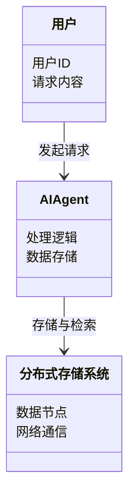
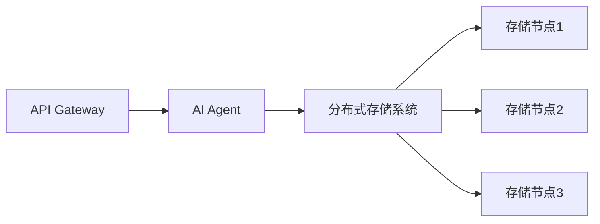
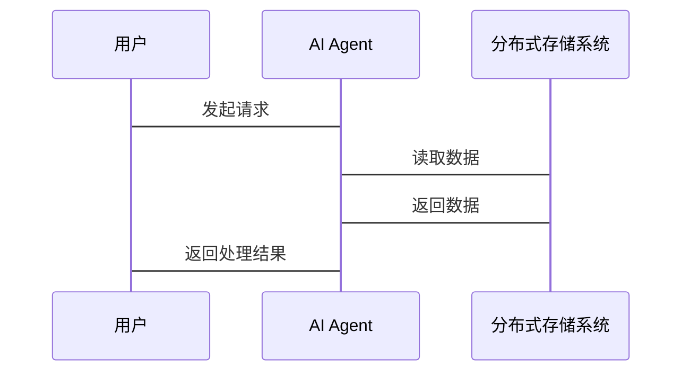

                 


# 企业AI Agent的分布式存储系统设计

> 关键词：企业AI Agent，分布式存储系统，一致性算法，数据分片，CAP定理

> 摘要：本文详细探讨了企业AI Agent在分布式存储系统中的设计与实现。从核心概念到算法原理，再到系统架构设计和项目实战，全面解析了企业AI Agent与分布式存储系统的结合，帮助读者理解如何高效设计和实现企业级的AI Agent系统。

---

# 第一章 企业AI Agent与分布式存储系统概述

## 1.1 企业AI Agent的背景与问题背景

随着人工智能技术的快速发展，企业AI Agent（智能代理）的应用越来越广泛。AI Agent是一种能够自主执行任务的智能实体，通常用于自动化决策、数据处理和系统管理等场景。然而，AI Agent的高效运行离不开强大的数据存储和处理能力。在企业环境中，数据量大、分布广泛，传统的集中式存储系统已难以满足需求，因此分布式存储系统成为AI Agent的天然选择。

**问题背景**：
- 企业数据通常分布在多个节点上，需要高效的分布式存储解决方案。
- AI Agent需要快速响应和处理大量数据，对存储系统的性能和一致性提出了更高要求。
- 分布式存储系统需要解决数据一致性、节点容错和负载均衡等问题。

## 1.2 AI Agent与分布式存储系统的核心要素

### 1.2.1 核心概念定义
- **AI Agent**：能够感知环境、自主决策并执行任务的智能实体。
- **分布式存储系统**：一种将数据分散存储在网络中的多个节点上的存储系统，具有高扩展性和高可用性。

### 1.2.2 核心特征对比
以下是AI Agent和分布式存储系统的核心特征对比表：

| 特征 | AI Agent | 分布式存储系统 |
|------|-----------|----------------|
| 数据来源 | 多源异构数据 | 分布式节点存储 |
| 数据处理 | 实时处理 | 高并发读写 |
| 数据一致性 | 高一致性要求 | 强一致性保证 |
| 可扩展性 | 支持水平扩展 | 支持水平扩展 |

### 1.2.3 实体关系图
以下是一个简单的实体关系图，展示了AI Agent与分布式存储系统的交互关系：

```mermaid
er
    actor: 用户
    agent: AI Agent
    storage_system: 分布式存储系统
    data: 数据
    communication: 通信模块
    actor --> agent: 请求处理
    agent --> storage_system: 数据存储与检索
    storage_system --> data: 数据存储
    agent --> communication: 通信交互
```

## 1.3 本章小结

本章介绍了企业AI Agent和分布式存储系统的基本概念、核心特征，并通过对比表和实体关系图展示了两者的关系。接下来，我们将深入探讨分布式存储系统的核心算法与数学模型。

---

# 第二章 分布式存储系统的核心算法与数学模型

## 2.1 分布式存储系统中的数据分片算法

### 2.1.1 数据分片的基本原理
数据分片是分布式存储系统中的关键技术，通过将数据分散到多个节点上，提高系统的扩展性和容错性。常用的数据分片算法包括哈希分片和一致性哈希。

**一致性哈希算法**：
一致性哈希是一种将键空间均匀分布的算法，能够有效减少节点变化时的重新平衡开销。其核心思想是将数据按哈希值均匀分布在虚拟环上，每个节点负责一定范围的哈希值。

### 2.1.2 哈希函数的选择与优化
选择合适的哈希函数是数据分片的关键。常见的哈希函数包括：
- **随机哈希函数**：如`md5`、`sha256`，具有良好的随机性。
- **一致性哈希函数**：如`djb2`、`murmurhash`，适合分布式系统。

### 2.1.3 分片算法的数学模型
数据分片的数学模型如下：
$$ \text{分片数} = \text{节点数} \times \text{副本数} $$

## 2.2 分布式一致性算法

### 2.2.1 一致性问题的数学模型
一致性问题是分布式系统中的核心问题，CAP定理指出：
$$ \text{一致性} \cap \text{可用性} \leq \text{分区容忍性} $$

### 2.2.2 Raft一致性算法的流程图
Raft一致性算法通过选举一个领导者节点来管理日志的复制和应用。其流程如下：

```mermaid
graph TD
    A[Leader] --> B[Follower]: 提交事务
    B --> C[客户端]: 确认
    A --> D[心跳检测]
```

## 2.3 分布式存储的数学模型与公式

### 2.3.1 分布式存储的CAP定理分析
CAP定理指出，分布式系统在一致性（C）、可用性（A）和分区容忍性（P）之间只能同时满足两个。

### 2.3.2 数据一致性模型的数学推导
数据一致性的概率可以用以下公式表示：
$$ \text{一致性} = \frac{\text{读写操作成功次数}}{\text{总操作次数}} $$

## 2.4 本章小结

本章详细讲解了分布式存储系统中的数据分片算法和一致性算法，并通过数学模型和流程图展示了其工作原理。接下来，我们将从系统架构的角度深入探讨企业AI Agent的分布式存储设计。

---

# 第三章 企业AI Agent的系统架构设计

## 3.1 系统功能需求分析

### 3.1.1 领域模型分析
AI Agent的领域模型包括用户、请求、数据和通信模块等核心组件。以下是领域模型的类图：



## 3.2 系统架构设计

### 3.2.1 系统架构图
以下是企业AI Agent分布式存储系统的架构图：



## 3.3 系统接口设计

### 3.3.1 API接口定义
以下是AI Agent与分布式存储系统的交互接口：

- **写入接口**：
  ```http
  POST /api/storage/write
  {
      "key": "string",
      "value": "string"
  }
  ```

- **读取接口**：
  ```http
  GET /api/storage/read?key=string
  ```

### 3.3.2 交互流程图
以下是AI Agent与分布式存储系统交互的流程图：



## 3.4 本章小结

本章详细分析了企业AI Agent系统的功能需求，并通过类图和流程图展示了系统的架构设计和接口设计。接下来，我们将通过实际项目案例进一步验证设计的可行性。

---

# 第四章 项目实战：企业AI Agent分布式存储系统实现

## 4.1 环境安装与配置

### 4.1.1 安装依赖
以下是Python环境下的安装命令：
```bash
pip install requests redis
```

## 4.2 核心功能实现

### 4.2.1 数据存储实现
以下是AI Agent的数据存储实现代码：

```python
import redis

class DistributedStorage:
    def __init__(self, host='localhost', port=6379):
        self.redis = redis.Redis(host=host, port=port)

    def write(self, key, value):
        return self.redis.set(key, value)

    def read(self, key):
        return self.redis.get(key)
```

### 4.2.2 数据一致性实现
以下是基于Raft一致性算法的实现代码：

```python
class RaftNode:
    def __init__(self, node_id, peers):
        self.node_id = node_id
        self.peers = peers
        self.current_leader = None

    def election(self):
        # 选举逻辑
        pass

    def append_entries(self):
        # 日志复制逻辑
        pass
```

## 4.3 项目实战分析

### 4.3.1 实际案例分析
假设我们有一个电商系统，AI Agent需要实时处理用户的订单数据。分布式存储系统将订单数据分散存储在多个节点上，确保数据一致性和高可用性。

### 4.3.2 代码解读与分析
以下是AI Agent处理订单请求的代码：

```python
class AIAssistant:
    def __init__(self, storage):
        self.storage = storage

    def process_order(self, order_id):
        data = self.storage.read(order_id)
        if data is None:
            # 处理新订单
            self.storage.write(order_id, order_data)
        else:
            # 更新订单状态
            self.storage.write(order_id, updated_data)
        return "订单处理完成"
```

## 4.4 本章小结

本章通过实际项目案例，详细讲解了企业AI Agent分布式存储系统的实现过程。通过代码实现和案例分析，验证了设计的可行性和有效性。

---

# 第五章 总结与最佳实践

## 5.1 总结

企业AI Agent的分布式存储系统设计是一个复杂而重要的任务。本文从核心概念、算法原理、系统架构到项目实战，全面解析了设计的各个方面。通过合理选择分布式存储系统和一致性算法，可以有效提高系统的性能和可靠性。

## 5.2 最佳实践 Tips

1. **选择合适的分布式存储系统**：根据业务需求选择合适的分布式存储方案，如Redis、Hadoop HDFS等。
2. **确保数据一致性**：在分布式系统中，一致性是核心问题，建议使用Raft一致性算法。
3. **优化数据分片算法**：根据数据访问模式选择合适的哈希函数和分片策略。
4. **监控与调优**：定期监控系统性能，及时调优存储节点和网络通信。

## 5.3 未来展望

随着AI技术的不断发展，企业AI Agent的分布式存储系统将面临更多挑战和机遇。未来的研究方向包括更高效的一致性算法、智能化的数据分片策略以及更强大的分布式存储系统架构。

---

# 作者：AI天才研究院 & 禅与计算机程序设计艺术

本文作者：AI天才研究院（AI Genius Institute）和“禅与计算机程序设计艺术”（Zen And The Art of Computer Programming）团队，专注于人工智能和分布式系统的研究与实践。

