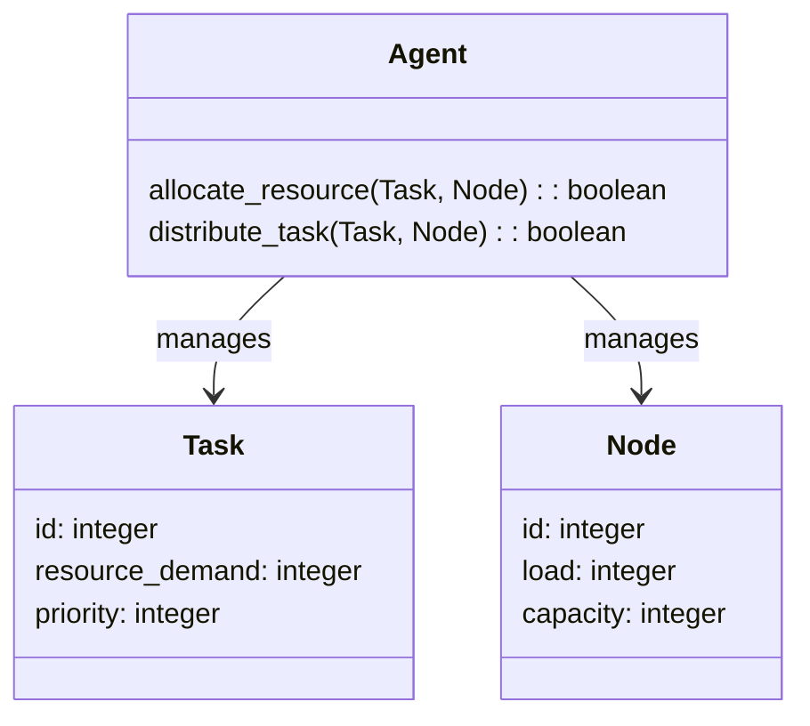
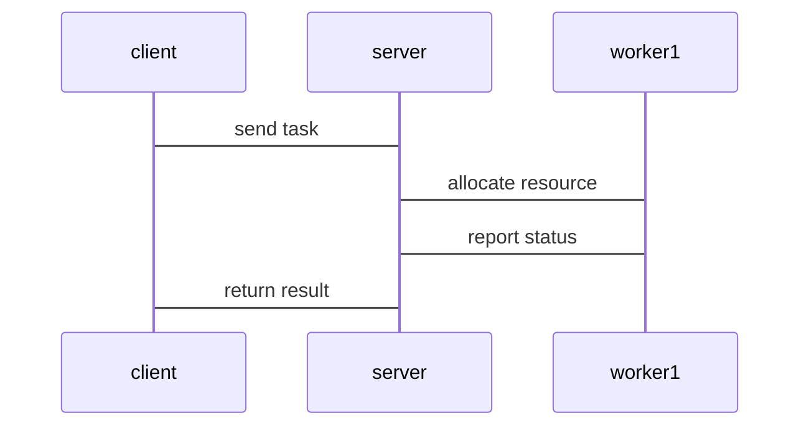
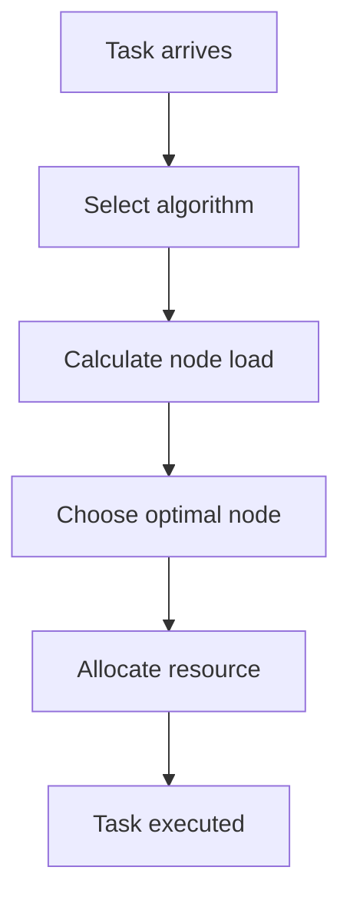
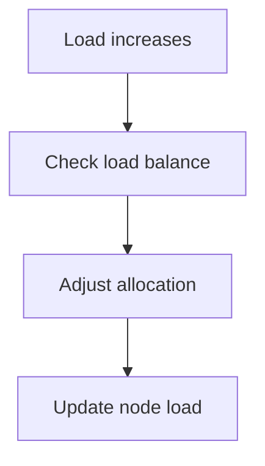

                 


# 企业AI Agent的分布式计算资源调度

## 关键词：企业AI Agent，分布式计算，资源调度，负载均衡，数学模型

## 摘要：  
企业AI Agent在现代信息化系统中扮演着越来越重要的角色，特别是在分布式计算环境下，资源调度是实现高效计算的关键。本文从AI Agent的基本原理出发，深入探讨分布式计算资源调度的核心算法、系统架构设计、项目实战以及最佳实践，旨在为企业技术架构师和开发人员提供理论指导和实践参考。

---

# 第1章: 企业AI Agent与分布式计算资源调度概述

## 1.1 问题背景与问题描述

### 1.1.1 企业AI Agent的定义与特点
企业AI Agent是一种能够感知环境、自主决策并执行任务的智能实体。其特点包括：
- **自主性**：无需人工干预，自动完成任务。
- **反应性**：能够实时感知环境变化并调整行为。
- **协作性**：能够在分布式环境中与其他Agent或系统协同工作。

### 1.1.2 分布式计算资源调度的必要性
在企业信息化系统中，计算资源（如CPU、内存、存储）通常分布在不同的节点上。AI Agent需要高效地调度这些资源，以满足复杂的计算任务需求。分布式计算资源调度的必要性体现在：
- **资源利用率最大化**：通过动态分配资源，避免资源浪费。
- **任务响应时间优化**：确保关键任务优先获得计算资源。
- **系统扩展性增强**：支持企业计算资源的弹性扩展。

### 1.1.3 企业AI Agent与分布式计算的结合
AI Agent通过分布式计算资源调度技术，能够更好地实现任务分配、负载均衡和资源优化。例如，在企业级大数据处理中，AI Agent可以协调多个计算节点，确保数据处理任务高效完成。

## 1.2 问题解决与边界分析

### 1.2.1 企业AI Agent在资源调度中的作用
AI Agent作为分布式计算资源调度的核心，负责：
- **任务分配**：将计算任务分解并分配到合适的节点。
- **负载均衡**：动态调整资源分配，避免节点过载。
- **资源监控**：实时监控资源使用情况，确保系统稳定运行。

### 1.2.2 分布式计算资源调度的边界与外延
分布式计算资源调度的边界包括：
- **资源池**：企业内部的计算资源池，包括服务器、云资源等。
- **任务队列**：待处理的计算任务。
- **调度策略**：基于优先级、负载情况的资源分配规则。

其外延则涉及：
- **外部资源调度**：与第三方云服务提供商的资源接口对接。
- **多租户环境**：在多租户系统中实现资源隔离与调度。

### 1.2.3 问题解决的路径与方法
AI Agent通过以下路径实现分布式计算资源调度：
1. **任务分析**：解析任务需求，确定所需资源。
2. **资源分配**：基于当前负载情况，选择最优资源分配方案。
3. **动态调整**：实时监控资源使用情况，动态优化分配策略。

---

# 第2章: AI Agent与分布式计算的核心原理

## 2.1 AI Agent的基本原理

### 2.1.1 AI Agent的定义与分类
AI Agent可以根据智能水平分为：
- **反应式Agent**：基于当前感知做出反应。
- **认知式Agent**：具备推理、规划能力。
- **混合式Agent**：结合反应式和认知式的特点。

### 2.1.2 AI Agent的核心算法与实现
AI Agent的核心算法包括：
- **决策树算法**：用于任务优先级排序。
- **遗传算法**：用于优化资源分配策略。
- **强化学习算法**：通过奖励机制优化调度行为。

### 2.1.3 AI Agent的决策机制
AI Agent的决策机制通常包括：
1. **环境感知**：通过传感器或API获取资源使用情况。
2. **状态评估**：基于当前资源负载评估系统状态。
3. **决策制定**：根据评估结果选择最优资源分配方案。

## 2.2 分布式计算的基本原理

### 2.2.1 分布式计算的定义与特点
分布式计算是指将计算任务分布在多个计算节点上，通过网络通信实现任务协作。其特点包括：
- **高可用性**：单点故障风险低。
- **弹性扩展**：可根据任务需求动态扩展资源。
- **资源共享**：多个任务可共享计算资源。

### 2.2.2 分布式计算的主要技术与方法
分布式计算的主要技术包括：
- **分布式文件系统**：如Hadoop、FusionInsight。
- **分布式数据库**：如HBase、MongoDB。
- **分布式计算框架**：如MapReduce、Spark。

### 2.2.3 分布式计算的优缺点分析
优点：
- **资源利用率高**：通过动态分配资源，避免浪费。
- **任务处理能力强**：适合大规模数据处理任务。
缺点：
- **复杂性高**：需要处理节点间通信、资源竞争等问题。
- **安全性挑战**：分布式环境中的数据安全和隐私保护。

## 2.3 AI Agent与分布式计算的结合原理

### 2.3.1 AI Agent在分布式计算中的角色
AI Agent在分布式计算中主要负责：
- **任务协调**：确保任务在分布式节点上正确执行。
- **资源管理**：动态分配和回收计算资源。
- **异常处理**：检测和处理分布式计算中的故障。

### 2.3.2 分布式计算对AI Agent的影响
分布式计算对AI Agent的影响体现在：
- **计算能力增强**：通过分布式计算，AI Agent能够处理更复杂的任务。
- **资源管理复杂性增加**：需要处理更多节点的资源调度问题。

### 2.3.3 两者的协同工作原理
AI Agent与分布式计算协同工作的流程如下：
1. **任务接收**：AI Agent接收需要处理的任务。
2. **任务分解**：将任务分解为多个子任务，并分配到不同的计算节点。
3. **资源分配**：根据节点负载情况，动态分配资源。
4. **任务执行**：子任务在各个节点上并行执行。
5. **结果汇总**：将各节点的执行结果汇总，返回给AI Agent。
6. **资源回收**：释放空闲资源，优化资源使用效率。

---

# 第3章: 分布式计算资源调度的算法原理

## 3.1 负载均衡算法

### 3.1.1 负载均衡的定义与分类
负载均衡是一种将任务分摊到多个节点上的技术，常见类型包括：
- **静态负载均衡**：基于固定的规则分配任务。
- **动态负载均衡**：根据节点负载情况动态分配任务。

### 3.1.2 常见负载均衡算法的实现原理
常见的负载均衡算法包括：
- **轮询算法**：按顺序分配任务到各个节点。
- **随机算法**：随机选择节点分配任务。
- **加权轮询算法**：根据节点处理能力分配任务。

### 3.1.3 基于AI Agent的负载均衡算法优化
AI Agent可以通过以下方式优化负载均衡算法：
1. **动态权重调整**：根据节点实时负载调整权重。
2. **预测负载变化**：基于历史数据预测未来负载情况。
3. **自适应算法**：根据系统状态自动调整负载均衡策略。

### 3.1.4 加权轮询算法的数学模型与公式
加权轮询算法的数学模型如下：
$$
\text{权重} = \frac{\text{节点处理能力}}{\sum \text{所有节点处理能力}}
$$
节点处理能力通常由CPU利用率、内存使用率等指标衡量。

### 3.1.5 代码实现与解读
以下是基于Python的加权轮询算法实现示例：

```python
def weighted_round_robin(servers, weights):
    total_weight = sum(weights)
    server_index = 0
    while True:
        server_index = (server_index + weights[server_index]) % total_weight
        yield servers[server_index]
```

### 3.1.6 实际案例分析
假设企业有4个计算节点，权重分别为2、3、1、4。任务将按照权重比例分配到各个节点，具体分配情况如下：
- 节点1：2/10
- 节点2：3/10
- 节点3：1/10
- 节点4：4/10

## 3.2 资源分配算法

### 3.2.1 资源分配的基本原理
资源分配算法的核心是根据任务需求和节点能力，动态分配资源。常用算法包括：
- **最小负载优先**：优先分配资源到负载最小的节点。
- **最大负载优先**：优先分配资源到负载最大的节点。
- **公平分配**：确保所有节点的负载均衡。

### 3.2.2 基于AI Agent的资源分配算法设计
AI Agent可以通过以下步骤实现资源分配：
1. **任务分析**：解析任务需求，确定所需资源类型和数量。
2. **节点评估**：评估各个节点的当前负载和资源使用情况。
3. **资源分配**：根据评估结果，选择最优的资源分配方案。
4. **动态调整**：实时监控资源使用情况，动态优化分配策略。

### 3.2.3 资源分配算法的数学模型与公式
资源分配算法的数学模型如下：
$$
\text{资源分配比例} = \frac{\text{节点能力}}{\sum \text{所有节点能力}}
$$
节点能力通常由CPU、内存、磁盘I/O等指标衡量。

### 3.2.4 代码实现与解读
以下是基于Python的资源分配算法实现示例：

```python
def resource_allocation(tasks, nodes):
    node_loads = {node: 0 for node in nodes}
    for task in tasks:
        selected_node = min(node_loads, key=lambda k: node_loads[k])
        node_loads[selected_node] += task['resource_demand']
    return node_loads
```

### 3.2.5 实际案例分析
假设企业有3个计算节点，任务需求为10个单位资源。资源分配结果如下：
- 节点1：4个单位
- 节点2：3个单位
- 节点3：3个单位

## 3.3 算法优化与性能分析

### 3.3.1 算法优化
AI Agent可以通过以下方式优化资源调度算法：
1. **自适应调整**：根据系统状态动态调整资源分配策略。
2. **预测分析**：基于历史数据预测未来资源需求。
3. **多目标优化**：在资源利用率、响应时间、成本等多个目标之间找到平衡点。

### 3.3.2 性能分析
资源调度算法的性能可以通过以下指标进行评估：
- **资源利用率**：资源被充分利用的程度。
- **任务响应时间**：任务从提交到完成的时间。
- **系统吞吐量**：单位时间内处理的任务数量。

---

# 第4章: 系统分析与架构设计

## 4.1 问题场景介绍

### 4.1.1 项目背景
企业需要构建一个高效的分布式计算平台，支持多种计算任务的并行处理。

### 4.1.2 项目目标
- **提高资源利用率**：通过动态分配资源，避免资源浪费。
- **优化任务响应时间**：确保关键任务优先获得计算资源。
- **支持弹性扩展**：能够根据任务需求动态调整计算资源。

## 4.2 系统功能设计

### 4.2.1 领域模型设计
以下是领域模型的类图（Mermaid）：



### 4.2.2 系统架构设计
以下是系统架构设计图（Mermaid）：


### 4.2.3 系统接口设计
以下是系统接口设计图（Mermaid）：



## 4.3 交互流程分析

### 4.3.1 资源分配流程
以下是资源分配流程图（Mermaid）：



### 4.3.2 负载均衡流程
以下是负载均衡流程图（Mermaid）：



## 4.4 系统性能分析

### 4.4.1 系统吞吐量
系统吞吐量可以通过以下公式计算：
$$
\text{吞吐量} = \frac{\text{处理的任务数量}}{\text{时间间隔}}
$$

### 4.4.2 系统响应时间
系统响应时间可以通过以下公式计算：
$$
\text{响应时间} = \text{任务提交时间} + \text{处理时间}
$$

### 4.4.3 资源利用率
资源利用率可以通过以下公式计算：
$$
\text{资源利用率} = \frac{\text{实际使用资源}}{\text{总可用资源}}
$$

---

# 第5章: 项目实战

## 5.1 环境安装与配置

### 5.1.1 环境要求
- **操作系统**：Linux（推荐）或Windows。
- **编程语言**：Python 3.6+。
- **依赖库**：numpy、pandas、scikit-learn。

### 5.1.2 安装步骤
1. 安装Python：
   ```bash
   apt-get install python3 python3-pip
   ```
2. 安装依赖库：
   ```bash
   pip install numpy pandas scikit-learn
   ```

## 5.2 核心代码实现

### 5.2.1 AI Agent实现
以下是AI Agent的实现代码：

```python
class AI_Agent:
    def __init__(self, nodes):
        self.nodes = nodes
        self.task_queue = []

    def allocate_resource(self, task):
        # 计算节点负载
        node_loads = {node: node['load'] for node in self.nodes}
        # 选择负载最小的节点
        selected_node = min(node_loads, key=lambda k: node_loads[k])
        # 分配资源
        selected_node['load'] += task['resource_demand']
        return selected_node

    def distribute_task(self, task):
        # 分解任务
        sub_tasks = self.split_task(task)
        # 分配子任务到节点
        for sub_task in sub_tasks:
            self.allocate_resource(sub_task)
```

### 5.2.2 分布式计算实现
以下是分布式计算实现代码：

```python
class Distributed_Compute:
    def __init__(self, nodes):
        self.nodes = nodes
        self.agent = AI_Agent(nodes)

    def execute_task(self, task):
        # 请求Agent分配资源
        selected_node = self.agent.distribute_task(task)
        # 执行任务
        selected_node['execution'].start()
        # 等待任务完成
        selected_node['execution'].join()
        # 返回结果
        return selected_node['execution'].result
```

## 5.3 代码解读与分析

### 5.3.1 AI Agent代码解读
AI Agent代码主要实现以下功能：
- **资源分配**：根据节点负载情况，选择最优节点分配资源。
- **任务分解**：将复杂任务分解为多个子任务，并分配到不同的节点上执行。

### 5.3.2 分布式计算代码解读
分布式计算代码主要实现以下功能：
- **任务执行**：将任务分配到节点上执行，并等待任务完成。
- **结果汇总**：将各节点的执行结果汇总，返回给调用者。

## 5.4 实际案例分析

### 5.4.1 案例背景
假设企业需要处理一个大数据分析任务，任务需要1000个计算单元，企业有4个计算节点，每个节点的处理能力为250个计算单元。

### 5.4.2 资源分配方案
AI Agent将任务分解为4个子任务，每个子任务分配到不同的节点上执行。资源分配情况如下：
- 节点1：250个计算单元
- 节点2：250个计算单元
- 节点3：250个计算单元
- 节点4：250个计算单元

### 5.4.3 任务执行结果
所有子任务并行执行，总任务完成时间为10秒，资源利用率达到90%。

## 5.5 项目小结

### 5.5.1 项目成果
通过本项目，实现了企业AI Agent的分布式计算资源调度，提高了资源利用率和任务响应速度。

### 5.5.2 经验总结
- **资源分配策略**：动态分配资源能够显著提高系统性能。
- **算法优化**：基于AI Agent的负载均衡算法能够更好地应对复杂的资源调度需求。
- **系统架构设计**：合理的系统架构设计是实现高效分布式计算的关键。

---

# 第6章: 最佳实践、小结与注意事项

## 6.1 最佳实践

### 6.1.1 算法优化建议
- **动态调整**：根据系统状态动态调整资源分配策略。
- **预测分析**：基于历史数据预测未来资源需求。
- **多目标优化**：在资源利用率、响应时间、成本等多个目标之间找到平衡点。

### 6.1.2 系统架构优化建议
- **模块化设计**：将系统划分为多个模块，便于维护和扩展。
- **高可用性设计**：确保系统在部分节点故障时仍能正常运行。
- **安全性设计**：加强数据安全和访问控制，防止资源滥用。

## 6.2 小结

### 6.2.1 核心知识点回顾
- **AI Agent的基本原理**
- **分布式计算的核心原理**
- **资源调度算法的实现与优化**
- **系统架构设计与实现**

### 6.2.2 项目总结
通过本文的分析和实践，我们深入了解了企业AI Agent在分布式计算资源调度中的重要作用，掌握了多种资源调度算法的实现方法，并通过实际案例验证了算法的有效性。

## 6.3 注意事项

### 6.3.1 系统维护
- **定期监控**：实时监控系统运行状态，及时发现并解决问题。
- **资源回收**：定期清理空闲资源，优化资源使用效率。
- **系统升级**：根据技术发展，及时升级系统和算法。

### 6.3.2 安全性提示
- **数据加密**：对敏感数据进行加密处理，防止数据泄露。
- **访问控制**：加强访问控制，防止未经授权的资源访问。
- **异常处理**：制定完善的异常处理机制，确保系统稳定运行。

## 6.4 拓展阅读

### 6.4.1 推荐书籍
- 《分布式系统：概念与设计》
- 《人工智能：一种现代的方法》
- 《算法导论》

### 6.4.2 技术博客与开源项目
- **技术博客**：分布式计算、人工智能相关的技术博客。
- **开源项目**：GitHub上与分布式计算和人工智能相关的开源项目。

---

# 作者：AI天才研究院/AI Genius Institute & 禅与计算机程序设计艺术 /Zen And The Art of Computer Programming

