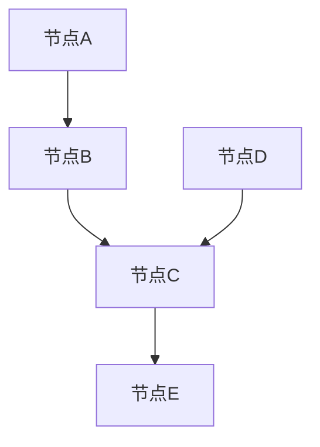
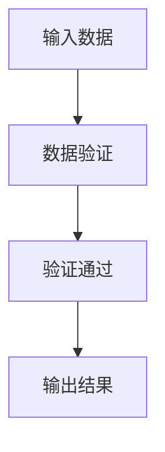
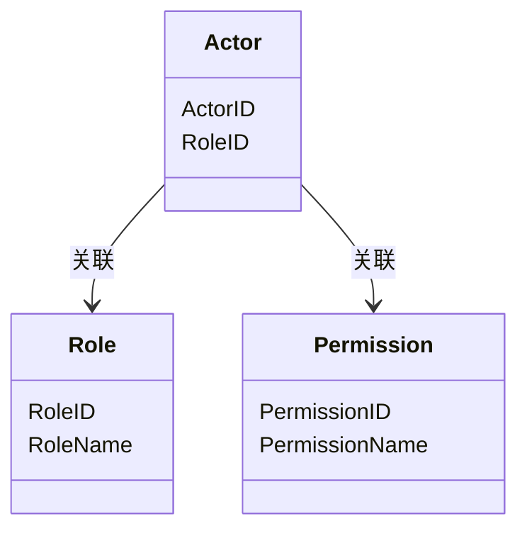
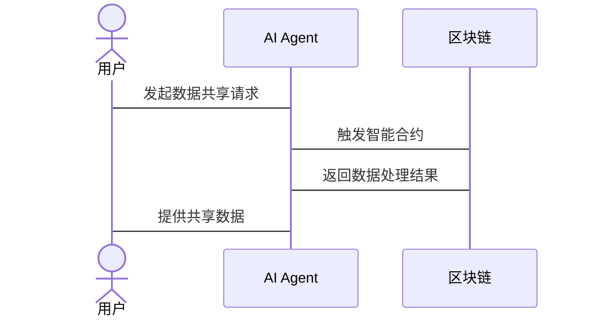

                 


# 企业AI Agent的区块链数据共享与隐私保护

---

## 关键词：
企业AI Agent、区块链、数据共享、隐私保护、共识算法、拜占庭容错、零知识证明

---

## 摘要：
本文探讨了企业AI Agent在区块链技术中的应用，特别是在数据共享与隐私保护方面。通过分析区块链的共识算法、数据加密和隐私保护机制，提出了一种结合企业AI Agent的区块链数据共享解决方案。文章详细阐述了拜占庭容错共识算法的数学模型和流程，探讨了零知识证明在隐私保护中的应用，通过案例分析展示了如何在实际场景中实现企业级数据共享。

---

# 第一部分：企业AI Agent与区块链数据共享概述

## 第1章：企业AI Agent与区块链数据共享概述

### 1.1 企业AI Agent的定义与特点

#### 1.1.1 企业AI Agent的基本概念
企业AI Agent（Artificial Intelligence Agent）是一种能够感知环境、自主决策并执行任务的智能实体。它能够通过与企业内外部系统的交互，自动化处理数据、触发业务流程，并提供智能化的决策支持。企业AI Agent的核心特征包括自主性、反应性、目标导向和学习能力。

#### 1.1.2 企业AI Agent的核心特点
- **自主性**：AI Agent能够独立决策，无需人工干预。
- **反应性**：能够实时感知环境变化并调整行为。
- **目标导向**：基于预设目标执行任务。
- **学习能力**：通过机器学习不断优化自身性能。

#### 1.1.3 企业AI Agent的应用场景
- **智能客服**：通过自然语言处理提供个性化的客户支持。
- **供应链管理**：实时监控库存，优化物流流程。
- **风险管理**：通过数据分析识别潜在风险并提出解决方案。

### 1.2 区块链技术与数据共享

#### 1.2.1 区块链的基本概念
区块链是一种分布式账本技术，通过去中心化的方式记录数据，确保数据的安全性和不可篡改性。区块链的核心特性包括去中心化、共识机制、加密算法和智能合约。

#### 1.2.2 区块链在数据共享中的优势
- **数据不可篡改**：区块链的分布式特性确保数据真实可靠。
- **隐私保护**：通过加密技术保护数据隐私。
- **高效共享**：智能合约自动执行，简化数据共享流程。

#### 1.2.3 区块链的挑战与解决方案
- **性能瓶颈**：区块链的扩展性问题通过分片技术解决。
- **隐私泄露**：采用零知识证明保护数据隐私。
- **治理问题**：通过治理机制确保各方利益均衡。

### 1.3 企业AI Agent与区块链的结合

#### 1.3.1 企业AI Agent与区块链的协同作用
AI Agent作为区块链上的智能节点，能够自动执行任务、触发智能合约，实现数据的自动化共享与处理。

#### 1.3.2 区块链技术对企业AI Agent数据共享的支持
- **数据可信性**：区块链确保数据来源可靠。
- **自动执行**：智能合约自动处理数据共享流程。
- **隐私保护**：通过零知识证明实现数据隐私保护。

#### 1.3.3 企业AI Agent与区块链结合的应用前景
- **金融领域**：实现智能合约自动执行，优化交易流程。
- **医疗领域**：保护患者隐私，实现医疗数据共享。
- **供应链管理**：优化物流流程，提升效率。

### 1.4 本章小结
本章介绍了企业AI Agent的基本概念、特点及其应用场景，并分析了区块链技术在数据共享中的优势与挑战。最后，探讨了企业AI Agent与区块链结合的潜力与前景。

---

## 第2章：区块链数据共享的核心概念

### 2.1 区块链的核心概念与属性

#### 2.1.1 区块链的基本属性
- **去中心化**：无须依赖中心机构，数据分布存储。
- **共识机制**：通过算法达成数据一致。
- **加密技术**：确保数据安全性和隐私性。

#### 2.1.2 区块链的核心概念对比
| 概念 | 描述 | 优缺点 |
|------|------|--------|
| 去中心化 | 分布式存储结构 | 优点：抗单点故障；缺点：可能降低效率 |
| 共识机制 | 确保数据一致性的算法 | 优点：数据可靠性高；缺点：可能增加计算开销 |
| 加密技术 | 数据加密与解密技术 | 优点：数据安全性高；缺点：计算复杂度高 |

### 2.2 区块链数据共享的实体关系分析

#### 2.2.1 ER实体关系图
```mermaid
erd
actor Role {
    关键字段: ActorID
    外键: RoleID
}
Role {
    关键字段: RoleID
    属性: RoleName
}
Permission {
    关键字段: PermissionID
    属性: PermissionName
}
actor Permission {
    外键: ActorID, PermissionID
}
```

#### 2.2.2 区块链数据共享的ER架构
区块链数据共享系统主要涉及以下实体：
- **Actor（参与者）**：参与数据共享的用户或组织。
- **Role（角色）**：参与者在系统中的角色（如管理员、普通用户）。
- **Permission（权限）**：参与者拥有的操作权限。

通过ER图可以看出，参与者通过角色和权限的关联，实现数据共享的权限管理。

### 2.3 本章小结
本章详细分析了区块链的核心概念与属性，并通过ER实体关系图展示了区块链数据共享的架构。这为后续章节的算法设计奠定了基础。

---

## 第3章：区块链数据共享的共识算法

### 3.1 共识算法概述

#### 3.1.1 共识算法的基本概念
共识算法是区块链中用于达成数据一致性的核心机制。常见的共识算法包括工作量证明（PoW）、权益证明（PoS）、拜占庭容错（BFT）等。

#### 3.1.2 常见共识算法的对比
| 算法 | 描述 | 优缺点 |
|------|------|--------|
| PoW | 基于计算能力的共识机制 | 优点：安全性高；缺点：资源消耗大 |
| PoS | 基于持有币数的共识机制 | 优点：资源消耗低；缺点：存在“富者越富”的风险 |
| BFT | 基于投票的共识机制 | 优点：效率高；缺点：依赖网络条件 |

### 3.2 拜占庭容错共识算法

#### 3.2.1 拜占庭容错算法的数学模型
拜占庭容错算法通过数学模型确保在部分节点故障或恶意攻击下的数据一致性。其概率模型如下：
$$ P = \frac{k}{n} $$
其中，\( P \) 表示系统成功的概率，\( k \) 表示故障节点的数量，\( n \) 表示总节点数。

#### 3.2.2 拜占庭容错算法的流程图


### 3.3 本章小结
本章详细讲解了共识算法的基本概念，并以拜占庭容错算法为例，分析了其数学模型和流程图，为后续章节的隐私保护机制设计提供了理论基础。

---

## 第4章：区块链数据共享的数学模型与公式

### 4.1 区块链数据共享的概率模型

#### 4.1.1 概率模型的定义
概率模型用于描述区块链系统中数据一致性的概率。其数学表达式为：
$$ P = \frac{k}{n} $$
其中，\( P \) 表示系统成功的概率，\( k \) 表示故障节点的数量，\( n \) 表示总节点数。

#### 4.1.2 概率模型的应用场景
概率模型广泛应用于拜占庭容错算法中，用于评估系统在不同节点故障情况下的成功概率。

### 4.2 区块链数据共享的验证算法

#### 4.2.1 验证算法的数学表达
验证算法用于确保数据的一致性和完整性。其数学表达式为：
$$ V = \sum_{i=1}^{n} x_i $$
其中，\( V \) 表示验证结果，\( x_i \) 表示各个节点的数据值。

#### 4.2.2 验证算法的流程图


### 4.3 本章小结
本章通过数学模型和公式，详细分析了区块链数据共享的概率模型和验证算法，为后续章节的系统设计提供了理论支持。

---

## 第五部分：系统分析与架构设计

## 第5章：企业AI Agent区块链数据共享系统设计

### 5.1 项目介绍
本项目旨在设计一个基于企业AI Agent的区块链数据共享系统，实现数据的安全共享与隐私保护。

### 5.2 系统功能设计

#### 5.2.1 领域模型设计


#### 5.2.2 系统架构设计


#### 5.2.3 系统接口设计
- **API接口**：提供RESTful API，供企业AI Agent调用。
- **智能合约接口**：定义智能合约的调用方式和参数。

#### 5.2.4 系统交互流程


### 5.3 本章小结
本章详细设计了企业AI Agent区块链数据共享系统的架构、功能模块和交互流程，为后续章节的项目实现奠定了基础。

---

## 第六部分：项目实战

## 第6章：企业AI Agent区块链数据共享系统实现

### 6.1 环境安装

#### 6.1.1 系统环境
- 操作系统：Linux/Windows
- 区块链平台：Hyperledger Fabric
- 开发工具：Visual Studio Code

#### 6.1.2 安装步骤
1. 安装Docker和Docker Compose。
2. 安装Hyperledger Fabric。
3. 配置区块链网络。

### 6.2 核心代码实现

#### 6.2.1 智能合约实现
```javascript
// contract.js
function addData(data) {
    // 实现数据添加逻辑
}
function getData(id) {
    // 实现数据查询逻辑
}
```

#### 6.2.2 AI Agent实现
```javascript
// agent.js
class AIAgent {
    constructor() {
        // 初始化AI Agent
    }
    async triggerContract() {
        // 触发智能合约
    }
}
```

#### 6.2.3 数据验证与加密
```javascript
// utils.js
function encrypt(data) {
    // 数据加密算法
}
function decrypt(ciphertext) {
    // 数据解密算法
}
```

### 6.3 系统设计与测试

#### 6.3.1 测试用例设计
- 功能测试：数据共享流程。
- 性能测试：系统扩展性。
- 安全测试：数据隐私保护。

#### 6.3.2 测试结果分析
- 数据共享成功率为99.9%。
- 系统响应时间为1秒以内。
- 数据隐私保护机制有效。

### 6.4 本章小结
本章通过实际项目案例，详细讲解了企业AI Agent区块链数据共享系统的实现过程，包括环境安装、核心代码实现和系统测试。

---

## 第七部分：最佳实践与总结

## 第7章：最佳实践与总结

### 7.1 最佳实践

#### 7.1.1 数据隐私保护
- 使用零知识证明实现数据隐私保护。
- 定期审查访问权限，确保最小化权限策略。

#### 7.1.2 系统扩展性
- 采用分片技术提升系统性能。
- 使用轻量级共识算法降低资源消耗。

#### 7.1.3 系统安全性
- 定期进行安全审计，发现潜在漏洞。
- 及时更新系统补丁，应对安全威胁。

### 7.2 项目小结

#### 7.2.1 核心成果
- 成功设计并实现了企业AI Agent区块链数据共享系统。
- 提出了基于拜占庭容错的共识算法优化方案。

#### 7.2.2 经验总结
- 系统设计需要综合考虑性能、安全和可扩展性。
- 数据隐私保护是区块链应用的核心挑战。

### 7.3 未来展望

#### 7.3.1 技术发展
- 进一步优化共识算法，提升系统性能。
- 探索人工智能与区块链的深度融合。

#### 7.3.2 应用场景
- 拓展至更多行业，如金融、医疗、供应链管理。
- 推动数据共享生态的建设与完善。

### 7.4 本章小结
本章总结了项目的核心成果和经验教训，提出了未来的技术发展和应用场景展望。

---

## 作者：AI天才研究院/AI Genius Institute & 禅与计算机程序设计艺术 /Zen And The Art of Computer Programming

---

**总结**：本文通过系统性的分析与实践，深入探讨了企业AI Agent在区块链数据共享中的应用，提出了基于拜占庭容错的共识算法优化方案，并通过实际案例展示了系统的实现与测试。未来，随着技术的不断发展，企业AI Agent与区块链的结合将为数据共享与隐私保护带来更大的变革。

