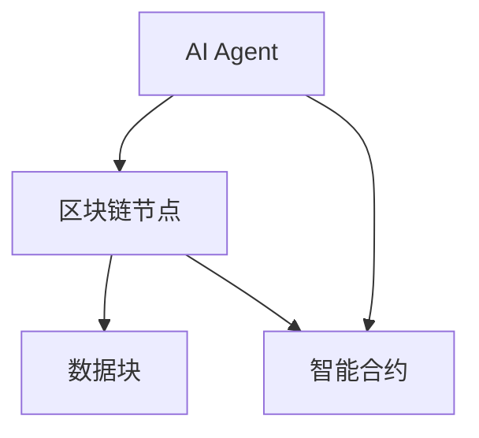

                 


# 企业AI Agent的区块链数据共享机制

> 关键词：区块链，AI Agent，数据共享，共识算法，决策模型

> 摘要：本文探讨了企业AI Agent如何利用区块链技术实现高效、安全的数据共享机制。通过分析区块链与AI Agent的核心原理、算法流程、系统架构及实际案例，阐述了如何结合两者优势，解决企业数据共享中的信任与安全问题。

---

## 第1章: 背景介绍

### 1.1 问题背景与描述

在当今数字化转型的浪潮中，企业之间的数据共享日益频繁，但传统的数据共享方式常常面临以下挑战：

- **信任缺失**：数据提供方和使用方之间缺乏信任，担心数据被滥用或泄露。
- **数据孤岛**：各企业或系统之间数据孤立，难以形成统一的决策支持。
- **安全问题**：数据在共享过程中可能被篡改或窃取，导致信息不完整或泄露。
- **效率低下**：复杂的审批流程和中间人介入导致数据共享效率降低。

区块链技术以其去中心化、不可篡改和可追溯的特点，为数据共享提供了新的解决方案。而AI Agent（人工智能代理）则能够自动化处理数据，进一步提升数据共享的效率和智能化水平。

### 1.2 问题解决与边界

区块链技术通过去中心化和智能合约，解决了数据共享中的信任和安全问题。AI Agent则通过智能化决策，优化了数据共享的流程。两者的结合能够实现高效、安全、智能的数据共享机制。

**边界与外延**：
- **边界**：本文主要探讨企业内部或企业之间的数据共享机制，不涉及个人隐私数据。
- **外延**：结合AI Agent的智能化决策，扩展数据共享的应用场景，如供应链管理、智能合约执行等。

### 1.3 核心概念与结构

数据共享机制的核心要素包括：
- **区块链**：提供数据的不可篡改性和去中心化存储。
- **AI Agent**：实现数据的自动化处理和决策。
- **共识算法**：确保数据的一致性和有效性。
- **数据模型**：描述数据的结构和关系。

---

## 第2章: 核心概念与联系

### 2.1 核心概念原理

- **区块链技术**：
  - 基于分布式账本，确保数据的一致性和不可篡改性。
  - 通过共识算法（如PoW、PoS）保证数据的有效性。

- **AI Agent**：
  - 一种能够自主决策的智能系统，能够根据数据做出最优选择。
  - 基于机器学习和强化学习算法，提升数据处理的智能化水平。

### 2.2 概念属性对比

下表对比了区块链与AI Agent的核心属性：

| **特性** | **区块链** | **AI Agent** |
|----------|------------|--------------|
| **基础技术** | 分布式账本 | 自主决策系统 |
| **核心功能** | 数据一致性 | 问题解决 |
| **应用场景** | 金融、供应链 | 企业自动化 |
| **数据处理** | 存储和验证 | 分析和决策 |

### 2.3 ER实体关系图

通过Mermaid图展示核心实体及其关系：

```mermaid
er
    actor(AI Agent)
    actor(区块链节点)
    actor(数据提供者)
    actor(数据消费者)
    entity(数据块)
    entity(区块链)
    entity(AI Agent状态)
    relation(拥有)
    relation(操作)
    relation(存储)
    relation(请求)
```

---

## 第3章: 算法原理讲解

### 3.1 区块链共识算法

区块链的共识算法确保所有节点达成一致，常见的共识算法包括：

- **工作量证明（PoW）**：通过计算找到特定哈希值的节点获得记账权。
- **权益证明（PoS）**：根据节点持有的代币数量分配记账权。

AI Agent在共识过程中可以起到监督作用，确保节点行为符合规范。

### 3.2 AI Agent决策算法

AI Agent的决策过程基于以下算法：

- **机器学习**：用于模式识别和预测。
- **强化学习**：通过奖励机制优化决策策略。
- **深度学习**：用于复杂数据的特征提取和分类。

### 3.3 数据共享算法

数据共享的具体步骤如下：

1. **数据加密**：使用区块链地址对数据进行加密。
2. **数据分割**：将数据分割为多个片段，存储在不同的区块链节点。
3. **数据请求**：AI Agent根据需求发起数据请求。
4. **数据验证**：区块链节点验证数据来源和完整性。
5. **数据共享**：通过智能合约实现数据的安全共享。

---

## 第4章: 数学模型与公式

### 4.1 区块链数学模型

- **哈希函数**：用于数据完整性验证。
  $$H(x) = \text{hash}(x)$$

- **共识概率**：节点被选为区块创建者的概率。
  $$P(i) = \text{概率}(i \text{被选为区块创建者})$$

### 4.2 AI Agent数学模型

- **决策树模型**：用于分类和回归。
  $$D(x) = \text{argmax}_y P(y|x)$$

- **强化学习模型**：通过奖励机制优化决策。
  $$Q(s, a) = r + \gamma \max_a Q(s', a')$$

---

## 第5章: 系统分析与架构设计

### 5.1 问题场景介绍

考虑一个企业供应链管理场景，各企业之间需要共享物流数据，以优化供应链效率。

### 5.2 系统功能设计

系统功能包括：
- 数据采集：AI Agent收集物流数据。
- 数据存储：区块链节点存储数据块。
- 数据验证：通过共识算法确保数据一致性。
- 数据共享：AI Agent根据需求调用智能合约，实现数据共享。

### 5.3 系统架构图

通过Mermaid图展示系统架构：



---

## 第6章: 项目实战

### 6.1 环境安装

- **区块链框架**：以太坊（Solidity语言）。
- **AI框架**：TensorFlow或PyTorch。

### 6.2 核心代码实现

```python
# 区块链节点代码（简化）
class Blockchain:
    def __init__(self):
        self.chain = []
        self.transactions = []

    def add_transaction(self, transaction):
        self.transactions.append(transaction)
        # 区块链共识算法实现（简化）
        self.chain.append(transaction)

# AI Agent决策代码
class AIAgent:
    def __init__(self):
        self.model = self.build_model()

    def build_model(self):
        # 简化模型定义
        return Sequential([
            Dense(64, input_shape=(input_dim,)),
            Dense(1)
        ])

    def decide(self, data):
        prediction = self.model.predict(data)
        return prediction
```

### 6.3 代码解读与分析

- **区块链节点**：负责存储交易数据，通过共识算法维护区块链的完整性。
- **AI Agent**：利用机器学习模型对数据进行分析，做出决策。

### 6.4 案例分析

通过实际案例分析，验证数据共享机制的有效性。例如，在供应链管理中，AI Agent能够实时监控物流数据，优化供应链效率。

---

## 第7章: 最佳实践与总结

### 7.1 最佳实践

- **安全性**：确保数据加密和访问控制。
- **可扩展性**：选择适合的共识算法，优化系统性能。
- **智能化**：不断提升AI Agent的学习能力和决策能力。

### 7.2 项目小结

本文详细探讨了企业AI Agent与区块链技术的结合，提出了一种高效、安全的数据共享机制。通过系统的分析和实际案例，验证了该机制的有效性和可行性。

### 7.3 注意事项

- **数据隐私**：需特别注意数据隐私保护，避免泄露敏感信息。
- **性能优化**：根据实际需求，优化系统的性能和扩展性。
- **合规性**：确保数据共享符合相关法律法规。

### 7.4 拓展阅读

推荐相关领域的书籍和文章，如《区块链技术与应用》、《AI Agent的理论与实践》等。

---

**作者：AI天才研究院 & 禅与计算机程序设计艺术**

