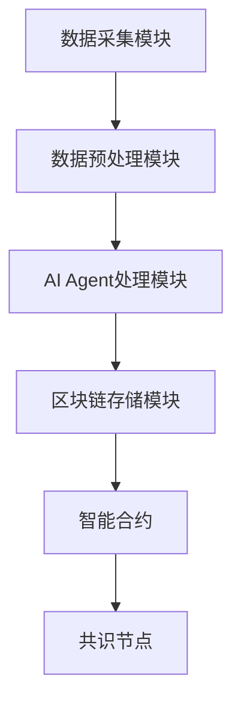

                 


# 《企业AI Agent的区块链数据审计系统》

---

## 关键词：企业AI Agent、区块链数据审计、数据完整性、智能合约、共识机制、去中心化

---

## 摘要：本文探讨企业AI Agent与区块链技术结合的数据审计系统，分析其原理、架构和实现，展示其在提升企业数据信任度和透明度中的应用。

---

## 引言：数据审计的重要性

随着数字化转型的推进，企业数据的准确性和完整性变得至关重要。传统数据审计依赖人工操作，效率低下且易受主观因素影响。区块链技术以其不可篡改性和透明性，为数据审计提供了新思路。AI Agent的引入，进一步提升了审计的智能化和自动化水平。本文将深入分析企业AI Agent在区块链数据审计中的应用，探讨其技术实现和优势。

---

## 第一章：核心概念与技术原理

### 1.1 企业AI Agent

企业AI Agent是具备自主决策和执行能力的智能实体，能够处理复杂数据任务。其特点包括：

- **自主性**：独立执行任务。
- **反应性**：实时响应数据变化。
- **协作性**：与其他系统或AI Agent协同工作。

### 1.2 区块链技术

区块链通过分布式账本和共识机制确保数据不可篡改。关键概念包括：

- **区块结构**：数据块由交易记录和哈希指针组成。
- **共识机制**：如PoW、PoS，确保数据一致性。
- **智能合约**：自动执行预设规则的脚本。

---

## 第二章：算法与数学模型

### 2.1 数据完整性验证算法

使用哈希函数验证数据完整性。例如，SHA-256函数：

$$ H(data) = SHA-256(data) $$

将数据转换为固定长度的哈希值，确保数据未被篡改。

### 2.2 共识机制数学模型

以工作量证明（PoW）为例，节点通过计算找到满足条件的哈希值：

$$ hash(block) < target $$

其中，target是难度目标值，确保网络安全性。

---

## 第三章：系统架构设计

### 3.1 系统架构图

展示系统模块划分，包括数据采集、AI Agent处理、区块链存储等部分。



### 3.2 接口设计

系统提供REST API接口，如：

- `/api/upload`：上传数据块。
- `/api/audit`：发起审计请求。
- `/api/result`：查询审计结果。

---

## 第四章：项目实战与案例分析

### 4.1 环境安装

安装必要的工具，如Python、Solidity、以太坊节点。

### 4.2 核心代码实现

实现数据审计的AI Agent和智能合约：

```python
def audit_data(data_block):
    hash_value = compute_hash(data_block)
    if verify_consensus(hash_value):
        return "Data is valid"
    else:
        return "Data is tampered"
```

### 4.3 案例分析

通过具体案例展示系统运作，如审计供应链数据，确保每个环节的信息真实可靠。

---

## 第五章：最佳实践与总结

### 5.1 优化建议

- 定期更新共识机制，防止算力集中。
- 加强AI Agent的自适应能力，提升审计效率。

### 5.2 未来展望

随着AI和区块链技术的融合，数据审计将更加智能化和自动化，为企业决策提供更可靠的支持。

---

## 作者：AI天才研究院 & 禅与计算机程序设计艺术

---

通过本文的详细分析，企业可以了解如何利用AI Agent和区块链技术提升数据审计能力，确保数据的真实性和透明度，推动企业数字化转型的深入发展。

