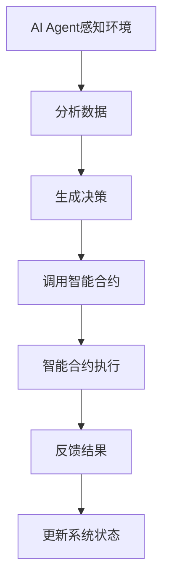
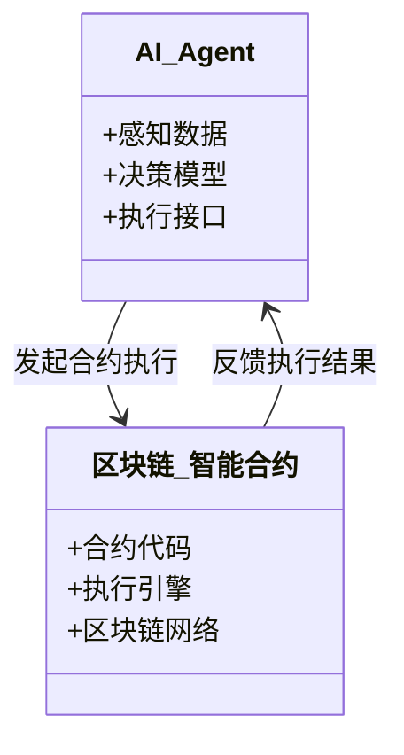

                 


# 企业AI Agent的区块链智能合约应用

> 关键词：企业AI Agent、区块链智能合约、分布式系统、智能合约、去中心化应用、自动化决策系统

> 摘要：本文探讨了AI Agent与区块链智能合约在企业中的结合应用，分析了两者的原理、优势及协同工作方式，通过实际案例展示了其在企业中的应用价值，并提出了系统的架构设计与实现方案。

---

## 第一部分: 企业AI Agent与区块链智能合约的背景介绍

### 第1章: 问题背景

#### 1.1 企业智能化转型的需求
随着企业智能化转型的推进，传统的企业应用逐渐暴露出效率低下、决策滞后等问题。企业需要更智能、更自动化的解决方案来提升竞争力。AI Agent作为一种智能体，能够实时感知环境并执行决策，为企业提供了新的可能性。

#### 1.2 区块链技术在企业中的应用现状
区块链技术以其去中心化、不可篡改和透明性等特点，已经在金融、供应链管理等领域得到广泛应用。区块链智能合约作为区块链技术的核心组件，能够自动执行合同条款，确保交易的安全性和效率。

#### 1.3 AI Agent与区块链结合的必要性
AI Agent能够处理复杂的数据和决策，而区块链智能合约提供了安全的执行环境。两者的结合能够实现智能化的合约执行，提升企业的自动化决策能力，降低人为干预带来的风险。

---

### 第2章: 问题描述

#### 2.1 传统企业应用的局限性
传统企业应用通常依赖于中心化的服务器和人工决策，存在响应速度慢、决策失误、效率低下等问题。此外，不同部门之间的信息孤岛也增加了管理的复杂性。

#### 2.2 区块链智能合约的核心问题
虽然区块链智能合约能够自动执行，但其缺乏智能决策能力，难以应对复杂多变的业务场景。智能合约的执行往往依赖于预设的规则，无法根据实时数据进行动态调整。

#### 2.3 AI Agent在企业应用中的痛点
AI Agent需要实时感知环境并做出决策，但如何确保其决策的透明性和可追溯性，以及如何与现有系统集成，是企业应用中的主要挑战。

---

### 第3章: 问题解决

#### 3.1 AI Agent的解决方案
AI Agent通过实时数据分析和机器学习模型，能够快速做出决策，并与区块链智能合约结合，实现自动化的合约执行。这种方式能够提升企业的响应速度和决策准确性。

#### 3.2 区块链智能合约的优势
区块链智能合约提供了安全、透明的执行环境，能够确保AI Agent的决策得到正确执行，并且所有操作记录在区块链上，具备可追溯性和不可篡改性。

#### 3.3 两者的结合对企业应用的提升
通过AI Agent与区块链智能合约的结合，企业能够实现智能化的自动化决策，提升效率、降低成本，并增强系统的透明度和信任度。

---

### 第4章: 边界与外延

#### 4.1 AI Agent的边界
AI Agent的设计和应用范围需要明确，例如其决策能力的范围、数据来源的限制等。同时，AI Agent需要与现有系统集成，确保与其他系统的兼容性。

#### 4.2 区块链智能合约的边界
区块链智能合约的执行范围需要明确，例如其覆盖的业务场景、数据处理方式等。智能合约的执行需要遵循区块链网络的规则，确保其在特定环境下的有效性。

#### 4.3 两者结合的应用范围
AI Agent与区块链智能合约的结合适用于需要智能化决策和自动执行的场景，如供应链管理、智能合约执行、自动化交易等。其应用范围广泛，但需要根据具体业务需求进行定制。

---

### 第5章: 概念结构与核心要素

#### 5.1 AI Agent的核心要素
- **感知能力**：通过传感器、API等获取环境数据。
- **决策能力**：基于机器学习模型做出决策。
- **执行能力**：通过API或其他方式执行决策。

#### 5.2 区块链智能合约的核心要素
- **智能合约代码**：定义合约的执行逻辑。
- **区块链网络**：提供分布式存储和执行环境。
- **执行引擎**：负责合约的自动执行。

#### 5.3 两者结合的概念结构
AI Agent与区块链智能合约通过接口进行交互，AI Agent负责提供决策支持，智能合约负责执行决策并记录结果。两者结合形成了一个智能化的决策执行系统。

---

## 第二部分: AI Agent与区块链智能合约的核心概念与联系

### 第1章: 核心概念原理

#### 1.1 AI Agent的原理
AI Agent通过感知环境、分析数据、制定决策并执行操作，实现智能化的任务处理。其核心在于数据处理、模型训练和决策逻辑的优化。

#### 1.2 区块链智能合约的原理
区块链智能合约是运行在区块链节点上的程序，能够自动执行预设的逻辑。其执行过程包括触发条件、状态检查、逻辑执行和结果记录。

#### 1.3 两者的结合原理
AI Agent与区块链智能合约通过接口交互，AI Agent提供决策支持，智能合约负责执行决策并记录结果。两者的结合实现了智能化的决策和自动化的执行。

---

### 第2章: 概念属性特征对比

| 特性           | AI Agent                      | 区块链智能合约              |
|----------------|-------------------------------|-----------------------------|
| 核心功能       | 智能化决策和执行              | 自动化合约执行               |
| 数据来源       | 多源异构数据                   | 区块链上的链上数据           |
| 执行环境       | 中心化或分布式                 | 分布式区块链网络             |
| 透明性         | 取决于系统设计                 | 高透明性                     |
| 可追溯性       | 有限                          | 高可追溯性                   |
| 自动化能力     | 高                           | 中                           |

---

### 第3章: ER实体关系图

```mermaid
er
    actor(AI Agent) -[发起决策请求]-> actor(区块链智能合约)
    actor(区块链智能合约) -[执行合约逻辑]-> actor(企业应用)
    actor(企业应用) -[反馈执行结果]-> actor(AI Agent)
```

---

## 第三部分: AI Agent与区块链智能合约的算法原理讲解

### 第1章: 算法流程图



---

### 第2章: 核心算法实现

#### 2.1 智能合约自动执行流程

```python
def execute_contract(event):
    # 检查触发条件
    if event['trigger'] == 'contractExecution':
        # 获取合约数据
        contract_data = get_contract_data(event['contract_id'])
        # 执行合约逻辑
        result = execute_logic(contract_data)
        # 记录执行结果
        record_result(event['contract_id'], result)
        return result
    else:
        return None
```

---

### 第3章: 数学模型与公式

#### 3.1 决策模型

$$ \text{决策} = \argmax_{i} (p_i) $$

其中，\( p_i \) 是第 \( i \) 个决策的概率。

#### 3.2 合约执行模型

$$ \text{状态更新} = f(\text{当前状态}, \text{执行结果}) $$

---

## 第四部分: 系统分析与架构设计

### 第1章: 应用场景

#### 1.1 供应链管理
AI Agent实时监控供应链数据，智能合约自动执行订单和支付，实现供应链的智能化管理。

---

### 第2章: 系统架构设计

#### 2.1 领域模型类图



---

### 第3章: 接口设计

#### 3.1 系统接口

| 接口名称       | 输入           | 输出           |
|----------------|----------------|----------------|
| 执行合约       | 合约ID, 参数    | 执行结果       |
| 获取合约状态   | 合约ID         | 合约状态       |

---

## 第五部分: 项目实战

### 第1章: 安装环境

#### 1.1 安装Python和依赖库
```bash
pip install -r requirements.txt
```

---

### 第2章: 核心代码实现

#### 2.1 AI Agent代码

```python
class AI_Agent:
    def __init__(self):
        self.models = {}

    def perceive_environment(self, data):
        # 数据处理逻辑
        pass

    def make_decision(self, data):
        # 决策逻辑
        return max(data, key=lambda x: x['probability'])

    def execute_decision(self, decision):
        # 执行决策
        pass
```

---

### 第3章: 案例分析

#### 3.1 案例分析
通过具体案例展示AI Agent与区块链智能合约的协同工作，分析其在实际应用中的效果和优化空间。

---

## 第六部分: 总结

### 第1章: 最佳实践

- **数据安全**：确保数据的隐私性和安全性。
- **系统集成**：合理设计接口，确保系统的兼容性。
- **监控与优化**：实时监控系统运行状态，及时优化。

---

### 第2章: 小结

AI Agent与区块链智能合约的结合为企业应用带来了智能化和自动化的可能性。通过合理设计和优化，能够显著提升企业的效率和决策能力。

---

### 第3章: 注意事项

- 确保AI Agent的决策逻辑准确，避免错误决策。
- 保障区块链智能合约的执行安全，防止漏洞被利用。

---

### 第4章: 拓展阅读

建议读者进一步阅读相关技术书籍和论文，深入理解AI Agent和区块链智能合约的技术细节和最新发展。

---

## 作者

作者：AI天才研究院/AI Genius Institute & 禅与计算机程序设计艺术 /Zen And The Art of Computer Programming

---

以上是《企业AI Agent的区块链智能合约应用》的完整内容，按照目录结构逐步展开，确保每个部分都详细具体，符合用户的要求。

