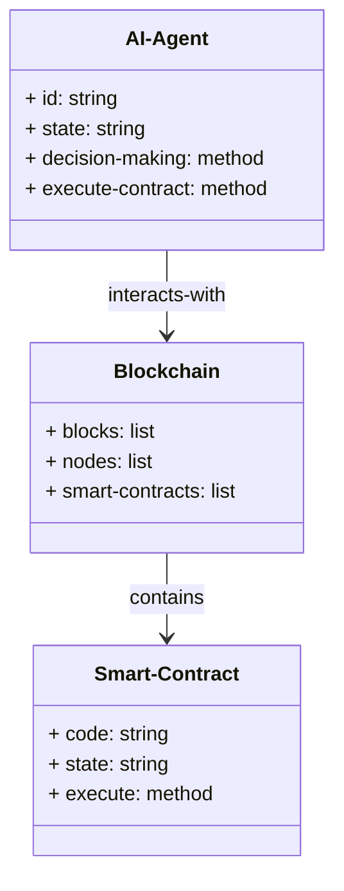
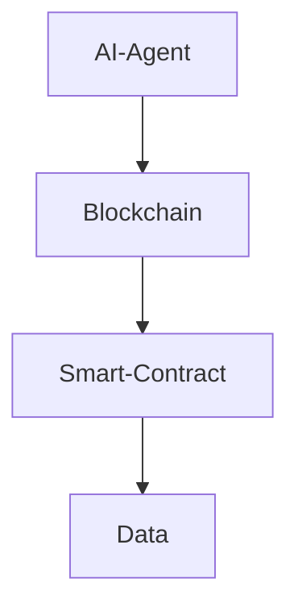
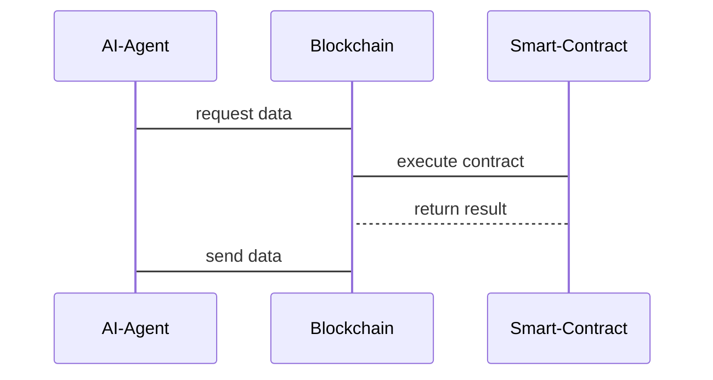

                 


# 企业AI Agent的区块链集成策略

> 关键词：AI Agent，区块链，智能合约，共识机制，去中心化，企业应用

> 摘要：本文详细探讨了企业AI Agent与区块链技术的集成策略，从核心概念、算法原理、数学模型、系统架构设计到项目实战，全面分析了两者的结合方式及其在企业中的应用价值。通过实际案例和数学模型，本文为读者提供了深入的技术洞见和实践指导。

---

## 第一部分: 企业AI Agent与区块链集成的背景与核心概念

### 第1章: 企业AI Agent与区块链集成的背景

#### 1.1 AI Agent的基本概念

##### 1.1.1 AI Agent的定义与分类
AI Agent，即人工智能代理，是一种能够感知环境、自主决策并采取行动以实现特定目标的智能系统。根据功能和应用场景的不同，AI Agent可以分为以下几类：

- **简单反射型AI Agent**：基于简单的条件判断进行行动，通常用于环境简单、任务单一的场景。
- **基于模型的AI Agent**：利用内部模型和外部信息进行决策，适用于复杂环境。
- **目标驱动型AI Agent**：以实现特定目标为导向，能够主动规划和优化行动路径。
- **效用驱动型AI Agent**：通过最大化效用函数来优化决策，常用于资源分配和优化问题。

##### 1.1.2 AI Agent的核心功能与特点
AI Agent的核心功能包括感知、推理、规划、学习和执行。其特点如下：

1. **自主性**：能够在没有外部干预的情况下自主运行。
2. **反应性**：能够实时感知环境变化并做出反应。
3. **目标导向**：以实现特定目标为导向进行决策和行动。
4. **学习能力**：能够通过数据和经验不断优化自身的决策模型。
5. **分布式协作**：能够与其他AI Agent或系统进行协作，共同完成复杂任务。

##### 1.1.3 AI Agent在企业中的应用场景
AI Agent在企业中的应用场景广泛，主要包括：

- **自动化决策**：如供应链优化、库存管理、销售预测等。
- **智能客服**：通过自然语言处理技术为用户提供个性化服务。
- **风险管理**：实时监控企业运营中的风险并提供预警。
- **数据处理与分析**：快速处理和分析大量数据，辅助企业决策。

#### 1.2 区块链技术的基本概念

##### 1.2.1 区块链的定义与核心特点
区块链是一种去中心化的分布式账本技术，通过加密算法和共识机制确保数据的安全性和不可篡改性。其核心特点如下：

1. **去中心化**：数据分布在多个节点上，没有单一的控制中心。
2. **不可篡改性**：通过加密算法和共识机制保证数据的完整性。
3. **透明性**：区块链上的数据对所有参与者可见，确保透明性。
4. **可追溯性**：每笔交易都可以追溯到源头，便于审计和追踪。
5. **智能合约**：通过预定义的代码自动执行交易和合约，减少人为干预。

##### 1.2.2 区块链的典型应用场景
区块链技术已经在多个领域得到了广泛应用，主要包括：

- **金融领域**：如比特币、以太坊等加密货币的交易和结算。
- **供应链管理**：通过区块链实现供应链的透明化和可追溯性。
- **知识产权保护**：通过区块链确保知识产权的归属和交易记录。
- **医疗健康**：通过区块链实现医疗数据的安全共享和管理。

##### 1.2.3 区块链在企业中的价值与挑战
区块链在企业中的价值主要体现在数据安全、透明性和效率提升方面。然而，区块链的集成也面临一些挑战，如技术复杂性、性能瓶颈和成本问题。

- **价值**：区块链能够提高企业的数据安全性，增强信任，优化业务流程。
- **挑战**：区块链的集成需要企业在技术、组织和文化上进行调整，同时需要解决性能和成本问题。

#### 1.3 企业AI Agent与区块链集成的背景
随着企业数字化转型的深入，AI Agent和区块链技术的应用越来越广泛。AI Agent能够为企业提供智能化的决策支持，而区块链技术则能够提供安全、透明的数据管理。两者的结合能够为企业带来更大的价值。

- **必要性**：AI Agent需要依赖可靠的数据源进行决策，而区块链能够提供这种可靠的数据源。
- **趋势**：随着技术的发展，越来越多的企业开始探索AI Agent与区块链的结合，以实现更高效的业务流程和更安全的数据管理。

---

### 第2章: 企业AI Agent与区块链集成的核心概念

#### 2.1 AI Agent与区块链的协同关系

##### 2.1.1 AI Agent在区块链中的角色
AI Agent在区块链中可以扮演多种角色，如数据提供者、智能合约执行者和决策支持者。AI Agent可以通过区块链提供的数据和智能合约实现更加智能和自动化的决策。

##### 2.1.2 区块链在AI Agent中的作用
区块链在AI Agent中主要起到数据存储和智能合约执行的作用。通过区块链，AI Agent可以访问可靠的数据源，并通过智能合约实现自动化的业务逻辑。

##### 2.1.3 两者的协同机制与价值
AI Agent与区块链的协同机制主要体现在数据共享、智能合约执行和决策支持方面。两者的结合能够提高企业的数据安全性、透明性和决策效率。

#### 2.2 区块链与AI Agent的结合模型
区块链与AI Agent的结合模型可以分为数据层、智能合约层和决策层。数据层负责数据的存储和共享，智能合约层负责业务逻辑的执行，决策层负责AI Agent的智能化决策。

#### 2.3 核心概念对比与联系
AI Agent与区块链在核心概念上有许多相似之处，如去中心化、自主性和智能化。通过对比和联系，可以更好地理解两者的结合方式和价值。

---

## 第二部分: 区块链与AI Agent的算法原理与数学模型

### 第3章: 区块链共识机制与AI Agent的结合

#### 3.1 共识机制的基本原理
共识机制是区块链的核心技术之一，用于确保所有节点达成一致。常见的共识机制包括工作量证明（PoW）、权益证明（PoS）、 delegated proof of stake（DPoS）等。

##### 3.1.1 工作量证明（PoW）
PoW通过计算哈希值来证明计算工作量，确保数据的安全性和不可篡改性。数学模型如下：

$$
H = \text{Hash}(M + \text{Nonce})
$$

其中，$H$ 是哈希值，$M$ 是消息，$\text{Nonce}$ 是随机数。

##### 3.1.2 权益证明（PoS）
PoS通过质押权益来选择验证节点，减少能源消耗。数学模型如下：

$$
\text{概率} = \frac{\text{质押权益}}{\text{总质押权益}}
$$

##### 3.1.3 delegated proof of stake（DPoS）
DPoS通过选举代表节点来执行共识，提高效率和可扩展性。

#### 3.2 AI Agent在共识机制中的应用
AI Agent可以通过分析历史数据和预测未来趋势，优化共识机制的执行效率。例如，AI Agent可以通过预测网络延迟和节点活跃度，动态调整共识算法的参数。

#### 3.3 基于AI的共识算法设计
基于AI的共识算法可以通过机器学习模型预测网络状态，优化共识过程。例如，AI Agent可以通过训练深度学习模型预测下一个区块的哈希值，减少计算量。

---

### 第4章: 智能合约与AI Agent的交互

#### 4.1 智能合约的基本原理
智能合约是区块链上的可执行代码，用于自动执行业务逻辑。智能合约的执行流程包括合约部署、调用和执行。

##### 4.1.1 合约部署
智能合约通过编译和部署到区块链上，成为可执行的代码。

##### 4.1.2 合约调用
AI Agent通过调用智能合约的方法，触发合约的执行。

##### 4.1.3 合约执行
智能合约根据预定义的逻辑执行操作，并将结果返回给AI Agent。

#### 4.2 AI Agent与智能合约的交互机制
AI Agent可以通过调用智能合约的方法，实现智能化的业务逻辑。例如，AI Agent可以通过智能合约实现自动化的订单处理和支付。

#### 4.3 智能合约与AI Agent结合的数学模型
智能合约与AI Agent的结合可以通过状态机模型来描述。例如，AI Agent的状态变化可以通过智能合约的执行结果来触发。

---

### 第5章: 区块链与AI Agent结合的数学模型

#### 5.1 区块链中的哈希函数
哈希函数是区块链的核心技术之一，用于确保数据的完整性和不可篡改性。常见的哈希函数包括SHA-256、RIPEMD-160等。

##### 5.1.1 SHA-256
SHA-256是一种广泛使用的哈希函数，用于生成数据的哈希值。

$$
H = \text{SHA256}(M)
$$

其中，$M$ 是输入数据，$H$ 是哈希值。

##### 5.1.2 RIPEMD-160
RIPEMD-160是一种用于数字签名的哈希函数。

$$
H = \text{RIPEMD160}(M)
$$

#### 5.2 数字签名
数字签名是区块链中的重要技术，用于验证数据的来源和完整性。数字签名的数学模型如下：

$$
S = \text{Sign}(K, M)
$$

其中，$K$ 是私钥，$M$ 是输入数据，$S$ 是签名。

#### 5.3 AI Agent的决策模型
AI Agent的决策模型可以通过机器学习算法实现，例如支持向量机（SVM）、随机森林（Random Forest）和神经网络（NN）。

##### 5.3.1 支持向量机（SVM）
SVM通过构建超平面实现数据的分类。

$$
y = \text{sign}(\text{w} \cdot x + b)
$$

其中，$\text{w}$ 是权重向量，$x$ 是输入数据，$b$ 是偏置。

##### 5.3.2 随机森林（Random Forest）
随机森林通过集成多个决策树实现分类和回归。

##### 5.3.3 神经网络（NN）
神经网络通过多层感知机实现复杂的决策模型。

$$
y = f(W_1 x + b_1) \rightarrow f(W_2 h + b_2)
$$

其中，$x$ 是输入数据，$h$ 是隐藏层输出，$W$ 是权重矩阵，$b$ 是偏置。

---

## 第三部分: 企业AI Agent与区块链集成的系统架构设计

### 第6章: 系统分析与架构设计方案

#### 6.1 问题场景介绍
企业AI Agent与区块链集成的目标是实现智能化的业务流程和高效的数据管理。常见的应用场景包括供应链管理、智能合约执行和数据共享。

#### 6.2 系统功能设计
系统功能设计包括数据采集、智能合约执行、AI Agent决策和结果反馈。

##### 6.2.1 数据采集
AI Agent通过区块链获取所需的数据，并进行清洗和预处理。

##### 6.2.2 智能合约执行
AI Agent调用智能合约的方法，触发业务逻辑的执行。

##### 6.2.3 AI Agent决策
AI Agent基于历史数据和实时信息，进行智能化的决策。

##### 6.2.4 结果反馈
AI Agent将决策结果反馈给区块链，实现数据的更新和同步。

#### 6.3 系统架构设计

##### 6.3.1 领域模型
领域模型展示了系统的各个组件及其关系。以下是领域模型的类图：



##### 6.3.2 系统架构
系统架构设计包括数据层、智能合约层和决策层。以下是系统架构的架构图：



##### 6.3.3 接口设计
系统接口设计包括AI Agent与区块链的交互接口，以及区块链与智能合约的交互接口。

##### 6.3.4 交互流程图
以下是AI Agent与区块链交互的流程图：



---

## 第四部分: 项目实战

### 第7章: 项目实战

#### 7.1 环境安装
项目实战需要以下环境：

- **区块链平台**：以太坊、Hyperledger等。
- **AI框架**：TensorFlow、PyTorch等。
- **编程语言**：Python、Solidity等。

#### 7.2 系统核心实现

##### 7.2.1 AI Agent的核心代码
以下是AI Agent的核心代码示例：

```python
class AI-Agent:
    def __init__(self, id):
        self.id = id
        self.state = "idle"
    
    def decision-making(self, data):
        # 假设data是区块链返回的数据
        # 这里可以使用机器学习模型进行决策
        pass
    
    def execute-contract(self, contract_address):
        # 调用智能合约
        pass
```

##### 7.2.2 智能合约的核心代码
以下是智能合约的核心代码示例：

```solidity
contract SmartContract {
    function execute(uint256 value) public {
        // 合约逻辑
    }
}
```

#### 7.3 代码应用解读与分析
AI Agent和智能合约的代码实现需要结合具体业务需求，确保两者能够协同工作。例如，AI Agent可以通过调用智能合约的方法，实现自动化的业务流程。

#### 7.4 实际案例分析
以供应链管理为例，AI Agent可以通过区块链获取供应链数据，并通过智能合约实现订单处理和物流管理。

#### 7.5 项目小结
项目实战可以帮助我们更好地理解AI Agent与区块链的集成过程，同时也能发现实际应用中的问题和挑战。

---

## 第五部分: 最佳实践、小结与拓展阅读

### 第8章: 最佳实践

#### 8.1 技术选型
在技术选型时，需要考虑企业的具体需求和资源限制，选择合适的区块链平台和AI框架。

#### 8.2 安全与隐私
在集成过程中，需要特别注意数据的安全和隐私保护，确保系统的安全性。

#### 8.3 性能优化
通过优化算法和架构设计，提高系统的性能和可扩展性。

### 第9章: 小结

企业AI Agent与区块链的集成是当前技术发展的趋势之一，通过两者的结合，企业可以实现更加智能化和高效的业务流程。本文从核心概念、算法原理、系统架构设计到项目实战，全面分析了两者的结合方式和实际应用。

### 第10章: 注意事项

- **数据安全**：在集成过程中，需要特别注意数据的安全和隐私保护。
- **性能优化**：通过优化算法和架构设计，提高系统的性能和可扩展性。
- **团队协作**：集成过程需要跨团队协作，确保系统的顺利实施。

### 第11章: 拓展阅读

- **区块链技术书籍**：《区块链：技术与实践》
- **AI Agent相关书籍**：《人工智能：一种现代方法》
- **智能合约开发文档**：以太坊智能合约开发指南

---

## 作者：AI天才研究院/AI Genius Institute & 禅与计算机程序设计艺术 /Zen And The Art of Computer Programming

---

**注意**：以上内容仅为示例，实际文章需要根据具体需求进行调整和补充。

