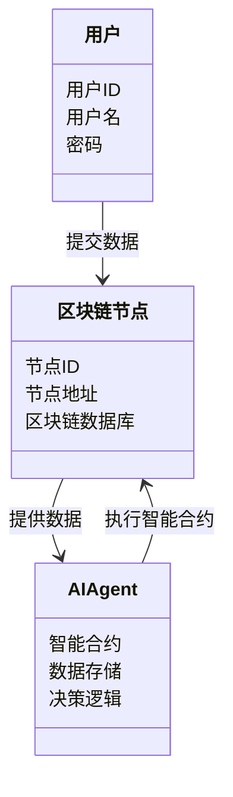
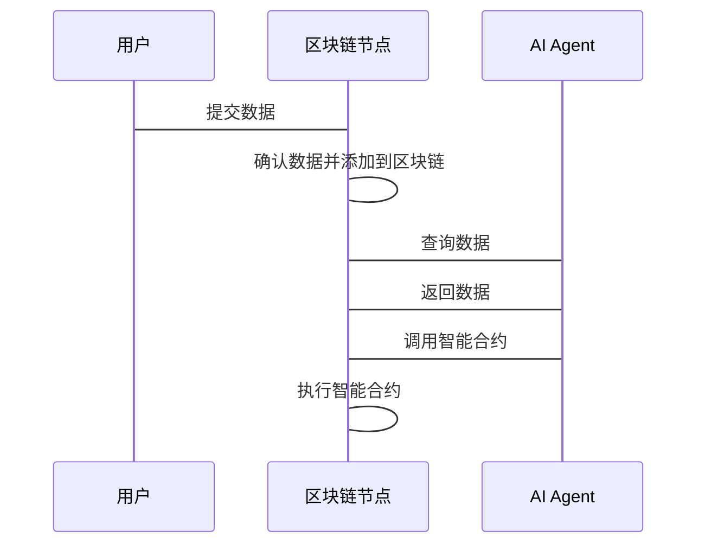

                 


# 企业AI Agent的区块链集成：提升数据可信度

## 关键词：
企业AI Agent，区块链集成，数据可信度，智能合约，共识机制，去中心化

## 摘要：
本文详细探讨了企业AI Agent与区块链技术的集成，分析了区块链如何提升AI Agent的数据可信度。通过结合区块链的可信数据存储和AI Agent的智能决策机制，提出了优化企业数据管理的新思路。文章从核心概念、技术原理、系统架构到项目实战，全面解析了AI Agent与区块链的集成过程，为企业在数字化转型中提供了新的解决方案。

---

## 第一部分: 企业AI Agent与区块链集成概述

### 第1章: 企业AI Agent与区块链概述

#### 1.1 企业AI Agent的基本概念
##### 1.1.1 AI Agent的定义与特点
AI Agent（人工智能代理）是一种能够感知环境、自主决策并执行任务的智能实体。它具有以下特点：
- **自主性**：能够独立做出决策。
- **反应性**：能实时感知环境变化并做出响应。
- **社会性**：能与其他系统或用户进行交互。
- **学习能力**：能通过数据和经验不断优化自身行为。

##### 1.1.2 企业级AI Agent的应用场景
企业AI Agent广泛应用于多个领域，例如：
- **智能客服**：通过自然语言处理提供24/7的客户支持。
- **供应链管理**：优化库存、物流和订单处理流程。
- **金融分析**：实时监控市场动态，辅助投资决策。

##### 1.1.3 区块链技术的基本概念
区块链是一种去中心化的分布式账本技术，具有以下特点：
- **去中心化**：数据不依赖单一中心节点，分布在网络的各个节点。
- **不可篡改**：通过加密算法确保数据的安全性和不可篡改性。
- **透明性**：区块链上的交易记录对所有参与者公开，确保透明度。

#### 1.2 区块链在企业中的应用价值
##### 1.2.1 区块链的核心特性
区块链的核心特性包括：
- **去中心化**：消除单点故障，提升系统的可靠性和安全性。
- **共识机制**：通过算法确保所有节点达成一致，保证数据的真实性和一致性。
- **智能合约**：自动化执行预定义的规则和条款，减少人为干预。

##### 1.2.2 区块链在企业数据可信度中的作用
区块链通过去中心化和不可篡改的特性，解决了企业数据管理中的信任问题。例如：
- **数据完整性**：区块链确保数据在传输和存储过程中不被篡改。
- **数据透明性**：区块链上的数据对所有授权方公开，增加透明度。
- **数据溯源**：区块链可以追踪数据的来源和修改历史，便于审计和追溯。

##### 1.2.3 AI Agent与区块链的结合优势
AI Agent与区块链的结合能够充分发挥双方的优势：
- **数据可信度**：区块链提供可信的数据源，AI Agent基于可信数据做出决策。
- **智能合约**：AI Agent可以调用智能合约，自动化执行任务，减少人工干预。
- **去中心化决策**：区块链的去中心化特性为AI Agent提供了更广阔的应用场景。

#### 1.3 本章小结
本章介绍了AI Agent和区块链的基本概念，分析了区块链在企业中的应用价值，并探讨了AI Agent与区块链结合的优势。这为后续章节的技术细节分析奠定了基础。

---

## 第二部分: AI Agent与区块链的核心概念与联系

### 第2章: AI Agent与区块链的核心概念

#### 2.1 AI Agent的智能决策机制
##### 2.1.1 AI Agent的决策模型
AI Agent的决策模型通常包括以下步骤：
1. **感知环境**：通过传感器或API获取环境数据。
2. **分析数据**：利用机器学习算法对数据进行分析和处理。
3. **制定策略**：基于分析结果，制定最优决策策略。
4. **执行操作**：根据决策结果执行相应的操作。

##### 2.1.2 基于区块链的可信数据源
AI Agent的决策依赖于高质量的数据。区块链通过去中心化和不可篡改的特性，确保数据源的可信度。例如：
- **数据存证**：将重要数据存储在区块链上，确保数据的真实性和完整性。
- **数据溯源**：通过区块链记录数据的来源和修改历史，便于审计和追溯。

#### 2.2 区块链的可信数据存储
##### 2.2.1 区块链的数据存储特性
区块链的数据存储特性包括：
- **分布式存储**：数据分布在多个节点上，避免单点故障。
- **不可篡改性**：通过加密算法确保数据在存储过程中不被篡改。
- **可追溯性**：区块链上的每一条记录都包含时间戳和交易哈希，便于追溯。

##### 2.2.2 数据可信度的衡量标准
数据可信度的衡量标准包括：
- **完整性**：数据是否完整，没有缺失或损坏。
- **真实性**：数据是否真实，没有被篡改或伪造。
- **一致性**：数据在不同节点之间是否一致。

#### 2.3 AI Agent与区块链的实体关系图
```mermaid
erDiagram
    actor 用户
    actor 区块链节点
    actor AI Agent
    database 区块链数据库
    object 数据块
    object 智能合约
    用户 --> 区块链节点: 提交数据
    区块链节点 --> 数据块: 存储数据
    区块链节点 --> 智能合约: 执行合约
    AI Agent --> 数据块: 查询数据
```

#### 2.4 本章小结
本章详细探讨了AI Agent的智能决策机制和区块链的可信数据存储特性，并通过实体关系图展示了两者之间的关系。这为后续章节的技术实现提供了理论基础。

---

## 第三部分: 区块链技术的原理与应用

### 第3章: 区块链技术的原理

#### 3.1 区块链的共识机制
##### 3.1.1 共识机制的定义
共识机制是指区块链网络中所有节点就某个数据达成一致的过程。常见的共识机制包括：
- **工作量证明（PoW）**：通过计算哈希值来证明工作量。
- **权益证明（PoS）**：根据节点持有的代币数量来决定记账权。
- **实用拜占庭共识（PBFT）**：适用于高性能区块链的共识算法。

##### 3.1.2 常见共识算法对比
以下是对常见共识算法的对比：
| 特性          | PoW           | PoS           | PBFT          |
|---------------|---------------|---------------|---------------|
| 手法          | 计算哈希       | 持有代币       | 高性能         |
| 优点          | 安全性高       | 能耗低         | 速度快         |
| 缺点          | 能耗高         | 易被操控       | 对网络依赖高    |

##### 3.1.3 实例分析：PoW、PoS等算法
以PoW为例，挖矿过程如下：
1. **交易打包**：将未确认的交易打包成一个区块。
2. **计算哈希**：矿工通过计算哈希值来寻找符合条件的随机数。
3. **区块验证**：其他节点验证区块的哈希值是否正确。
4. **区块添加**：正确的区块被添加到区块链中，矿工获得奖励。

#### 3.2 智能合约的工作原理
##### 3.2.1 智能合约的定义
智能合约是区块链上的自动化程序，用于在满足特定条件时自动执行操作。例如：
- **支付合同**：当某个条件满足时，自动进行资金转移。
- **供应链管理**：当货物到达某个位置时，自动触发相关操作。

##### 3.2.2 智能合约的实现
以下是用Solidity语言实现的简单智能合约示例：
```solidity
// SPDX-License-Identifier: MIT
pragma solidity ^0.8.0;

contract SimpleStorage {
    uint256 public storedValue;

    function setValue(uint256 _value) external {
        storedValue = _value;
    }
}
```

##### 3.2.3 智能合约的安全性
智能合约的安全性依赖于代码的正确性和区块链网络的可靠性。常见的安全风险包括：
- **代码漏洞**：合约代码中的逻辑错误可能导致资金损失。
- **恶意攻击**：攻击者可能利用合约漏洞进行攻击。

#### 3.3 区块链的共识机制与AI Agent的结合
AI Agent可以通过调用智能合约来实现自动化决策。例如：
1. **数据存储**：AI Agent将数据存储在区块链上，确保数据的可信度。
2. **数据查询**：AI Agent通过智能合约查询区块链上的数据。
3. **自动化操作**：AI Agent根据查询结果，触发智能合约执行相应的操作。

#### 3.4 本章小结
本章详细讲解了区块链的共识机制和智能合约的工作原理，并分析了它们与AI Agent的结合方式。这为后续章节的技术实现提供了理论支持。

---

## 第四部分: 系统分析与架构设计

### 第4章: 系统分析与架构设计

#### 4.1 项目背景
本项目旨在通过AI Agent与区块链的集成，提升企业数据的可信度。项目的主要目标包括：
- **数据可信度提升**：通过区块链技术确保数据的真实性和完整性。
- **自动化决策**：通过AI Agent实现数据的自动化分析和决策。

#### 4.2 系统功能设计
##### 4.2.1 领域模型
以下是系统的领域模型：


##### 4.2.2 系统架构
以下是系统的架构设计：


##### 4.2.3 接口设计
系统的主要接口包括：
- **数据提交接口**：用户通过API提交数据到区块链节点。
- **数据查询接口**：AI Agent通过API查询区块链上的数据。
- **智能合约调用接口**：AI Agent通过API调用区块链上的智能合约。

##### 4.2.4 交互流程
以下是系统的交互流程：


#### 4.3 本章小结
本章详细分析了项目的背景、功能设计、系统架构和交互流程，为后续章节的实现提供了明确的指导。

---

## 第五部分: 项目实战

### 第5章: 项目实战

#### 5.1 环境安装
以下是项目实战所需的环境配置：
- **操作系统**：Linux或Windows
- **区块链框架**：以太坊（Ganache）
- **编程语言**：Solidity、JavaScript
- **开发工具**：Visual Studio Code、MetaMask

#### 5.2 核心代码实现
##### 5.2.1 智能合约实现
以下是实现的智能合约代码：
```solidity
// SPDX-License-Identifier: MIT
pragma solidity ^0.8.0;

contract DataStorage {
    string public data;

    function setData(string calldata _data) external {
        data = _data;
    }

    function getData() external view returns (string memory) {
        return data;
    }
}
```

##### 5.2.2 AI Agent实现
以下是AI Agent的实现代码：
```javascript
const Web3 = require('web3');
const web3 = new Web3(new Web3.providers.HttpProvider('http://localhost:8545'));

async function main() {
    // 获取智能合约实例
    const contractAddress = '0x...'; // 替换为实际地址
    const contractABI = /* 替换为实际ABI */;

    const contract = new web3.eth.Contract(contractABI, contractAddress);

    // 提交数据
    await contract.methods.setData('test data').send();

    // 查询数据
    const data = await contract.methods.getData().call();
    console.log('Data:', data);

    // 调用智能合约
    await contract.methods.executeContract().send();
}

main();
```

##### 5.2.3 案例分析
假设我们有一个供应链管理项目，AI Agent可以自动监控货物状态并触发相应的操作。以下是具体的实现步骤：
1. **数据存储**：供应商将货物信息存储在区块链上。
2. **数据查询**：AI Agent查询货物的状态。
3. **自动化操作**：当货物到达某个位置时，AI Agent触发智能合约进行货物转移。

#### 5.3 项目小结
本章通过实际案例展示了AI Agent与区块链集成的实现过程，包括环境配置、代码实现和案例分析。

---

## 第六部分: 总结与展望

### 第6章: 总结与展望

#### 6.1 总结
本文详细探讨了企业AI Agent与区块链的集成，分析了区块链如何提升数据可信度。通过结合AI Agent的智能决策机制和区块链的可信数据存储特性，提出了一种优化企业数据管理的新思路。

#### 6.2 当前应用中的挑战
当前AI Agent与区块链集成面临以下挑战：
- **技术复杂性**：区块链和AI技术的结合需要较高的技术门槛。
- **安全性问题**：智能合约的安全性需要进一步提升。
- **性能瓶颈**：区块链的性能可能限制AI Agent的实时性要求。

#### 6.3 未来发展方向
未来的发展方向包括：
- **技术优化**：进一步优化共识机制和智能合约的性能。
- **跨链技术**：实现不同区块链之间的互操作性。
- **应用拓展**：探索更多AI Agent与区块链结合的应用场景。

#### 6.4 最佳实践 Tips
- **数据完整性**：确保数据在区块链上的完整性和一致性。
- **安全性保障**：定期审计智能合约，确保代码的安全性。
- **性能优化**：选择合适的共识机制，提升系统的性能。

#### 6.5 本章小结
本章总结了本文的核心内容，分析了当前应用中的挑战，并展望了未来的发展方向。这为读者提供了进一步学习和研究的方向。

---

## 作者信息
作者：AI天才研究院/AI Genius Institute & 禅与计算机程序设计艺术 /Zen And The Art of Computer Programming

---

通过以上内容，我们系统性地分析了企业AI Agent与区块链集成的各个方面，从理论到实践，为读者提供了全面的知识和指导。

