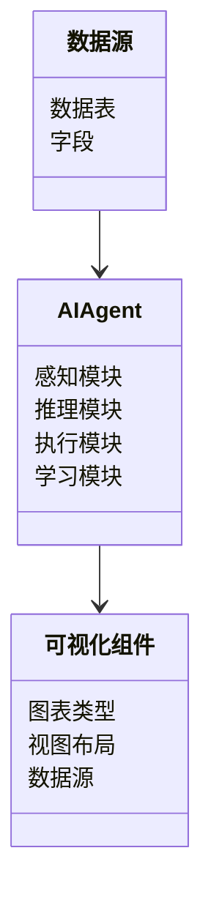
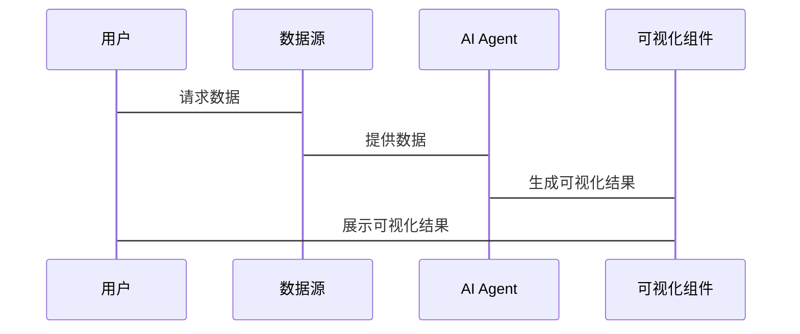
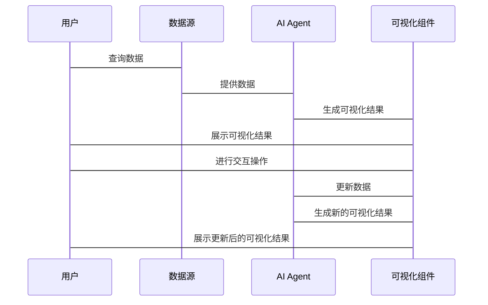

                 


# 企业AI Agent的可视化分析工具

## 关键词：企业AI Agent，可视化分析工具，数据可视化，人工智能，系统架构设计，机器学习

## 摘要：  
企业AI Agent的可视化分析工具是一种结合人工智能和数据可视化技术的创新解决方案，旨在通过直观的图形界面帮助企业用户更高效地理解和优化复杂的业务流程。本文将从AI Agent的基本概念、可视化分析工具的核心功能、算法原理、系统架构设计、项目实战以及最佳实践等多个维度，详细探讨企业AI Agent可视化分析工具的构建与应用，为企业智能化转型提供有价值的参考。

---

## 第1章: 企业AI Agent与可视化分析工具的背景

### 1.1 AI Agent的基本概念

#### 1.1.1 AI Agent的定义  
人工智能代理（AI Agent）是指能够感知环境、自主决策并执行任务的智能实体。它可以是一个软件程序、一个机器人，或者一个嵌入式系统，其核心目标是通过智能化手段提高任务执行效率。

#### 1.1.2 AI Agent的核心特征  
- **自主性**：能够在没有人工干预的情况下独立执行任务。  
- **反应性**：能够实时感知环境变化并做出相应调整。  
- **学习能力**：通过机器学习算法不断优化自身行为。  
- **协作性**：能够与其他AI Agent或系统协同工作。  

#### 1.1.3 企业级AI Agent的应用场景  
- **自动化决策**：如供应链管理中的库存优化、销售预测。  
- **客户互动**：如智能客服、个性化推荐系统。  
- **风险管理**：如 fraud detection 和实时监控。  

### 1.2 可视化分析工具的定义与作用

#### 1.2.1 可视化分析工具的定义  
可视化分析工具是一种利用图形、图表、仪表盘等方式，将数据或信息以直观形式呈现的工具。它能够帮助用户快速理解复杂的数据关系、趋势和模式。

#### 1.2.2 可视化分析工具的核心功能  
- **数据呈现**：通过图表、热力图等方式展示数据。  
- **交互分析**：支持用户与图表的交互，如筛选、钻取、联动分析。  
- **实时更新**：能够实时反映数据变化。  
- **定制化设计**：支持用户根据需求自定义仪表盘布局。  

#### 1.2.3 企业级AI Agent可视化分析工具的价值  
- **提升决策效率**：通过直观的数据展示，帮助用户快速做出决策。  
- **降低学习门槛**：将复杂的AI计算结果转化为易于理解的可视化形式。  
- **增强协作能力**：支持团队成员通过可视化工具共享和分析数据。  

### 1.3 企业AI Agent与可视化分析工具的结合

#### 1.3.1 AI Agent如何赋能可视化分析  
AI Agent可以通过实时数据分析、自动预测和推荐，为可视化分析工具提供动态数据源，使可视化结果更加智能化和实时化。

#### 1.3.2 可视化分析工具如何提升AI Agent的用户体验  
可视化分析工具将AI Agent的内部运算过程和结果以图形化方式呈现，帮助用户更好地理解AI Agent的工作原理和输出结果。

#### 1.3.3 企业AI Agent可视化分析工具的典型应用  
- **智能监控**：实时监控企业运营指标，并通过可视化工具展示关键绩效指标（KPI）。  
- **预测分析**：利用AI Agent进行销售预测，并通过可视化工具展示预测结果及趋势分析。  
- **流程优化**：通过可视化工具分析业务流程中的瓶颈，优化企业运营效率。  

### 1.4 本章小结  
本章介绍了企业AI Agent和可视化分析工具的基本概念、核心特征及其在企业中的应用场景，强调了两者结合的重要性和潜在价值。

---

## 第2章: 企业AI Agent的可视化分析工具的核心概念

### 2.1 AI Agent的核心概念

#### 2.1.1 AI Agent的构成要素  
AI Agent的构成要素包括感知模块、推理模块、执行模块和学习模块。  

**感知模块**：负责获取环境中的数据和信息。  
**推理模块**：对获取的数据进行分析和推理，生成决策建议。  
**执行模块**：根据决策结果执行具体操作。  
**学习模块**：通过机器学习算法不断优化AI Agent的行为模式。  

#### 2.1.2 AI Agent的分类与特点  
AI Agent可以根据功能和应用场景分为以下几类：  
- **任务型AI Agent**：专注于完成特定任务，如自动化订单处理系统。  
- **决策型AI Agent**：用于辅助或替代人类做出决策，如智能风控系统。  
- **协作型AI Agent**：能够与其他系统或AI Agent协同工作的代理，如多智能体系统。  

#### 2.1.3 企业级AI Agent与传统自动化工具的区别  
- **智能化水平**：AI Agent具备学习和推理能力，而传统自动化工具仅能执行预定义的规则。  
- **适应性**：AI Agent能够根据环境变化自动调整行为，而传统工具需要人工干预才能修改规则。  
- **数据处理能力**：AI Agent能够处理非结构化数据并从中提取价值，而传统工具通常只能处理结构化数据。  

### 2.2 可视化分析工具的核心概念

#### 2.2.1 数据可视化的基本原理  
数据可视化的基本原理是将数据转换为图形、图表或其他视觉形式，以便用户能够更直观地理解和分析数据。  

**数据编码**：将数据属性映射到视觉元素（如颜色、形状、大小等）。  
**视觉通道**：利用视觉通道（如位置、长度、角度等）传递数据信息。  
**交互设计**：通过交互操作（如缩放、过滤、钻取）增强用户对数据的理解。  

#### 2.2.2 可视化分析工具的关键技术  
- **数据处理技术**：包括数据清洗、数据整合和数据转换。  
- **可视化技术**：如图表生成、热力图绘制、地图绘制等。  
- **交互技术**：支持用户与可视化界面的交互操作。  
- **动态更新技术**：实时刷新可视化结果以反映最新数据变化。  

#### 2.2.3 可视化分析工具的用户交互设计  
- **直观性**：确保用户能够快速理解可视化内容。  
- **便捷性**：提供简单易用的交互操作，降低用户使用门槛。  
- **可定制性**：允许用户根据需求自定义可视化布局和样式。  

### 2.3 企业AI Agent与可视化分析工具的关联

#### 2.3.1 AI Agent如何赋能可视化分析  
AI Agent可以通过以下方式赋能可视化分析：  
1. **数据源集成**：AI Agent负责从多个数据源收集数据，并将其提供给可视化工具。  
2. **智能分析**：AI Agent对数据进行深度分析，并生成预测性见解，可视化工具将这些见解以图形形式展示。  
3. **动态更新**：AI Agent实时监控数据变化，并通过可视化工具动态更新展示内容。  

#### 2.3.2 可视化分析工具如何提升AI Agent的用户体验  
可视化分析工具通过以下方式提升AI Agent的用户体验：  
1. **结果呈现**：将AI Agent的分析结果以直观的形式展示，帮助用户快速理解。  
2. **交互操作**：用户可以通过可视化界面与AI Agent进行交互，如输入查询、调整参数等。  
3. **反馈优化**：用户可以通过可视化工具查看AI Agent的执行结果，并根据反馈优化AI Agent的行为参数。  

#### 2.3.3 企业AI Agent可视化分析工具的核心优势  
- **高效性**：通过AI Agent和可视化工具的结合，能够快速生成和分析数据，提升决策效率。  
- **直观性**：可视化工具将复杂的AI计算结果转化为易于理解的图形，降低用户的学习成本。  
- **灵活性**：支持用户根据需求自定义可视化布局和分析维度，满足不同场景的需求。  

### 2.4 本章小结  
本章详细阐述了企业AI Agent和可视化分析工具的核心概念，分析了两者之间的关联，并总结了企业AI Agent可视化分析工具的核心优势。

---

## 第3章: 企业AI Agent可视化分析工具的核心算法原理

### 3.1 AI Agent的核心算法

#### 3.1.1 机器学习算法在AI Agent中的应用  
机器学习算法是AI Agent的核心技术之一，主要用于数据处理、模式识别和预测分析。  

**监督学习**：如线性回归、支持向量机（SVM）等，用于分类和回归任务。  
**无监督学习**：如聚类分析、主成分分析（PCA）等，用于数据分组和降维。  
**强化学习**：如Q-Learning、Deep Q-Network（DQN）等，用于序列决策和策略优化。  

#### 3.1.2 自然语言处理算法在AI Agent中的应用  
自然语言处理（NLP）算法用于处理文本数据，支持AI Agent理解用户输入、生成文本回复等功能。  

**分词**：将文本分割成词语或短语，如jieba分词。  
**句法分析**：分析句子的语法结构，如依存句法分析。  
**文本生成**：利用生成式模型（如GPT）生成自然语言文本。  

#### 3.1.3 图神经网络在AI Agent中的应用  
图神经网络（Graph Neural Network，GNN）用于处理图结构数据，支持AI Agent进行关系推理和网络分析。  

**节点表示**：将图中的节点转换为向量表示，如Word2Vec、GraphSAGE。  
**边关系推理**：分析节点之间的关系，如图卷积网络（GCN）。  

#### 3.1.4 算法实现步骤  
以监督学习为例，机器学习算法的实现步骤如下：  
1. **数据准备**：收集和整理数据，进行特征工程。  
2. **模型选择**：选择适合任务的机器学习模型。  
3. **模型训练**：使用训练数据拟合模型参数。  
4. **模型评估**：通过测试数据评估模型的性能。  
5. **模型优化**：调整超参数，优化模型表现。  

#### 3.1.5 算法代码示例  
以下是使用Python实现的线性回归算法示例：  

```python
import numpy as np
from sklearn.linear_model import LinearRegression

# 生成数据
X = np.array([1, 2, 3, 4, 5])
y = np.array([2, 4, 5, 4, 5])

# 训练模型
model = LinearRegression()
model.fit(X.reshape(-1, 1), y)

# 预测结果
预测值 = model.predict(X.reshape(-1, 1))
print(预测值)
```

#### 3.1.6 算法的数学模型  
线性回归的数学模型可以表示为：  
$$y = \beta_0 + \beta_1 x + \epsilon$$  
其中，$$\beta_0$$是截距，$$\beta_1$$是回归系数，$$\epsilon$$是误差项。  

---

### 3.2 可视化分析工具的算法原理

#### 3.2.1 数据可视化的算法基础  
数据可视化算法的基础包括数据预处理、数据编码和视觉通道设计。  

**数据预处理**：对数据进行清洗、归一化和特征选择。  
**数据编码**：将数据属性映射到视觉元素（如颜色、大小等）。  
**视觉通道**：利用视觉通道（如位置、长度、颜色）传递数据信息。  

#### 3.2.2 可视化分析工具的交互算法  
交互算法用于支持用户与可视化界面的交互操作，如筛选、钻取和联动分析。  

**筛选**：用户可以通过选择特定的过滤条件来缩小数据范围。  
**钻取**：用户可以点击图表中的某个区域，查看更详细的数据。  
**联动分析**：用户在一个图表中进行操作，其他相关图表也会相应更新。  

#### 3.2.3 可视化分析工具的动态更新算法  
动态更新算法用于实时刷新可视化结果以反映最新数据变化。  

**数据订阅**：可视化工具通过订阅数据源的更新事件，实时获取最新数据。  
**数据处理**：对新数据进行处理，生成新的可视化内容。  
**界面更新**：将新内容渲染到界面上，使用户看到最新的数据变化。  

#### 3.2.4 算法实现步骤  
以动态更新算法为例，实现步骤如下：  
1. **数据订阅**：通过API或消息队列订阅数据源的更新事件。  
2. **数据处理**：接收到更新数据后，进行清洗、转换和计算。  
3. **界面更新**：将处理后的数据传递给可视化组件，动态更新图表内容。  

#### 3.2.5 算法代码示例  
以下是使用Python实现的动态更新算法示例：  

```python
import time
import pandas as pd
import matplotlib.pyplot as plt

# 生成动态数据
data = pd.DataFrame({
    '时间': range(10),
    '值': [i**2 for i in range(10)]
})

# 绘制初始图表
plt.ion()
plt.figure(figsize=(10, 5))
plt.plot(data['时间'], data['值'])
plt.title('动态更新图表')
plt.xlabel('时间')
plt.ylabel('值')

# 动态更新数据
for i in range(10, 20):
    new_data = pd.DataFrame({
        '时间': range(i, i+1),
        '值': [i**2]
    })
    data = pd.concat([data, new_data])
    plt.scatter(i, i**2, color='red')
    plt.pause(1)
    
plt.show()
```

#### 3.2.6 算法的数学模型  
动态更新算法的数学模型可以表示为：  
$$y_{n+1} = y_n + \Delta y$$  
其中，$$y_n$$表示当前的值，$$\Delta y$$表示变化量。  

---

### 3.3 企业AI Agent可视化分析工具的算法集成

#### 3.3.1 多算法协同工作的原理  
企业AI Agent可视化分析工具通常需要集成多种算法，如机器学习算法、自然语言处理算法和图神经网络算法，以实现复杂的数据分析和可视化任务。  

**协同工作流程**：  
1. **数据预处理**：清洗和转换数据，使其适合不同算法的输入要求。  
2. **多算法分析**：根据任务需求，选择合适的算法进行分析。  
3. **结果整合**：将不同算法的输出结果整合，生成统一的可视化展示。  

#### 3.3.2 算法优化与调优策略  
- **参数调优**：通过网格搜索、随机搜索等方法优化算法的超参数。  
- **模型融合**：将多个算法的结果进行融合，提升整体性能。  
- **性能监控**：实时监控算法的运行状态，及时发现和解决性能瓶颈。  

#### 3.3.3 算法在实际应用中的案例分析  
以销售预测为例，企业可以使用机器学习算法（如LSTM）预测未来的销售趋势，并通过可视化工具（如折线图）展示预测结果。  

**案例分析步骤**：  
1. **数据准备**：收集历史销售数据，包括时间、销售额、促销活动等。  
2. **模型选择**：选择LSTM模型进行时间序列预测。  
3. **模型训练**：使用训练数据拟合LSTM模型。  
4. **模型评估**：通过测试数据验证模型的预测准确性。  
5. **可视化展示**：将预测结果与实际数据对比，生成折线图展示预测趋势。  

#### 3.3.4 算法代码示例  
以下是使用Python实现的LSTM模型示例：  

```python
import numpy as np
from keras.models import Sequential
from keras.layers import LSTM, Dense

# 生成数据
X_train = np.array([np.random.random((1, 10)) for _ in range(100)])
y_train = np.array([np.random.random() for _ in range(100)])

# 定义模型
model = Sequential()
model.add(LSTM(5, input_shape=(1, 10)))
model.add(Dense(1))
model.compile(loss='mean_squared_error', optimizer='adam')

# 训练模型
model.fit(X_train, y_train, epochs=10, batch_size=1)

# 预测结果
X_test = np.array([np.random.random((1, 10)) for _ in range(10)])
y_test = model.predict(X_test)
print(y_test)
```

#### 3.3.5 算法的数学模型  
LSTM模型的数学模型可以表示为：  
$$f(t) = \sigma(W_{f}x_t + U_{f}h_{t-1} + b_f)$$  
其中，$$x_t$$是输入数据，$$h_{t-1}$$是前一时刻的隐藏状态，$$W_f$$和$$U_f$$是权重矩阵，$$b_f$$是偏置项，$$\sigma$$是激活函数（如sigmoid函数）。  

---

### 3.4 本章小结  
本章详细探讨了企业AI Agent可视化分析工具的核心算法原理，包括机器学习算法、自然语言处理算法和图神经网络算法的应用，以及它们的实现步骤和数学模型。同时，还通过案例分析和代码示例，展示了算法在实际应用中的具体实现方式。

---

## 第4章: 企业AI Agent可视化分析工具的系统分析与架构设计

### 4.1 问题场景介绍

#### 4.1.1 问题背景  
企业AI Agent可视化分析工具的目标是通过智能化的数据分析和直观的可视化展示，帮助企业用户快速理解业务数据、优化运营流程。  

#### 4.1.2 问题描述  
企业在实际应用中，常常面临以下问题：  
- 数据量大、类型多样，难以快速提取有价值的信息。  
- 数据分析结果复杂，难以通过简单的方式传递给非技术人员。  
- 业务流程繁琐，缺乏直观的监控和优化手段。  

#### 4.1.3 问题解决  
企业AI Agent可视化分析工具通过以下方式解决问题：  
1. **数据处理**：对企业数据进行清洗、转换和分析，提取有价值的信息。  
2. **可视化展示**：将复杂的分析结果转化为直观的图表，便于用户理解。  
3. **实时监控**：实时跟踪业务指标，及时发现和解决潜在问题。  

#### 4.1.4 边界与外延  
- **边界**：企业AI Agent可视化分析工具仅关注数据的分析和可视化部分，不涉及数据的采集和存储。  
- **外延**：可视化分析工具可以与企业现有的CRM、ERP等系统集成，扩展其功能和应用场景。  

#### 4.1.5 概念结构与核心要素组成  
企业AI Agent可视化分析工具的概念结构包括以下核心要素：  
- **数据源**：企业内部的数据库、日志文件等。  
- **AI Agent**：负责数据处理和智能分析。  
- **可视化组件**：用于数据的图形化展示。  
- **用户界面**：供用户与系统进行交互的操作界面。  

---

### 4.2 系统功能设计

#### 4.2.1 领域模型设计

**领域模型的类图**  


#### 4.2.2 系统架构设计

**系统架构图**  


#### 4.2.3 系统接口设计

**系统接口设计图**  


#### 4.2.4 系统交互设计

**系统交互序列图**  


---

### 4.3 本章小结  
本章通过问题场景分析和系统架构设计，详细探讨了企业AI Agent可视化分析工具的系统功能和交互流程，为后续的项目实现奠定了基础。

---

## 第5章: 企业AI Agent可视化分析工具的项目实战

### 5.1 环境安装

#### 5.1.1 开发环境选择  
推荐使用以下开发环境：  
- **操作系统**：Windows 10 或 macOS 10.15以上。  
- **编程语言**：Python 3.8 以上。  
- **开发工具**：PyCharm、VS Code等。  

#### 5.1.2 依赖库安装  
以下是常用的依赖库及其安装命令：  
- **数据处理**：numpy、pandas。  
  ```bash
  pip install numpy pandas
  ```
- **数据可视化**：matplotlib、seaborn。  
  ```bash
  pip install matplotlib seaborn
  ```
- **机器学习**：scikit-learn、tensorflow。  
  ```bash
  pip install scikit-learn tensorflow
  ```
- **图表生成工具**：Plotly、Dash。  
  ```bash
  pip install plotly dash
  ```

---

### 5.2 系统核心实现

#### 5.2.1 数据处理模块

**代码实现**  
```python
import pandas as pd
import numpy as np

# 读取数据
data = pd.read_csv('data.csv')

# 数据清洗
data.dropna(inplace=True)

# 特征工程
data['新特征'] = data['特征1'] * data['特征2']

# 数据保存
data.to_csv('processed_data.csv', index=False)
```

#### 5.2.2 AI Agent实现

**代码实现**  
```python
from sklearn.linear_model import LinearRegression
from sklearn.metrics import mean_squared_error

# 训练模型
model = LinearRegression()
model.fit(X_train, y_train)

# 预测结果
y_pred = model.predict(X_test)

# 评估指标
mse = mean_squared_error(y_test, y_pred)
print(f'均方误差：{mse}')
```

#### 5.2.3 可视化组件实现

**代码实现**  
```python
import matplotlib.pyplot as plt

# 绘制折线图
plt.figure(figsize=(10, 6))
plt.plot(data['时间'], data['值'], 'b-', label='实际值')
plt.plot(data['时间'], model.predict(data[['时间']]), 'r-', label='预测值')
plt.title('销售预测')
plt.xlabel('时间')
plt.ylabel('值')
plt.legend()
plt.show()
```

---

### 5.3 案例分析

#### 5.3.1 数据分析与可视化  
以销售数据分析为例，通过AI Agent进行预测，并将结果以折线图形式展示。  

**案例分析步骤**：  
1. **数据准备**：读取销售数据，清洗和预处理。  
2. **模型训练**：使用线性回归模型训练销售预测模型。  
3. **模型评估**：计算均方误差，评估模型的预测准确性。  
4. **可视化展示**：将实际值和预测值绘制在同一图表中，进行对比分析。  

#### 5.3.2 项目小结  
通过本案例分析，我们可以看到企业AI Agent可视化分析工具在实际应用中的强大能力。AI Agent通过机器学习算法对数据进行深度分析，可视化组件则将复杂的分析结果转化为直观的图表，帮助用户快速理解数据背后的含义。

---

## 第6章: 企业AI Agent可视化分析工具的最佳实践

### 6.1 小结

#### 6.1.1 核心内容回顾  
企业AI Agent可视化分析工具通过结合人工智能和数据可视化技术，为企业用户提供了一种高效、直观的数据分析方式。  

#### 6.1.2 项目经验总结  
在实际项目中，需要特别注意数据处理的准确性、算法选择的合理性以及可视化展示的直观性。  

---

### 6.2 注意事项

#### 6.2.1 数据安全  
企业在使用AI Agent可视化分析工具时，需要特别注意数据的安全性，避免数据泄露和被篡改。  

#### 6.2.2 系统性能优化  
为了提升系统的运行效率，需要对算法进行优化，减少不必要的计算步骤，并合理配置系统资源。  

#### 6.2.3 用户体验优化  
可视化分析工具的设计需要注重用户体验，确保界面简洁、操作便捷，并提供足够的反馈信息。  

---

### 6.3 拓展阅读

#### 6.3.1 相关书籍推荐  
- 《Python机器学习实战》  
- 《数据可视化实战》  
- 《人工智能系统设计》  

#### 6.3.2 技术博客与资源  
- [Towards Data Science](https://towardsdatascience.com/)  
- [Medium - AI & Data Science](https://medium.com/ai-data-science)  
- [GitHub - AI Projects](https://github.com/ai)  

---

## 结语

企业AI Agent可视化分析工具作为人工智能与数据可视化技术的结合体，为企业用户提供了一种高效、直观的数据分析方式。通过本文的详细探讨，我们深入分析了企业AI Agent可视化分析工具的核心概念、算法原理、系统架构设计以及实际应用案例。未来，随着人工智能和数据可视化技术的不断发展，企业AI Agent可视化分析工具将发挥越来越重要的作用，为企业智能化转型提供更加强有力的支持。

---

## 作者：AI天才研究院/AI Genius Institute & 禅与计算机程序设计艺术 /Zen And The Art of Computer Programming

---

**注意**：本文内容由AI天才研究院/AI Genius Institute撰写，版权归作者所有。转载请注明出处。

