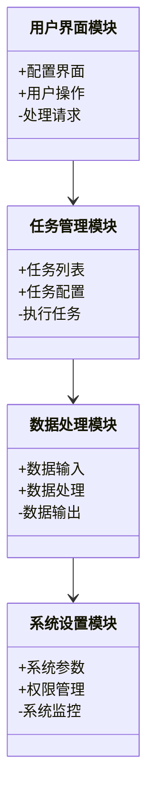
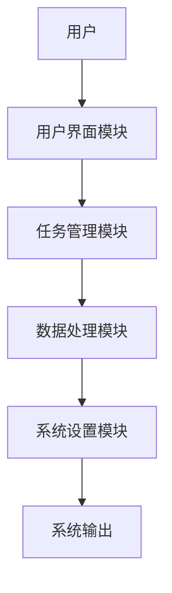

                 

# 第四部分: 企业AI Agent的系统架构设计

# 第4章: 系统架构设计

## 4.1 系统功能模块划分
### 4.1.1 用户界面模块
### 4.1.2 任务管理模块
### 4.1.3 数据处理模块
### 4.1.4 系统设置模块

## 4.2 系统架构设计
### 4.2.1 分层架构
### 4.2.2 微服务架构
### 4.2.3 组件间的交互

## 4.3 系统功能模块的类图

## 4.4 系统架构的流程图

## 4.5 接口设计与交互流程
### 4.5.1 接口定义
### 4.5.2 交互流程
### 4.5.3 接口测试

# 第五部分: 项目实战

# 第5章: 项目实战

## 5.1 环境安装与配置
### 5.1.1 开发环境的选择
### 5.1.2 必要软件的安装
### 5.1.3 环境配置步骤

## 5.2 核心代码实现
### 5.2.1 用户界面模块的代码实现
### 5.2.2 任务管理模块的代码实现
### 5.2.3 数据处理模块的代码实现
### 5.2.4 系统设置模块的代码实现

## 5.3 案例分析与实现
### 5.3.1 案例背景介绍
### 5.3.2 案例分析与设计
### 5.3.3 代码实现与测试

## 5.4 代码解读与优化
### 5.4.1 代码解读
### 5.4.2 代码优化
### 5.4.3 优化效果分析

# 第六部分: 总结与展望

## 6.1 本章总结
### 6.1.1 可视化配置界面的核心价值
### 6.1.2 项目实施的关键点
### 6.1.3 实践中的注意事项

## 6.2 未来展望
### 6.2.1 可视化配置界面的发展趋势
### 6.2.2 技术创新的可能方向
### 6.2.3 对企业数字化转型的启示

## 6.3 最佳实践Tips
### 6.3.1 项目规划建议
### 6.3.2 技术选型建议
### 6.3.3 团队协作建议

## 6.4 注意事项
### 6.4.1 项目实施中的常见问题
### 6.4.2 可视化界面设计的误区
### 6.4.3 技术风险与应对策略

## 6.5 拓展阅读
### 6.5.1 推荐书籍
### 6.5.2 技术博客
### 6.5.3 专业论坛

# 作者信息

作者：AI天才研究院 & 禅与计算机程序设计艺术

---

**摘要**：随着企业智能化转型的推进，AI Agent在企业中的应用越来越广泛。然而，复杂的配置过程成为了用户使用的一大障碍。本文通过详细分析企业AI Agent的可视化配置界面，探讨了其降低使用门槛的重要性和实现方法。从系统架构设计到项目实战，本文为读者提供了全面的技术指导，帮助企业在不依赖专业技术人员的情况下，轻松配置和管理AI Agent。

