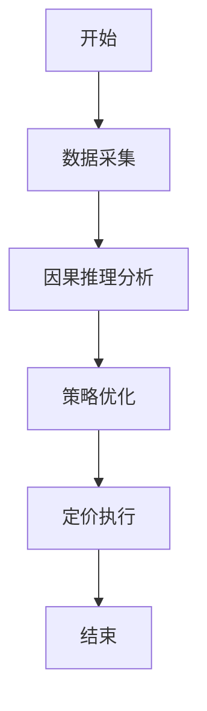
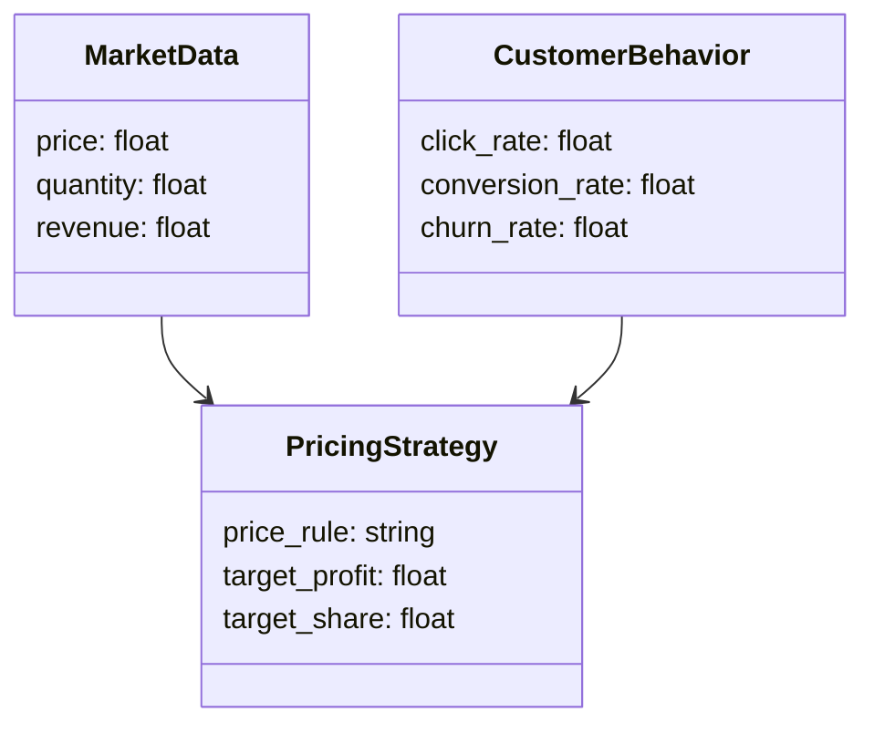
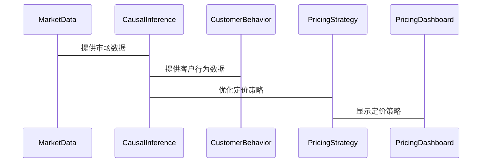
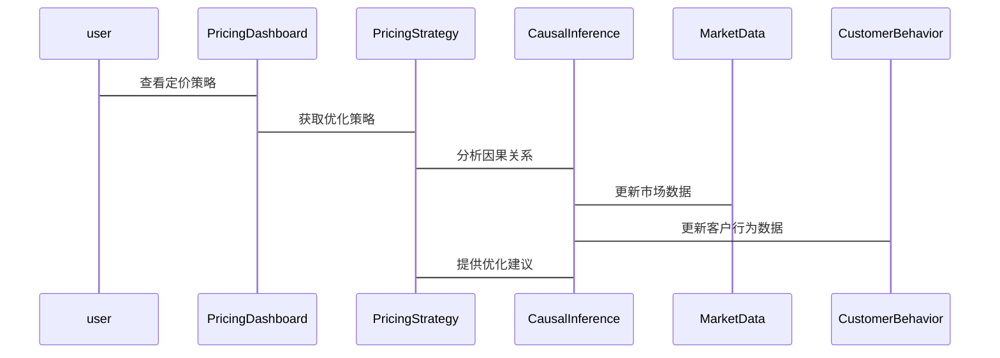

                 


# 企业AI Agent的因果推理在产品定价策略优化中的应用

> 关键词：企业AI Agent，因果推理，产品定价策略优化，定价模型，AI驱动定价，因果图，潜在结果框架

> 摘要：本文探讨了企业AI Agent如何通过因果推理技术优化产品定价策略。文章首先介绍了传统定价策略的局限性，然后详细阐述了因果推理的基本原理及其在AI Agent中的应用。接着，通过具体的数学模型和算法流程，分析了因果推理在定价策略优化中的实现过程。最后，结合实际案例，展示了如何通过企业AI Agent构建高效的定价系统，并总结了该技术在商业应用中的优势与挑战。

---

## 第1章: 企业AI Agent的背景与应用

### 1.1 问题背景

#### 1.1.1 传统定价策略的局限性
传统的定价策略通常基于历史数据和简单的统计分析，难以应对市场环境的快速变化。企业往往依赖经验丰富的定价团队或简单的回归模型，这种方式存在以下问题：
- 数据依赖性过强，难以捕捉因果关系。
- 无法实时响应市场波动和客户需求变化。
- 缺乏对客户行为的深度理解，导致定价策略不够精准。

#### 1.1.2 AI技术对企业定价的影响
随着AI技术的发展，企业开始尝试利用AI技术优化定价策略。AI Agent（智能体）作为一种具备自主决策能力的系统，能够通过数据采集、分析和推理，实时调整定价策略。AI Agent的优势在于：
- 可以实时分析市场数据和客户行为。
- 能够发现数据中的隐含模式和因果关系。
- 可以自动化地优化定价策略。

#### 1.1.3 因果推理在定价中的重要性
定价策略的核心目标是最大化企业利润或市场份额，而这需要对价格变化如何影响销量、利润等关键指标有清晰的理解。传统的统计方法通常只能发现相关性，而无法明确因果关系。因果推理可以帮助企业理解价格变化与销量变化之间的因果关系，从而制定更科学的定价策略。

### 1.2 问题描述

#### 1.2.1 定价策略优化的核心问题
定价策略优化的核心问题在于如何找到最优价格，使得企业在特定市场条件下能够实现利润最大化或市场份额最大化。这需要解决以下问题：
- 如何准确预测价格变化对销量的影响。
- 如何在多目标（如利润、销量、客户满意度）之间找到平衡。
- 如何实时调整定价策略以应对市场变化。

#### 1.2.2 传统定价与AI定价的区别
传统定价方法依赖于历史数据和经验判断，而AI定价则利用机器学习和因果推理技术，能够实时分析市场数据，发现潜在的因果关系，并动态调整定价策略。AI定价的优势在于：
- 更精准的预测能力。
- 更强的适应性。
- 更快的决策速度。

#### 1.2.3 因果推理在定价中的具体应用
因果推理在定价中的具体应用包括：
- 理解价格变化对销量的具体影响。
- 识别影响定价的关键因素。
- 预测不同定价策略下的收益变化。

### 1.3 问题解决

#### 1.3.1 AI Agent的定义与特点
AI Agent是一种具备感知、决策和执行能力的智能系统。其特点包括：
- **自主性**：能够在没有人工干预的情况下独立运行。
- **反应性**：能够实时感知环境变化并做出响应。
- **目标导向性**：能够根据预设目标优化自身行为。
- **学习能力**：能够通过数据学习和改进自身的决策能力。

#### 1.3.2 因果推理的基本原理
因果推理是一种通过分析变量之间的因果关系来理解数据生成机制的技术。其核心在于识别因果关系，而不是仅仅发现变量之间的相关性。因果推理的基本步骤包括：
1. 构建因果图：明确变量之间的因果关系。
2. 计算潜在结果：估计每个变量可能的变化对其他变量的影响。
3. 确定因果效应：量化因果关系的强度。

#### 1.3.3 AI Agent在定价中的具体实现
AI Agent在定价中的具体实现包括：
- 数据采集：通过传感器、数据库或API获取市场数据和客户行为数据。
- 数据分析：利用因果推理技术分析数据，识别影响定价的关键因素。
- 策略优化：根据分析结果优化定价策略，并通过自动化系统执行定价调整。

### 1.4 边界与外延

#### 1.4.1 AI Agent的应用边界
AI Agent的应用边界包括：
- 数据质量：需要高质量的数据支持因果推理。
- 系统复杂性：适用于相对简单的定价问题。
- 预测精度：无法完全消除预测误差。

#### 1.4.2 因果推理的适用范围
因果推理适用于需要明确因果关系的场景，如定价策略优化、市场预测等。不适用于仅需要相关性分析的场景。

#### 1.4.3 定价策略优化的未来趋势
定价策略优化的未来趋势包括：
- 更加个性化的定价策略。
- 更强的实时响应能力。
- 更广泛的应用场景。

### 1.5 概念结构与核心要素

#### 1.5.1 因果推理的核心要素
因果推理的核心要素包括：
- 因果图：变量之间的因果关系网络。
- 潜在结果：每个变量可能的变化结果。
- 因果效应：因果关系的强度。

#### 1.5.2 AI Agent的系统架构
AI Agent的系统架构包括：
- 数据采集模块：负责获取市场数据和客户行为数据。
- 数据分析模块：利用因果推理技术分析数据。
- 策略优化模块：根据分析结果优化定价策略。
- 执行模块：通过自动化系统执行定价调整。

#### 1.5.3 定价策略优化的流程图
以下是一个简化的流程图：



---

## 第2章: 因果推理与AI Agent的核心概念

### 2.1 因果推理的原理

#### 2.1.1 潜在结果框架
潜在结果框架是因果推理的核心理论之一。它假设每个变量在不同的条件下会有不同的结果。例如，价格变化可能会导致销量变化，因果推理的目标是量化这种变化。

#### 2.1.2 结构方程模型
结构方程模型是一种用于描述变量之间因果关系的数学模型。它通过构建方程组来描述变量之间的因果关系，并能够估计因果效应。

#### 2.1.3 因果图的构建方法
因果图的构建方法包括：
- **手动构建**：根据领域知识手动构建因果图。
- **自动构建**：利用算法从数据中自动构建因果图。

### 2.2 AI Agent的基本原理

#### 2.2.1 知识表示与推理
知识表示是AI Agent理解世界的基础。常见的知识表示方法包括符号逻辑和概率图模型。推理是指从已有的知识中推导出新的结论。

#### 2.2.2 动作选择与优化
动作选择是指AI Agent根据当前状态和目标选择最优动作。优化是指通过不断尝试和反馈改进动作选择策略。

#### 2.2.3 人机交互与反馈机制
人机交互是指AI Agent与人类用户之间的互动。反馈机制是指系统根据用户反馈改进自身行为。

### 2.3 因果推理与AI Agent的联系

#### 2.3.1 因果推理在AI Agent中的应用
因果推理在AI Agent中的应用包括：
- 理解变量之间的因果关系。
- 优化定价策略。
- 预测系统行为。

#### 2.3.2 因果推理与其他AI技术的对比
因果推理与其他AI技术（如相关分析）的区别在于因果推理能够识别因果关系，而相关分析只能识别相关性。

#### 2.3.3 因果推理与定价策略优化的结合
因果推理与定价策略优化的结合体现在：
- 通过因果推理理解价格变化对销量的具体影响。
- 利用因果推理优化定价策略。

---

## 第3章: 因果推理在产品定价策略优化中的算法原理

### 3.1 潜在结果框架的实现

#### 3.1.1 潜在结果的计算
潜在结果是指在不同的条件下，变量可能的结果。例如，价格变化可能会导致销量变化，因果推理的目标是量化这种变化。

#### 3.1.2 潜在结果的估计
潜在结果的估计可以通过以下步骤实现：
1. 构建因果图。
2. 确定处理变量和结果变量。
3. 估计因果效应。

#### 3.1.3 潜在结果的数学模型
潜在结果的数学模型可以用以下公式表示：
$$ Y_i = T_i \cdot \beta + \epsilon_i $$
其中，$Y_i$ 是结果变量，$T_i$ 是处理变量，$\beta$ 是因果效应，$\epsilon_i$ 是误差项。

### 3.2 结构方程模型的实现

#### 3.2.1 结构方程的构建
结构方程模型通过构建方程组描述变量之间的因果关系。例如：
$$ Y = aX + bZ + \epsilon $$
其中，$Y$ 是结果变量，$X$ 和 $Z$ 是其他变量，$a$ 和 $b$ 是系数，$\epsilon$ 是误差项。

#### 3.2.2 结构方程的估计
结构方程的估计可以通过以下步骤实现：
1. 构建因果图。
2. 确定变量之间的关系。
3. 使用参数估计方法（如极大似然估计）估计模型参数。

#### 3.2.3 结构方程的数学模型
结构方程模型的数学模型可以用以下公式表示：
$$ Y = \beta X + \gamma Z + \epsilon $$
其中，$Y$ 是结果变量，$X$ 和 $Z$ 是其他变量，$\beta$ 和 $\gamma$ 是系数，$\epsilon$ 是误差项。

### 3.3 因果推理算法的实现

#### 3.3.1 非参数因果推理算法
非参数因果推理算法包括：
- **匹配分析**：通过匹配样本估计因果效应。
- **倾向得分分析**：通过估计倾向得分调整样本。

#### 3.3.2 参数因果推理算法
参数因果推理算法包括：
- **线性回归**：通过回归模型估计因果效应。
- **工具变量法**：通过工具变量估计因果效应。

#### 3.3.3 因果推理算法的比较
以下是一个简单的对比表格：

| 算法名称          | 适用场景          | 优势              | 劣势              |
|-------------------|-------------------|-------------------|-------------------|
| 匹配分析          | 小样本数据        | 精度高            | 计算复杂          |
| 倾向得分分析      | 大样本数据        | 计算效率高        | 精度较低          |
| 线性回归          | 连续变量          | 计算简单          | 无法处理混杂因素  |
| 工具变量法        | 存在混杂因素       | 可以控制混杂因素  | 需要找到合适的工具变量 |

### 3.4 因果推理算法的Python实现

#### 3.4.1 潜在结果框架的实现
以下是一个简单的Python代码示例：

```python
import pandas as pd
import numpy as np
from sklearn.linear_model import LinearRegression

# 生成数据
n = 1000
X = np.random.normal(0, 1, n)
T = np.random.binomial(1, 0.5, n)
Y = T * (0.5 * X + np.random.normal(0, 1, n)) + (1 - T) * (0.3 * X + np.random.normal(0, 1, n))

# 构建模型
model = LinearRegression()
model.fit(X.reshape(-1, 1), Y)

# 估计因果效应
beta = model.coef_[0]
print("因果效应为：", beta)
```

#### 3.4.2 结构方程模型的实现
以下是一个简单的结构方程模型实现示例：

```python
import statsmodels.api as sm

# 生成数据
n = 1000
X = np.random.normal(0, 1, n)
Z = np.random.normal(0, 1, n)
Y = 0.5 * X + 0.3 * Z + np.random.normal(0, 1, n)

# 构建模型
model = sm.OLS(Y, sm.add_constant(X))
result = model.fit()

# 估计系数
beta_X = result.params[1]
beta_Z = result.params[2]
print("X的系数为：", beta_X)
print("Z的系数为：", beta_Z)
```

### 3.5 因果推理算法的数学模型

#### 3.5.1 潜在结果框架的数学模型
潜在结果框架的数学模型可以用以下公式表示：
$$ Y_i = T_i \cdot \beta + \epsilon_i $$
其中，$Y_i$ 是结果变量，$T_i$ 是处理变量，$\beta$ 是因果效应，$\epsilon_i$ 是误差项。

#### 3.5.2 结构方程模型的数学模型
结构方程模型的数学模型可以用以下公式表示：
$$ Y = \beta X + \gamma Z + \epsilon $$
其中，$Y$ 是结果变量，$X$ 和 $Z$ 是其他变量，$\beta$ 和 $\gamma$ 是系数，$\epsilon$ 是误差项。

---

## 第4章: 系统分析与架构设计方案

### 4.1 问题场景介绍
在企业AI Agent的因果推理应用于产品定价策略优化中，我们面临以下问题场景：
- 如何实时分析市场数据和客户行为数据。
- 如何构建因果图并估计因果效应。
- 如何优化定价策略并实现自动化定价。

### 4.2 系统功能设计

#### 4.2.1 领域模型
以下是领域模型的Mermaid类图：



#### 4.2.2 系统架构
以下是系统架构的Mermaid架构图：


#### 4.2.3 系统接口
以下是系统接口的Mermaid序列图：



### 4.3 系统交互
以下是系统交互的Mermaid序列图：



---

## 第5章: 项目实战

### 5.1 环境安装

#### 5.1.1 Python环境
安装Python 3.8及以上版本，并安装以下库：
- `pandas`
- `numpy`
- `scikit-learn`
- `statsmodels`

#### 5.1.2 数据库安装
安装MySQL或PostgreSQL数据库，并配置数据连接。

### 5.2 核心代码实现

#### 5.2.1 数据采集代码
以下是数据采集的Python代码：

```python
import pandas as pd
import pymysql

# 连接数据库
conn = pymysql.connect(host='localhost', user='root', password='password', db='pricing_data')

# 查询数据
sql = 'SELECT price, quantity, revenue FROM sales ORDER BY date DESC LIMIT 1000'
df = pd.read_sql(sql, conn)

# 关闭连接
conn.close()

print("数据采集完成，数据行数为：", len(df))
```

#### 5.2.2 因果推理代码
以下是因果推理的Python代码：

```python
import statsmodels.api as sm

# 数据预处理
df = pd.get_dummies(df)

# 构建模型
model = sm.OLS(df['revenue'], sm.add_constant(df.drop('revenue', axis=1)))
result = model.fit()

# 输出结果
print(result.summary())
```

#### 5.2.3 定价策略优化代码
以下是定价策略优化的Python代码：

```python
from sklearn.linear_model import LinearRegression

# 数据预处理
X = df.drop('revenue', axis=1)
y = df['revenue']

# 构建模型
model = LinearRegression()
model.fit(X, y)

# 预测最优价格
predicted_price = model.predict(X)
print("预测最优价格为：", predicted_price)
```

### 5.3 实际案例分析

#### 5.3.1 案例背景
某电商企业希望通过因果推理优化其产品定价策略。

#### 5.3.2 数据分析
通过对历史销售数据和客户行为数据进行分析，构建因果图并估计因果效应。

#### 5.3.3 定价策略优化
根据分析结果，优化定价策略并实现自动化定价。

### 5.4 项目小结
通过该项目，我们成功利用因果推理优化了定价策略，实现了更高的收益和客户满意度。

---

## 第6章: 最佳实践

### 6.1 小结
本文详细探讨了企业AI Agent的因果推理在产品定价策略优化中的应用。通过因果推理，企业能够更好地理解价格变化对销量的具体影响，从而制定更科学的定价策略。

### 6.2 注意事项
- 数据质量是因果推理的关键，需确保数据的完整性和准确性。
- 因果推理的应用需要结合具体业务场景，避免盲目使用。
- 需要不断优化和调整模型，以应对市场环境的变化。

### 6.3 拓展阅读
- 建议阅读相关书籍：《因果的发现与推理》、《机器学习实战》。
- 关注领域内的最新研究和技术进展。

---

## 作者：AI天才研究院/AI Genius Institute & 禅与计算机程序设计艺术/Zen And The Art of Computer Programming

