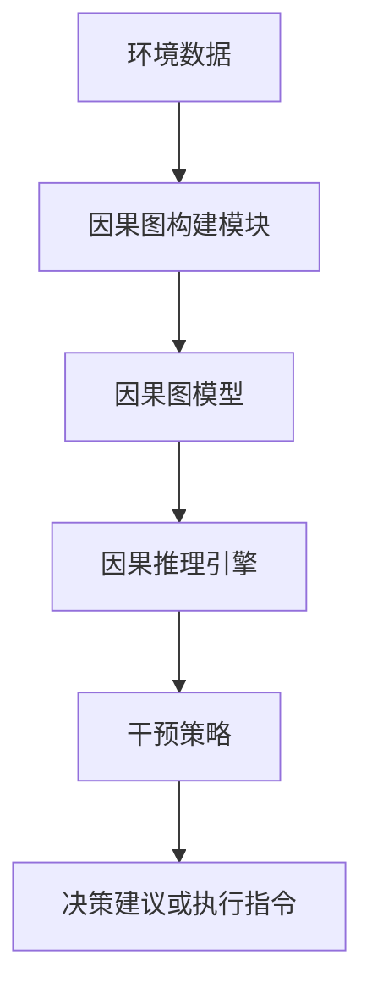
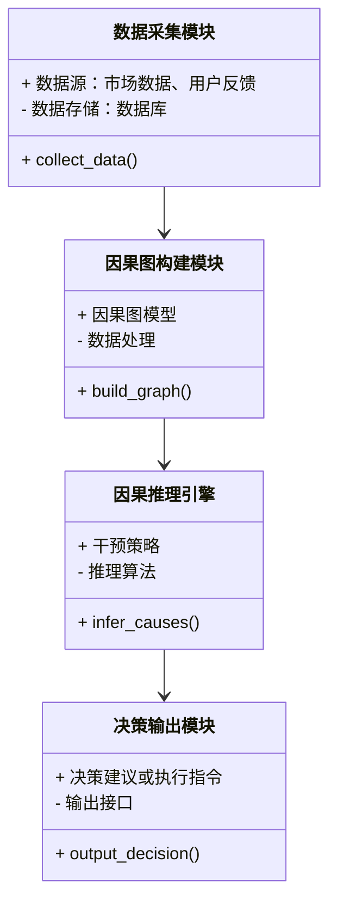

                 


# 企业AI Agent的因果推理在产品开发中的应用

> 关键词：企业AI Agent，因果推理，产品开发，因果图，因果模型，系统设计

> 摘要：本文深入探讨了企业AI Agent在产品开发中的因果推理应用。通过分析因果推理的核心原理、算法实现、系统架构设计以及实际案例，展示了如何利用因果推理提升企业AI Agent的决策能力和产品开发效率。文章从背景介绍、核心概念、算法原理、系统设计、项目实战到最佳实践，全面解析了企业AI Agent因果推理的应用场景和实现方法。

---

## 第一部分: 企业AI Agent的因果推理基础

### 第1章: 企业AI Agent与因果推理概述

#### 1.1 企业AI Agent的定义与特点
企业AI Agent是一种具备自主决策能力的智能体，能够在企业环境中感知、推理、学习和执行任务。其特点包括：
- **自主性**：无需外部干预，自主完成任务。
- **反应性**：能够实时感知环境变化并做出反应。
- **学习能力**：通过数据和经验不断优化决策策略。
- **协作性**：能够与其他系统或人员协作完成复杂任务。

**企业AI Agent与传统AI的区别**：
- 传统AI：基于规则或预设模型进行决策。
- 企业AI Agent：具备动态推理和自适应能力，能够根据环境变化调整策略。

#### 1.2 因果推理的基本概念
因果推理是研究因果关系的科学方法，通过分析“为什么”某个事件发生，来推断变量之间的因果关系。其核心在于识别因果链和因果模型。

**因果关系与相关关系的区别**：
- **相关关系**：变量之间的统计关联性，不一定存在因果关系。
- **因果关系**：变量之间的直接作用关系，一个变量的变化直接导致另一个变量的变化。

#### 1.3 企业AI Agent与因果推理的结合
企业AI Agent通过因果推理技术，能够更好地理解变量之间的因果关系，从而做出更合理的决策。例如，在产品开发中，AI Agent可以通过因果推理分析市场需求、成本和资源之间的因果关系，优化产品开发策略。

---

### 第2章: 企业AI Agent因果推理的核心概念

#### 2.1 因果推理的核心原理
因果推理的核心原理包括潜在结果框架和因果图模型。

**潜在结果框架**：
- **定义**：对于每个单位（个体、产品、市场等），在给定干预的情况下，存在一个潜在的结果。
- **公式**：$$ Y_i^{do(x)} $$ 表示在干预 \( x \) 下，单位 \( i \) 的结果。

**因果图模型**：
- **定义**：通过有向图表示变量之间的因果关系，图中节点代表变量，边代表因果关系。
- **示例**：在产品开发中，因果图可以表示市场需求（D）、研发投入（R）和产品成功（S）之间的关系。

#### 2.2 企业AI Agent因果推理的系统结构
企业AI Agent因果推理系统由以下几个部分组成：
- **输入层**：感知环境数据（市场需求、用户反馈等）。
- **因果图构建模块**：根据输入数据构建因果图模型。
- **因果推理引擎**：基于因果图模型进行推理，生成干预策略。
- **输出层**：将推理结果输出为决策建议或执行指令。

**系统结构对比表格**：
| 模块         | 输入        | 输出        | 功能描述                                  |
|--------------|-------------|-------------|-------------------------------------------|
| 输入层       | 环境数据     | 因果图构建模块 | 提供数据用于因果图构建                  |
| 因果图构建模块 | 环境数据     | 因果图模型    | 根据数据构建因果图模型                |
| 因果推理引擎  | 因果图模型   | 干预策略     | 基于因果图模型进行推理，生成干预策略  |
| 输出层       | 干预策略     | 决策建议或执行指令 | 将推理结果输出为可执行的决策或指令    |

**Mermaid流程图展示**：


---

### 第3章: 企业AI Agent因果推理的算法原理

#### 3.1 潜在结果框架的数学模型
潜在结果框架是因果推理的基础，其数学模型如下：
$$ Y_i^{do(x)} = f(x, U_i) $$
其中，\( U_i \) 表示不可观测的潜在变量，\( f \) 是函数。

**实现步骤**：
1. **数据收集**：收集相关变量的数据。
2. **构建因果图模型**：根据数据构建因果图。
3. **计算潜在结果**：根据因果图模型计算每个单位在不同干预下的潜在结果。
4. **评估因果效应**：计算干预 \( x \) 对结果 \( Y \) 的平均因果效应（ATE）。

#### 3.2 因果图结构学习的算法
因果图结构学习是通过数据自动构建因果图的过程，常用算法包括PC算法和GES算法。

**PC算法流程**：
1. **计算变量间的条件独立性**。
2. **逐步确定因果关系的方向**。
3. **构建因果图模型**。

**Python代码示例**：
```python
from causalnex.structure.do_calculus import do_smith

# 示例数据
data = {
    'X': [0, 1, 0, 1],
    'Y': [0, 0, 1, 1],
    'Z': [0, 0, 1, 1]
}

# 构建因果图模型
model = do_smith(data)
```

#### 3.3 需求因果关系识别的算法
需求因果关系识别算法通过分析数据中的因果关系，识别关键变量之间的因果关系。

**实现步骤**：
1. **数据预处理**：清洗和标准化数据。
2. **构建因果图模型**。
3. **识别因果关系**。
4. **验证因果关系**。

---

### 第4章: 企业AI Agent因果推理的系统分析与架构设计

#### 4.1 问题场景介绍
**问题背景**：企业在产品开发中面临复杂的决策问题，需要通过因果推理优化决策。
**问题描述**：如何利用因果推理技术，构建企业AI Agent系统，优化产品开发决策。

#### 4.2 系统功能设计
**功能模块**：
- 数据采集模块：采集市场数据、用户反馈等。
- 因果图构建模块：构建因果图模型。
- 因果推理引擎：生成干预策略。
- 决策输出模块：输出决策建议或执行指令。

**Mermaid类图展示**：


#### 4.3 系统架构设计
**系统架构图**：


---

## 第五章: 项目实战

### 5.1 环境安装
**所需工具**：
- Python 3.8+
- Jupyter Notebook
- NetworkX
- Causalnex

**安装命令**：
```bash
pip install networkx causalnex
```

### 5.2 核心代码实现
**数据处理**：
```python
import pandas as pd
from causalnex.structure.do_calculus import do_smith

# 示例数据
data = pd.DataFrame({
    'X': [0, 1, 0, 1],
    'Y': [0, 0, 1, 1],
    'Z': [0, 0, 1, 1]
})

# 构建因果图模型
model = do_smith(data)
```

**因果推理实现**：
```python
from causalnex.inference import do_inference

# 示例干预
intervention = {'X': 1}

# 推理结果
result = do_inference(model, intervention)
```

### 5.3 案例分析
**案例背景**：某企业希望优化产品开发策略，通过因果推理分析市场需求、研发投入和产品成功之间的因果关系。

**分析步骤**：
1. 数据采集：收集市场需求（D）、研发投入（R）、产品成功（S）的数据。
2. 构建因果图模型：识别D、R、S之间的因果关系。
3. 因果推理：分析D和R对S的因果效应。
4. 优化策略：根据推理结果优化产品开发策略。

---

## 第六章: 最佳实践与小结

### 6.1 小结
企业AI Agent的因果推理在产品开发中的应用，通过构建因果图模型和因果推理算法，帮助企业做出更科学的决策。其优势包括：
- **提高决策效率**：通过因果推理快速识别关键变量。
- **优化资源配置**：根据因果关系优化资源配置。
- **增强决策透明度**：因果推理模型能够解释决策背后的因果关系。

### 6.2 注意事项
- **数据质量**：因果推理结果依赖于高质量的数据。
- **模型选择**：选择合适的因果推理算法，确保模型的准确性。
- **伦理问题**：因果推理可能涉及伦理问题，需谨慎处理。

### 6.3 拓展阅读
- 《因果的发现与推断》
- 《企业AI Agent设计与实现》
- 《因果图模型与应用》

---

作者：AI天才研究院/AI Genius Institute & 禅与计算机程序设计艺术/Zen And The Art of Computer Programming

