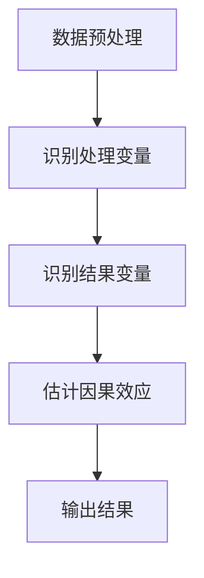
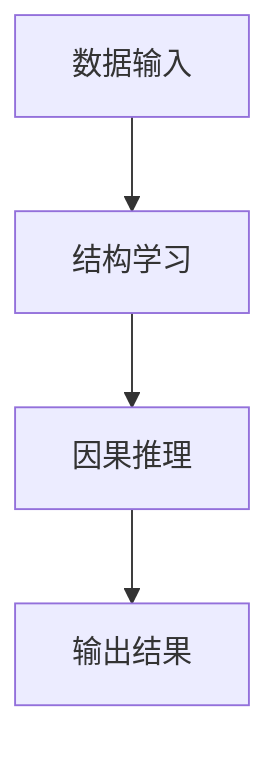

                 


# 企业AI Agent的因果推理在商业决策中的应用

## 关键词：企业AI Agent, 因果推理, 商业决策, AI系统设计, 机器学习, 知识图谱

## 摘要：  
本文探讨了企业AI Agent如何通过因果推理技术提升商业决策的效率和准确性。文章首先介绍了因果推理的基本概念及其在商业决策中的重要性，然后详细讲解了因果推理的算法原理，包括潜在结果框架和因果图模型。接下来，文章分析了企业AI Agent的系统架构设计，展示了如何将因果推理应用于实际业务场景。最后，通过一个具体案例，本文详细说明了因果推理在商业决策中的实际应用，并总结了最佳实践和未来发展方向。

---

# 第一部分：背景介绍

## 第1章：企业AI Agent与因果推理概述

### 1.1 问题背景

在企业运营中，决策者常常面临复杂的选择，例如市场推广策略、产品定价或供应链优化。传统的统计方法虽然能提供一定的支持，但往往只能揭示相关性，无法准确判断因果关系。例如，数据分析可能显示广告投放量与销售额增长相关，但无法确定广告投放是否直接导致销售额增长。这种局限性使得企业在复杂决策中难以依赖传统方法。

随着AI技术的发展，AI Agent（智能体）逐渐成为企业决策的重要工具。AI Agent能够实时收集和处理数据，提供基于数据的决策支持。然而，AI Agent的决策能力在很大程度上依赖于数据的质量和模型的准确性。如何从相关性中识别因果关系，成为AI Agent在商业决策中面临的关键挑战。

### 1.2 问题描述

因果推理的核心在于理解变量之间的因果关系，而不仅仅是相关性。例如，在市场推广中，因果推理可以明确广告投放对销售额的具体影响，而不仅仅是相关关系。传统统计方法无法满足这种需求，因为它无法排除其他潜在因素的影响。

AI Agent在商业决策中的应用需要结合因果推理技术，以提高决策的准确性和可靠性。然而，因果推理涉及复杂的数学模型和算法，企业在实际应用中面临技术门槛高、数据要求严格等挑战。

### 1.3 问题解决

引入因果推理可以解决传统统计方法的局限性。通过因果推理，AI Agent能够识别变量之间的因果关系，从而做出更准确的商业决策。例如，通过因果推理，AI Agent可以确定最佳广告投放策略，从而优化市场推广效果。

AI Agent的因果推理能力需要结合先进的算法和数据处理技术。这包括因果图模型、潜在结果框架等方法，以及结合知识图谱和规则引擎来增强推理能力。通过这些技术，AI Agent能够更好地理解业务场景，并提供更精准的决策支持。

### 1.4 边界与外延

因果推理的应用范围广泛，但在实际应用中存在一定的边界。例如，因果推理需要足够的数据支持，否则可能导致错误的因果关系判断。此外，因果推理模型的复杂性可能限制其在实时决策中的应用。

与相关概念如相关性分析和预测模型相比，因果推理更关注变量之间的因果关系，而不仅仅是相关性或预测准确性。未来，因果推理技术可能会进一步发展，与强化学习、知识图谱等技术结合，推动AI Agent在商业决策中的应用。

---

# 第二部分：核心概念与联系

## 第2章：因果推理的原理与模型

### 2.1 因果关系模型

因果关系模型是因果推理的基础，主要包括潜在结果框架和因果图模型。

#### 2.1.1 潜在结果框架

潜在结果框架由J. Pearl提出，是因果推理的重要理论基础。该框架假设每个个体在不同处理下的潜在结果，通过观察部分结果来推断其他结果。

例如，考虑广告投放对销售额的影响。对于每个潜在客户，存在两种潜在结果：广告投放下的销售额和不投放广告下的销售额。通过观察数据，可以估计广告投放的平均因果效应。

#### 2.1.2 因果图模型

因果图模型通过绘制变量之间的因果关系，帮助识别因果路径和混淆变量。例如，市场推广和销售额之间可能受到价格和渠道的影响。通过因果图，可以识别出价格是市场推广对销售额的潜在混淆变量。

#### 2.1.3 结构方程模型

结构方程模型是一种用于估计因果关系的统计方法，适用于复杂因果关系的建模。例如，可以建模市场推广、价格、渠道和销售额之间的因果关系，并通过方程组描述变量之间的关系。

### 2.2 AI Agent的因果推理能力

AI Agent通过因果推理技术，能够识别变量之间的因果关系，并基于此做出更明智的决策。

#### 2.2.1 因果推理在决策中的应用

因果推理可以帮助AI Agent做出更准确的决策。例如，在供应链优化中，AI Agent可以识别供应商选择对成本的具体影响，从而优化采购策略。

#### 2.2.2 知识图谱与因果推理

知识图谱为企业AI Agent提供了丰富的知识背景，支持因果推理的实现。例如，通过知识图谱，AI Agent可以理解市场推广、产品定价和客户行为之间的复杂关系。

#### 2.2.3 实例分析

以市场推广为例，AI Agent可以通过因果推理确定广告投放对销售额的因果效应，从而优化广告投放策略。

---

# 第三部分：算法原理讲解

## 第4章：因果推理算法

### 4.1 潜在结果框架

潜在结果框架通过估计因果效应，帮助AI Agent做出决策。

#### 4.1.1 定义与应用

潜在结果框架通过定义每个单位在不同处理下的潜在结果，估计因果效应。例如，通过估计广告投放对销售额的因果效应，确定最佳广告投放策略。

#### 4.1.2 因果效应的计算

因果效应的计算可以通过平均处理效应（ATE）、平均处理效应于子群体（ATT）等方法实现。例如，通过计算广告投放对高价值客户的因果效应，优化广告投放策略。

#### 4.1.3 算法流程图（mermaid）



### 4.2 因果图模型

因果图模型通过绘制变量之间的因果关系，帮助识别因果路径和混淆变量。

#### 4.2.1 概念与结构

因果图模型通过绘制变量之间的因果关系，帮助识别因果路径和混淆变量。例如，市场推广和销售额之间的因果路径可能受到价格和渠道的影响。

#### 4.2.2 结构学习算法

结构学习算法用于从数据中学习因果图的结构。例如，基于贝叶斯网络的结构学习算法可以自动发现变量之间的因果关系。

#### 4.2.3 算法流程图（mermaid）



---

# 第四部分：系统分析与架构设计

## 第5章：企业AI Agent系统架构

### 5.1 系统功能设计

企业AI Agent系统需要具备数据采集、因果推理、决策优化等功能。

#### 5.1.1 数据采集模块

数据采集模块负责收集企业运营中的相关数据，包括市场推广、销售数据等。

#### 5.1.2 因果推理模块

因果推理模块基于潜在结果框架和因果图模型，识别变量之间的因果关系。

#### 5.1.3 决策优化模块

决策优化模块基于因果推理结果，优化商业决策。

### 5.2 系统架构设计

系统架构设计采用分层结构，包括数据层、计算层和应用层。

#### 5.2.1 数据层

数据层负责存储企业运营数据，支持数据预处理和特征提取。

#### 5.2.2 计算层

计算层负责因果推理的算法实现，包括潜在结果框架和因果图模型。

#### 5.2.3 应用层

应用层负责展示因果推理结果，支持商业决策。

### 5.3 系统接口设计

系统接口设计包括数据接口、算法接口和用户接口，支持与其他系统的集成。

#### 5.3.1 数据接口

数据接口负责与企业数据源的对接，支持数据的导入和导出。

#### 5.3.2 算法接口

算法接口负责与其他AI系统的对接，支持因果推理算法的调用。

#### 5.3.3 用户接口

用户接口负责与用户的交互，支持用户查询因果推理结果。

### 5.4 系统交互设计

系统交互设计采用用户友好的界面，支持用户的操作和决策。

#### 5.4.1 用户查询

用户可以通过输入查询条件，获取因果推理结果。

#### 5.4.2 系统响应

系统根据用户查询，返回因果推理结果，并提供决策建议。

---

# 第五部分：项目实战

## 第6章：因果推理在商业决策中的应用案例

### 6.1 环境安装

环境安装包括安装Python、Jupyter Notebook和相关库，如pandas、numpy、do Why等。

#### 6.1.1 安装Python

使用Anaconda安装Python环境，版本3.8及以上。

#### 6.1.2 安装Jupyter Notebook

通过conda命令安装Jupyter Notebook。

#### 6.1.3 安装相关库

安装pandas、numpy、do Why等库，支持因果推理的实现。

### 6.2 核心代码实现

核心代码实现包括数据预处理、因果推理和决策优化。

#### 6.2.1 数据预处理

数据预处理包括数据清洗和特征工程。

代码示例：

```python
import pandas as pd
import numpy as np

# 数据加载
data = pd.read_csv('marketing.csv')

# 数据清洗
data = data.dropna()
data = data.drop_duplicates()

# 特征工程
data['log_sales'] = np.log(data['sales'] + 1)
```

#### 6.2.2 因果推理

因果推理基于潜在结果框架和因果图模型。

代码示例：

```python
from doWhy import dowhy

# 初始化因果推理
 estimator = dowhy.CausalEstimator(data, treatment='advertisement', outcome='sales')

# 估计因果效应
estimation = estimator.estimate_effect()
print(estimation)
```

#### 6.2.3 决策优化

决策优化模块基于因果推理结果，优化商业决策。

代码示例：

```python
# 优化广告投放策略
advertisement预算 = estimation * marketing预算
print(advertisement预算)
```

### 6.3 案例分析

以市场推广为例，展示因果推理在广告投放策略中的应用。

#### 6.3.1 环境安装

安装必要的库，包括pandas、numpy、do Why等。

#### 6.3.2 核心代码实现

数据预处理、因果推理和决策优化的实现。

#### 6.3.3 案例分析

通过因果推理，确定广告投放对销售额的具体影响，优化广告投放策略。

### 6.4 项目总结

项目总结包括经验教训和改进建议。

---

# 第六部分：最佳实践与小结

## 第7章：总结与展望

### 7.1 最佳实践

建议企业在应用因果推理时，关注数据质量、模型选择和业务场景的匹配。

#### 7.1.1 数据质量

确保数据的完整性、准确性和及时性，支持因果推理的实现。

#### 7.1.2 模型选择

根据业务需求选择合适的因果推理模型，如潜在结果框架或因果图模型。

#### 7.1.3 业务场景匹配

确保因果推理技术与实际业务场景匹配，提高决策的准确性。

### 7.2 小结

总结全文，强调因果推理在企业AI Agent中的重要性，以及其在商业决策中的应用价值。

### 7.3 注意事项

在应用因果推理时，需要注意数据的可解释性、模型的可扩展性和业务的可操作性。

### 7.4 拓展阅读

推荐相关书籍和资源，供读者进一步学习。

---

# 作者：AI天才研究院/AI Genius Institute & 禅与计算机程序设计艺术 /Zen And The Art of Computer Programming

---

**注**：以上内容为文章的大纲和部分章节内容的示例。实际撰写时，需要根据具体需求调整各部分的详细程度和内容安排。

