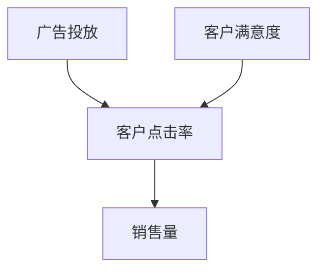
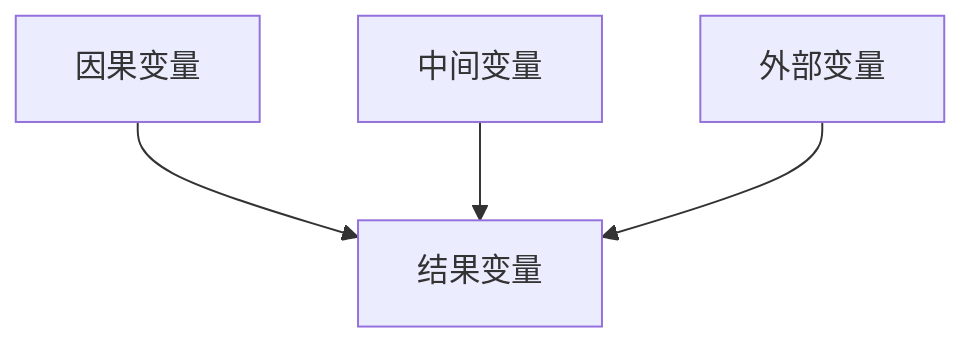
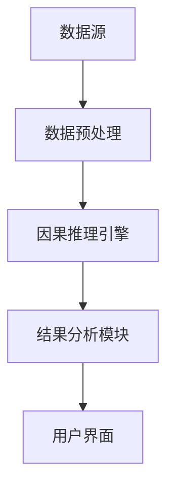
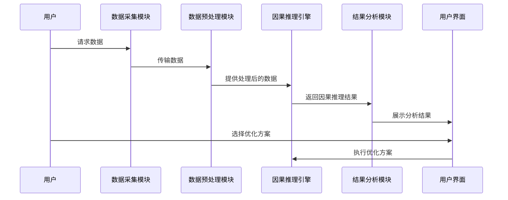

                 


# 企业AI Agent的因果推理在商业决策分析中的应用

> **关键词**: 企业AI Agent, 因果推理, 商业决策分析, 系统架构设计, 项目实战

> **摘要**: 本文探讨了企业AI Agent如何通过因果推理技术优化商业决策分析。从因果推理的基本原理到算法实现，再到系统架构设计和项目实战，详细阐述了因果推理在商业决策中的应用，帮助企业在复杂多变的市场环境中做出更明智的决策。

---

## 第一部分：企业AI Agent与因果推理基础

### 第1章：企业AI Agent的背景与概述

#### 1.1 问题背景

- **1.1.1 企业决策分析的复杂性**  
  在当今快速变化的商业环境中，企业决策需要考虑的因素越来越多。传统的基于相关性的分析方法难以捕捉变量之间的因果关系，导致决策的不确定性和风险增加。

- **1.1.2 AI Agent在企业决策中的作用**  
  AI Agent（智能代理）能够实时感知环境变化、分析数据，并提出优化建议。通过引入因果推理，AI Agent能够更准确地理解变量之间的关系，从而做出更可靠的决策。

- **1.1.3 因果推理的必要性**  
  因果推理能够揭示变量之间的因果关系，帮助企业在决策时考虑“如果采取某种行动，结果会如何”的问题，而不仅仅是观察到的相关性。

#### 1.2 问题描述

- **1.2.1 传统决策分析的局限性**  
  传统的统计分析方法主要依赖相关性分析，无法区分因果关系，容易导致错误的决策。

- **1.2.2 企业决策中的因果关系缺失**  
  在复杂的商业环境中，因果关系往往被忽视，导致决策缺乏深度和准确性。

- **1.2.3 AI Agent在因果推理中的应用需求**  
  通过AI Agent实现因果推理，可以帮助企业在决策过程中考虑更多的潜在因素，提高决策的可靠性和可解释性。

#### 1.3 问题解决

- **1.3.1 引入因果推理的解决方案**  
  通过因果推理技术，AI Agent能够识别变量之间的因果关系，从而在决策过程中考虑更多的潜在影响。

- **1.3.2 AI Agent如何实现因果推理**  
  AI Agent通过构建因果图模型，分析变量之间的因果关系，并基于这些关系进行推理和预测。

- **1.3.3 因果推理在商业决策中的具体应用**  
  在市场营销、供应链管理、风险管理等领域，因果推理可以帮助企业优化资源配置、预测市场趋势，并制定更有效的策略。

#### 1.4 边界与外延

- **1.4.1 因果推理的边界条件**  
  因果推理依赖于数据的质量和模型的准确性，数据不足或模型错误可能导致推理结果偏差。

- **1.4.2 与相关概念的区分**  
  因果推理与相关性分析、预测模型等不同，它关注的是变量之间的因果关系，而不仅仅是相关性或预测性。

- **1.4.3 未来发展的可能性**  
  随着AI技术的进步，因果推理在商业决策中的应用将更加广泛和深入，未来可能会出现更复杂的因果图模型和更智能的AI Agent。

#### 1.5 核心概念与组成

- **1.5.1 因果推理的核心要素**  
  因果推理基于因果图模型，通过识别因果关系路径和调节变量，分析变量之间的因果关系。

- **1.5.2 AI Agent的组成结构**  
  AI Agent通常包括感知模块、推理模块、决策模块和执行模块，每个模块协同工作以实现智能决策。

- **1.5.3 两者结合的系统架构**  
  将因果推理技术集成到AI Agent中，构建一个能够实时分析因果关系、优化决策的系统架构。

---

## 第二部分：因果推理的核心概念与联系

### 第2章：因果推理的基本原理

#### 2.1 因果推理的定义与原理

- **2.1.1 因果关系的基本定义**  
  因果关系是指一个事件（原因）导致另一个事件（结果）的发生。在因果推理中，我们需要识别哪些变量是因果关系中的原因和结果。

- **2.1.2 因果推理的基本原理**  
  因果推理通过构建因果图模型，分析变量之间的因果关系路径，识别因果关系中的直接效应和间接效应。

- **2.1.3 因果推理在AI中的应用**  
  在AI中，因果推理常用于处理复杂的数据关系，特别是在需要因果关系分析的场景中，如医疗、金融和市场营销等领域。

#### 2.2 因果推理的属性特征对比

| 属性             | 相关性分析       | 因果推理         |
|------------------|------------------|------------------|
| 分析目标         | 发现变量间的相关性 | 发现变量间的因果关系 |
| 数据需求         | 需要大量数据     | 需要结构化数据   |
| 结果解释性       | 较低             | 较高             |
| 应用场景         | 预测             | 改善和优化       |

- **2.2.1 因果关系的可解释性**  
  因果推理的结果通常具有较高的可解释性，能够明确说明因果关系的来源和路径。

- **2.2.2 因果关系的稳定性**  
  因果关系在不同环境和数据集中的表现较为稳定，而相关性可能因为数据分布的变化而变化。

- **2.2.3 因果关系的可转移性**  
  因果关系可以在不同场景和数据集中进行转移，而相关性可能仅限于特定数据集。

#### 2.3 ER实体关系图

- **2.3.1 实体识别**  
  在因果推理中，首先需要识别相关的实体（变量），例如在市场营销中，可能涉及广告投放、销售量、客户点击率等变量。

- **2.3.2 关系建模**  
  通过构建因果图，明确实体之间的因果关系。例如，广告投放（A）导致客户点击率（B）增加，而客户点击率（B）进一步影响销售量（C）。

- **2.3.3 图谱构建**  
  使用Mermaid流程图，可以清晰地展示因果关系网络，便于理解和分析。



---

## 第三部分：因果推理的算法原理

### 第3章：因果推理算法详解

#### 3.1 因果推理算法的分类

- **3.1.1 贝叶斯网络**  
  贝叶斯网络是一种概率图模型，通过有向无环图（DAG）表示变量之间的依赖关系，能够进行概率推理和因果推理。

- **3.1.2 隐马尔可夫模型**  
  隐马尔可夫模型常用于时间序列数据的分析，能够处理变量之间的隐含关系，适用于因果推理中的时间依赖性问题。

- **3.1.3 结构方程模型**  
  结构方程模型通过方程组描述变量之间的因果关系，能够同时处理多个变量之间的相互作用。

#### 3.2 算法原理图



#### 3.3 Python实现示例

```python
import numpy as np
from causalgraphicalmodels import CausalGraphicalModel

# 创建因果图模型
model = CausalGraphicalModel(
    nodes=['A', 'B', 'C'],
    edges=[('A', 'B'), ('C', 'B')]
)

# 可视化模型
model.draw()
```

#### 3.4 数学模型与公式

- **3.4.1 贝叶斯定理**  
  $$P(A|B) = \frac{P(B|A)P(A)}{P(B)}$$  
  通过贝叶斯定理，我们可以计算在给定结果B的情况下，原因A发生的概率。

- **3.4.2 结构方程模型**  
  $$Y = \beta X + \epsilon$$  
  其中，Y是结果变量，X是原因变量，$\beta$是因果效应，$\epsilon$是误差项。

---

## 第四部分：系统分析与架构设计

### 第4章：系统分析与架构设计

#### 4.1 问题场景介绍

- **4.1.1 商业决策中的因果推理需求**  
  在企业运营中，因果推理可以帮助识别哪些变量对业务结果有直接影响，从而优化资源配置和策略制定。

- **4.1.2 系统目标与范围**  
  构建一个基于因果推理的企业AI Agent系统，能够在实际业务场景中进行实时分析和决策优化。

- **4.1.3 用户角色与需求分析**  
  用户包括企业高管、市场营销人员、供应链经理等，他们需要通过系统获取因果关系分析结果，辅助决策。

#### 4.2 系统功能设计

- **4.2.1 数据采集模块**  
  负责收集企业相关的数据，包括销售数据、客户数据、市场数据等。

- **4.2.2 因果推理模块**  
  通过因果图模型分析数据，识别变量之间的因果关系，计算因果效应。

- **4.2.3 结果分析模块**  
  将因果推理结果可视化，提供决策建议和优化方案。

#### 4.3 系统架构图



#### 4.4 系统接口设计

- **4.4.1 数据接口**  
  数据采集模块与企业数据库对接，获取结构化数据。

- **4.4.2 API接口**  
  因果推理引擎提供API接口，供结果分析模块调用。

- **4.4.3 用户接口**  
  用户界面展示因果推理结果和决策建议，支持用户交互。

#### 4.5 系统交互流程



---

## 第五部分：项目实战

### 第5章：项目实战与案例分析

#### 5.1 环境安装与配置

- **5.1.1 安装Python环境**  
  使用Anaconda或virtualenv创建独立的Python环境，推荐Python 3.8及以上版本。

- **5.1.2 安装依赖库**  
  安装必要的库，如`numpy`, `pymc`, `causalgraphicalmodels`等。

#### 5.2 系统核心实现

- **5.2.1 数据预处理代码**

```python
import pandas as pd
import numpy as np

# 读取数据
data = pd.read_csv('marketing.csv')

# 数据清洗
data.dropna(inplace=True)
data = pd.get_dummies(data)
```

- **5.2.2 因果推理代码**

```python
from causalgraphicalmodels import CausalGraphicalModel

# 创建因果图模型
model = CausalGraphicalModel(
    nodes=['A', 'B', 'C'],
    edges=[('A', 'B'), ('C', 'B')]
)

# 可视化模型
model.draw()
```

- **5.2.3 结果分析代码**

```python
import matplotlib.pyplot as plt

# 绘制因果效应分布图
plt.hist(model.causal_effect, bins=10)
plt.title('Causal Effect Distribution')
plt.show()
```

#### 5.3 案例分析

- **5.3.1 案例背景**  
  某电商平台希望优化广告投放策略，通过因果推理分析广告投放对销售额的影响。

- **5.3.2 数据分析**  
  使用因果图模型分析广告投放（A）、客户点击率（B）和销售额（C）之间的因果关系。

- **5.3.3 结果解读**  
  分析结果显示，广告投放对客户点击率有直接影响，而客户点击率进一步影响销售额。因此，优化广告投放策略可以有效提高销售额。

---

## 第六部分：最佳实践与总结

### 第6章：最佳实践与总结

#### 6.1 最佳实践 tips

- **数据质量**  
  确保数据的完整性和准确性，避免因数据问题导致因果推理结果偏差。

- **模型选择**  
  根据具体场景选择合适的因果推理算法，例如贝叶斯网络适合处理多变量因果关系。

- **模型验证**  
  通过交叉验证和对比实验验证因果推理模型的准确性和稳定性。

- **可解释性**  
  因果推理结果需要具有较高的可解释性，便于业务人员理解和应用。

#### 6.2 小结

通过本文的介绍，我们了解了因果推理在企业AI Agent中的重要作用，掌握了因果推理的基本原理和算法实现方法，并通过实际案例展示了因果推理在商业决策中的应用价值。

#### 6.3 注意事项

- 因果推理依赖于数据和模型的准确性，数据不足或模型错误可能导致推理结果偏差。
- 在实际应用中，需要结合业务场景和专家知识，对因果推理结果进行验证和调整。

#### 6.4 拓展阅读

- 《Causal Inference: What If?》——Miquel Hurtado-Axol
- 《因果图模型及其实现》——Pearl, J.

---

**作者：AI天才研究院/AI Genius Institute & 禅与计算机程序设计艺术 /Zen And The Art of Computer Programming**

---

以上是完整的《企业AI Agent的因果推理在商业决策分析中的应用》的目录大纲和正文内容，涵盖了从基础概念到算法实现再到实际应用的各个方面，适合技术读者深入了解和实践。

