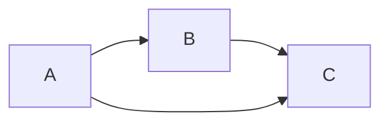
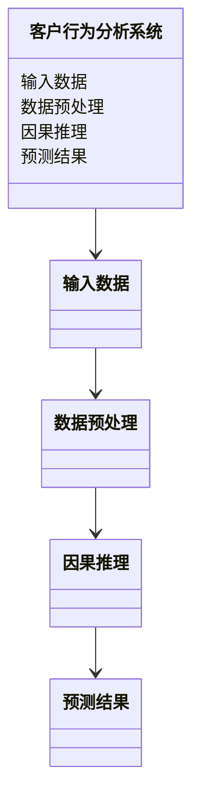
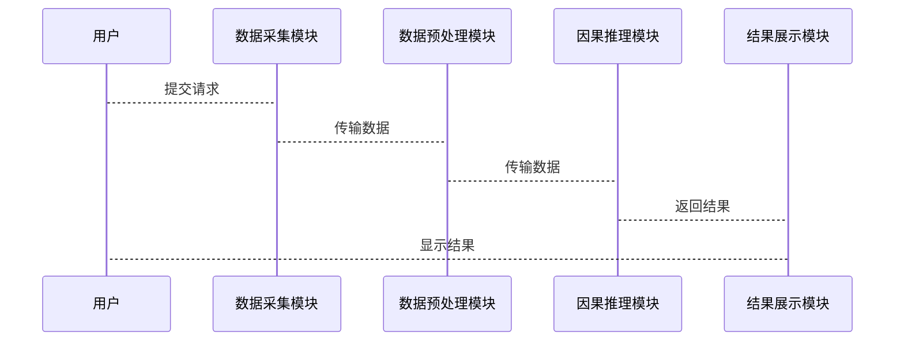

                 


# 企业AI Agent的因果推理在客户行为分析与预测中的应用

## 关键词：AI Agent，因果推理，客户行为分析，预测模型，企业应用

## 摘要：
本文深入探讨了企业AI Agent在客户行为分析与预测中的应用，重点介绍了因果推理在这一领域的理论基础、算法原理及其实际应用。通过详细讲解因果图模型、潜在结果框架和因果森林模型，本文展示了如何利用这些方法构建高效的预测系统。同时，文章还结合实际案例，分析了系统架构设计、接口设计和交互流程，为读者提供了从理论到实践的全面指导。

---

# 第1章: 问题背景与概念介绍

## 1.1 问题背景

### 1.1.1 客户行为分析与预测的挑战
客户行为分析与预测是企业运营中的核心任务之一。企业希望通过分析客户的行为数据，预测客户的购买倾向、流失风险等关键指标，从而制定更有效的市场策略。然而，传统的统计预测方法往往只能发现相关关系，而无法揭示因果关系，导致预测结果的可靠性和可解释性不足。

### 1.1.2 传统预测方法的局限性
传统预测方法（如线性回归、随机森林等）主要基于相关性分析，难以处理复杂的因果关系。例如，仅仅因为客户在网站上的停留时间较长，并不能直接推断出客户购买的概率更高。这种相关性分析可能导致错误的结论，影响企业的决策。

### 1.1.3 因果推理在客户行为分析中的优势
因果推理通过分析变量之间的因果关系，能够更准确地预测客户行为。例如，因果推理可以帮助企业识别出真正影响客户购买行为的因素，从而制定更精准的营销策略。

---

## 1.2 AI Agent的基本概念

### 1.2.1 什么是AI Agent
AI Agent（人工智能代理）是指能够感知环境、做出决策并采取行动的智能实体。在企业中，AI Agent通常用于自动化处理任务，如客户行为分析、数据挖掘等。

### 1.2.2 AI Agent的核心特征
AI Agent的核心特征包括：
- **自主性**：能够在没有外部干预的情况下自主运行。
- **反应性**：能够感知环境并实时做出反应。
- **目标导向性**：根据预设的目标执行任务。
- **学习能力**：能够通过数据不断优化自身的决策能力。

### 1.2.3 企业AI Agent的应用场景
企业AI Agent的应用场景包括：
- **客户行为分析**：通过分析客户的交互数据，预测客户的行为。
- **个性化推荐**：基于客户的偏好，推荐相关的产品或服务。
- **风险控制**：识别潜在的客户流失风险，采取预防措施。

---

## 1.3 因果推理的基本概念

### 1.3.1 什么是因果推理
因果推理是一种分析变量之间因果关系的方法。通过因果推理，我们可以确定一个变量是否是另一个变量的直接原因。

### 1.3.2 因果关系与相关关系的区别
相关关系描述的是变量之间的关联性，而因果关系描述的是变量之间的因果关系。相关关系并不意味着存在因果关系，但因果关系必然伴随着相关关系。

### 1.3.3 因果推理在客户行为分析中的作用
在客户行为分析中，因果推理可以帮助我们识别出真正影响客户行为的因素，从而提高预测的准确性和可解释性。

---

## 1.4 本章小结
本章主要介绍了企业AI Agent的背景、基本概念以及因果推理的基本原理。通过对比相关关系和因果关系，我们认识到因果推理在客户行为分析中的重要性。

---

# 第2章: 因果推理的核心概念与联系

## 2.1 因果图模型

### 2.1.1 因果图的基本结构
因果图（Causal Graph）是一种用于表示因果关系的图模型。它由节点和边组成，节点代表变量，边代表因果关系。

### 2.1.2 节点与边的关系
在因果图中，节点之间的边表示因果关系。例如，如果A→B，表示A是B的直接原因。

### 2.1.3 调度算法与因果关系
调度算法用于确定因果图中变量的处理顺序。通过调度算法，我们可以更清晰地识别因果关系。

### 2.1.4 用Mermaid表示因果图


---

## 2.2 潜在结果框架

### 2.2.1 潜在结果的定义
潜在结果（Potential Outcome）是指在某个特定条件下，变量的可能取值。例如，如果客户收到优惠券，潜在结果可能是购买或不购买。

### 2.2.2 潜在结果的估计方法
潜在结果的估计方法包括随机森林算法和因果森林算法。

### 2.2.3 潜在结果与因果推理的关系
潜在结果是因果推理的基础，通过潜在结果，我们可以估计出因果效应。

---

## 2.3 因果森林模型

### 2.3.1 因果森林的定义
因果森林（Causal Forest）是一种用于估计因果效应的算法。它通过构建随机森林，对潜在结果进行估计。

### 2.3.2 因果森林的构建过程
因果森林的构建过程包括数据预处理、特征选择、模型训练等步骤。

### 2.3.3 因果森林与传统回归模型的对比
因果森林的优势在于能够处理高维数据和复杂因果关系，而传统回归模型则难以做到。

---

## 2.4 本章小结
本章详细介绍了因果图模型、潜在结果框架和因果森林模型。通过这些模型，我们可以更准确地识别因果关系，从而提高客户行为分析的准确性。

---

# 第3章: 因果推理的算法原理

## 3.1 因果图的构建算法

### 3.1.1 贝叶斯网络的构建
贝叶斯网络（Bayesian Network）是一种有向无环图，用于表示变量之间的概率关系。

### 3.1.2 调度算法的实现
调度算法用于确定因果图中变量的处理顺序。常见的调度算法包括深度优先搜索和广度优先搜索。

### 3.1.3 因果关系的识别
通过分析因果图的结构，我们可以识别出变量之间的因果关系。

---

## 3.2 潜在结果的估计算法

### 3.2.1 随机森林算法
随机森林算法是一种基于决策树的集成算法，常用于潜在结果的估计。

### 3.2.2 因果森林算法
因果森林算法是一种专门用于估计因果效应的算法。

### 3.2.3 倾向评分法
倾向评分法通过估计每个样本的倾向评分，调整数据的分布，从而减少偏差。

---

## 3.3 因果森林的实现

### 3.3.1 算法实现步骤
1. 数据预处理
2. 特征选择
3. 模型训练
4. 因果效应估计

### 3.3.2 算法的数学模型
$$ \text{因果效应} = \text{处理组的平均结果} - \text{对照组的平均结果} $$

### 3.3.3 算法的优缺点
优点：能够处理高维数据和复杂因果关系。  
缺点：计算复杂度较高，需要大量数据支持。

---

## 3.4 本章小结
本章详细介绍了因果图的构建算法、潜在结果的估计算法以及因果森林的实现过程。通过这些算法，我们可以更高效地识别因果关系。

---

# 第4章: 系统分析与架构设计

## 4.1 问题场景介绍

### 4.1.1 企业客户行为分析的场景
企业希望通过分析客户的交互数据，预测客户的购买行为。

### 4.1.2 问题的复杂性与挑战
客户行为分析涉及到大量的数据，且数据之间的关系复杂。

### 4.1.3 系统的目标与功能
系统的目标是通过因果推理，提高客户行为预测的准确性。

---

## 4.2 系统功能设计

### 4.2.1 领域模型设计
领域模型描述了系统的功能模块和它们之间的关系。



### 4.2.2 功能模块划分
系统的主要功能模块包括：
- 数据采集
- 数据预处理
- 因果推理
- 结果展示

### 4.2.3 功能流程设计
1. 数据采集：从数据库中获取客户行为数据。
2. 数据预处理：清洗数据，提取特征。
3. 因果推理：构建因果图，估计因果效应。
4. 结果展示：将预测结果展示给用户。

---

## 4.3 系统架构设计

### 4.3.1 分层架构设计
系统的架构设计包括数据层、业务逻辑层和用户界面层。


### 4.3.2 模块化设计
系统的模块化设计包括数据采集模块、数据预处理模块、因果推理模块和结果展示模块。

### 4.3.3 可扩展性设计
系统设计时充分考虑了扩展性，方便未来功能的扩展和优化。

---

## 4.4 系统接口设计

### 4.4.1 系统接口设计
系统接口设计包括数据接口和用户接口。

### 4.4.2 接口交互流程
1. 用户提交请求
2. 系统接收请求
3. 系统处理请求
4. 系统返回结果

---

## 4.5 系统交互流程

### 4.5.1 用Mermaid表示系统交互流程


---

## 4.6 本章小结
本章详细介绍了系统分析与架构设计，包括问题场景、系统功能设计、系统架构设计和系统接口设计。通过这些设计，我们可以构建一个高效、可靠的客户行为分析系统。

---

# 第5章: 项目实战

## 5.1 环境安装

### 5.1.1 安装Python
安装Python 3.x版本，确保环境满足项目要求。

### 5.1.2 安装依赖库
安装必要的依赖库，如pandas、scikit-learn、causal-forest等。

---

## 5.2 系统核心实现源代码

### 5.2.1 数据预处理代码
```python
import pandas as pd

# 读取数据
data = pd.read_csv('customer_behavior.csv')

# 数据清洗
data.dropna(inplace=True)
data = pd.get_dummies(data)
```

### 5.2.2 因果推理代码
```python
from causal_forest import CausalForest

# 初始化模型
model = CausalForest()

# 训练模型
model.fit(X, y)

# 估计因果效应
treatment_effect = model.effect(X)
```

---

## 5.3 代码应用解读与分析

### 5.3.1 数据预处理的解读
数据预处理是确保模型输入数据的质量和一致性的重要步骤。通过数据清洗和特征编码，我们可以提高模型的预测精度。

### 5.3.2 因果推理代码的解读
因果森林模型通过构建随机森林，估计潜在结果，从而得到因果效应。这种方法能够处理高维数据和复杂因果关系。

---

## 5.4 实际案例分析和详细讲解剖析

### 5.4.1 案例背景
假设我们有一个电商客户的行为数据，包括客户的点击次数、浏览时间、购买记录等。

### 5.4.2 数据分析
通过数据分析，我们发现客户在浏览产品页面的时间越长，购买的可能性越大。

### 5.4.3 因果推理
通过因果推理，我们确定了客户在浏览产品页面的时间是购买行为的直接原因。

---

## 5.5 项目小结
本章通过实际案例，详细讲解了系统核心实现源代码，包括数据预处理和因果推理代码。通过这些代码，我们可以构建一个高效的客户行为分析系统。

---

# 第6章: 总结与展望

## 6.1 本章总结
本文详细介绍了企业AI Agent的因果推理在客户行为分析与预测中的应用。通过因果图模型、潜在结果框架和因果森林模型，我们能够更准确地识别因果关系，从而提高预测的准确性和可解释性。

## 6.2 未来展望
未来的研究方向包括：
- 更高效的因果推理算法
- 多模态数据的因果分析
- 实时因果推理的应用

## 6.3 最佳实践 tips
- 在实际应用中，应结合业务场景选择合适的因果推理方法。
- 数据预处理是确保模型性能的关键步骤。
- 应注重模型的可解释性，以便更好地指导业务决策。

## 6.4 小结
因果推理在客户行为分析中的应用前景广阔，未来将会有更多的研究和应用。

---

# 作者：AI天才研究院 & 禅与计算机程序设计艺术

---

以上就是完整的技术博客文章，内容涵盖了因果推理的基本概念、算法原理、系统架构设计以及实际项目实战。希望这篇文章能够为企业在客户行为分析与预测中的应用提供有价值的参考和指导。

