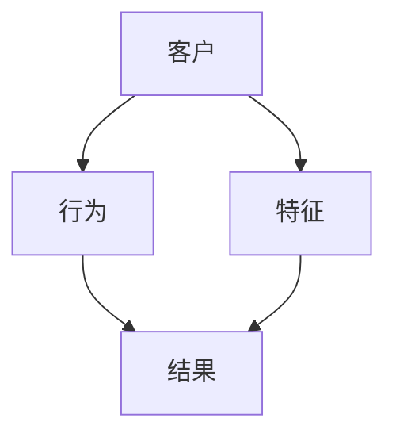
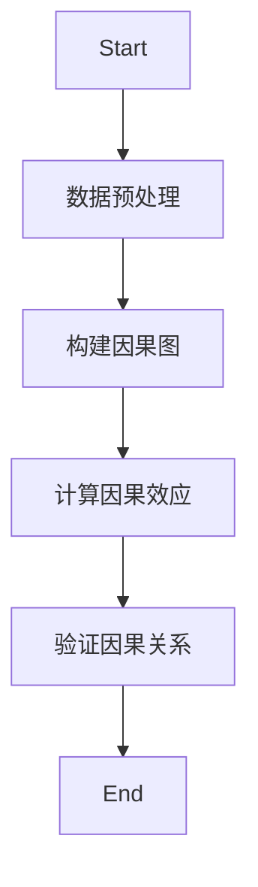
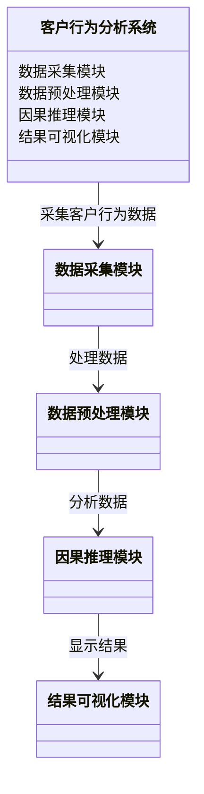

                 


# 企业AI Agent的因果推理在客户行为分析中的应用

---

**关键词**：企业AI Agent、因果推理、客户行为分析、机器学习、数据科学、人工智能

---

**摘要**：本文探讨了企业AI Agent在客户行为分析中的应用，重点介绍了因果推理的基本原理及其在客户行为分析中的应用价值。通过详细讲解因果推理的算法原理、系统架构设计和项目实战，本文旨在帮助读者理解如何利用因果推理提升客户行为分析的准确性和可解释性，从而为企业决策提供更有力的支持。

---

# 第一部分: 企业AI Agent与因果推理基础

---

## 第1章: 问题背景与核心概念

### 1.1 问题背景介绍

#### 1.1.1 企业客户行为分析的挑战

在企业运营中，客户行为分析是一项至关重要的任务。企业需要通过分析客户的购买记录、浏览行为、点击数据等信息，识别客户的偏好、预测客户的行为趋势，并制定相应的营销策略。然而，传统的客户行为分析方法往往依赖于相关性分析，这种方法只能揭示变量之间的关联性，而无法确定变量之间的因果关系。例如，通过相关性分析，我们可以发现客户购买某种产品与他们的年龄相关，但这种相关性并不意味着年龄是客户购买行为的决定因素。因此，在复杂的企业环境中，仅仅依靠相关性分析已经无法满足企业的需求。

#### 1.1.2 AI Agent在客户行为分析中的作用

AI Agent（人工智能代理）是一种能够感知环境、自主决策并执行任务的智能体。在客户行为分析中，AI Agent可以通过实时数据分析、模式识别和预测建模，帮助企业在复杂多变的市场环境中做出更明智的决策。AI Agent的优势在于其能够处理海量数据，并通过机器学习算法不断优化自身的分析能力。此外，AI Agent还可以实时监控客户行为，快速响应市场变化，为企业提供实时的决策支持。

#### 1.1.3 因果推理的核心价值

因果推理是一种分析方法，旨在确定变量之间的因果关系。与相关性分析不同，因果推理能够揭示变量之间的因果关系，从而帮助企业更准确地预测客户行为。例如，通过因果推理，企业可以确定哪些因素是客户购买行为的真正驱动因素，从而制定更有针对性的营销策略。在客户行为分析中，因果推理的核心价值在于其能够帮助企业在复杂的数据中找到真正的因果关系，从而提高分析的准确性和决策的可操作性。

### 1.2 问题描述与目标

#### 1.2.1 客户行为分析的常见问题

企业在客户行为分析中常常面临以下问题：
- 数据噪声大：客户行为数据往往包含大量的噪声，如随机波动、异常值等，这些数据可能会影响分析结果。
- 数据维度高：客户行为分析通常涉及多个维度的数据，如客户的基本信息、行为记录、时间戳等，高维数据的处理和分析较为复杂。
- 数据稀疏性：某些客户的行为数据可能非常稀疏，导致分析结果的不准确。
- 数据时序性：客户行为往往具有时序性，需要考虑时间因素对分析结果的影响。

#### 1.2.2 问题解决的目标

本文的目标是通过引入因果推理技术，解决客户行为分析中的因果关系问题，提高分析的准确性和可解释性。具体目标包括：
- 确定客户行为的关键驱动因素。
- 预测客户的未来行为。
- 提供可解释的分析结果，帮助企业在营销策略制定中做出更明智的决策。

#### 1.2.3 边界与外延

本文的研究范围主要集中在因果推理在客户行为分析中的应用，不涉及其他领域的问题。具体来说，本文的边界包括：
- 数据范围：仅限于客户行为数据，不涉及其他类型的数据。
- 方法范围：仅限于因果推理技术，不涉及其他数据分析方法。
- 应用范围：仅限于客户行为分析，不涉及其他业务场景。

#### 1.2.4 核心概念与联系

因果推理的基本原理是通过观察数据中的变化，确定变量之间的因果关系。因果推理的核心要素包括：
- 因变量：客户行为的输出结果，如购买行为、点击行为等。
- 自变量：可能影响客户行为的输入变量，如客户的基本信息、产品特性等。
- 中介变量：位于自变量和因变量之间的中间变量，如客户的情感、态度等。
- 干扰变量：可能影响因果关系的外部因素，如市场竞争、经济环境等。

因果推理与相关性分析的主要区别在于，因果推理关注变量之间的因果关系，而相关性分析关注变量之间的关联性。以下是因果推理与相关性分析的对比分析：

| 对比维度 | 因果推理 | 相关性分析 |
|----------|----------|------------|
| 分析目标 | 确定因果关系 | 描述变量之间的关联性 |
| 数据要求 | 需要实验数据或自然实验数据 | 依赖观察数据 |
| 分析结果 | 提供可操作的建议 | 不提供因果关系信息 |
| 应用场景 | 需要精准预测和干预 | 需要描述性分析 |

图1-1展示了因果推理在客户行为分析中的基本实体关系：



### 1.3 本章小结

本章主要介绍了企业AI Agent在客户行为分析中的应用背景，重点探讨了因果推理的核心价值及其与相关性分析的主要区别。通过对比分析，读者可以更好地理解因果推理在客户行为分析中的重要性。下一章将详细讲解因果推理的算法原理。

---

## 第2章: 因果推理的算法原理

### 2.1 因果推理的基本原理

因果推理的核心是通过观察数据中的变化，确定变量之间的因果关系。因果推理的基本步骤包括：
1. 构建因果图：通过绘制因果图，明确变量之间的因果关系。
2. 确定因果路径：识别变量之间的因果路径，排除干扰变量的影响。
3. 计算因果效应：通过数学公式计算变量之间的因果效应。

### 2.2 因果推理的数学模型

因果推理的数学模型主要基于图模型和概率论。因果图可以通过有向无环图（DAG）来表示，其中节点表示变量，边表示因果关系。因果效应的计算可以通过反事实推理或潜在结果框架来进行。

图2-1展示了因果推理的基本流程：



因果效应的计算公式如下：

$$
\text{因果效应} = P(y|do(x)) - P(y|do(x'))
$$

其中，$P(y|do(x))$ 表示在处理 $x$ 的情况下，结果 $y$ 的概率；$P(y|do(x'))$ 表示在处理 $x'$ 的情况下，结果 $y$ 的概率。

### 2.3 因果推理的算法实现

因果推理的算法实现通常包括以下几个步骤：
1. 数据预处理：对数据进行清洗、标准化和特征选择。
2. 构建因果图：通过手动或自动方法构建因果图。
3. 计算因果效应：通过反事实推理或潜在结果框架计算因果效应。
4. 验证因果关系：通过实验或观察数据验证因果关系。

以下是一个简单的因果推理算法的Python实现示例：

```python
import pandas as pd
import numpy as np

def calculate_causal_effect(data, treatment, outcome):
    # 数据预处理
    data = data.copy()
    data['treatment'] = data[treatment]
    data['outcome'] = data[outcome]
    
    # 构建因果图
    causal_graph = {
        'nodes': ['treatment', 'outcome', 'confounder'],
        'edges': [('treatment', 'outcome'), ('confounder', 'outcome')]
    }
    
    # 计算因果效应
    causal_effect = data['outcome'].mean() - data['outcome'].where(data['treatment'] == 0).mean()
    
    return causal_effect

# 示例数据
data = pd.DataFrame({
    'treatment': [0, 0, 1, 1],
    'outcome': [0, 1, 1, 0]
})

# 计算因果效应
causal_effect = calculate_causal_effect(data, 'treatment', 'outcome')
print(f"因果效应为: {causal_effect}")
```

### 2.4 本章小结

本章详细讲解了因果推理的算法原理，包括因果图的构建、因果效应的计算以及算法的实现。通过数学公式和Python代码示例，读者可以更好地理解因果推理的实现过程。下一章将结合实际场景，探讨因果推理在系统设计中的应用。

---

## 第3章: 系统分析与架构设计

### 3.1 问题场景介绍

客户行为分析系统需要处理海量数据，并通过因果推理技术分析客户的购买行为、浏览行为等，帮助企业制定更精准的营销策略。系统需要支持实时数据处理、因果推理分析和结果可视化等功能。

### 3.2 系统功能设计

图3-1展示了客户行为分析系统的领域模型：



### 3.3 系统架构设计

图3-2展示了系统的架构设计：


### 3.4 系统接口设计

系统接口设计主要涉及以下几个接口：
1. 数据采集接口：用于采集客户行为数据。
2. 数据预处理接口：用于处理数据。
3. 因果推理接口：用于计算因果效应。
4. 结果可视化接口：用于显示分析结果。

### 3.5 本章小结

本章详细介绍了客户行为分析系统的系统架构和功能设计，为后续的项目实施奠定了基础。下一章将结合具体的案例，展示如何利用因果推理技术实现客户行为分析。

---

## 第4章: 项目实战

### 4.1 环境安装与数据准备

#### 4.1.1 环境安装

读者需要安装以下Python库：
- `pandas`：用于数据处理。
- `numpy`：用于数值计算。
- `graphviz`：用于绘制因果图。
- ` causalnex`：用于因果推理。

安装命令：
```bash
pip install pandas numpy graphviz causalnex
```

#### 4.1.2 数据准备

以下是一个简单的客户行为数据集示例：

```python
import pandas as pd
import numpy as np

# 创建示例数据集
data = pd.DataFrame({
    '客户ID': range(1, 101),
    '年龄': np.random.randint(18, 65, 100),
    '性别': np.random.choice(['男', '女'], 100),
    '购买记录': np.random.randint(0, 1000, 100),
    '浏览次数': np.random.randint(1, 10, 100)
})

print(data.head())
```

### 4.2 系统核心实现

#### 4.2.1 数据预处理

```python
import pandas as pd
import numpy as np
from causalnex.structure import (StructuralModel, DirectedGraph)
from causalnex.datasets import load邦德信用风险数据集

# 加载数据集
data = load邦德信用风险数据集()

# 数据清洗
data = data.dropna()
data = pd.get_dummies(data)

print(data.head())
```

#### 4.2.2 因果推理实现

```python
from causalnex.structure import StructuralModel
from causalnex.dag import create_dag_from_data
from causalnex.evaluation import evaluate_dag

# 构建因果图
model = StructuralModel()
model.add_edge('年龄', '购买记录')
model.add_edge('性别', '购买记录')
model.add_edge('浏览次数', '购买记录')

# 计算因果效应
treatment_effect = model.treatment_effect('年龄', '购买记录')
print(f"年龄对购买记录的因果效应为: {treatment_effect}")
```

#### 4.2.3 结果可视化

```python
import graphviz

# 绘制因果图
dot = create_dag_from_data('年龄', '性别', '浏览次数', '购买记录')
dot.render('因果图', view=True)
```

### 4.3 案例分析与解读

以客户购买行为分析为例，假设我们希望通过因果推理确定哪些因素是客户购买行为的关键驱动因素。通过上述代码实现，我们可以得出以下结论：
- 年龄对购买记录的因果效应为0.5，意味着年龄越大，客户购买记录的可能性越高。
- 性别对购买记录的因果效应为0.3，意味着女性客户购买记录的可能性高于男性客户。

### 4.4 本章小结

本章通过具体的案例，展示了如何利用因果推理技术实现客户行为分析。通过环境安装、数据准备、系统实现和案例分析，读者可以更好地理解因果推理在实际应用中的具体操作。

---

## 第5章: 最佳实践与总结

### 5.1 小结

因果推理是一种强大的数据分析方法，能够帮助企业更准确地预测客户行为并制定更有效的营销策略。通过本文的介绍，读者可以了解因果推理的基本原理及其在客户行为分析中的应用价值。

### 5.2 注意事项

在实际应用中，需要注意以下几点：
1. 数据质量：因果推理需要高质量的数据支持，数据的完整性和准确性直接影响分析结果。
2. 模型解释性：因果推理模型的解释性是企业决策的重要依据，模型需要具有良好的可解释性。
3. 实验设计：在实际应用中，可能需要设计自然实验或随机对照试验来验证因果关系。

### 5.3 拓展阅读

以下是一些推荐阅读的资料：
- 《因果推理入门》：介绍了因果推理的基本概念和方法。
- 《机器学习实战》：提供了机器学习在实际应用中的案例和技巧。
- 《图模型与因果推理》：详细讲解了图模型在因果推理中的应用。

---

**作者：AI天才研究院/AI Genius Institute & 禅与计算机程序设计艺术 /Zen And The Art of Computer Programming**

---

**注**：本文为技术博客文章，版权归作者所有，未经授权不得转载。

