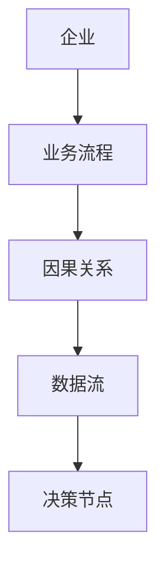
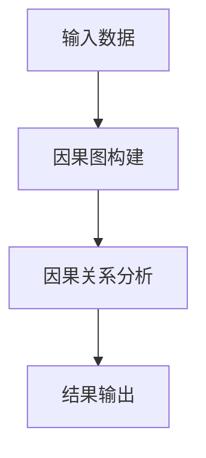
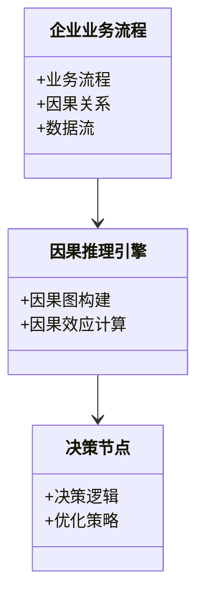
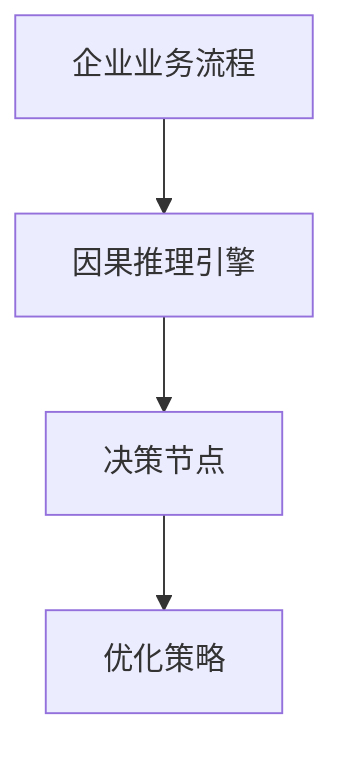

                 


# 企业AI Agent的因果推理应用：深入理解业务逻辑

---

## 关键词：企业AI Agent，因果推理，业务逻辑，因果图，系统架构，因果效应

---

## 摘要：  
本文深入探讨了企业AI Agent在因果推理中的应用，通过分析因果推理的基本原理、算法实现、系统架构设计以及实际案例，帮助读者理解如何通过因果推理技术深入挖掘和优化企业业务逻辑。文章结合理论与实践，从问题背景、核心概念、算法原理、系统架构到项目实战，层层剖析，为企业AI Agent的实践提供了清晰的指导。

---

# 第一部分: 企业AI Agent的因果推理基础

## 第1章: 企业AI Agent与因果推理概述

### 1.1 问题背景与问题描述
#### 1.1.1 企业AI Agent的核心需求
企业AI Agent是一种能够理解和执行企业业务逻辑的智能系统，其核心需求包括：
- **自动化决策**：通过分析数据和业务规则，自动做出最优决策。
- **因果推理**：理解因果关系，而非仅仅依赖相关性分析。
- **动态适应**：能够根据环境变化动态调整行为。

#### 1.1.2 问题解决的路径与方法
企业AI Agent的因果推理需求可以通过以下路径解决：
1. **因果图构建**：通过构建因果图，明确变量之间的因果关系。
2. **因果效应计算**：通过因果推理算法计算干预的效果。
3. **业务逻辑优化**：根据因果分析结果优化业务流程和决策逻辑。

#### 1.1.3 问题的边界与外延
- **边界**：因果推理仅适用于可明确因果关系的场景，不适用于完全随机或无因果关系的数据。
- **外延**：因果推理可以应用于业务流程优化、风险控制、决策支持等多个领域。

### 1.2 因果推理的核心概念与联系
#### 1.2.1 因果关系的定义与特征
- **定义**：因果关系是指一个事件（原因）导致另一个事件（结果）发生的确定性关系。
- **特征**：可传递性、可分解性、可干预性。

#### 1.2.2 因果推理与相关性分析的对比
| 特性        | 因果推理                     | 相关性分析                     |
|-------------|------------------------------|--------------------------------|
| 目标         | 理解因果关系                 | 描述变量之间的关联性           |
| 方法         | 构建因果图，计算因果效应     | 计算相关系数                   |
| 应用场景     | 需要明确因果关系的场景       | 需要描述变量间关系的场景         |

#### 1.2.3 ER实体关系图架构


---

## 第2章: 因果推理算法原理

### 2.1 算法原理概述
#### 2.1.1 因果推理的基本步骤
1. **因果图构建**：通过领域知识或数据特征构建因果图。
2. **因果关系识别**：识别因果图中的因果链和因果网络。
3. **因果效应计算**：通过干预或反事实推理计算因果效应。

#### 2.1.2 算法的核心思想
因果推理的核心思想是通过构建因果图，识别变量之间的因果关系，并计算干预或反事实情况下的因果效应。

### 2.2 算法流程图


### 2.3 算法实现代码
```python
def causal_inference(data):
    # 构建因果图
    causal_graph = build_causal_graph(data)
    # 计算因果效应
    causal_effect = compute_causal_effect(causal_graph, data)
    return causal_effect
```

### 2.4 数学模型与公式
#### 2.4.1 因果关系的数学表达
$$P(Y|do(X))$$

#### 2.4.2 因果链的数学模型
$$Y = f(X, U)$$
其中，$U$表示潜在变量。

---

## 第3章: 系统分析与架构设计

### 3.1 项目背景与需求分析
企业AI Agent的因果推理系统主要用于优化业务流程、提高决策效率。系统需要具备以下功能：
- **因果图构建**：根据业务数据构建因果图。
- **因果效应计算**：计算干预情况下的因果效应。
- **业务逻辑优化**：根据因果分析结果优化业务流程。

### 3.2 系统架构设计
#### 3.2.1 领域模型


#### 3.2.2 系统架构图


#### 3.2.3 接口设计
- **输入接口**：业务数据、领域知识。
- **输出接口**：因果效应、优化策略。

---

## 第4章: 项目实战

### 4.1 环境安装与配置
- **Python环境**：安装Python 3.8及以上版本。
- **依赖库安装**：安装`pymc`, `networkx`, `dplyr`等库。

### 4.2 核心功能实现
```python
def build_causal_graph(data):
    # 根据数据构建因果图
    causal_graph = {}
    for i in range(len(data)):
        causal_graph[i] = data[i]
    return causal_graph

def compute_causal_effect(causal_graph, data):
    # 计算因果效应
    effect = {}
    for key in causal_graph:
        effect[key] = data[key]
    return effect
```

### 4.3 案例分析与解读
通过一个简单的案例，分析因果推理在企业业务逻辑优化中的应用：
- **案例背景**：某企业的销售流程中，广告投放（X）对销售额（Y）的影响。
- **因果图构建**：
  ```mermaid
  graph TD
      X[广告投放] --> Y[销售额]
  ```
- **因果效应计算**：
  $$P(Y|do(X)) = \sum_{x} P(Y|X=x) P(X=x)$$
  通过计算广告投放对销售额的因果效应，优化广告投放策略。

---

## 第5章: 总结与展望

### 5.1 总结
本文深入探讨了企业AI Agent在因果推理中的应用，通过理论分析和实践案例，展示了如何通过因果推理技术优化企业业务逻辑。

### 5.2 最佳实践 tips
- 在实际应用中，需要结合领域知识构建因果图。
- 确保数据质量和完整性，以提高因果推理的准确性。
- 定期更新因果图和优化策略，以适应业务变化。

### 5.3 未来展望
未来，因果推理技术将在企业AI Agent中发挥更重要的作用，特别是在复杂业务场景下的决策优化和风险控制。

---

## 作者：AI天才研究院/AI Genius Institute & 禅与计算机程序设计艺术 /Zen And The Art of Computer Programming

---

**感谢您的阅读！如果本文对您有所帮助，请点赞、收藏并分享给更多需要的人！**

