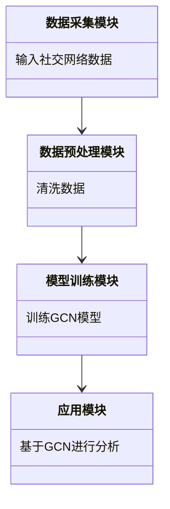
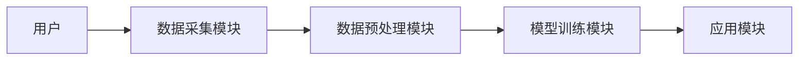
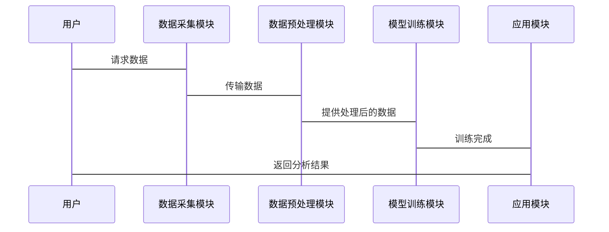

                 


# 企业AI Agent的图卷积网络在社交网络分析中的应用

## 关键词：企业AI Agent，图卷积网络，社交网络分析，图论，深度学习，网络架构

## 摘要：本文深入探讨了企业AI Agent在社交网络分析中的应用，重点介绍了图卷积网络（GCN）的核心原理及其在社交网络中的实际应用。文章从背景介绍开始，逐步分析GCN的算法原理、系统架构设计，再到项目实战，最后总结了GCN在社交网络分析中的优势和未来发展方向。

---

# 第一部分: 背景介绍

## 第1章: 背景介绍

### 1.1 社交网络分析的背景与意义

#### 1.1.1 社交网络的基本结构
社交网络由节点（用户）和边（关系）组成，广泛应用于企业关系分析、社交舆情监控等领域。通过分析节点之间的关系，可以发现潜在的商业机会和风险。

#### 1.1.2 社交网络分析的重要性
社交网络分析帮助企业识别关键意见领袖（KOL）、发现社群结构、预测用户行为，从而优化市场策略和提升用户体验。

#### 1.1.3 图卷积网络的引入
传统机器学习方法难以处理图结构数据，GCN通过将图结构与深度学习结合，解决了这一问题，成为社交网络分析的有力工具。

### 1.2 AI Agent的基本概念

#### 1.2.1 AI Agent的定义
AI Agent是一种能够感知环境、自主决策的智能体，能够在企业场景中执行复杂任务，如数据分析、决策支持等。

#### 1.2.2 AI Agent的核心功能
AI Agent具备学习、推理、规划、自适应等能力，能够根据实时数据动态调整行为，优化企业运营。

#### 1.2.3 AI Agent在企业中的应用
AI Agent广泛应用于企业内部流程优化、客户关系管理、市场预测等领域，显著提升了企业的智能化水平。

### 1.3 图卷积网络（GCN）的基本原理

#### 1.3.1 图论基础
图论研究节点间的关系，节点之间的边可以有方向和权重，表示关系的强度和方向。

#### 1.3.2 卷积神经网络的原理
CNN通过局部感受野和权值共享机制，有效提取图像特征，但在处理图结构数据时存在局限性。

#### 1.3.3 图卷积网络的核心思想
GCN将卷积操作扩展到图结构，通过聚合邻居节点信息，捕获图中的局部和全局特征。

---

## 第2章: 图卷积网络的核心概念与联系

### 2.1 图卷积网络的核心概念

#### 2.1.1 图的表示
图由节点集合V和边集合E组成，节点特征表示为X，邻接矩阵表示为A。

#### 2.1.2 邻接矩阵与特征矩阵
邻接矩阵A表示节点之间的连接关系，特征矩阵X存储节点的属性信息。

#### 2.1.3 图卷积操作的数学表达
$$y = \sum_{j} A_{ij} x_j$$

### 2.2 图卷积网络与传统卷积网络的对比

#### 2.2.1 传统卷积网络的局限性
CNN无法处理图结构数据，难以捕捉节点间的复杂关系。

#### 2.2.2 图卷积网络的优势
GCN能够处理非规则结构数据，捕捉节点间的局部和全局特征。

#### 2.2.3 图卷积网络的改进方向
未来研究将集中在图结构的动态性和可解释性上。

### 2.3 ER实体关系图的构建与分析

#### 2.3.1 实体关系图的定义
ER图描述实体及其关系，用于建模复杂的业务场景。

#### 2.3.2 实体关系图的构建方法
通过数据建模和关系抽取，构建企业内部的实体关系图。

#### 2.3.3 实体关系图的分析与应用
分析实体关系图有助于发现关键节点和潜在风险，优化企业运营。

---

## 第3章: 图卷积网络的算法原理

### 3.1 图卷积网络的数学模型

#### 3.1.1 邻接矩阵的定义
邻接矩阵A表示节点之间的连接关系，其中A_ij表示节点i和j之间的边权重。

#### 3.1.2 节点特征的表示
节点特征向量X表示节点的属性信息，维度为d。

#### 3.1.3 图卷积操作的数学公式
$$y = \sum_{j} A_{ij} x_j$$

### 3.2 图卷积网络的算法流程

#### 3.2.1 输入层的处理
将节点特征和邻接矩阵输入GCN，进行前向传播。

#### 3.2.2 图卷积操作的实现
通过聚合邻居节点信息，更新节点表示。

#### 3.2.3 激活函数的引入
使用ReLU等激活函数，增强模型的非线性表达能力。

### 3.3 图卷积网络的优化与改进

#### 3.3.1 模型的训练过程
通过反向传播和梯度下降优化模型参数。

#### 3.3.2 模型的评估指标
采用准确率、召回率等指标评估模型性能。

#### 3.3.3 模型的调参技巧
通过网格搜索等方法，优化模型参数。

---

## 第4章: 系统分析与架构设计方案

### 4.1 系统分析

#### 4.1.1 问题场景的描述
企业需要分析社交网络中的用户行为，识别关键节点和社群结构。

#### 4.1.2 项目的介绍
本项目旨在构建一个基于GCN的企业AI Agent，用于社交网络分析。

### 4.2 系统功能设计

#### 4.2.1 系统功能模块
- 数据采集模块：收集社交网络数据
- 数据预处理模块：清洗和转换数据
- 模型训练模块：训练GCN模型
- 应用模块：基于GCN进行分析和预测

#### 4.2.2 领域模型（Mermaid类图）


### 4.3 系统架构设计

#### 4.3.1 系统架构图（Mermaid架构图）


### 4.4 系统接口设计

#### 4.4.1 接口描述
- 数据采集接口：从社交平台获取数据
- 数据预处理接口：清洗和转换数据
- 模型训练接口：训练GCN模型
- 应用接口：基于GCN进行分析和预测

### 4.5 系统交互设计

#### 4.5.1 系统交互流程（Mermaid序列图）


---

## 第5章: 项目实战

### 5.1 环境安装

#### 5.1.1 安装Python
```bash
python --version
pip install --upgrade pip
```

#### 5.1.2 安装依赖库
```bash
pip install numpy
pip install tensorflow
pip install networkx
pip install pymermaid
```

### 5.2 核心代码实现

#### 5.2.1 数据预处理代码
```python
import numpy as np
import networkx as nx

# 创建一个示例图
G = nx.Graph()
G.add_edges_from([(1,2), (2,3), (3,4), (4,5)])
```

#### 5.2.2 图卷积网络实现代码
```python
import tensorflow as tf
from tensorflow.keras import layers

def gcn_layer(x, A):
    x = layers.Dense(64, activation='relu')(x)
    x = layers.Dot((1, A.shape[1]))([x, A])
    return x

# 示例输入
input_node_features = layers.Input(shape=(64,))
input_adjacency = layers.Input(shape=(None, None))
output = gcn_layer(input_node_features, input_adjacency)
model = tf.keras.Model(inputs=[input_node_features, input_adjacency], outputs=output)
model.compile(optimizer='adam', loss='binary_crossentropy')
```

#### 5.2.3 模型训练代码
```python
# 示例训练数据
X_train = np.random.rand(100, 64)
A_train = np.random.rand(100, 100)

# 编译模型
model.fit([X_train, A_train], y_train, epochs=10, batch_size=32)
```

### 5.3 案例分析与解读

#### 5.3.1 案例分析
以企业内部员工关系分析为例，构建员工关系图，识别关键员工和潜在风险。

#### 5.3.2 代码实现与解读
上述代码实现了GCN的基本结构，包括数据预处理、模型训练和预测。

### 5.4 项目小结

通过项目实战，读者可以掌握GCN的基本实现和应用方法，为实际的企业AI Agent开发打下基础。

---

## 第6章: 总结与展望

### 6.1 总结

本文系统地介绍了企业AI Agent在社交网络分析中的应用，重点讲解了GCN的原理和实现方法。通过理论分析和项目实战，展示了GCN在社交网络分析中的巨大潜力。

### 6.2 展望

未来的研究方向包括优化GCN的计算效率，探索新的图结构模型，以及结合强化学习提升AI Agent的智能性。

---

作者：AI天才研究院/AI Genius Institute & 禅与计算机程序设计艺术 /Zen And The Art of Computer Programming

