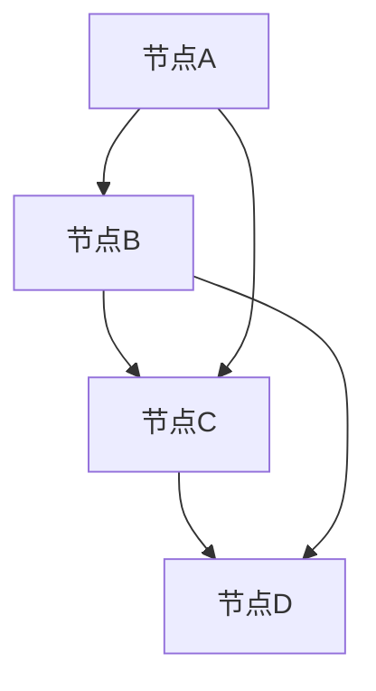
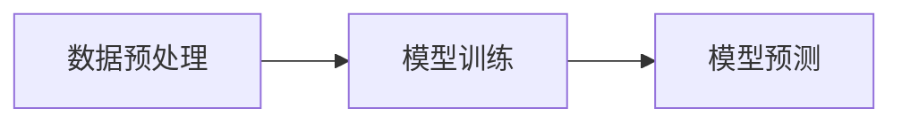
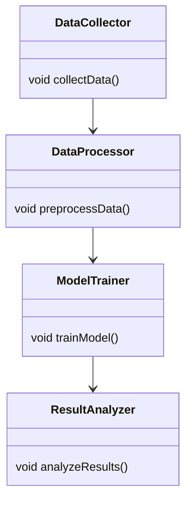
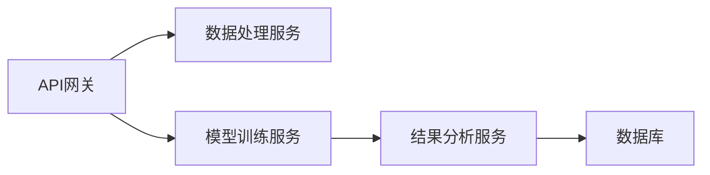
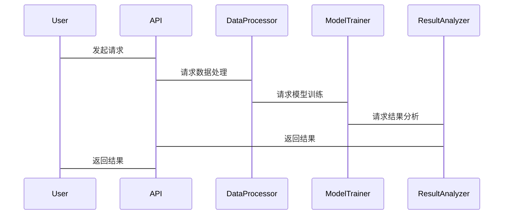

                 


# 企业AI Agent的图卷积网络在社交网络影响力分析中的应用

> 关键词：企业AI Agent，图卷积网络，社交网络影响力分析，算法原理，系统设计，项目实战，最佳实践

> 摘要：本文将深入探讨企业AI Agent如何利用图卷积网络（GCN）在社交网络中进行影响力分析的应用。通过分析核心概念、算法原理、系统设计、项目实战和最佳实践，本文旨在为企业技术决策者和开发者提供全面的技术指导，帮助他们在社交网络中高效地进行影响力分析，提升企业的市场竞争力。

---

# 第一部分：背景与概念

## 第1章：企业AI Agent概述

### 1.1 AI Agent的基本概念
AI Agent（人工智能代理）是指能够感知环境、自主决策并执行任务的智能实体。它能够通过传感器获取信息，利用推理机制进行分析，并通过执行器与环境交互。企业AI Agent广泛应用于自动化决策、智能推荐和实时数据分析等领域。

**表1.1 AI Agent的核心特点**

| 属性 | 描述 |
|------|------|
| 智能性 | 能够自主学习和优化 |
| 反应性 | 能够实时感知并响应环境变化 |
| 主动性 | 能够主动执行任务 |
| 社交性 | 能够与人类或其他系统进行交互 |

### 1.2 图卷积网络（GCN）概述
图卷积网络是一种基于图结构的深度学习模型，能够处理图中的节点和边信息。GCN的核心思想是将传统的卷积操作扩展到图结构中，通过聚合节点及其邻居的信息来生成节点表示。

**图1.1 图卷积网络的节点表示**



### 1.3 社交网络影响力分析
社交网络影响力分析是指通过分析社交网络中的用户行为和关系，评估用户或节点在网络中的影响力。影响力分析在品牌推广、舆情监控和社群管理等领域具有重要应用。

**图1.2 社交网络影响力分析的实体关系图**

```mermaid
erd
    id: 用户ID
    username: 用户名
    content: 用户发布的内容
    like_count: 点赞数
    follow_count: 关注数
    user(User) { id, username, content, like_count, follow_count }
    post(Post) { id, content, author_id }
    follow(Follow) { id, user_id, target_user_id }
```

---

## 第2章：图卷积网络的核心概念与联系

### 2.1 图卷积网络的数学模型
图卷积网络的数学模型基于图的邻接矩阵和节点特征矩阵。GCN的核心公式为：

$$
Z = A X W + X W
$$

其中，\(A\) 是邻接矩阵，\(X\) 是节点特征矩阵，\(W\) 是权重矩阵。

### 2.2 核心概念的属性对比
GCN与其他图神经网络（如GAT）相比，具有以下特点：

**表2.1 GCN与GAT的对比**

| 特性 | GCN | GAT |
|------|------|------|
| 注意力机制 | 无 | 有 |
| 计算效率 | 高 | 较低 |
| 模型复杂度 | 低 | 高 |

---

## 第3章：企业AI Agent的图卷积网络应用

### 3.1 企业AI Agent的核心功能
企业AI Agent的核心功能包括：

- 自动化决策：基于社交网络数据，自动识别关键意见领袖（KOL）。
- 智能推荐：根据用户影响力，推荐优质内容。
- 实时数据分析：快速响应社交网络中的热点事件。

### 3.2 图卷积网络在影响力分析中的应用
图卷积网络可以通过以下方式提升影响力分析的准确性：

- 用户影响力评估：基于GCN生成的节点表示，评估用户的影响力。
- 社群影响力分析：通过GCN识别社群中的核心用户。
- 关键意见领袖识别：基于GCN的注意力机制，识别关键用户。

---

# 第二部分：算法原理

## 第4章：图卷积网络的数学模型与算法

### 4.1 图卷积网络的数学模型
GCN的数学模型可以表示为：

$$
Y = A X W + X W
$$

其中，\(Y\) 是节点表示，\(A\) 是邻接矩阵，\(X\) 是节点特征矩阵，\(W\) 是权重矩阵。

### 4.2 图卷积网络的算法流程
GCN的算法流程如下：



### 4.3 图卷积网络的变体与优化
GCN的变体包括：

- GAT：引入注意力机制，提升模型性能。
- GraphSAGE：通过采样方式优化计算效率。
- GCN+：通过残差连接提升模型深度。

---

## 第5章：图卷积网络的实现与案例分析

### 5.1 图卷积网络的Python实现
以下是GCN的Python实现代码：

```python
import torch
from torch import nn
from torch.nn import functional as F

class GCN(nn.Module):
    def __init__(self, input_dim, hidden_dim, output_dim):
        super(GCN, self).__init__()
        self.W1 = nn.Parameter(torch.randn(input_dim, hidden_dim))
        self.W2 = nn.Parameter(torch.randn(hidden_dim, output_dim))

    def forward(self, A, X):
        X = X.mm(A)  # 图卷积操作
        X = F.relu(X.mm(self.W1))  # 激活函数
        output = X.mm(self.W2)  # 输出层
        return output
```

### 5.2 案例分析
以新浪微博为例，分析用户影响力：

1. 数据预处理：收集用户信息、帖子内容和互动数据。
2. 模型训练：使用GCN进行训练，生成用户影响力评分。
3. 结果分析：识别关键用户，制定推广策略。

---

# 第三部分：系统设计

## 第6章：系统设计与实现

### 6.1 系统功能设计
系统功能模块包括：

- 数据采集模块：负责采集社交网络数据。
- 数据处理模块：对数据进行清洗和预处理。
- 模型训练模块：基于GCN进行训练。
- 结果分析模块：生成影响力报告。

**图6.1 系统功能设计类图**



### 6.2 系统架构设计
系统架构设计采用微服务架构，包括：

- API网关：负责请求分发。
- 数据处理服务：负责数据清洗和预处理。
- 模型训练服务：负责GCN模型训练。
- 结果分析服务：负责生成影响力报告。

**图6.2 系统架构设计图**



### 6.3 系统交互设计
系统交互流程如下：

1. 用户发起请求，API网关接收请求。
2. 数据处理服务清洗数据。
3. 模型训练服务训练GCN模型。
4. 结果分析服务生成报告。
5. API网关返回结果。

**图6.3 系统交互流程图**



---

# 第四部分：项目实战

## 第7章：项目实战与经验分享

### 7.1 项目背景与目标
本项目旨在利用GCN分析新浪微博中的用户影响力，识别关键意见领袖。

### 7.2 项目实现
以下是项目的实现步骤：

1. 环境搭建：安装PyTorch和相关库。
2. 数据采集：使用API采集用户数据。
3. 数据处理：清洗数据并构建邻接矩阵。
4. 模型训练：训练GCN模型。
5. 结果分析：生成影响力报告。

### 7.3 项目代码实现
以下是模型训练代码：

```python
import torch
from torch import nn
from torch.nn import functional as F

class GCN(nn.Module):
    def __init__(self, input_dim, hidden_dim, output_dim):
        super(GCN, self).__init__()
        self.W1 = nn.Parameter(torch.randn(input_dim, hidden_dim))
        self.W2 = nn.Parameter(torch.randn(hidden_dim, output_dim))

    def forward(self, A, X):
        X = X.mm(A)
        X = F.relu(X.mm(self.W1))
        output = X.mm(self.W2)
        return output

# 数据加载与预处理
A = ...  # 邻接矩阵
X = ...  # 节点特征矩阵

# 模型训练
model = GCN(input_dim, hidden_dim, output_dim)
criterion = nn.MSELoss()
optimizer = torch.optim.Adam(model.parameters(), lr=0.001)

for epoch in range(num_epochs):
    outputs = model(A, X)
    loss = criterion(outputs, Y)
    optimizer.zero_grad()
    loss.backward()
    optimizer.step()
```

### 7.4 项目小结
通过本项目，我们验证了GCN在影响力分析中的有效性，识别了关键用户，并为企业的市场推广提供了支持。

---

# 第五部分：最佳实践与总结

## 第8章：最佳实践与总结

### 8.1 最佳实践
1. 数据质量：确保数据准确性和完整性。
2. 模型选择：根据场景选择合适的GCN变体。
3. 资源优化：优化模型训练时间和计算资源。
4. 安全性：确保数据隐私和模型安全性。

### 8.2 未来展望
未来，随着图神经网络的不断发展，GCN在社交网络影响力分析中的应用将更加广泛。建议企业持续关注技术动态，优化模型性能。

### 8.3 本章小结
本文通过深入分析企业AI Agent的图卷积网络在社交网络影响力分析中的应用，为企业技术决策者和开发者提供了全面的技术指导。

---

# 作者信息

作者：AI天才研究院/AI Genius Institute & 禅与计算机程序设计艺术 /Zen And The Art of Computer Programming

---

以上是关于《企业AI Agent的图卷积网络在社交网络影响力分析中的应用》的技术博客文章的完整目录和内容概要。希望对您有所帮助！

