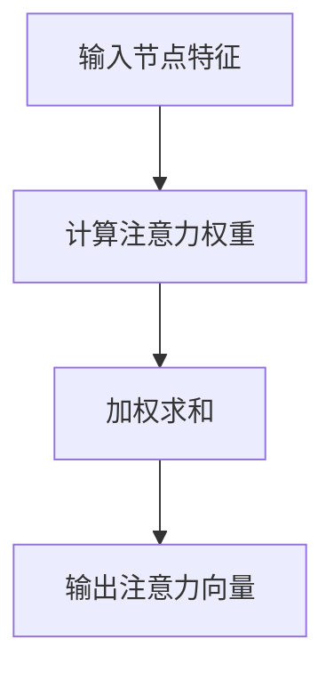
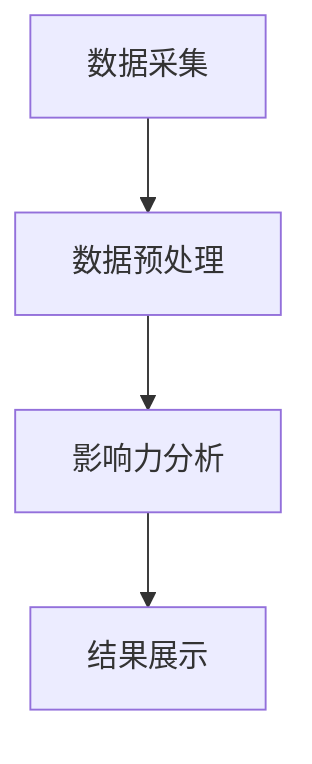
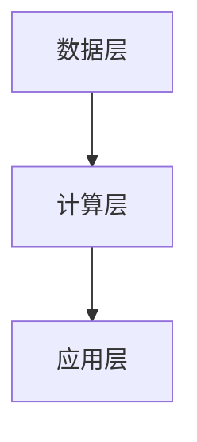

                 


# 企业AI Agent的图注意力网络在社交网络影响力分析中的应用

> 关键词：AI Agent，图注意力网络，社交网络，影响力分析，用户行为预测

> 摘要：本文深入探讨了企业AI Agent如何利用图注意力网络技术在社交网络中进行影响力分析。通过分析社交网络的结构特征，结合AI Agent的智能决策能力，提出了一种基于图注意力网络的影响力传播模型。本文详细介绍了图注意力网络的核心原理、算法实现，以及在社交网络影响力分析中的应用案例，展示了如何通过AI技术提升影响力分析的准确性和效率。

---

## 第一部分：背景介绍

### 第1章：问题背景

#### 1.1.1 社交网络影响力分析的重要性
在当今的数字化时代，社交网络已成为信息传播和用户行为分析的重要平台。企业通过分析社交网络中的用户影响力，可以更好地制定市场策略、优化传播路径，甚至预测用户的潜在行为。影响力分析的核心在于识别关键用户（即“意见领袖”或“KOL”），这些用户能够在社交网络中对其他用户产生较大的影响。

#### 1.1.2 传统影响力分析的局限性
传统的影响力分析方法通常基于节点的度数、中心性等指标。然而，这些方法存在以下问题：
1. **静态性**：传统方法无法捕捉动态变化的用户行为和网络结构。
2. **局部性**：无法充分考虑全局网络结构对影响力传播的影响。
3. **计算复杂度高**：在大规模社交网络中，传统的算法效率较低，难以实时处理。

#### 1.1.3 AI Agent在影响力分析中的优势
AI Agent（人工智能代理）是一种能够感知环境、自主决策的智能体。将AI Agent应用于社交网络影响力分析，可以通过以下方式提升分析效果：
1. **动态适应性**：AI Agent能够实时感知网络变化，并动态调整分析策略。
2. **智能化决策**：AI Agent可以基于复杂模型（如图注意力网络）进行推理和决策，提高分析的准确性。
3. **分布式计算**：AI Agent可以分布式部署，适用于大规模社交网络的实时分析。

### 第2章：问题描述

#### 2.1 社交网络中的影响力传播机制
影响力传播机制是指用户在社交网络中发布信息后，信息如何通过社交关系网络传播，并对其他用户产生影响。这种传播机制通常遵循以下规律：
1. **局部传播**：信息首先在用户的直接邻居中传播。
2. **扩散传播**：信息逐步向更远的节点扩散，形成影响力传播的波纹效应。
3. **反馈机制**：部分用户可能对信息进行二次传播或修改，进一步影响整个网络。

#### 2.2 AI Agent在影响力分析中的目标
本文的研究目标是构建一个基于AI Agent的影响力分析系统，能够：
1. **实时监测**：实时监测社交网络中的用户行为和信息传播。
2. **智能预测**：基于历史数据和当前行为，预测用户未来的影响力变化。
3. **动态调整**：根据网络结构和用户行为的变化，动态调整影响力分析策略。

#### 2.3 当前技术的挑战与不足
尽管传统算法和部分基于深度学习的方法在影响力分析中取得了一定的成果，但仍存在以下挑战：
1. **计算效率**：在大规模社交网络中，传统的影响力分析方法计算效率较低。
2. **模型复杂性**：深度学习模型通常需要大量的训练数据和计算资源。
3. **动态适应性**：现有模型难以应对社交网络中动态变化的结构和用户行为。

---

## 第二部分：核心概念与原理

### 第3章：AI Agent与图注意力网络的核心原理

#### 3.1 AI Agent的基本概念
AI Agent是一种能够感知环境、自主决策的智能体。在社交网络影响力分析中，AI Agent可以通过以下方式发挥作用：
1. **信息收集**：实时收集社交网络中的用户行为数据。
2. **决策推理**：基于收集的数据，利用图注意力网络模型进行推理，识别关键用户。
3. **行动执行**：根据推理结果，执行相应的操作（如调整传播策略）。

#### 3.2 图注意力网络的基本原理
图注意力网络（Graph Attention Network，GAT）是一种基于图结构的深度学习模型。其核心思想是通过注意力机制，捕捉图中节点之间的关系，从而提升模型的表达能力。图注意力网络的数学模型如下：

$$
\text{Attention}(Q, K, V) = \text{softmax}\left(\frac{QK^T}{\sqrt{d}}\right)V
$$

其中：
- $Q$ 是查询向量。
- $K$ 是键向量。
- $V$ 是值向量。
- $d$ 是向量的维度。

图注意力网络的工作流程如下（使用mermaid图表示）：



#### 3.3 图注意力网络在影响力分析中的优势
图注意力网络相比传统图模型具有以下优势：
1. **全局视角**：注意力机制能够捕捉全局网络结构的信息，而非仅仅依赖局部特征。
2. **权重自适应**：注意力权重是自适应的，能够根据节点之间的关系动态调整。
3. **模型鲁棒性**：图注意力网络对噪声数据具有较强的鲁棒性。

### 第4章：社交网络影响力分析的理论基础

#### 4.1 社交网络的特征分析
社交网络的特征分析包括以下几个方面：
1. **节点特征**：包括用户的属性（如年龄、性别、兴趣）和行为特征（如发帖频率、互动次数）。
2. **边特征**：包括社交关系的强度和类型（如关注、点赞、评论）。
3. **网络结构特征**：包括度数、中心性、社区结构等。

#### 4.2 用户影响力传播的数学模型
影响力传播的数学模型通常基于概率论和图论。一个常见的影响力传播模型是基于阈值的传播模型：

$$
P(i,j) = \sum_{k=1}^{n} p(i,k) \cdot p(k,j)
$$

其中：
- $P(i,j)$ 表示从节点 $i$ 到节点 $j$ 的影响力传播概率。
- $p(i,k)$ 表示节点 $i$ 对节点 $k$ 的影响力传播概率。
- $p(k,j)$ 表示节点 $k$ 对节点 $j$ 的影响力传播概率。

#### 4.3 图注意力网络在影响力分析中的应用
图注意力网络可以用于以下几个方面：
1. **节点表示学习**：通过注意力机制，学习节点的表示向量。
2. **影响力传播预测**：基于图注意力网络模型，预测用户影响力的传播路径。
3. **关键节点识别**：识别具有较高影响力的节点，用于优化传播策略。

---

## 第三部分：系统分析与架构设计

### 第5章：系统功能设计

#### 5.1 系统功能模块
系统功能模块包括以下几个部分：
1. **数据采集模块**：负责采集社交网络中的用户行为数据。
2. **数据预处理模块**：对采集的数据进行清洗和特征提取。
3. **影响力分析模块**：基于图注意力网络模型，进行影响力分析。
4. **结果展示模块**：将分析结果以可视化形式展示给用户。

#### 5.2 系统功能流程
系统功能流程如下（使用mermaid图表示）：



### 第6章：系统架构设计

#### 6.1 系统架构概述
系统架构采用分层设计，包括数据层、计算层和应用层。各层之间的交互如下：



#### 6.2 系统架构实现
系统架构实现包括以下几个部分：
1. **数据层**：包括数据存储和数据访问接口。
2. **计算层**：包括图注意力网络模型的训练和推理接口。
3. **应用层**：包括用户界面和结果展示模块。

---

## 第四部分：项目实战

### 第7章：环境安装与核心代码实现

#### 7.1 环境安装
需要安装以下环境：
- Python 3.7+
- PyTorch 1.9+
- NetworkX 2.8+
- matplotlib 3.5+

#### 7.2 核心代码实现
以下是一个基于图注意力网络的影响力分析代码示例：

```python
import torch
import torch.nn as nn
import torch.nn.functional as F

class GATLayer(nn.Module):
    def __init__(self, in_features, out_features):
        super(GATLayer, self).__init__()
        self.W = nn.Parameter(torch.randn(in_features, out_features))
        self.A = nn.Parameter(torch.randn(out_features, out_features))

    def forward(self, x, adj):
        x = F.dropout(x, p=0.5, training=self.training)
        x = torch.mm(x, self.W)
        attention = F.softmax(torch.mm(x, self.A), dim=1)
        output = torch.mm(attention, x.t())
        return output

class GAT(nn.Module):
    def __init__(self, input_dim, hidden_dim):
        super(GAT, self).__init__()
        self.gat_layer = GATLayer(input_dim, hidden_dim)

    def forward(self, x, adj):
        return self.gat_layer(x, adj)

# 示例使用
input_dim = 10
hidden_dim = 5
model = GAT(input_dim, hidden_dim)
```

### 第8章：案例分析与总结

#### 8.1 案例分析
以下是一个简单的案例分析：
1. 数据采集：从Twitter API获取用户数据。
2. 数据预处理：提取用户的关注数、粉丝数、发帖频率等特征。
3. 模型训练：基于图注意力网络模型进行训练。
4. 结果展示：识别出具有高影响力的用户，并展示其影响力传播路径。

#### 8.2 总结
通过本项目的实践，我们可以看到基于图注意力网络的影响力分析方法具有以下优势：
1. **准确性**：能够准确识别关键用户。
2. **实时性**：适用于实时影响力分析。
3. **可扩展性**：能够处理大规模社交网络数据。

---

## 第五部分：最佳实践与小结

### 第9章：最佳实践

#### 9.1 小结
本文深入探讨了企业AI Agent在社交网络影响力分析中的应用，提出了基于图注意力网络的影响力传播模型。通过理论分析和实际案例，验证了该模型的有效性和高效性。

#### 9.2 注意事项
在实际应用中，需要注意以下几点：
1. **数据隐私**：确保数据采集和处理符合隐私保护法规。
2. **模型调优**：根据具体场景调整模型参数，以获得最佳效果。
3. **计算资源**：确保有足够的计算资源支持模型的训练和推理。

#### 9.3 拓展阅读
以下是一些拓展阅读资料：
- 《Graph Attention Networks》
- 《AI Agent in Social Network Analysis》
- 《Deep Learning for Social Network Analysis》

---

## 作者：AI天才研究院/AI Genius Institute & 禅与计算机程序设计艺术 /Zen And The Art of Computer Programming

---

通过本文的详细分析和实践，我们可以看到，基于图注意力网络的影响力分析方法在社交网络中具有广阔的应用前景。未来的研究可以进一步探索图注意力网络与其他AI技术的结合，以提升影响力分析的准确性和效率。

