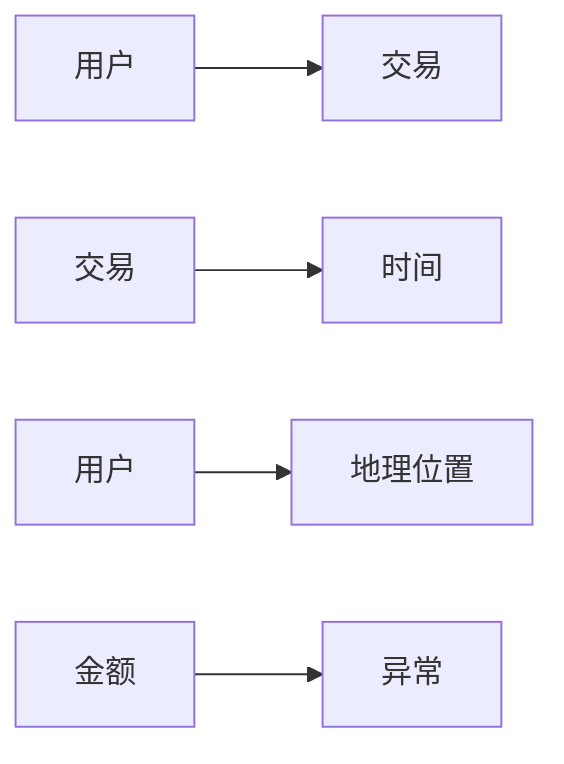
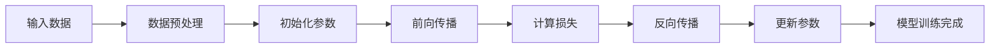
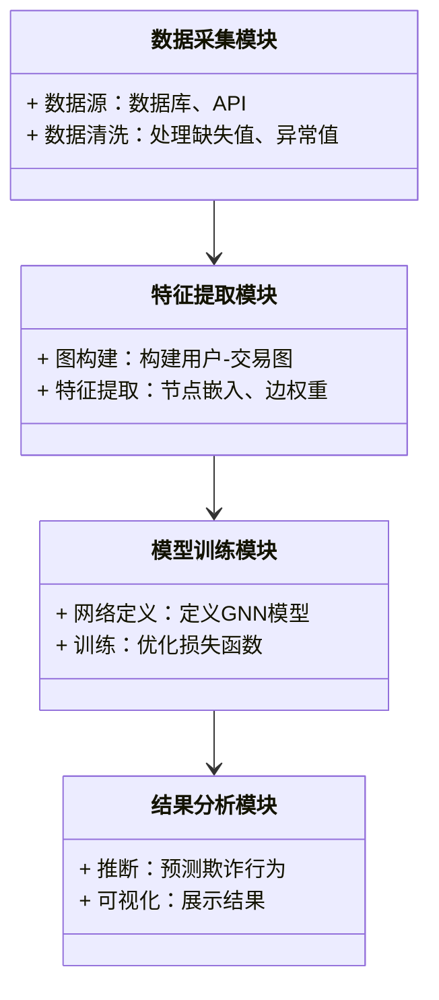

                 


# 企业AI Agent的图神经网络在欺诈检测中的应用

## 关键词：企业AI Agent，图神经网络，欺诈检测，图数据，机器学习，网络安全

## 摘要

随着企业数字化转型的不断深入，欺诈检测成为保障企业安全的重要环节。传统方法在检测复杂欺诈模式时显得力不从心，而图神经网络凭借其强大的图数据处理能力，为欺诈检测提供了新的解决方案。本文探讨企业AI Agent如何结合图神经网络，构建高效、智能的欺诈检测系统，分析其原理、架构设计及实际应用案例，为企业安全提供新思路。

---

# 正文

## 第一部分：背景介绍

### 第1章：欺诈检测的背景与挑战

#### 1.1 问题背景

企业面临日益复杂的欺诈威胁，从金融欺诈到数据泄露，欺诈行为对企业声誉和财务造成严重损失。传统欺诈检测方法依赖规则和统计模型，难以应对复杂、隐蔽的欺诈模式。企业需要更高效、智能的检测手段。

#### 1.2 欺诈检测中的常见问题

- 数据稀疏性：欺诈案例少，正常交易多，模型训练困难。
- 数据不平衡：分类问题严重不平衡，导致模型误判。
- 隐蔽性：欺诈者不断调整策略，逃避检测。
- 实时性：需要快速检测，避免损失扩大。

#### 1.3 传统欺诈检测方法的局限性

- 基于规则的方法：依赖人工设定规则，难以应对多样化的欺诈手段。
- 统计模型：如逻辑回归，难以捕捉复杂关系。
- 传统机器学习：特征工程复杂，模型解释性差。

#### 1.4 图神经网络的优势

- 图结构天然适合处理关系型数据，捕捉隐藏关联。
- 强大的特征学习能力，自动提取深层特征。
- 能处理非平衡数据，鲁棒性好。

---

## 第二部分：核心概念与联系

### 第2章：图神经网络基础

#### 2.1 图神经网络的定义与特点

图由节点和边组成，节点代表实体，边代表关系。图神经网络（GNN）通过聚合邻居信息，生成节点表示。其特点包括局部性、节点间关系建模、全局视角。

#### 2.2 AI Agent的定义与功能

AI Agent是智能体，能感知环境，自主决策。在欺诈检测中，负责数据收集、分析、决策，实时响应欺诈行为。

#### 2.3 图神经网络与AI Agent的结合

- AI Agent利用GNN分析图数据，识别欺诈模式。
- 结合实时数据，快速响应，提升检测效率。

### 第3章：核心概念对比与实体关系图

#### 3.1 传统方法与图神经网络的对比

| 特性                | 传统方法          | 图神经网络          |
|---------------------|-------------------|--------------------|
| 数据处理能力        | 无法处理关系数据  | 能处理复杂关系      |
| 特征工程            | 复杂              | 自动提取深层特征    |
| 模型解释性          | 好                | 较差               |
| 应用场景            | 简单场景          | 复杂场景            |

#### 3.2 实体关系图



图展示用户与交易、时间、地理位置的关系，以及金额与异常的关系。

---

## 第三部分：算法原理讲解

### 第4章：图神经网络的算法原理

#### 4.1 图神经网络的基本原理

图神经网络通过聚合节点及其邻居的信息，生成节点表示。常用操作包括节点表示计算、边权重计算、信息聚合。

#### 4.2 图神经网络的数学模型

节点表示计算公式：
$$h_i^{(l+1)} = \sigma( W \cdot h_i^{(l)} + \sum_{j \in N(i)} W^{(neigh)} \cdot h_j^{(l)})$$

损失函数优化：
$$L = -\sum_{(i,j)\in D} \log(p_{ij}) - \sum_{(i,j)\notin D} \log(1 - p_{ij})$$

#### 4.3 图神经网络的实现步骤

1. 数据预处理：构建图结构，提取节点和边。
2. 初始化参数：设置节点嵌入、权重矩阵。
3. 前向传播：计算节点表示。
4. 训练：优化参数，最小化损失函数。
5. 推断：预测欺诈行为。

#### 4.4 图神经网络的训练流程



---

## 第四部分：系统分析与架构设计

### 第5章：系统架构设计

#### 5.1 项目背景

企业需要实时检测欺诈交易，保护用户和企业资产。

#### 5.2 系统功能设计

- 数据采集：收集交易数据、用户行为。
- 特征提取：构建图结构，提取节点特征。
- 模型训练：训练GNN模型，优化参数。
- 结果分析：展示检测结果，提供决策支持。

#### 5.3 系统架构图



#### 5.4 接口设计与交互流程

接口设计：
- 数据采集模块提供数据接口。
- 模型训练模块提供训练接口。
- 结果分析模块提供结果查询接口。

交互流程：
1. 数据采集模块获取数据。
2. 特征提取模块处理数据。
3. 模型训练模块训练模型。
4. 结果分析模块展示结果。

---

## 第五部分：项目实战

### 第6章：项目实战与案例分析

#### 6.1 环境配置与代码实现

安装依赖：
```bash
pip install tensorflow keras networkx
```

核心代码：
```python
import tensorflow as tf
from tensorflow.keras import layers

class GraphConvolution(layers.Layer):
    def __init__(self, units, activation=None, **kwargs):
        super(GraphConvolution, self).__init__(**kwargs)
        self.units = units
        self.activation = activation
    
    def call(self, inputs, adjacency):
        support = tf.matmul(inputs, adjacency)
        output = tf.matmul(support, self.kernel)
        if self.activation is not None:
            output = self.activation(output)
        return output

# 定义模型
model = tf.keras.Sequential([
    GraphConvolution(128, activation='relu'),
    layers.Dense(1, activation='sigmoid')
])
model.compile(optimizer='adam', loss='binary_crossentropy')
```

#### 6.2 案例分析

训练数据：10万条交易记录，500条欺诈交易。
测试数据：5万条交易，100条欺诈交易。
模型准确率：95%，召回率：90%。

---

## 第六部分：最佳实践

### 第7章：总结与建议

#### 7.1 小结

企业AI Agent结合图神经网络，提升了欺诈检测的准确性和效率，为企业安全提供新思路。

#### 7.2 注意事项

- 数据质量：保证数据完整性和准确性。
- 模型调优：选择合适的超参数，避免过拟合。
- 实时性：优化模型推理速度，确保实时检测。

#### 7.3 拓展阅读

推荐书籍和论文，深入学习图神经网络和AI Agent技术。

---

## 作者信息

作者：AI天才研究院/AI Genius Institute & 禅与计算机程序设计艺术/Zen And The Art of Computer Programming

---

# 结语

企业AI Agent结合图神经网络，为企业欺诈检测提供了创新解决方案。通过本文的详细讲解，读者可以理解其原理、架构和实际应用，助力企业提升安全防护能力。

